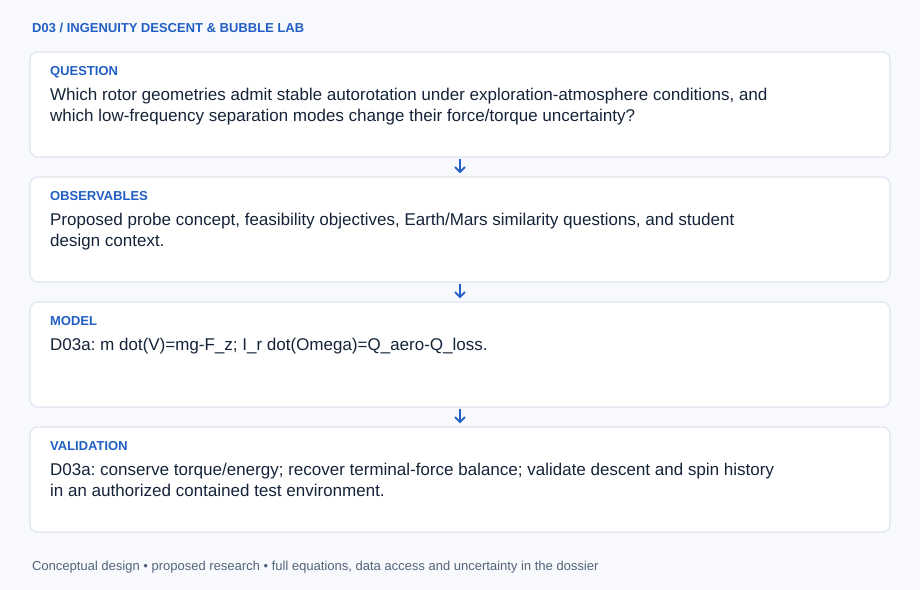

# D03 · INGENUITY DESCENT & BUBBLE LAB

**Original project:** Optimizing Autorotating Sensor Probe Design for Space Exploration- Low Frequency Unsteadiness in Laminar Separation Bubbles

**Session D:** Aeronautics
**Status:** proposed research dossier; no project experiment or mission qualification has been performed.

The supplied line combines two research concepts. Preserve both as coordinated but distinct proposed work packages: D03a, an autorotating sensor-probe feasibility study, and D03b, low-frequency dynamics of laminar separation bubbles. Their scientific connection is low-Reynolds aerodynamics; neither project's success is assumed to validate the other. The aggregate mission asks how aerodynamic unsteadiness changes passive descent robustness.

## Scientific question

Which rotor geometries admit stable autorotation under exploration-atmosphere conditions, and which low-frequency separation modes change their force/torque uncertainty?

## Testable hypothesis

A coupled design informed by independently validated low-Reynolds response statistics will predict descent dispersion better than steady blade-element models; feasibility on Mars may remain mass- and deployment-limited.



*Conceptual research design; arrows show the analysis dependency, not observed causation.*

## Mathematical model

```text
D03a: m dot(V)=mg-F_z; I_r dot(Omega)=Q_aero-Q_loss.
```

```text
D03a: dF_z=0.5 rho U_rel^2 c_r(C_L cos phi+C_D sin phi)dr; solve torque and descent jointly.
```

```text
D03b: St=f L_b/U_inf; P_xx(f)=Fourier-based power spectrum of a defined pressure/velocity observable.
```

```text
D03b: u'(x,t)=sum_j a_j(t)phi_j(x) for a POD basis; modes are descriptive unless independently linked to a mechanism.
```

### Variables and units

- Probe mass m, rotor inertia I_r, descent speed V, rotation Omega, local relative speed U_rel, blade chord c_r, flow angle phi.
- Atmospheric density/viscosity, gravitational acceleration, deployed geometry, bubble length L_b, Reynolds number, turbulence intensity, and signal duration.

### Assumptions and boundary conditions

- D03a's blade-element model is a first approximation; reverse flow, low-Reynolds nonlinearities, and deployment transients require extensions.
- D03b baseline is a stationary airfoil experiment; transferring its statistics to rotating blades requires separate tests.

### Inference or simulation method

D03a searches a constrained mass–geometry–atmosphere space using torque equilibrium, stability derivatives, and Monte Carlo descent. D03b uses pressure/velocity time series to distinguish genuine low-frequency bubble modes from drift and sparse-sampling artifacts. Combine only validated aerodynamic response envelopes in the descent model, then test an independent prototype or higher-fidelity simulation. Maintain separate datasets, acceptance gates, and publications for each package.

### Model limits

Matching Reynolds number alone does not match gravity, rotor inertia, density, Mach number, and dynamic similarity. A low-frequency spectral peak does not prove a unique bubble-bursting mechanism.

## Data and provenance contracts

### NAU SEED Mars autorotation concept

[Resource or product discovery](https://www.ceias.nau.edu/capstone/projects/ME/2022/22F_P17MarsSensor/Project/index.html)

**Fields:** Proposed probe concept, feasibility objectives, Earth/Mars similarity questions, and student design context.

**Access:** Public university project; a precedent, not the original user's project or flight-proven hardware.

**Role:** D03a architecture context.

### Original laminar-bubble fluctuation experiment

[Resource or product discovery](https://www.jstage.jst.go.jp/article/jjsass/50/582/50_582_293/_article/-char/en)

**Fields:** Airfoil/Reynolds context, low-frequency velocity fluctuation observations, and phase-averaged behavior.

**Access:** Public research article; request raw time series if not supplemented.

**Role:** D03b benchmark.

## Staged execution

1. D03a: establish proposed payload mass, survivable descent-speed requirement, deployment reliability, and atmospheric uncertainty.
2. D03a: solve autorotation equilibria, assess local stability, and identify infeasible mass/area combinations before prototype selection.
3. D03b: collect or obtain time series long enough to resolve candidate low-frequency modes across angle and Reynolds number.
4. D03b: compare spectral and modal statistics, then quantify their incremental impact on probe-force uncertainty without equating stationary and rotating flow.

## Verification and validation

- D03a: conserve torque/energy; recover terminal-force balance; validate descent and spin history in an authorized contained test environment.
- D03b: verify sampling/aliasing control, stationarity, block-bootstrap uncertainty, and repeatability of bubble-length dynamics.
- Coupled gate: held-out descent dispersion improves only when bubble-informed models outperform a steady baseline with uncertainty; otherwise preserve two independent outcomes.

*Any numerical gate is a proposed requirement unless the dossier explicitly identifies a sourced requirement. Freeze gates before collecting confirmatory data.*

## Resources and deliverables

- Rotor aerodynamics expertise, low-Reynolds flow facility, atmospheric model, time-series analysis, and appropriately supervised prototype testing.

- D03a feasibility/stability map and descent simulator; D03b spectral/modal bubble atlas; a documented transferability assessment joining them.

## Risks and interpretation

- A Earth demonstration can be physically unlike Mars even at similar Reynolds number.
- The combined source line is ambiguous; explicitly retaining both packages prevents accidental project deletion.

## Figure plan

Left: descent speed/rotation stability and feasible payload region. Right: bubble time series, spectra, and flow modes. A clearly labeled transferability link shows which aerodynamic statistics enter the probe model.

## Retained research work packages

```json
[
  {
    "id": "D03a",
    "name": "INGENUITY SEED DESCENT",
    "original_title": "Optimizing Autorotating Sensor Probe Design for Space Exploration",
    "model": "Coupled vertical translation and rotor torque with low-Reynolds blade aerodynamics.",
    "data": "Versioned synthetic atmosphere/descent ensembles and university concept documentation.",
    "validation": "Independent descent/spin histories, equilibrium stability, and dynamic-similarity assessment."
  },
  {
    "id": "D03b",
    "name": "LANGLEY BUBBLE OSCILLATORY",
    "original_title": "Low Frequency Unsteadiness in Laminar Separation Bubbles",
    "model": "Spectral, phase-averaged, and POD description of bubble/wake dynamics.",
    "data": "Pressure/velocity/bubble-length time series with sampling and run metadata.",
    "validation": "Spectral convergence, repeated runs, aliasing checks, and withheld operating points."
  }
]
```

## Cited scientific resources

- [Northern Arizona University SEED Mars Sensor project](https://www.ceias.nau.edu/capstone/projects/ME/2022/22F_P17MarsSensor/Project/index.html) — University-authored autorotating-probe concept and similarity objectives.
- [Experimental Studies of Low Frequency Velocity Disturbances Observed in Short Bubble Formed on Airfoil](https://www.jstage.jst.go.jp/article/jjsass/50/582/50_582_293/_article/-char/en) — Original low-frequency bubble measurements.
- [Bursting and reformation cycle of the laminar separation bubble over a NACA-0012 aerofoil](https://arxiv.org/abs/1807.08681) — Original computational mechanism hypothesis to test against experimental modes.

Source discovery reviewed 2026-10-02. A public source pointer does not imply original student-team data access. See [model assurance](../../docs/MODEL_ASSURANCE.md) and [data management](../../docs/DATA_MANAGEMENT.md).
