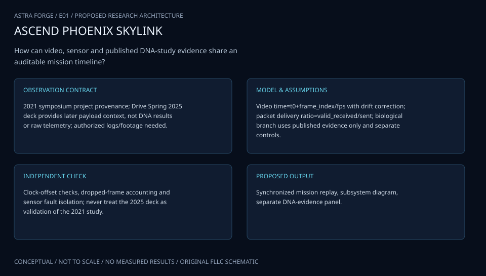

# E01 · APOLLO HELIOSCOPE

**Original project:** Phoenix College: Video Streaming and DNA Studies

**Session E:** ASCEND
**Status:** proposed research dossier; no project experiment or mission qualification has been performed.

Integrate public flight video with a separate passive DNA-damage investigation in a synchronized balloon payload. The proposed advance is a common time base and exposure ledger: a viewer can connect the flight environment to the biological observation without treating video as a radiation dosimeter. Preserve Phoenix College’s paired science and communications concept.

## Scientific question

Can synchronized ultraviolet exposure and environmental logs explain passive DNA damage while a constrained video downlink maintains useful coverage?

## Testable hypothesis

Measured UV fluence will explain more assay variation than altitude alone; adaptive video rate will improve delivered observation time per watt under identical link conditions.



*Conceptual research design; arrows show the analysis dependency, not observed causation.*

## Mathematical model

```text
H_UV=integral E_UV(t) dt
```

```text
N_break ~ Binomial(N_target, 1-exp(-k*H_UV)); Poisson(N_target*k*H_UV) is only the rare-break approximation when k*H_UV << 1.
```

```text
E_bat(t)=E0+integral(P_solar-P_load)dt
```

```text
R_delivered=R_encoded*(1-p_loss)
```

### Variables and units

- H_UV: UV fluence J/m^2; E_UV: irradiance W/m^2
- k: damage response m^2/J, fitted independently; N_target: susceptible sites
- R: bit/s; p_loss dimensionless; E_bat J

### Assumptions and boundary conditions

- Use isolated, noninfectious reference material and institution-reviewed assays; no human clinical interpretation.
- UV, temperature and handling controls are independent covariates; do not conflate ionizing radiation and UV.
- Independent susceptible sites and a common break probability are simplified assay assumptions; overdispersion or clustered damage requires a richer model.

### Inference or simulation method

Fit an exposure-response model with dark/handling controls and thermal covariates, while a replayed communication channel measures rate adaptation. Partition flight time into ascent, float if present, and descent; retain sensor lag and clock uncertainty. Trade image usefulness against energy rather than maximizing nominal resolution.

### Model limits

A single flight cannot identify every damage mechanism. Ground-to-balloon and balloon-to-space environmental equivalence is limited; sample integrity and assay floor can dominate.

## Data and provenance contracts

### Arizona Space Grant ASCEND program

[Resource or product discovery](https://spacegrant.arizona.edu/research/ascend)

**Fields:** UTC, altitude m, calibrated UV W/m^2, temperature K, sample control identifier, assay endpoint, packet sequence, bitrate and bus power W

**Access:** Public reference or archive pointer. Original team measurements are not supplied. Confirm product-level access, version and license; a linked paper does not imply its raw data are downloadable.

**Role:** Comparison/model context; prospective measurement schema is listed separately.

### NASA RaD-X balloon dosimetry

[Resource or product discovery](https://www.nasa.gov/science-research/heliophysics/nasa-studies-cosmic-radiation-to-protect-high-altitude-travelers/)

**Fields:** Independent benchmark metadata, reference assumptions and calibration context; select actual products before execution.

**Access:** Public reference or archive pointer. Original team measurements are not supplied. Confirm product-level access, version and license; a linked paper does not imply its raw data are downloadable.

**Role:** Comparison/model context; prospective measurement schema is listed separately.

## Staged execution

1. Define science endpoints, clock budget and mass/power requirements; produce a separate video and sample interface contract.
2. Characterize sensors and replay link fading with stored video; keep biological work at supervised analysis-design level.
3. Analyze a flight only after calibration and recovery records are complete; publish exposure and video-efficiency uncertainties.

## Verification and validation

- Proposed gate: recover >=95% of planned local environmental records and report uncertainty in UV fluence; freeze gate before flight.
- Compare fitted damage model to temperature-only and altitude-only baselines with held-out exposure groups.
- Compare rate adaptation against a constant-rate replay at identical channel trace and total energy.

*Any numerical gate is a proposed requirement unless the dossier explicitly identifies a sourced requirement. Freeze gates before collecting confirmatory data.*

## Resources and deliverables

- Embedded telemetry engineer, radiation/UV metrologist and supervised molecular-assay collaborator.
- Camera, calibrated UV sensor, environmental logger, shielded reference compartments, independent energy meter and analysis workstation.

- Versioned analysis configuration, raw-to-derived provenance and uncertainty report.
- Project-specific model comparison, a publication figure with units, and an explicit outcome including inconclusive findings.

## Risks and interpretation

- Telemetry loss can be repaired from local storage only if time synchronization survives.
- Contamination, sensor spectral mismatch and thermal confounding can produce false attribution.

## Figure plan

Linked altitude/UV/temperature profiles, DNA-response intervals and delivered bitrate versus energy; biological points remain prospective until measured.

## Cited scientific resources

- [Arizona Space Grant ASCEND program](https://spacegrant.arizona.edu/research/ascend) — Program context and flight records, not original team telemetry.
- [NASA RaD-X balloon dosimetry](https://www.nasa.gov/science-research/heliophysics/nasa-studies-cosmic-radiation-to-protect-high-altitude-travelers/) — Balloon radiation measurement precedent.
- [NASA Open MCT](https://ammos.nasa.gov/openmct/) — Telemetry visualization platform; operational interfaces still require design.

Source discovery reviewed 2026-10-02. A public source pointer does not imply original student-team data access. See [model assurance](../../docs/MODEL_ASSURANCE.md) and [data management](../../docs/DATA_MANAGEMENT.md).
