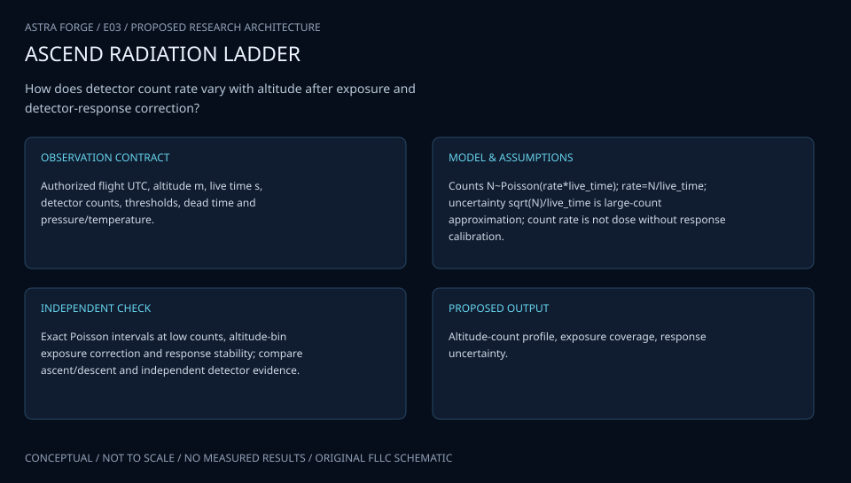

# E03 · ARTEMIS STRATODOSE

**Original project:** UArizona ASCEND: Profiling High-Altitude Radiation with a General Data Logger

**Session E:** ASCEND
**Status:** proposed research dossier; no project experiment or mission qualification has been performed.

Develop a radiation-profile observatory that measures detector response and tests shielding hypotheses rather than assuming count rate equals dose. Pair balloon observations with atmospheric radiation models and independent dosimetry. The resulting transfer-function library could guide smallsat electronics studies while documenting why the atmospheric secondary-particle spectrum differs from orbit.

## Scientific question

Can altitude-resolved detector observations constrain a radiation transport model and determine whether candidate shielding changes the response under the sampled spectrum?

## Testable hypothesis

A response-folded model will explain the count profile better than an altitude-only curve; shielding effects will depend on spectrum and may be smaller than uncertainty.



*Conceptual research design; arrows show the analysis dependency, not observed causation.*

## Mathematical model

```text
N_i ~ Poisson(dt_i*integral R_i(E,Omega)*Phi(E,Omega,h,t)dE dOmega + B_i)
```

```text
n_true=n_obs/(1-n_obs*tau)
```

```text
D=integral Phi(E)*S(E)dE
```

### Variables and units

- Phi differential particle flux; R detector effective response
- tau detector dead time s; n count rate 1/s; h altitude m
- D dose rate Gy/s only for a validated response S

### Assumptions and boundary conditions

- Dead-time correction shown is for a nonparalyzable detector; choose actual instrument model.
- Fit detector response from documented calibration and preserve geometry/temperature effects.

### Inference or simulation method

Fit Poisson observations in pressure/altitude bins, folding NAIRAS predictions through detector response. Compare paired shield configurations with matched geometry and exposure duration, and include overdispersion tests. Avoid extrapolation beyond measured energy sensitivity.

### Model limits

Shielding can generate secondary particles; count suppression does not establish electronics reliability or human dose. Flight conditions do not qualify a CubeSat for orbit.

## Data and provenance contracts

### NASA NAIRAS 3.0 model and RaD-X resources

[Resource or product discovery](https://ccmc.gsfc.nasa.gov/models/NAIRAS~3.0/)

**Fields:** UTC, geolocation, pressure, altitude, counts, integration time, dead time, detector temperature, shielding configuration and calibration matrix

**Access:** Public reference or archive pointer. Original team measurements are not supplied. Confirm product-level access, version and license; a linked paper does not imply its raw data are downloadable.

**Role:** Comparison/model context; prospective measurement schema is listed separately.

### NASA RaD-X balloon dosimetry

[Resource or product discovery](https://www.nasa.gov/science-research/heliophysics/nasa-studies-cosmic-radiation-to-protect-high-altitude-travelers/)

**Fields:** Independent benchmark metadata, reference assumptions and calibration context; select actual products before execution.

**Access:** Public reference or archive pointer. Original team measurements are not supplied. Confirm product-level access, version and license; a linked paper does not imply its raw data are downloadable.

**Role:** Comparison/model context; prospective measurement schema is listed separately.

## Staged execution

1. Write detector response and background requirements; obtain calibration records and NAIRAS run metadata.
2. Run synthetic injection/recovery with known backgrounds and missed samples.
3. Compare flight data against independent dosimeter/model output and publish null shielding results if uncertainties dominate.

## Verification and validation

- Check Poisson coverage using simulated counts before any science fit.
- Proposed gate: model uncertainty intervals include independently calibrated count rate across >=90% of valid profile bins.
- Require paired-shield inference to remain stable under background, spectral and dead-time sensitivity analysis.

*Any numerical gate is a proposed requirement unless the dossier explicitly identifies a sourced requirement. Freeze gates before collecting confirmatory data.*

## Resources and deliverables

- Radiation instrumentation scientist, embedded programmer and transport-model analyst.
- Characterized detector, passive/reference dosimeter, environmental recorder and archival model access.

- Versioned analysis configuration, raw-to-derived provenance and uncertainty report.
- Project-specific model comparison, a publication figure with units, and an explicit outcome including inconclusive findings.

## Risks and interpretation

- Background and detector temperature can imitate an altitude trend.
- Uncalibrated detector response prevents dose claims.

## Figure plan

Altitude-count posterior and response-folded model band; shielding effect forest plot with no assumed benefit.

## Cited scientific resources

- [NASA NAIRAS 3.0 model and RaD-X resources](https://ccmc.gsfc.nasa.gov/models/NAIRAS~3.0/) — Radiation environment model and independent comparison resources.
- [NASA RaD-X balloon dosimetry](https://www.nasa.gov/science-research/heliophysics/nasa-studies-cosmic-radiation-to-protect-high-altitude-travelers/) — Balloon radiation measurement precedent.

Source discovery reviewed 2026-10-02. A public source pointer does not imply original student-team data access. See [model assurance](../../docs/MODEL_ASSURANCE.md) and [data management](../../docs/DATA_MANAGEMENT.md).
