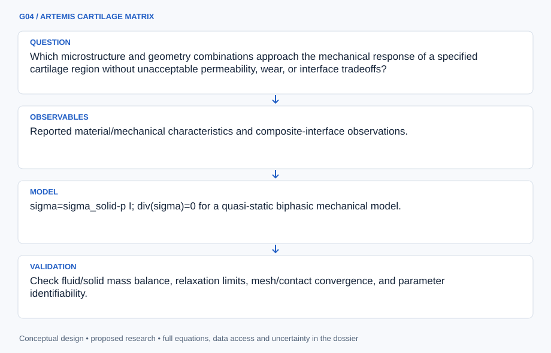

# G04 · ARTEMIS CARTILAGE MATRIX

**Original project:** Photocurable nanocomposites for customizable cartilage replacements

**Session G:** Exploration Systems Engineering

**Document class:** engineering research design and analysis record · **Revision:** 2 · **Date:** 2026-10-02

**Evidence state:** design basis, mathematical formulation and verification plan documented. Project-specific empirical results remain to be acquired; executable shared model demonstrations have their own recorded checks.

[Engineering document register](../../ENGINEERING_DOCUMENTATION.md) · [Session G handbook](../../documentation/SESSION_G.md) · [Previous: G03](../G/G03.md) · [Next: G05](../G/G05.md)

## Purpose and scientific objective

Proposed mission: evaluate customizable photocurable nanocomposite concepts using a computational and analytical materials framework before any clinical application. Cartilage replacement requires more than initial stiffness: permeability, time-dependent deformation, fatigue, wear, interface behavior, and biological compatibility all matter. Preserve the title while treating proposed constructs as research materials rather than approved replacements.

**Question:** Which microstructure and geometry combinations approach the mechanical response of a specified cartilage region without unacceptable permeability, wear, or interface tradeoffs?

**Testable hypothesis:** A spatially varied, poro-viscoelastic design may reproduce load-bearing and relaxation behavior better than a uniformly stiff material, but printing/cure variability and biological effects could outweigh that advantage.

## 1. Design basis and analysis boundary

The system is a nonclinical materials/mechanics assessment of photocurable nanocomposite constructs against a region-specific cartilage response envelope. Its boundary includes solid mechanics, fluid transport, relaxation, geometry and interface loading, with published material data and proposed simulations. It specifies no clinical implantation, biological intervention or fabrication recipe.

Begin with biphasic small-strain response and a transparent relaxation fit, then add nonlinear contact, swelling or cure heterogeneity only when supported data distinguish them. Matching a single modulus is inadequate: permeability, rate dependence, stress concentration and wear evidence remain separate gates. Biological compatibility and long-term integration are outside a mechanics-only claim.

## 2. Requirements and verification traceability

These are project design requirements or proposed analysis gates. A numerical target is not a NASA requirement unless its controlling source is explicitly identified. “TBD” identifies evidence required before a decision; it is not permission to assume a value. Verification evidence listed here is planned, unless a linked result explicitly records execution.

| ID | Requirement / gate | Engineering rationale | Verification method | Basis / required evidence |
| --- | --- | --- | --- | --- |
| G04-R1 | All Darcy models shall use intrinsic permeability k in m^2 and fluid viscosity in Pa s. | Hydraulic conductivity is a different coefficient. | Unit check and analytic pressure-gradient flux. | Corrected transport definition. |
| G04-R2 | Target envelopes shall identify cartilage region, loading mode, rate and source population. | One universal cartilage modulus is misleading. | Audit target-to-data provenance. | Materials-comparison requirement. |
| G04-R3 | Proposed numerical gate: closed-domain solid/fluid mass-balance residual below 10^-6 of imposed volume change. | Poroelastic fits can conceal conservation failure. | Integrate boundary flux and deformation ledger. | Proposed solver target. |
| G04-R4 | Report relaxation, peak strain/contact pressure and interface uncertainty separately; clinical suitability remains unclaimed. | Good bulk stiffness can coexist with harmful concentrations. | Multimetric contact/relaxation comparison. | Nonclinical design gate; no patient threshold. |

## 3. Architecture and controlled interfaces

A material registry supplies modulus, Poisson response, intrinsic permeability, fluid viscosity and relaxation parameters with domain/source metadata. Geometry and region target adapters define specimen and loading coordinates. A biphasic solver returns solid displacement and pore pressure; contact/interface modules consume tractions and deformations.

Optical-dose/cure heterogeneity enters as a spatial material-field hypothesis, not a manufacturing instruction. The observation adapter maps simulation outputs to published relaxation/load-displacement data. Comparison retains rate/region context and marks absent wear or biological evidence as unknown, rather than filling it from mechanics predictions.



Correct intrinsic-permeability transport couples to solid response and a conservation ledger. Region-specific comparison and interface stress remain separate from wear, biological compatibility and clinical approval.

[Editable engineering diagram source](../../visuals/projects/G04.mmd)

## 4. Mathematical model and derivation

### Governing equations

```text
sigma=sigma_solid-p I; div(sigma)=0 for a quasi-static biphasic mechanical model.
```

```text
q=-(k/mu_f)grad p; mass balance couples fluid flux q to solid deformation.
```

```text
E(t)=E_inf+sum_j E_j exp(-t/tau_j), a fitted relaxation representation.
```

```text
cure_state(x)~f(local optical dose,attenuation,material state); dose is an explanatory variable, not a prescribed fabrication recipe.
```

### Variables, units and conventions

- Solid modulus, Poisson response, hydraulic permeability k, relaxation times tau, filler distribution, and swelling.
- Construct geometry, loading rate, contact stress, interface strength, wear particles, cure heterogeneity, and manufacturing tolerance.
- In the Darcy relation, k is intrinsic permeability [m^2], mu_f fluid dynamic viscosity [Pa s], p pressure [Pa], and q Darcy flux [m/s]; hydraulic conductivity is a different coefficient.

### Assumptions and boundary conditions

- Biphasic and relaxation parameters are region- and test-dependent; matching one modulus does not reproduce native cartilage.
- The proposal is non-operational materials assessment; biological compatibility and clinical approval require independent regulated work.

### Derivation step 1

$$
\boldsymbol\sigma=\boldsymbol\sigma_s-pI;\quad\nabla\cdot\boldsymbol\sigma=0
$$

Positive p is compressive pore pressure in the tensile-positive stress convention. Solid and fluid contributions must use the same sign convention at contact boundaries.

### Derivation step 2

$$
q=-(k/\mu_f)\nabla p
$$

k/mu has m^2/(Pa s); pressure gradient is Pa/m, giving Darcy flux m/s. The minus sign sends fluid down pressure, not toward higher p.

### Derivation step 3

$$
\dot\epsilon_v+\nabla\cdot q=0
$$

For the chosen incompressible-constituent small-strain mixture approximation, volume change and flux divergence balance. Compressible phases need additional storage terms.

### Derivation step 4

$$
E(t)=E_\infty+\sum_jE_je^{-t/\tau_j};\quad\tau_{poro}\sim\mu_fL^2/(kH_A)
$$

Relaxation fitting is phenomenological; poroelastic timescale has seconds with aggregate modulus H_A in Pa. Thickness and permeability can be confounded with intrinsic viscoelastic relaxation.

### Inference or simulation procedure

Compile published material-response ranges and build a region-specific cartilage target envelope. Fit poro-viscoelastic models to supported relaxation data and simulate contact/loading under uncertainty. Explore geometry and parameter tradeoffs with constraints on permeability and strain concentration. Specify nonclinical characterization outputs needed to distinguish mechanical promise from printing/cure artifacts. Plan any physical or biological study only through qualified materials/biomedical investigators.

### Validity domain and fidelity limits

Long-term wear, integration, inflammation, and patient variability are not established by short laboratory tests. Nanofillers may alter optics, curing, degradation, and cell response in ways a mechanics-only model cannot predict.

## 5. Data specifications and provenance

| Field | Type | Unit | Physical / statistical meaning | Quality and missing-data rule |
| --- | --- | --- | --- | --- |
| target_region | record | 1 | Anatomical region and published response context. | Population/test mode required; no universal target. |
| geometry | record | m | Construct/test domain dimensions. | Tolerance and boundary conditions retained. |
| solid_parameters | record | Pa,1 | Moduli and Poisson response. | Physical range/source and covariance required. |
| intrinsic_permeability | float64 | m^2 | Darcy material permeability. | Positive; never mislabeled conductivity. |
| fluid_viscosity | float64 | Pa s | Fluid dynamic viscosity. | Temperature/context recorded. |
| relaxation_curve | nullable<array<time,stress>> | s,Pa | Published/model relaxation observation. | Load history and digitization error retained. |
| cure_field | nullable<array<float64>> | 1 | Hypothesized material-state heterogeneity. | Uncalibrated fields labeled proposed; null allowed. |

[Machine-readable record schema](../../data/contracts/G04.schema.json) · [Empty acquisition CSV](../../data/contracts/G04.csv) · [Field dictionary CSV](../../data/contracts/G04.dictionary.csv)

The CSV above contains column headers only. Its schema defines future records and does not establish that original-team data or a particular archive product have been acquired. Frame, timing, calibration, covariance, selection and provenance details must accompany populated records.

### Photopolymerized nanocomposite cartilage-damage study

[Product, archive or reference](https://pmc.ncbi.nlm.nih.gov/articles/PMC4950507/)

**Fields:** Reported material/mechanical characteristics and composite-interface observations.

**Access:** Public article; machine-readable mechanical curves may require supplements/authors.

**Role:** Nanocomposite research precedent.

### Photoreactive adhesive-hydrogel composite study

[Product, archive or reference](https://pmc.ncbi.nlm.nih.gov/articles/PMC3972413/)

**Fields:** Interface concept, nonclinical/clinical research outcomes, and limitations.

**Access:** Public article; do not interpret a study as approval of the proposed material.

**Role:** Independent interface/translation context.

## 6. Uncertainty, sensitivity and identifiability

Material scatter, swelling, thickness and boundary leakage couple strongly to relaxation. Filler distribution and cure heterogeneity can change both solid stiffness and transport; treating them as independent scalar errors can understate response variability. Interface slip and wear are structural discrepancies beyond a bulk biphasic fit.

Profile permeability against modulus and thickness, compare multiple loading rates/geometries and test whether intrinsic relaxation is identifiable separately from fluid drainage. Propagate spatial material ensembles into contact concentrations. Report unsupported wear and biological endpoints as missing evidence; simulations can prioritize characterization without claiming clinical performance.

## 7. Engineering trade study

| Alternative | Benefit | Cost / limitation | Decision rule |
| --- | --- | --- | --- |
| Homogeneous biphasic model | Interpretable fluid/solid coupling. | Misses heterogeneity and nonlinear strain. | Baseline after conservation checks. |
| Poro-viscoelastic model | Separates multiple relaxation mechanisms. | Parameters may be correlated. | Use only if rates/geometries identify added terms. |
| Spatial heterogeneous contact model | Reveals local concentration/interface effects. | Needs material-field evidence. | Apply to bounded proposed fields and report sensitivity. |

## 8. Verification and validation cases

| Case ID | Stimulus / condition | Expected result / criterion | Method | Evidence artifact |
| --- | --- | --- | --- | --- |
| G04-V1 | Uniform pressure gradient | One-dimensional q=-k Delta p/(mu L) with declared sign. | Analytic Darcy fixture. | Unit/sign conservation. |
| G04-V2 | Closed undrained limit | No boundary flux implies conserved mixture volume under stated incompressibility. | Boundary-ledger integration. | Mass balance. |
| G04-V3 | Relaxation endpoints | E(0)=E_inf+sum E_j and E(infinity)=E_inf for positive tau. | Analytic and fitted-function checks. | Relaxation identity; measured fitting pending. |

**Execution status:** these cases are specified, not claimed as executed. Close a case only with the versioned inputs, output, uncertainty, reviewer and pass/fail rationale.

### Additional scientific validation gates

- Check fluid/solid mass balance, relaxation limits, mesh/contact convergence, and parameter identifiability.
- Require prediction on withheld loading rates and geometries; compare stress distributions, relaxation, and permeability jointly.
- Proposed gate: a candidate meets its mechanical target envelope across uncertainty while unsupported biological properties remain explicit gaps.

## 9. Implementation and reproducible work packages

1. Create region_target_registry.csv with source and loading context.
2. Build biphasic_material.yaml with permeability units and covariance.
3. Implement poroelastic_solver.py and Darcy/closed-domain fixtures.
4. Create relaxation_identifiability.ipynb across rates and dimensions.
5. Build contact_interface.py with spatial material-field scenarios.
6. Publish response_trade.parquet and an evidence-gap matrix for wear/interface/compatibility.

### Investigation sequence

1. Choose a proposed anatomical target and define a multidimensional response envelope rather than a single stiffness target.
2. Build and validate a poro-viscoelastic contact model with geometry/cure uncertainty.
3. Rank customizable concepts by relaxation, permeability, interface stress, and manufacturing robustness.
4. Prepare a nonclinical characterization specification including wear, degradation, and biocompatibility evidence gaps.

### Resources and interfaces to expertise

- Cartilage mechanics expertise, materials characterization collaboration, finite-element software, optical-cure modeling, and institutional biomedical oversight.

## 10. Failure modes and interpretation controls

| Failure mode | Effect on result | Detection / evidence | Design response |
| --- | --- | --- | --- |
| Permeability coefficient confused | Incorrect drainage timescale. | Unit checker. | Intrinsic k plus explicit viscosity. |
| Rate/region target mixed | False native-cartilage match. | Target provenance audit. | Context-specific envelope. |
| Mechanics equated compatibility | Unsupported clinical claim. | Evidence-category review. | Separate nonclinical outputs and missing biology/wear evidence. |

- A stiffer material can increase harmful local contact stress rather than improve function.
- Cure heterogeneity, nanofiller release, and fatigue may invalidate initial mechanical promise; no implant or treatment recommendation is made.

## 11. Required engineering outputs

- Material/geometry trade atlas, validated constitutive model, tolerance study, and evidence-based nonclinical research specification.

### Scientific result figures to produce during execution

Generic cartilage contact model, relaxation curves, permeability–modulus Pareto map, and cure/strain heterogeneity contours; all synthetic curves are labeled simulations.

## 12. Cited technical and scientific resources

- [Synthesis of a Novel Photopolymerized Nanocomposite Hydrogel for Treatment of Acute Mechanical Damage to Cartilage](https://pmc.ncbi.nlm.nih.gov/articles/PMC4950507/) — Original nanocomposite materials/mechanical research.
- [Human Cartilage Repair with a Photoreactive Adhesive-Hydrogel Composite](https://pmc.ncbi.nlm.nih.gov/articles/PMC3972413/) — Original interface and translational study relevant to evidence gaps, without establishing approval for this proposed concept.

Framework and evidence rules: [engineering documentation standard](../../docs/ENGINEERING_STANDARD.md), [model assurance](../../docs/MODEL_ASSURANCE.md), [uncertainty procedure](../../docs/UNCERTAINTY_AND_DECISION_RULES.md), and [data management](../../docs/DATA_MANAGEMENT.md). NASA-inspired names are creative identifiers; requirements and results are not NASA certification.
