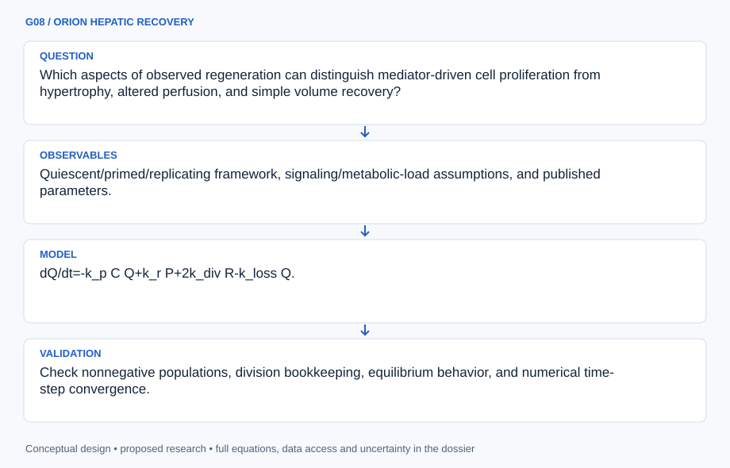

# G08 · ORION HEPATIC RECOVERY

**Original project:** Mediated Liver Regeneration

**Session G:** Exploration Systems Engineering
**Status:** proposed research dossier; no project experiment or mission qualification has been performed.

Proposed mission: model how signaling, metabolic demand, tissue mechanics, and cell-state transitions may mediate liver regeneration. The mediator is unspecified in the original title, so the dossier retains several mechanistic candidates rather than inventing a treatment. Focus on published-data reanalysis and hypothesis discrimination; any experimental or clinical extension belongs to qualified institutional research.

## Scientific question

Which aspects of observed regeneration can distinguish mediator-driven cell proliferation from hypertrophy, altered perfusion, and simple volume recovery?

## Testable hypothesis

A cell-state model constrained by both structural volume and independent functional observations will discriminate mechanisms better than a volume-only growth curve, although sparse human data may remain nonidentifying.



*Conceptual research design; arrows show the analysis dependency, not observed causation.*

## Mathematical model

```text
dQ/dt=-k_p C Q+k_r P+2k_div R-k_loss Q.
```

```text
dP/dt=k_p C Q-(k_g GF+k_r)P; dR/dt=k_g GF P-k_div R.
```

```text
N=Q+P+R; dN/dt=k_div R-k_loss Q under the stated state-transition bookkeeping.
```

```text
V(t)=N(t)v_cell(t)+V_nonparenchymal(t)+V_vascular(t), separating cell number from measured tissue volume.
```

### Variables and units

- Quiescent Q, primed P, replicating R cell populations; cytokine signal C; growth-factor signal GF; transition/division/loss rates.
- Metabolic load per cell, average cell volume, extracellular matrix state, perfusion, imaging error, and subject-level heterogeneity.

### Assumptions and boundary conditions

- The ODEs are a proposed reduced model inspired by published cell-state work, not a validated clinical predictor.
- Volume recovery alone does not prove restored liver function; signaling variables are latent unless independently measured.

### Inference or simulation method

Reproduce a published baseline model and document species, observation times, and parameter provenance. Fit a hierarchy of volume-only, cell-state, and mechanics/perfusion-augmented alternatives to available de-identified data. Use profile likelihood, sensitivity analysis, and posterior predictive checks to identify parameters that data can actually constrain. Compare mediator hypotheses by expected observable differences and propose non-operational follow-up measurements, without interventions, dosing, or surgical procedures.

### Model limits

Published human pilot samples can be small, with sparse mediator measurements. Rodent-to-human timescale transfer is a modeling hypothesis, not a universal scaling law; disease and surgery populations may differ substantially.

## Data and provenance contracts

### Original liver-regeneration model

[Resource or product discovery](https://pmc.ncbi.nlm.nih.gov/articles/PMC2712210/)

**Fields:** Quiescent/primed/replicating framework, signaling/metabolic-load assumptions, and published parameters.

**Access:** Public article; reproduce model equations with attribution and verify any reused parameter units.

**Role:** Mechanistic baseline.

### Human live-donor model study

[Resource or product discovery](https://pmc.ncbi.nlm.nih.gov/articles/PMC6289189/)

**Fields:** Small pilot subject-volume data, parameter transfer, fit/verification partition, and unmeasured mediator limitations.

**Access:** Public article; raw clinical records are not assumed accessible. Use published de-identified aggregates only.

**Role:** Human translation and uncertainty benchmark.

## Staged execution

1. Clarify mediator candidates in the research specification while preserving the original broad topic.
2. Reproduce baseline equations and data fits with explicit initial conditions and units.
3. Compare mechanistic alternatives using identifiable parameter combinations and withheld subjects/time points.
4. Rank future observational measurements by information gain about mechanisms and functional recovery; seek institutional review before any biological extension.

## Verification and validation

- Check nonnegative populations, division bookkeeping, equilibrium behavior, and numerical time-step convergence.
- Use leave-one-subject-out prediction where data volume permits; report calibration and wide intervals when sample size is limited.
- Proposed gate: mechanistic claims require independent mediator/function evidence; a good volume fit alone is insufficient.

*Any numerical gate is a proposed requirement unless the dossier explicitly identifies a sourced requirement. Freeze gates before collecting confirmatory data.*

## Resources and deliverables

- Liver physiology, biomedical modeling, biostatistics expertise, reproducible ODE inference software, and appropriately approved clinical-data collaboration.

- Attributed baseline reproduction, mechanism-comparison model, identifiability atlas, and prospective measurement-priority specification.

## Risks and interpretation

- A model fit can conceal nonunique mechanisms and unsupported treatment implications.
- Regenerative signaling also intersects disease processes; computational hypotheses must not be presented as safe clinical interventions.

## Figure plan

Cell-state/signaling diagram, observed volume with competing model intervals, and parameter-identifiability heatmap; structural and functional recovery occupy separate output panels.

## Cited scientific resources

- [A Model of Liver Regeneration](https://pmc.ncbi.nlm.nih.gov/articles/PMC2712210/) — Original cell-state/metabolic-load mechanistic model.
- [Mathematical Model of Liver Regeneration in Human Live Donors](https://pmc.ncbi.nlm.nih.gov/articles/PMC6289189/) — Original small human pilot and explicit limitations from unmeasured biochemical mediators.

Source discovery reviewed 2026-10-02. A public source pointer does not imply original student-team data access. See [model assurance](../../docs/MODEL_ASSURANCE.md) and [data management](../../docs/DATA_MANAGEMENT.md).
