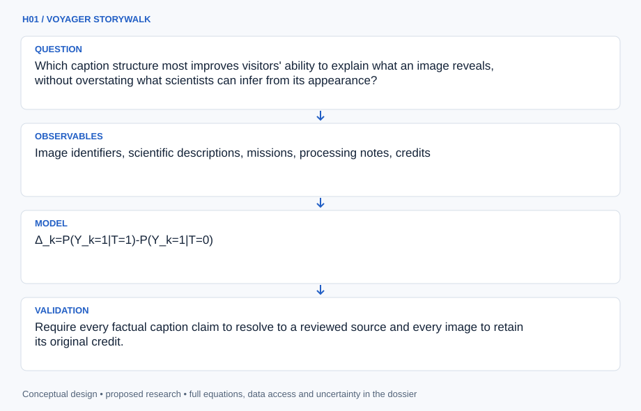

# H01 · VOYAGER STORYWALK

**Original project:** USGS Science Center: Solar System Exhibit Captions

**Session H:** Planetary Science
**Status:** proposed research dossier; no project experiment or mission qualification has been performed.

Complete the original mobile-caption concept for the USGS Flagstaff solar-system exhibit, then turn it into an evidence-based visitor learning platform. Every displayed image receives an identified mission product, accessible explanation, scale cue, and traceable scientific claim. NASA Photojournal and USGS mission material provide authoritative starting points; proposed audience experiments determine whether captions actually help visitors interpret evidence. This is a new development proposal, not a claim that the historic exhibit or its app has been updated.

## Scientific question

Which caption structure most improves visitors' ability to explain what an image reveals, without overstating what scientists can infer from its appearance?

## Testable hypothesis

A short observation-first caption with a clearly labeled inference, physical scale, and optional deeper layer will improve delayed comprehension relative to a factual inventory of the same length.



*Conceptual research design; arrows show the analysis dependency, not observed causation.*

## Mathematical model

```text
Δ_k=P(Y_k=1|T=1)-P(Y_k=1|T=0)
```

$$
\mathrm{logit}\,P(Y_{iv}=1)=\alpha+\beta T_{iv}+\gamma K_i+u_v+u_{\rm day}
$$

$$
G=(V,E),\quad E=\{\mathrm{image}\rightarrow\mathrm{claim}\rightarrow\mathrm{source}\}
$$

### Variables and units

- Y is a scored comprehension response; T is randomized caption assignment; Delta is an absolute probability difference.
- K is a preregistered prior-knowledge score; visitor and day effects represent clustered observations.
- G is a provenance graph; each image node stores product identifier, mission, acquisition date, processing description, and credit.

### Assumptions and boundary conditions

- Assignment occurs at a visitor-group or session level to avoid contamination from companions exchanging caption versions.
- Dwell time measures engagement opportunity; it is not treated as comprehension or satisfaction.

### Inference or simulation method

Build an inventory from exhibit photographs and staff records, identifying original products through Photojournal or instrument archives. A visually similar image is insufficient identification: verify scene geometry, crop, mission metadata, and processing. Draft three layers: an approximately 40-word observation, an approximately 100-word explanation, and an optional source-backed exploration. Mark enhanced color, mosaic seams, artistic renderings, and uncertain interpretations. Co-design mobile navigation with visitors using screen readers and people with limited bandwidth; provide readable print or staff-accessible alternatives. Randomize two equally accurate caption formats and score an observation-versus-inference task immediately and after a consented follow-up. Estimate effects with hierarchical logistic regression, retaining nonresponses and uncertainty rather than selecting favorable responses.

### Model limits

One exhibit's audience does not represent all museums. Device ownership, language, motivation, and voluntary participation influence estimates. No individual visitor tracking is needed for the basic caption system.

## Data and provenance contracts

### NASA Photojournal

[Resource or product discovery](https://science.nasa.gov/photojournal/)

**Fields:** Image identifiers, scientific descriptions, missions, processing notes, credits

**Access:** Public browsing; confirm usage conditions and actual exhibit-image matches individually.

**Role:** Caption evidence and product identity.

### USGS Astrogeology Science Center

[Resource or product discovery](https://www.usgs.gov/centers/astrogeology-science-center)

**Fields:** Center context, planetary mapping resources, visitor information

**Access:** Public context; local exhibit inventory requires staff cooperation.

**Role:** Host requirements and scientifically reviewed interpretation.

## Staged execution

1. Establish the complete image inventory and unresolved-identification queue before authoring captions.
2. Review each claim with a planetary specialist and each interaction with an accessibility reviewer.
3. Pilot comprehension tasks, define the smallest useful effect, and size the visitor study by simulated power.
4. Publish reviewed captions with version history, source links, and a correction route.

## Verification and validation

- Require every factual caption claim to resolve to a reviewed source and every image to retain its original credit.
- Test screen-reader order, keyboard navigation, text resizing, offline fallback, and reading on a low-end phone.
- Report effect intervals, attrition by group, and an anonymized scoring rubric; accept a null learning effect as informative.

*Any numerical gate is a proposed requirement unless the dossier explicitly identifies a sourced requirement. Freeze gates before collecting confirmatory data.*

## Resources and deliverables

- USGS exhibit curator, planetary-science reviewer, accessible web developer, education evaluator, consented visitor pilot.

- A versioned caption registry, mobile walking guide, provenance graph, visitor-study protocol, and evaluated design recommendations.

## Risks and interpretation

- Misidentified source images, outdated explanations, caption overload, and exclusion of visitors without phones.

## Figure plan

A sample planet image beside observation, inference, scale, and source layers; a separate diagram shows randomized caption evaluation. Proposed outcomes remain unfilled until measured.

## Cited scientific resources

- [NASA Photojournal](https://science.nasa.gov/photojournal/) — Authoritative mission imagery and accompanying descriptions.
- [USGS Astrogeology Science Center](https://www.usgs.gov/centers/astrogeology-science-center) — Center mission and visitor context.
- [NASA Museum and Informal Education Alliance](https://science.nasa.gov/sciact-team/museum-alliance/) — Informal-learning resources and connection to NASA science; not evidence that this proposed caption format works.

Source discovery reviewed 2026-10-02. A public source pointer does not imply original student-team data access. See [model assurance](../../docs/MODEL_ASSURANCE.md) and [data management](../../docs/DATA_MANAGEMENT.md).
