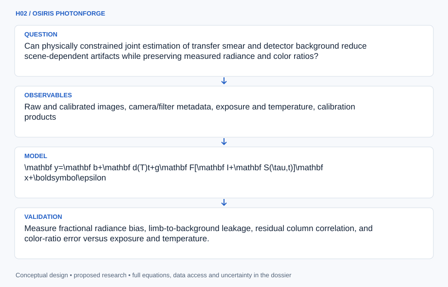

# H02 · OSIRIS PHOTONFORGE

**Original project:** Calibration of Images from the OSIRIS-REx Camera Suite

**Session H:** Planetary Science

**Document class:** engineering research design and analysis record · **Revision:** 2 · **Date:** 2026-10-02

**Evidence state:** design basis, mathematical formulation and verification plan documented. Project-specific empirical results remain to be acquired; executable shared model demonstrations have their own recorded checks.

[Engineering document register](../../ENGINEERING_DOCUMENTATION.md) · [Session H handbook](../../documentation/SESSION_H.md) · [Previous: H01](../H/H01.md) · [Next: H03](../H/H03.md)

## Purpose and scientific objective

Develop an uncertainty-aware charge-smear correction benchmark for OCAMS images of Bennu. Preserve the original detector-calibration problem while replacing empirical tuning with a forward model of frame transfer, detector offsets, and illumination. Golish and colleagues document the calibration pipeline and public raw, calibrated, and calibration-file archives. Proposed improvements must be demonstrated on withheld calibration scenes; visual smoothness alone cannot establish scientific accuracy.

**Question:** Can physically constrained joint estimation of transfer smear and detector background reduce scene-dependent artifacts while preserving measured radiance and color ratios?

**Testable hypothesis:** A transfer-operator model with a small, independently calibrated timing correction will outperform per-image heuristic factors in held-out high-contrast scenes and provide better uncertainty coverage.

## 1. Design basis and analysis boundary

The calibration benchmark models charge smear and detector offsets in actual OCAMS coordinate/readout conventions, using documented raw, calibrated and calibration-file products. The analysis boundary is detector correction followed by documented radiance conversion; illumination geometry and scene changes are separate causes of image differences. Visual smoothness is not a scientific accuracy metric.

Begin by reproducing the published correction order and camera-specific metadata, then compare fixed physical transfer and constrained joint scene/timing estimates. Synthetic scenes provide exact unsmeared truth, while withheld calibration/repeat scenes assess flight consistency. Gain, flat response, transfer timing and detector temperature remain sourced or TBD; arbitrary column smoothing is not accepted as a substitute for the frame-transfer operator.

## 2. Requirements and verification traceability

These are project design requirements or proposed analysis gates. A numerical target is not a NASA requirement unless its controlling source is explicitly identified. “TBD” identifies evidence required before a decision; it is not permission to assume a value. Verification evidence listed here is planned, unless a linked result explicitly records execution.

| ID | Requirement / gate | Engineering rationale | Verification method | Basis / required evidence |
| --- | --- | --- | --- | --- |
| H02-R1 | Each image shall retain camera/filter, raw/calibrated product ID, exposure definition, temperature, readout direction and calibration-file versions. | A wrong detector convention reverses smear geometry. | PDS label and processing-order audit. | Golish et al.; OCAMS archive. |
| H02-R2 | Derive smear operator from documented transfer sequence and row timing; proposed synthetic forward/inverse relative residual target is 10^-8 in noiseless supported cases. | Numerical correction must match physical acquisition. | Independent synthetic matrix checks. | Proposed computational target. |
| H02-R3 | Saturated/unsupported moving scenes shall be flagged, including downstream contamination where the transfer model requires it. | Clipped source charge is not recoverable truth. | Saturation/motion evidence gate. | Detector-model assumptions. |
| H02-R4 | Evaluate withheld cameras/campaign scenes with radiance bias, feature retention and covariance; no absolute-improvement claim from repeatability alone. | Regularization may erase real narrow features. | Held-out calibration comparison. | Published baseline context. |

## 3. Architecture and controlled interfaces

A PDS adapter decodes DN images and labels into documented detector coordinates without silently flipping rows. Bias/overscan and dark-rate modules preserve DN and DN/s conventions; gain is DN/electron. Flat response and transfer matrices are assembled in the published order, with effective operator definitions explicitly recorded.

The constrained estimator accepts noise covariance, timing priors and optional regularization, and outputs unsmeared electron signal plus parameter covariance. A radiance adapter applies the documented post-detector calibration and units. Synthetic forward scenes and withheld flight products share the same metadata path. Missing transfer/gain files, saturation or unsupported motion propagate invalid/limited-correction flags instead of cosmetically repaired science pixels.



The diagram binds correction to actual camera acquisition conventions and separates exact synthetic truth from flight consistency. It exposes saturation, timing and regularization limits before any claim of improved radiometry.

[Editable engineering diagram source](../../visuals/projects/H02.mmd)

## 4. Mathematical model and derivation

### Governing equations

$$
\mathbf y=\mathbf b+\mathbf d(T)t+g\mathbf F[\mathbf I+\mathbf S(\tau,t)]\mathbf x+\boldsymbol\epsilon
$$

$$
\hat{\mathbf x},\hat\tau=\arg\min_{\mathbf x\ge0,\tau}\;\Vert\mathbf W^{1/2}(\mathbf y-\boldsymbol\mu)\Vert^2+\lambda\Vert\mathbf L\mathbf x\Vert^2+\frac{(\tau-\tau_0)^2}{\sigma_\tau^2}
$$

$$
\mathbf C_x\approx\mathbf J_y\mathbf C_y\mathbf J_y^T+\mathbf J_\theta\mathbf C_\theta\mathbf J_\theta^T
$$

### Variables, units and conventions

- y and bias b are digital numbers; x is unsmeared scene signal in electrons; g converts electrons to digital numbers.
- d is dark rate in digital numbers per second; T is detector temperature; t and row-transfer timing tau are seconds.
- F contains dimensionless flat response; S is a camera-specific transfer operator; W is inverse noise covariance.
- C_theta describes calibration-parameter uncertainty; radiance conversion is applied after detector correction with documented units.

### Assumptions and boundary conditions

- Readout direction, detector coordinates, exposure definitions, and gain conventions must come from instrument documentation.
- A static scene during transfer is an approximation; saturated pixels and motion-blurred scenes require exclusion or an expanded model.

### Derivation step 1

```text
y=b+d(T)t+g F[I+S(tau,t)]x+epsilon.
```

x is unsmeared electrons, g DN/electron, b DN and d t DN. F and S are dimensionless effective operators in the verified camera-specific processing convention.

### Derivation step 2

```text
S(tau,t)=(tau/t)K_transfer for the supported static-scene linear model.
```

K_transfer encodes the actual sequence/path of rows; tau/t is dimensionless. Exposure approaching zero or scene motion requires a different validity treatment.

### Derivation step 3

```text
x_hat,tau_hat=argmin_(x>=0,tau) (y-mu)^T C_y^-1(y-mu)+lambda||Lx||²+(tau-tau0)²/sigma_tau².
```

Timing prior and scene regularization resolve some degeneracy but introduce bias; lambda is scaled so the objective is dimensionless.

### Derivation step 4

```text
C_x approximately J_y C_y J_y^T+J_theta C_theta J_theta^T.
```

Calibration uncertainty includes shared bias/dark/flat/timing covariance. Cross terms are retained when image and calibration estimates are not independent.

### Inference or simulation procedure

Reconstruct the published processing order using archived calibration files before changing any correction. Derive the smear matrix from the actual frame-transfer sequence rather than using an arbitrary column convolution. Fit timing corrections on dark-sky boundaries or dedicated calibration observations, with camera- and campaign-specific priors. Compare the published correction, fixed physical transfer model, and constrained joint estimator. Propagate shot noise, overscan bias uncertainty, dark-current uncertainty, flat response, and timing through radiance and reflectance products. Use carefully labeled synthetic images spanning sharp limbs, bright boulders, low signal, and saturated regions to obtain exact ground truth, then compare repeat observations at compatible geometry to assess real-image consistency.

### Validity domain and fidelity limits

Inverse regularization can erase narrow genuine features. Calibration cannot remove illumination-angle differences or point-source aliasing automatically. Improved relative precision does not establish an improved absolute calibration.

## 5. Data specifications and provenance

| Field | Type | Unit | Physical / statistical meaning | Quality and missing-data rule |
| --- | --- | --- | --- | --- |
| ocams_product | string | none | Camera/filter/PDS product identity. | Label and calibration version required. |
| detector_dn | float matrix | DN | Raw or bias-qualified pixels. | Readout coordinates/saturation retained. |
| exposure_time | float | s | Documented integration duration. | Positive; definition source required. |
| dark_rate | float matrix | DN/s | Temperature-dependent dark model. | Calibration covariance saved. |
| gain | float | DN/electron | Declared conversion convention. | No reciprocal-gain ambiguity. |
| transfer_operator | sparse matrix | dimensionless | Camera-specific smear coupling. | Sequence/timing provenance required. |
| unsmeared_signal | nullable matrix | electrons | Estimated scene signal. | Support/regularization flags retained. |
| scene_covariance | matrix/operator | electrons² | Joint corrected-signal uncertainty. | Shared calibration and timing terms included. |

[Machine-readable record schema](../../data/contracts/H02.schema.json) · [Empty acquisition CSV](../../data/contracts/H02.csv) · [Field dictionary CSV](../../data/contracts/H02.dictionary.csv)

The CSV above contains column headers only. Its schema defines future records and does not establish that original-team data or a particular archive product have been acquired. Frame, timing, calibration, covariance, selection and provenance details must accompany populated records.

### OSIRIS-REx OCAMS PDS bundle

[Product, archive or reference](https://arcnav.psi.edu/urn%3Anasa%3Apds%3Aorex.ocams)

**Fields:** Raw and calibrated images, camera/filter metadata, exposure and temperature, calibration products

**Access:** Public archive; verify bundle versions, product labels, and calibration availability before selecting files.

**Role:** Reproducible flight-data benchmark.

### Ground and in-flight calibration publication

[Product, archive or reference](https://pmc.ncbi.nlm.nih.gov/articles/PMC6979463/)

**Fields:** Detector layout, acquisition sequence, calibration order, published uncertainty context

**Access:** Open article; ground-test products may require separate archive discovery.

**Role:** Forward-model definitions and baseline.

## 6. Uncertainty, sensitivity and identifiability

Bias, dark, flat and timing errors are spatially correlated, and shot noise depends on signal. Joint timing and scene inference can trade off with sharp features or dark-sky boundaries. Profile tau under independent calibration priors and compare regularization strengths on withheld synthetic limbs and boulders; a lower residual can reflect overfitting or blurred truth.

Flight repeat scenes change illumination and viewing geometry, so they are consistency evidence rather than exact truth. Saturation and scene motion violate the static linear model; their influence may spread through transfer coupling. Keep absolute radiometric calibration uncertainty separate from relative smear improvement, and report feature-retention error alongside image-wide metrics.

## 7. Engineering trade study

| Alternative | Benefit | Cost / limitation | Decision rule |
| --- | --- | --- | --- |
| Published correction baseline | Known documented processing chain. | May leave scenario-specific residual smear. | Required reproduced comparator. |
| Fixed physical transfer inversion | Transparent detector physics and timing. | Limited if timing/model inputs are uncertain. | Preferred initial alternative. |
| Joint constrained scene/timing fit | Propagates timing and scene uncertainty. | Nonuniqueness/regularization can erase features. | Use only with independent priors and holdout benefit. |

## 8. Verification and validation cases

| Case ID | Stimulus / condition | Expected result / criterion | Method | Evidence artifact |
| --- | --- | --- | --- | --- |
| H02-V1 | Zero transfer timing | S=0 and x=F^-1(y-b-dt)/g where supported. | Condition/fixture: tau=0 with valid flat/gain and offsets. Verification procedure: Exact operator limit.. | Exact operator limit. |
| H02-V2 | Zero scene | y=b+d t, with no scene smear. | Condition/fixture: x=0 in noiseless synthetic acquisition. Verification procedure: Offset-only matrix fixture.. | Offset-only matrix fixture. |
| H02-V3 | Known sharp-limb scene | Recover supported unsaturated signal within proposed residual target and report edge bias. | Condition/fixture: Forward project a declared synthetic x through verified K, then invert. Verification procedure: Independent forward/inverse benchmark.. | Independent forward/inverse benchmark. |
| H02-V4 | Calibration holdout | Report radiance bias, covariance coverage and narrow-feature retention. | Condition/fixture: Reserve complete calibration scenes/campaigns. Verification procedure: Blocked flight/synthetic comparison.. | Blocked flight/synthetic comparison. |

**Execution status:** these cases are specified, not claimed as executed. Close a case only with the versioned inputs, output, uncertainty, reviewer and pass/fail rationale.

### Additional scientific validation gates

- Measure fractional radiance bias, limb-to-background leakage, residual column correlation, and color-ratio error versus exposure and temperature.
- Hold out entire observing sequences, since neighboring images share detector and illumination errors.
- Require synthetic credible-interval coverage and no loss of injected fine structure; report cases where the baseline remains superior.

## 9. Implementation and reproducible work packages

1. Freeze raw/calibrated/calibration PDS manifests and camera coordinate conventions.
2. Reproduce published offset/dark/flat/transfer order with unit checks.
3. Implement camera-specific forward transfer matrices and analytic fixtures.
4. Build noiseless/noisy synthetic limb, boulder and low-signal benchmarks.
5. Fit supported fixed/joint alternatives with parameter covariance and profiles.
6. Publish held-out radiance/feature results and absolute-calibration limitations.

### Investigation sequence

1. Freeze camera-specific product manifests and reproduce a small published-pipeline subset.
2. Create physical transfer simulations and calibrate timing on training campaigns.
3. Evaluate unseen cameras or campaigns only when their independent calibration is supplied.
4. Release correction code, uncertainty maps, and a change-impact report for downstream Bennu science.

### Resources and interfaces to expertise

- NumPy/SciPy linear algebra, PDS4 readers, instrument specialist, calibration workstation, versioned test products.

## 10. Failure modes and interpretation controls

| Failure mode | Effect on result | Detection / evidence | Design response |
| --- | --- | --- | --- |
| Readout direction wrong | Smear removed along incorrect rows. | Metadata/limb residual check. | Verified coordinate adapter. |
| Regularization hides features | False visually pleasing improvement. | Edge/point-source holdout error. | Feature-aware bias reporting. |
| Saturation treated recoverable | Invented signal values. | Clipping/contamination flags. | Exclude or qualify unsupported regions. |

- Incorrect row conventions, saturation propagation, missing calibration metadata, and unidentifiable timing versus scene brightness.

## 11. Required engineering outputs

- A documented transfer model, raw-to-radiance comparison pipeline, per-pixel uncertainty products, and calibration validation matrix.

### Scientific result figures to produce during execution

Synthetic truth, smeared input, baseline correction, proposed correction, and uncertainty-normalized residual panels; flight images appear separately without a truth label.

## 12. Cited technical and scientific resources

- [Golish et al. (2020), Ground and In-Flight Calibration of the OSIRIS-REx Camera Suite](https://pmc.ncbi.nlm.nih.gov/articles/PMC6979463/) — OCAMS detector physics, calibration pipeline, and data availability.
- [PDS OCAMS bundle](https://arcnav.psi.edu/urn%3Anasa%3Apds%3Aorex.ocams) — Archive discovery and product provenance.

Framework and evidence rules: [engineering documentation standard](../../docs/ENGINEERING_STANDARD.md), [model assurance](../../docs/MODEL_ASSURANCE.md), [uncertainty procedure](../../docs/UNCERTAINTY_AND_DECISION_RULES.md), and [data management](../../docs/DATA_MANAGEMENT.md). NASA-inspired names are creative identifiers; requirements and results are not NASA certification.
