# H03 · ARTEMIS POLAR COMPASS

**Original project:** Magnetic Anomalies in the South Polar Region of the Moon

**Session H:** Planetary Science
**Status:** proposed research dossier; no project experiment or mission qualification has been performed.

Produce a defensible south-polar lunar magnetic-field atlas from Kaguya magnetometer observations, with Lunar Prospector as an independent comparison where coverage permits. Preserve the equivalent-source dipole approach and polar map focus. The principal advance is a map of resolution, external-field contamination, and altitude-transfer uncertainty alongside field strength. A magnetic anomaly is a geological clue; this project does not equate orbital anomaly detection with a measured surface shielding benefit for astronauts.

## Scientific question

Which south-polar anomalies persist across quiet passes and reasonable equivalent-source geometries, and at what spatial resolution can their field be estimated?

## Testable hypothesis

Cross-orbit regularization with an explicit external-field component will recover stable regional anomalies while reducing apparent small-scale structure produced by irregular altitude and plasma disturbances.



*Conceptual research design; arrows show the analysis dependency, not observed causation.*

## Mathematical model

$$
\mathbf B(\mathbf r)=\frac{\mu_0}{4\pi}\sum_j\left[\frac{3\mathbf R_j(\mathbf m_j\cdot\mathbf R_j)}{R_j^5}-\frac{\mathbf m_j}{R_j^3}\right]+\mathbf B_{\rm ext}
$$

$$
(\hat{\mathbf m},\hat{\mathbf a})=\arg\min_{\mathbf m,\mathbf a}\;\Vert\mathbf C^{-1/2}(\mathbf G\mathbf m+\mathbf H\mathbf a-\mathbf b)\Vert^2+\lambda\Vert\mathbf L\mathbf m\Vert^2
$$

```text
W_perp = C^-1 - C^-1 H (H^T C^-1 H)^+ H^T C^-1; R_m = (G^T W_perp G + lambda L^T L)^+ G^T W_perp G, after eliminating unpenalized external-field nuisance coefficients.
```

### Variables and units

- B is magnetic induction in tesla, reported in nanotesla; r and dipole displacement R are meters; m is dipole moment in ampere square meters.
- G maps source moments to measured vector components; H a represents smooth external-field nuisance terms per pass.
- C includes correlated measurement and environmental errors; the resolution matrix R differs from dipole displacement R_j.
- W_perp: covariance-weighted projection after jointly fitting H a; superscript + denotes the Moore-Penrose pseudoinverse. R_m is source resolution under the declared constraints, not the resolution of a source-only fit.

### Assumptions and boundary conditions

- Equivalent dipoles are an inversion representation, not an assertion that physical isolated dipoles exist at the chosen depth.
- A reference-altitude map is modeled; downward continuation toward the surface is unstable and requires strong uncertainty qualification.
- Check rank and impose documented gauge/source constraints before interpreting resolution; uncertainty in the external-field model can reduce identifiable internal-field structure.

### Inference or simulation method

Select south-polar Kaguya LMAG passes using instrument flags, ephemerides, altitude, local time, and evidence of quiet external conditions. Compare several quiet-pass definitions instead of accepting a single threshold. Transform vectors into a documented lunar coordinate frame and invert on a polar mesh, testing source depth, spacing, and regularization. Jointly estimate slowly varying external terms with constraints that prevent them absorbing the crustal signal. Map radial and horizontal components at a declared reference altitude and evaluate spatial sensitivity with synthetic anomaly recovery. Compare independent Lunar Prospector passes at matched altitude rather than judging agreement between maps at different heights. Overlay geological boundaries only after the magnetic inversion is frozen.

### Model limits

Source magnetization magnitude, orientation, depth, and lateral extent are nonunique. External currents and sparse low-altitude coverage may dominate some pixels. The commonly cited PDS large-scale 30-km crustal map covers only 65 degrees south to 65 degrees north and cannot supply the polar study area.

## Data and provenance contracts

### JAXA DARTS Kaguya archive

[Resource or product discovery](https://darts.isas.jaxa.jp/en/missions/kaguya)

**Fields:** LMAG vector observations, product documentation, geometry and time metadata

**Access:** Public scientific archive; find the appropriate observation-level LMAG products, not the separate conductivity inversion.

**Role:** Primary polar magnetic observations.

### PDS Lunar Prospector holdings

[Resource or product discovery](https://pds-geosciences.wustl.edu/missions/lunarp/index.htm)

**Fields:** MAG/ER archive discovery and mission geometry

**Access:** Magnetometer products are linked through the PPI node; inspect quality and coverage.

**Role:** Independent instrument comparison.

## Staged execution

1. Build orbit manifests and coordinate-conversion checks.
2. Fit a depth/spacing/regularization ensemble using orbit-blocked cross-validation.
3. Generate vector maps with coverage, resolution, and uncertainty layers.
4. Test whether geological associations survive environmental and inversion sensitivity analyses.

## Verification and validation

- Hold out complete orbits and report vector residuals by altitude and plasma state.
- Inject known dipoles into actual sampling patterns to quantify location bias and resolvable separation.
- Require consistency across independent passes before labeling an anomaly robust; retain low-confidence regions explicitly.

*Any numerical gate is a proposed requirement unless the dossier explicitly identifies a sourced requirement. Freeze gates before collecting confirmatory data.*

## Resources and deliverables

- SPICE geometry, spherical vector tools, regularized inverse solver, lunar magnetism mentor, GIS polar projection expertise.

- A reference-altitude field atlas, orbit-quality catalog, inversion ensemble, and geological interpretation with uncertainty.

## Risks and interpretation

- Polar projection distortions, contamination selection bias, downward-continuation instability, and confusing modeled sources with unique geological bodies.

## Figure plan

Matched-altitude polar maps of field components, posterior spread, sampled orbit tracks, and resolution length; unsampled regions are visibly masked.

## Cited scientific resources

- [JAXA Kaguya DARTS mission archive](https://darts.isas.jaxa.jp/en/missions/kaguya) — LMAG data and instrument-documentation discovery.
- [PDS Lunar Prospector archive](https://pds-geosciences.wustl.edu/missions/lunarp/index.htm) — Independent MAG/ER observation access.
- [PDS lunar crustal magnetic-field-map bundle](https://pds.nasa.gov/ds-view/pds/viewBundle.jsp?identifier=urn%3Anasa%3Apds%3Alunar-crust-magnetic.field-map) — Explicit nonpolar latitude coverage limitation.

Source discovery reviewed 2026-10-02. A public source pointer does not imply original student-team data access. See [model assurance](../../docs/MODEL_ASSURANCE.md) and [data management](../../docs/DATA_MANAGEMENT.md).
