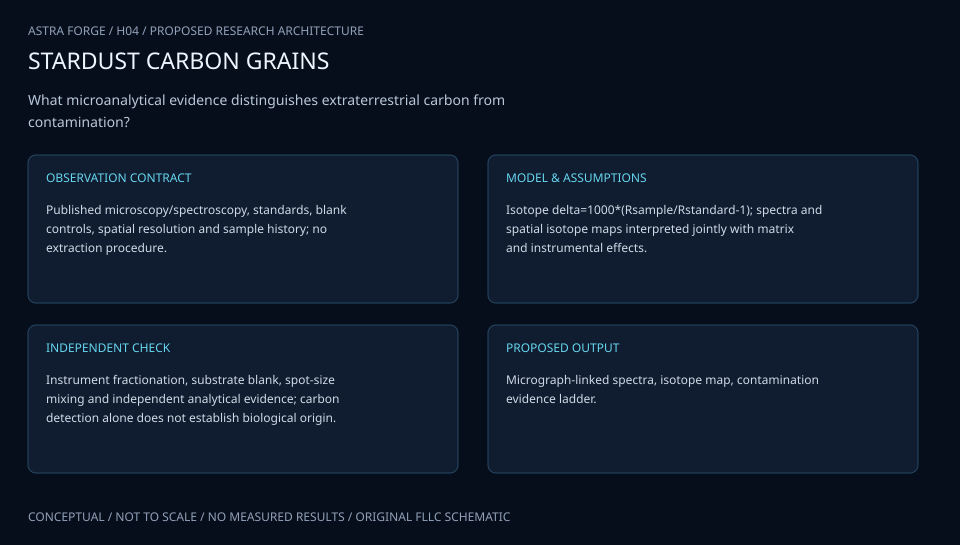

# H04 · STARDUST CARBON ATLAS

**Original project:** Exploring Carbon-bearing Matter in an Antarctic Micrometeorite

**Session H:** Planetary Science
**Status:** proposed research dossier; no project experiment or mission qualification has been performed.

Resolve carbon-bearing phases and isotope heterogeneity in the original Antarctic micrometeorite target, TAM19B-7, using a correlative microscale evidence chain. Preserve the carbon-isotope question while explicitly separating extraterrestrial heterogeneity, parent-body alteration, atmospheric entry, and Antarctic weathering. Published micrometeorite studies establish the importance of weathering and combined microscopy, not the numerical composition of this particular target. Historic symposium results are not treated as newly measured or independently reproduced data.

## Scientific question

Do spatially resolved carbon-isotope anomalies coincide with identifiable indigenous organic or carbonate phases after accounting for analytical matrix effects and terrestrial alteration?

## Testable hypothesis

A joint mineralogical and isotope model will explain more apparent carbon heterogeneity than an isotope-only analysis, while leaving a testable subset of phase-associated indigenous anomalies.

*Conceptual research design; arrows show the analysis dependency, not observed causation.*

## Mathematical model

$$
\delta^{13}C=1000\left[\frac{(^{13}C/^{12}C)_{\rm sample}}{(^{13}C/^{12}C)_{\rm reference}}-1\right]
$$

$$
N_{13,p}\sim\mathrm{Poisson}(\eta_{13,q}R_p\Lambda_p+b_{13,p}),\quad N_{12,p}\sim\mathrm{Poisson}(\eta_{12,q}\Lambda_p+b_{12,p})
$$

$$
R_{\rm mix}=\frac{\sum_q n_{12,q}R_q}{\sum_q n_{12,q}},\quad P(z_p=q\mid\mathrm{spectra,maps})
$$

### Variables and units

- delta is reported in per mil relative to a declared carbon isotope reference; R is an isotope ratio, not a delta value.
- N denotes secondary-ion counts per pixel; eta is phase-dependent sensitivity; Lambda is expected carbon signal; b is background.
- q labels candidate carbon-bearing phases; mixing weights use isotope atom inventories rather than unqualified volume fractions.

### Assumptions and boundary conditions

- Matrix-matched standards and analytical blanks are required; raw count ratios alone cannot establish an isotope anomaly.
- Serial sections and instrument maps must be spatially registered with uncertainty; a nearby mineral is not necessarily the isotope carrier.

### Inference or simulation method

Begin with non-destructive optical, Raman, and infrared mapping to identify organics, carbonates, and weathering products, documenting laser dose and sample history. Register SEM/EDS mineral maps and targeted NanoSIMS measurements to the same coordinate system. Fit counts with phase-specific instrumental mass-fractionation and detector corrections, explicitly including low-count pixels. Use a hierarchical background-plus-anomaly model to control multiple testing across spatially correlated pixels. Compare carbon isotope distributions across phase boundaries and weathering fronts; where sample allocation permits, seek independent oxygen or hydrogen isotope constraints. Reserve material for confirmation rather than consuming the entire particle during exploratory mapping. Record coatings, adhesives, and preparation residues as potential carbon sources.

### Model limits

A carbon isotope difference alone cannot identify a new parent body or demonstrate biological material. Destructive sampling, beam mixing, terrestrial contamination, and matrix effects can create or mask heterogeneity. The original target's raw maps and sample permissions remain to be obtained.

## Data and provenance contracts

### TAM19B-7 custodian and original analytical records

[Resource or product discovery](https://link.springer.com/article/10.5047/eps.2008.11.001)

**Fields:** Needed: target allocation, preparation history, raw isotope counts, standards and microscopy maps

**Access:** Target-specific raw data are not verified public holdings; this URL supplies comparative methods, not TAM19B-7 data.

**Role:** Original specimen study under an agreed sample plan.

### Published Antarctic micrometeorite correlative studies

[Resource or product discovery](https://doi.org/10.1016/j.gca.2023.08.023)

**Fields:** Weathering textures, carbon-bearing materials, analytical approaches

**Access:** Published comparison; distinct specimens cannot substitute for target observations.

**Role:** Weathering controls and competing explanations.

## Staged execution

1. Agree on sample stewardship, reference materials, and instrument sequence.
2. Build a registered phase map before selecting isotope regions.
3. Analyze standards and blanks interleaved with target measurements.
4. Confirm candidate anomalies independently and release permitted raw counts and uncertainty models.

## Verification and validation

- Recover known standard ratios within stated uncertainty and quantify phase-specific repeatability.
- Test anomaly false-discovery rate with count-level simulated null maps and spatially blocked holdouts.
- Require independent phase evidence and repeat measurement before interpreting an anomalous region as an indigenous carrier.

*Any numerical gate is a proposed requirement unless the dossier explicitly identifies a sourced requirement. Freeze gates before collecting confirmatory data.*

## Resources and deliverables

- NanoSIMS facility, Raman/FTIR microscopy, SEM/EDS access, meteorite curator, isotope specialist, matrix-matched standards.

- A registered carbon-phase atlas, calibrated isotope maps, sample-consumption ledger, and evidence table comparing origin hypotheses.

## Risks and interpretation

- Finite sample mass, preparation carbon, beam damage, unresolved matrix calibration, and overinterpreting a single particle.

## Figure plan

Co-registered morphology, Raman phase, calibrated delta-carbon, count uncertainty, and anomaly-probability maps with beam footprints and weathering boundaries.

## Cited scientific resources

- [Suzuki et al. (2010), Micro-spectroscopic characterization of organic and hydrous components in weathered Antarctic micrometeorites](https://link.springer.com/article/10.5047/eps.2008.11.001) — Correlative spectroscopy and weathering/entry caveats.
- [Boyd et al. (2023), Multiscale evidence for weathering and preservation of carbonaceous material in an Antarctic micrometeorite](https://doi.org/10.1016/j.gca.2023.08.023) — Terrestrial alteration and preservation as competing interpretations; different sample.

Source discovery reviewed 2026-10-02. A public source pointer does not imply original student-team data access. See [model assurance](../../docs/MODEL_ASSURANCE.md) and [data management](../../docs/DATA_MANAGEMENT.md).
