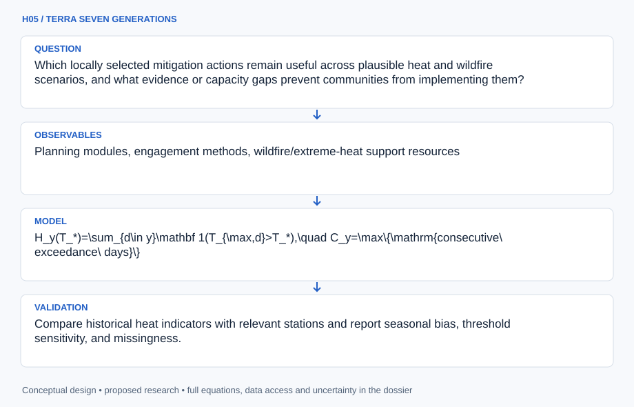

# H05 · TERRA SEVEN GENERATIONS

**Original project:** Supporting the Climate Change Department

**Session H:** Planetary Science
**Status:** proposed research dossier; no project experiment or mission qualification has been performed.

Expand the original ITEP Tribes and Climate Change internship into a Tribal-led decision-support and knowledge-sharing program for wildfire and extreme heat. Preserve its community support, youth/Elder engagement, and hazard-mitigation focus despite its placement in the planetary-science session. NASA Earth observations and climate projections serve locally chosen questions. Community authority determines which data are collected, interpreted, shared, or withheld; the output is a usable planning resource, not an externally imposed vulnerability ranking.

## Scientific question

Which locally selected mitigation actions remain useful across plausible heat and wildfire scenarios, and what evidence or capacity gaps prevent communities from implementing them?

## Testable hypothesis

A co-designed, uncertainty-explicit comparison of actions will improve planning usability and reveal implementation barriers more reliably than a single composite hazard score.

*Conceptual research design; arrows show the analysis dependency, not observed causation.*

## Mathematical model

$$
H_y(T_*)=\sum_{d\in y}\mathbf 1(T_{\max,d}>T_*),\quad C_y=\max\{\mathrm{consecutive\ exceedance\ days}\}
$$

$$
L(a,s)=\sum_j P(h_j\mid s)\,E_j\,V_j(a,s)
$$

$$
\mathrm{Regret}(a,s)=L(a,s)-\min_{a\prime\in\mathcal A}L(a\prime,s)
$$

### Variables and units

- H and C are heat-exceedance days and maximum run length per year; thresholds are chosen locally with technical support.
- s indexes climate and implementation scenarios; a indexes feasible actions; h is a hazard event; E denotes exposed assets.
- V is consequence per exposed asset under each action and scenario; totals use declared commensurate units. Cultural significance is recorded separately unless the community elects a weighting scheme.

### Assumptions and boundary conditions

- Climate projections are conditional scenarios, not forecasts of the exact timing of future events.
- Satellite land-surface temperature is not equivalent to two-meter air temperature or personal heat exposure.
- Knowledge holders control access and interpretation of Indigenous knowledge; public hazard layers cannot authorize disclosure of sensitive sites.

### Inference or simulation method

Begin with a listening and governance agreement defining the decisions, authorized participants, data ownership, and permitted public outputs. Assemble a source-checked catalog of wildfire and heat actions from ITEP resources and participating communities' approved plans. Calculate locally meaningful heat indicators from station observations and NASA NEX-GDDP-CMIP6 scenarios, using an ensemble and validating historical performance. Combine remotely observed burn or vegetation patterns with locally reviewed exposure information; refrain from converting coarse projections directly into parcel-level risk. Compare actions using community-selected criteria such as reliability, cost, maintenance, cultural compatibility, and access. Stress-test implementation under scenarios for staffing, power outages, funding delay, and climate severity. Facilitate youth/Elder review and document where quantitative metrics fail to represent community priorities.

### Model limits

Probability and consequence estimates may be weakly constrained, making ordinal scenario comparisons more honest than expected monetary losses. A decision aid does not replace Tribal plans, emergency instructions, or community judgment.

## Data and provenance contracts

### ITEP Tribal Hazard Mitigation Planning cohort account

[Resource or product discovery](https://itep.nau.edu/wp-content/uploads/2024/07/tribes_ntnlTHMPC.pdf)

**Fields:** Planning modules, engagement methods, wildfire/extreme-heat support resources

**Access:** Public account; participating Tribal planning documents require their own access decisions.

**Role:** Original program continuity and action-resource design.

### NASA NEX-GDDP-CMIP6

[Resource or product discovery](https://www.nccs.nasa.gov/data-collections/nex-gddp-cmip6/)

**Fields:** Downscaled daily temperature and other climate variables, models, scenarios and provenance

**Access:** Public service; choose product versions and calendars explicitly and retain documented limitations.

**Role:** Scenario stress testing, supplemented by local observations.

## Staged execution

1. Agree on governance and a community-selected pilot decision.
2. Compile an annotated action library and identify evidence gaps.
3. Build historical indicator checks and scenario comparisons.
4. Hold interpretation workshops, revise language and criteria, and return locally controlled outputs.

## Verification and validation

- Compare historical heat indicators with relevant stations and report seasonal bias, threshold sensitivity, and missingness.
- Conduct community-defined usability tasks and document whether proposed actions fit staffing and maintenance capacity.
- Audit every public map against the sharing agreement; report model disagreement and avoid presenting an ensemble mean as certainty.

*Any numerical gate is a proposed requirement unless the dossier explicitly identifies a sourced requirement. Freeze gates before collecting confirmatory data.*

## Resources and deliverables

- ITEP collaboration, compensated community participants and knowledge holders, climate analyst, accessible mapping tools, local planning staff.

- A locally governed action-resource library, climate scenario notebook, accessible workshop materials, and a prioritized implementation-gap register.

## Risks and interpretation

- Extractive engagement, disclosure of sensitive cultural locations, misleading fine-scale precision, and recommendations unsupported by local capacity.

## Figure plan

An accessible action-by-scenario matrix showing robustness, maintenance needs, evidence gaps, and community-defined priorities; sensitive assets remain in approved local materials only.

## Cited scientific resources

- [ITEP Climate Change 202 Tribal Hazard Mitigation Planning cohort](https://itep.nau.edu/wp-content/uploads/2024/07/tribes_ntnlTHMPC.pdf) — Program's planning, engagement, and hazard focus.
- [ITEP institutional mission](https://itep.nau.edu/) — Listening to Tribal priorities and strengthening capacity and sovereignty.
- [NASA NCCS NEX-GDDP-CMIP6 collection](https://www.nccs.nasa.gov/data-collections/nex-gddp-cmip6/) — Climate scenario data access; not local hazard validation.

Source discovery reviewed 2026-10-02. A public source pointer does not imply original student-team data access. See [model assurance](../../docs/MODEL_ASSURANCE.md) and [data management](../../docs/DATA_MANAGEMENT.md).
