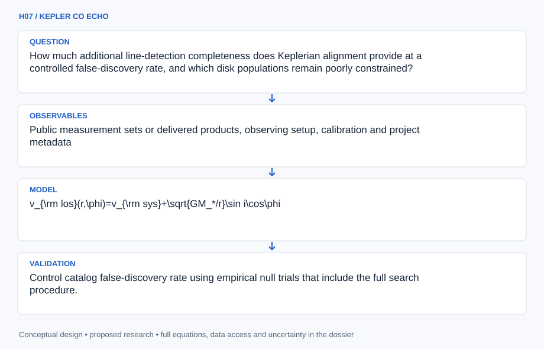

# H07 · KEPLER CO ECHO

**Original project:** Increasing CO Gas Detections in Protoplanetary Disks

**Session H:** Planetary Science

**Document class:** engineering research design and analysis record · **Revision:** 2 · **Date:** 2026-10-02

**Evidence state:** design basis, mathematical formulation and verification plan documented. Project-specific empirical results remain to be acquired; executable shared model demonstrations have their own recorded checks.

[Engineering document register](../../ENGINEERING_DOCUMENTATION.md) · [Session H handbook](../../documentation/SESSION_H.md) · [Previous: H06](../H/H06.md) · [Next: H08](../H/H08.md)

## Purpose and scientific objective

Reanalyze faint ALMA carbon-monoxide isotopologue emission by aligning spectra with disk rotation before stacking. Preserve the original CASA/GoFish archival-recovery concept while adding rigorous controls for parameter searching, correlated noise, and nondetections. The Chamaeleon I survey supplies a published comparison population. More detected CO lines can improve chemical and kinematic constraints; they do not automatically determine total disk gas masses.

**Question:** How much additional line-detection completeness does Keplerian alignment provide at a controlled false-discovery rate, and which disk populations remain poorly constrained?

**Testable hypothesis:** Velocity-aligned stacking with independently constrained geometry will recover weaker lines than fixed-aperture integration, whereas unrestricted tuning on noise will produce unreliable significance.

## 1. Design basis and analysis boundary

The disk-detection benchmark reanalyzes eligible faint ALMA CO-isotopologue observations, including nondetections, using rotation-aligned spectra and covariance-aware significance. The boundary includes archive/product audit, reproducible imaging, alignment, search-trial accounting and line-flux measurement. A normalized stack is a detection statistic and cannot automatically become total aperture flux or disk gas mass.

Begin with published aperture sums and fixed independent disk geometry, then annular stacking and matched filters. Injected synthetic disks and line-free/null transformations measure completeness and false alarms. The Chamaeleon I survey establishes a comparison population, while stellar/disk geometry and extraction settings require source-specific uncertainty. Radiative-transfer mass inference is a separate assumption-dependent stage.

## 2. Requirements and verification traceability

These are project design requirements or proposed analysis gates. A numerical target is not a NASA requirement unless its controlling source is explicitly identified. “TBD” identifies evidence required before a decision; it is not permission to assume a value. Verification evidence listed here is planned, unless a linked result explicitly records execution.

| ID | Requirement / gate | Engineering rationale | Verification method | Basis / required evidence |
| --- | --- | --- | --- | --- |
| H07-R1 | Freeze all eligible archive targets, including nondetections, and retain actual project/product IDs, proprietary status and CASA configuration. | Promising-cube selection biases recovery rates. | Selection/product manifest audit. | ALMA and published survey context. |
| H07-R2 | Record spectral reference frame, rest frequency, channel convention, synthesized beam and primary-beam correction. | Misaligned units/frame can create or suppress a line. | Cube/velocity/beam adapter checks. | Archive imaging metadata. |
| H07-R3 | Every searched radius, velocity, isotopologue and geometry variant shall enter a declared global detection procedure. | Local SNR ignores look-elsewhere effects. | Search-ledger and null-replay audit. | Proposed significance contract. |
| H07-R4 | Report calibrated false-alarm/completeness, nondetection upper limits and aperture flux separately from stack SNR. | Correlated pixels and normalized stacks affect estimands. | Injection/null and flux comparison. | Existing covariance/flux distinction. |

## 3. Architecture and controlled interfaces

A measurement-set/cube adapter records calibration, imaging weights, continuum subtraction and velocity conventions. Beam/primary-beam metadata define independent spatial support. A disk registry supplies independently constrained stellar mass, inclination, position angle, distance and systemic velocity with covariance.

The alignment engine maps sky pixels into disk coordinates and shifts spectra using the declared rotation model. Stack and matched-filter branches consume correlated noise estimated from line-free/support-compatible regions. A search ledger records all trials and null realizations. A separate aperture integrator computes beam-area-corrected flux. Cloud contamination, absorption, unsupported geometry or nondetection propagate flags and limits, rather than being excluded from the sample.



The diagram separates rotation-aligned detection from beam-corrected aperture flux and accounts for correlated noise and every search trial. It supports faint-line recovery without treating detections as direct total-gas-mass measurements.

[Editable engineering diagram source](../../visuals/projects/H07.mmd)

## 4. Mathematical model and derivation

### Governing equations

$$
v_{\rm los}(r,\phi)=v_{\rm sys}+\sqrt{GM_*/r}\sin i\cos\phi
$$

$$
\hat S(v)=\frac{\sum_p w_p I_p(v+v_{{\rm los},p})}{\sum_p w_p}
$$

$$
\mathrm{SNR}=\frac{\mathbf t^T\mathbf C^{-1}\mathbf d}{\sqrt{\mathbf t^T\mathbf C^{-1}\mathbf t}},\quad F_{\rm line}=\frac{\Omega_{\rm pix}}{\Omega_{\rm beam}}\sum_{p\in A}\int I_p(v)\,dv
$$

### Variables, units and conventions

- r is disk-plane radius in meters, M_star in kilograms, inclination i and azimuth phi in radians; velocities are reported in kilometers per second.
- I and normalized stack S are in janskys per beam; weights account for primary-beam response and covariance rather than assuming every pixel is independent.
- F_line is aperture flux in jansky kilometers per second after pixel/beam solid-angle conversion; A is the defined aperture. The normalized stack supports detection, not an automatic total-flux claim.
- t is a line template and C the measured noise covariance; pixel and beam solid angles use matching units.

### Assumptions and boundary conditions

- A thin Keplerian disk is the initial alignment model; emitting height, pressure support, warps, and cloud absorption may shift velocities.
- Stellar mass, position angle, inclination, and systemic velocity are constrained independently where possible, with uncertainty propagated.

### Derivation step 1

```text
v_los=v_sys+sqrt(G M_star/r) sin(i) cos(phi).
```

r is disk-plane metres and velocity m/s before conversion to km/s. Thin Keplerian geometry is a baseline; near edge-on deprojection needs special support limits.

### Derivation step 2

```text
S_hat(v)=sum_p w_p I_p(v+v_los,p)/sum_p w_p.
```

The normalized stack remains Jy/beam. Weights and velocity interpolation preserve covariance rather than treating every resampled pixel/channel as independent.

### Derivation step 3

```text
SNR=t^T C^-1 d/sqrt(t^T C^-1 t).
```

For fixed template and calibrated zero-mean Gaussian noise, this statistic has unit null variance. Searching templates changes its global null distribution.

### Derivation step 4

```text
F_line=(Omega_pix/Omega_beam)sum_(p in A) integral I_p(v)dv; Omega_beam=pi theta_maj theta_min/(4 ln2).
```

Angles use radians and solid angles matching units; the resulting aperture flux is Jy km/s. Primary-beam/noise corrections retain covariance.

### Inference or simulation procedure

Select a frozen archive sample including all eligible nondetections, not only promising cubes. Reproduce imaging and continuum subtraction with recorded CASA settings, spectral frames, weighting, and beam parameters. Align annular spectra using disk geometry, then compare aperture sums, annular stacks, and covariance-aware matched filters. Estimate null distributions from spatial offsets, line-free channels, and sign-preserving transformations that retain noise correlations. Account for every searched radius, velocity, isotopologue, and geometry in the detection procedure. Inject weak model disks into representative calibrated data before imaging when practical, spanning temperature, emitting height, size, and line-width assumptions. Report completeness and upper limits alongside detections. Use radiative-transfer and chemical model grids only as an explicitly assumption-dependent second stage.

### Validity domain and fidelity limits

CO freeze-out, photodissociation, chemical depletion, optical depth, and isotope-selective effects break a simple CO-flux-to-gas-mass conversion. Stacking can hide spatial contamination; an apparent aligned line still requires cube-level inspection.

## 5. Data specifications and provenance

| Field | Type | Unit | Physical / statistical meaning | Quality and missing-data rule |
| --- | --- | --- | --- | --- |
| alma_product | string | none | Project/cube/measurement-set identity. | Selection and calibration versions retained. |
| intensity_cube | nullable array | Jy/beam | Continuum-subtracted channel image. | Beam/primary-beam flags required. |
| velocity_axis | float[] | km/s | Declared spectral frame/convention. | Rest frequency and channel width saved. |
| beam_solid_angle | float | sr | Synthesized Gaussian support. | Major/minor axes and position angle retained. |
| disk_geometry | record | kg m rad km/s | Stellar/disk alignment parameters. | Independent source and covariance required. |
| noise_covariance | matrix | (Jy/beam)² | Spatial/spectral noise model. | Line-free selection and PSD check saved. |
| search_trial | record | none | Radius/geometry/velocity/isotopologue attempt. | All attempts enter global null. |
| line_flux | nullable float[] | Jy km/s | Aperture integrated flux/limit. | Distinct from normalized stack and gas mass. |

[Machine-readable record schema](../../data/contracts/H07.schema.json) · [Empty acquisition CSV](../../data/contracts/H07.csv) · [Field dictionary CSV](../../data/contracts/H07.dictionary.csv)

The CSV above contains column headers only. Its schema defines future records and does not establish that original-team data or a particular archive product have been acquired. Frame, timing, calibration, covariance, selection and provenance details must accompany populated records.

### ALMA Science Archive

[Product, archive or reference](https://almascience.nrao.edu/alma-data)

**Fields:** Public measurement sets or delivered products, observing setup, calibration and project metadata

**Access:** Availability and proprietary status are project-specific; identify actual project/product IDs before download.

**Role:** Observed line data and reproducible imaging.

### Long et al. Chamaeleon I CO survey

[Product, archive or reference](https://arxiv.org/abs/1706.03320)

**Fields:** Sample definitions, isotopologue observations, detections and nondetections

**Access:** Open paper; original archive products and table machine readability must be checked.

**Role:** Published selection function and benchmark.

## 6. Uncertainty, sensitivity and identifiability

Geometry errors, emitting height, pressure support and cloud absorption can misalign genuine lines. Propagate independent parameter covariance through shifts and inspect cube-level residuals. Resampling, beam overlap and imaging create noise correlations; null transformations must preserve them. Searching uncertain geometry can improve a local peak while increasing global false alarms.

Flux uncertainty includes primary-beam correction, continuum subtraction and aperture choice, not only stack noise. Inject weak disks before imaging where possible and vary line width/height/size to quantify completeness. CO depletion, freeze-out and optical depth leave gas mass nonidentifiable from flux alone. Nondetections and unsupported trials remain part of the benchmark denominator.

## 7. Engineering trade study

| Alternative | Benefit | Cost / limitation | Decision rule |
| --- | --- | --- | --- |
| Fixed aperture sum | Transparent flux baseline. | Rotation broadens weak signals. | Required published-method comparator. |
| Rotation-aligned annular stack | Concentrates compatible velocity signal. | Geometry and contamination can bias it. | Use with independent geometry/null calibration. |
| Covariance matched filter | Uses spectral/spatial noise structure. | Template search and mismatch matter. | Adopt with global trial and injection validation. |

## 8. Verification and validation cases

| Case ID | Stimulus / condition | Expected result / criterion | Method | Evidence artifact |
| --- | --- | --- | --- | --- |
| H07-V1 | Face-on rotation | v_los=v_sys at all resolved radii. | Condition/fixture: Set i=0 in the thin-disk model. Verification procedure: Analytic alignment fixture.. | Analytic alignment fixture. |
| H07-V2 | Fixed-template null | SNR null mean 0 and variance 1 in the ideal model. | Condition/fixture: Synthetic d~Normal(0,C) with fixed supported t. Verification procedure: Monte Carlo/analytic covariance check.. | Monte Carlo/analytic covariance check. |
| H07-V3 | Beam flux conversion | Aperture flux equals F in Jy km/s. | Condition/fixture: One beam-equivalent aperture with constant channel-integrated intensity F. Verification procedure: Independent area-ledger calculation.. | Independent area-ledger calculation. |
| H07-V4 | Search/injection holdout | Report global false alarms and recovery completeness with uncertainty. | Condition/fixture: Reserve targets and replay every trial on null and injected cubes. Verification procedure: Full-pipeline benchmark.. | Full-pipeline benchmark. |

**Execution status:** these cases are specified, not claimed as executed. Close a case only with the versioned inputs, output, uncertainty, reviewer and pass/fail rationale.

### Additional scientific validation gates

- Control catalog false-discovery rate using empirical null trials that include the full search procedure.
- Measure recovery probability versus integrated flux, disk size, inclination, and cloud contamination.
- Confirm candidate signals in independent execution blocks where available and compare recovered flux to injected truth.

## 9. Implementation and reproducible work packages

1. Freeze eligible target/product and CASA imaging manifests with nondetections.
2. Implement spectral-frame, disk-coordinate and beam-area adapters.
3. Reproduce aperture sums before rotation-aligned extraction.
4. Build covariance estimators and complete search/null ledgers.
5. Run synthetic disk injections and target holdouts through the same pipeline.
6. Release significance, completeness, flux/limits and separate mass-inference caveats.

### Investigation sequence

1. Freeze sample, geometry priors, search ranges, and detection rule.
2. Reproduce baseline flux measurements and noise diagnostics.
3. Perform aligned stacks and injection-recovery experiments.
4. Publish detections, limits, completeness curves, and transparent chemical interpretation.

### Resources and interfaces to expertise

- CASA, GoFish, spectral-cube tools, ALMA data mentor, compute and storage sized to the selected measurement sets.

## 10. Failure modes and interpretation controls

| Failure mode | Effect on result | Detection / evidence | Design response |
| --- | --- | --- | --- |
| Trial search uncounted | False faint-line detections. | Search-ledger versus null audit. | Global detection calibration. |
| Stack called total flux | Wrong luminosity/mass input. | Beam/aperture unit review. | Separate flux integrator. |
| Cloud signal aligned | Contaminated disk detection. | Cube/background inspection. | Contamination flags and independent checks. |

- Look-elsewhere bias, cloud emission, self-calibration selection effects, correlated beam noise, and overinterpreted gas masses.

## 11. Required engineering outputs

- A reproducible faint-line catalog, searchable disk stacks, completeness surface, covariance diagnostics, and model-dependent gas constraints.

### Scientific result figures to produce during execution

Channel-map velocity tracks, unaligned versus aligned spectra, empirical null distribution, and injected-flux recovery curves; measured and simulated panels remain distinct.

## 12. Cited technical and scientific resources

- [Long et al. (2017), ALMA CO isotopologue survey in Chamaeleon I](https://arxiv.org/abs/1706.03320) — Disk sample, faint emission, and CO-based mass caveats.
- [ALMA Science Archive data portal](https://almascience.nrao.edu/alma-data) — Observation and data access route.
- [GoFish documented spectral extraction tools](https://fishing.readthedocs.io/en/stable/user/fishing_basics.html) — Disk-coordinate and spectral extraction implementation reference; proposed significance controls are separate.

Framework and evidence rules: [engineering documentation standard](../../docs/ENGINEERING_STANDARD.md), [model assurance](../../docs/MODEL_ASSURANCE.md), [uncertainty procedure](../../docs/UNCERTAINTY_AND_DECISION_RULES.md), and [data management](../../docs/DATA_MANAGEMENT.md). NASA-inspired names are creative identifiers; requirements and results are not NASA certification.
