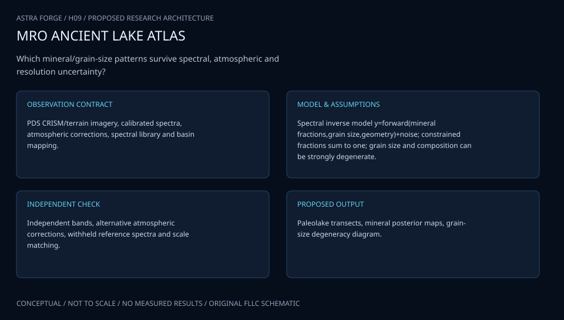

# H09 · PERSEVERANCE LAKE ARCHIVE

**Original project:** Trends in Mineralogy and Grain Size Distribution Across Paleolake Basins on Mars

**Session H:** Planetary Science
**Status:** proposed research dossier; no project experiment or mission qualification has been performed.

Build a comparative sedimentary-material atlas starting at Terby crater and extending to a deliberately selected set of Martian paleolake candidates. Preserve the original mineralogy and grain-size question, using CRISM spectra, morphological context, and independent thermal constraints where available. The key advance is honest separation of directly detected absorption features, model-dependent abundance and effective grain size, and geological interpretation. Terrestrial basins supply process analogs, not automatic ground truth for Mars.

## Scientific question

Are spatial mineral and effective-grain-size trends better explained by sediment transport and sorting, in-place alteration, or later dust and surface modification?

## Testable hypothesis

Models conditioned on mapped stratigraphic and geomorphic units will predict independent spectral and thermal observations better than a basin-wide composition model, while some grain-size estimates remain intrinsically nonunique.

*Conceptual research design; arrows show the analysis dependency, not observed causation.*

## Mathematical model

$$
r_\lambda=\mathcal H_\lambda(\mathbf f,\mathbf a,i,e,g,\theta)+\epsilon_\lambda,\quad f_q\ge0,\;\sum_qf_q=1
$$

$$
I_{\rm th}=\sqrt{k\rho c},\quad BD_\lambda=1-r_\lambda/r_{\rm cont,\lambda}
$$

$$
p(\mathbf f,\mathbf a,M\mid\mathbf r,\mathbf T)\propto p(\mathbf r,\mathbf T\mid\mathbf f,\mathbf a,M)\,p(\mathbf f,\mathbf a\mid M) p(M)
$$

### Variables and units

- r is dimensionless reflectance; f is mineral fraction under a stated mixing convention; a is effective optical grain size in micrometers.
- i, e, and g are incidence, emission, and phase angles; theta includes roughness, porosity, and scattering parameters.
- Thermal inertia I_th has units joules per square meter per kelvin per square-root second; k is conductivity, rho density, c heat capacity.
- BD is continuum-normalized band depth; T denotes thermal observations, and M competing transport/alteration scenarios.
- p(M): declared prior probability of each competing model or scenario; report sensitivity to prior choices.

### Assumptions and boundary conditions

- Optical effective grain size is not identical to geological sieve diameter, and thermal inertia is affected by rocks, cementation, porosity, and layering.
- Linear areal mixing and intimate particulate radiative transfer are distinct models requiring separate comparison.
- Atmospheric correction, photometric effects, and mineral-library variability contribute correlated spectral uncertainty.

### Inference or simulation method

Define a basin-selection rubric that records evidence for lacustrine deposition and includes comparison units with uncertain or nonlacustrine histories. Start with Terby and identify actual CRISM target products and morphology coverage before assigning mineral trends. Use map-projected targeted products with quality masks, then compare repeat observations and alternative continuum choices. Map diagnostic mineral features conservatively; fit probabilistic radiative-transfer models to estimate sets of acceptable compositions and effective grain sizes. Build laboratory-mixture tests spanning candidate clays, mafic minerals, carbonates, and dust with known particle distributions. Degrade those spectra to CRISM sampling and noise to measure identifiability. Register spectral, thermal, and imagery products at their true spatial resolutions and aggregate to common footprints. Compare predicted trends along mapped depositional transects and across stratigraphic units with full-basin holdouts.

### Model limits

Spectral non-detection does not prove mineral absence. Surface dust can conceal underlying sediment, and compositional/grain-size tradeoffs can be large. Neither clay nor carbonate detection alone establishes an ancient lake or habitability.

## Data and provenance contracts

### PDS CRISM archive

[Resource or product discovery](https://pds-geosciences.wustl.edu/missions/mro/crism.htm)

**Fields:** TER/MTRDR cubes, observation geometry, quality and instrument documentation

**Access:** Public holdings; Terby coverage, repeated targets, wavelengths, and artifact masks require product-level selection.

**Role:** Spectral observations and correction provenance.

### HiRISE images and DTM discovery

[Resource or product discovery](https://hirise.lpl.arizona.edu/dtm/)

**Fields:** Geomorphology, stratigraphic context, stereo elevation where available

**Access:** Public; site-specific DTM coverage cannot be assumed.

**Role:** Independent sedimentary context and spatial registration.

### PDS Odyssey THEMIS thermal image products

[Resource or product discovery](https://pds.nasa.gov/ds-view/pds/viewProfile.jsp?dsid=ODY-M-THM-5-IRGEO-V2.0)

**Fields:** Spatially registered thermal infrared imagery derived from calibrated radiance, geometry and processing documentation

**Access:** Public archive route; temperature and thermal inertia require appropriate thermophysical processing and viewing-time selection.

**Role:** Independent thermophysical constraints rather than direct grain-size measurements.

## Staged execution

1. Freeze basin evidence criteria, spatial footprints, and archive manifests.
2. Establish reliable mineral-feature detections and repeat-observation consistency.
3. Calibrate inversion uncertainty with known laboratory mixtures.
4. Compare transport, alteration, and surface-overprint predictions across withheld units and basins.

## Verification and validation

- Recover known laboratory-mixture properties after resolution degradation; report ambiguity rather than forcing point estimates.
- Test atmospheric, photometric, endmember, and dust sensitivity across repeated observations.
- Require cross-sensor agreement at common footprints and report residual spatial autocorrelation and basin-transfer failures.

*Any numerical gate is a proposed requirement unless the dossier explicitly identifies a sourced requirement. Freeze gates before collecting confirmatory data.*

## Resources and deliverables

- PDS spectral readers, GIS registration, radiative-transfer inference, laboratory VNIR spectrometer and sieved standards, sedimentology mentor.

- A Terby-centered basin atlas, mineral-detection confidence layers, composition/grain-size posterior sets, and competing sedimentary-history assessment.

## Risks and interpretation

- Assumed lake origins, unresolved mixed pixels, mineral-library mismatch, and reporting grain-size precision unsupported by the observations.

## Figure plan

Terby geomorphology with spectral footprints, diagnostic-band maps, grain-size/composition ambiguity plots, and model predictions along depositional transects; inferred lake histories are labeled.

## Cited scientific resources

- [PDS CRISM mission archive](https://pds-geosciences.wustl.edu/missions/mro/crism.htm) — Targeted spectral products and correction/geometry documentation.
- [Lapotre et al., A probabilistic approach to remote compositional analysis of planetary surfaces](https://www.usgs.gov/publications/a-probabilistic-approach-remote-compositional-analysis-planetary-surfaces) — Bayesian Hapke inversion and composition/grain-size tradeoffs.
- [Harris et al. (2018), Hapke mixture modeling of mafic minerals and shergottites](https://onlinelibrary.wiley.com/doi/full/10.1111/maps.13065) — Laboratory validation and limits on quantitative satellite unmixing.
- [HiRISE DTM archive](https://hirise.lpl.arizona.edu/dtm/) — Morphological/topographic product discovery.

Source discovery reviewed 2026-10-02. A public source pointer does not imply original student-team data access. See [model assurance](../../docs/MODEL_ASSURANCE.md) and [data management](../../docs/DATA_MANAGEMENT.md).
