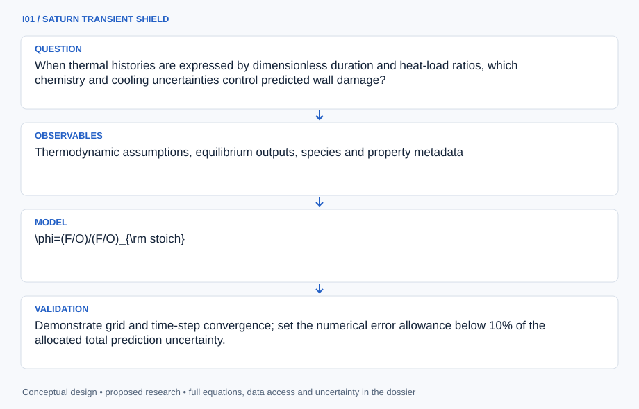

# I01 · SATURN TRANSIENT SHIELD

**Original project:** Rocket Development Lab Team: The Effects of Equivalence Ratio during shutdown of a rocket engine on hardware longevity

**Session I:** Aerospace Technology

**Document class:** engineering research design and analysis record · **Revision:** 2 · **Date:** 2026-10-02

**Evidence state:** design basis, mathematical formulation and verification plan documented. Project-specific empirical results remain to be acquired; executable shared model demonstrations have their own recorded checks.

[Engineering document register](../../ENGINEERING_DOCUMENTATION.md) · [Session I handbook](../../documentation/SESSION_I.md) · [Previous: H09](../H/H09.md) · [Next: I02](../I/I02.md)

## Purpose and scientific objective

Recast shutdown longevity as a coupled uncertainty problem: an equilibrium chemistry comparator, an externally supplied transient heat-flux envelope, and a wall fatigue model. Preserve the original question about equivalence ratio while studying how thermal history and material uncertainty influence damage. This is an analytical research proposal using archived measurements or electrically heated inert coupons. It does not specify a firing sequence, fuel delivery schedule, or engine construction.

**Question:** When thermal histories are expressed by dimensionless duration and heat-load ratios, which chemistry and cooling uncertainties control predicted wall damage?

**Testable hypothesis:** Integrated thermal-gradient cycling will explain specimen damage better than peak equilibrium gas temperature alone; the hypothesis can fail if mechanical loading or surface chemistry dominates.

## 1. Design basis and analysis boundary

The longevity analysis treats equivalence ratio as a source-supplied explanatory label and equilibrium chemistry as a comparator. Its executable boundary starts with externally supplied transient heat-flux envelopes or independently measured electrical heating on inert coupons. It ends with temperature gradients, strain uncertainty and a screening damage index. It contains no engine geometry, fuel delivery schedule or firing sequence.

Begin with dimensionless conduction and restrained elastic expansion, then temperature-dependent properties and calibrated cyclic constitutive behavior only if material evidence exists. CEA supplies equilibrium assumptions, not a shutdown heat-transfer history. Coupon dimensions/material certificates, permissible thermal envelope and sensor calibration remain TBD. The output ranks uncertainty drivers and model failure regions rather than recommending a shutdown procedure or certifying hardware life.

## 2. Requirements and verification traceability

These are project design requirements or proposed analysis gates. A numerical target is not a NASA requirement unless its controlling source is explicitly identified. “TBD” identifies evidence required before a decision; it is not permission to assume a value. Verification evidence listed here is planned, unless a linked result explicitly records execution.

| ID | Requirement / gate | Engineering rationale | Verification method | Basis / required evidence |
| --- | --- | --- | --- | --- |
| I01-R1 | Every thermal scenario shall identify an external heat-load source or inert electrical power measurement, separately from phi. | Equilibrium temperature does not determine incident wall heat flux. | Scenario/source and energy-boundary audit. | CEA boundary plus proposed thermal contract. |
| I01-R2 | Integrated heat balance shall close within 1% in synthetic conduction fixtures, a proposed target. | Numerical energy loss corrupts gradient/damage trends. | Stored-energy plus boundary-flux convergence. | Proposed numerical conservation target. |
| I01-R3 | Sensor response and contact conductance shall be independently calibrated or marked unidentifiable. | Both can mimic delayed wall cooling. | Lag/contact synthetic identifiability and calibration ledger. | Proposed metrology requirement. |
| I01-R4 | Damage shall be labeled a conditional screening index with material-cycle evidence and uncertainty. | Miner accumulation cannot certify life. | Constitutive provenance and applicability audit. | Proposed fatigue-scope rule. |
| I01-R5 | Any measured validation shall use a noncombusting inert surrogate inside an independently approved material/instrument envelope. | A thermal-model validation needs a controlled known input. | Reviewable coupon/load/sensor manifest and holdout pulse data. | Proposed surrogate gate; no engine operation specified. |

## 3. Architecture and controlled interfaces

A chemistry-label adapter records externally supplied phi and equilibrium-model version without converting them into an operational schedule. A heat-envelope interface supplies time, surface heat flux, spatial weighting and covariance. The coupon thermal solver uses verified thickness/material properties and measured contact/environment boundary conditions. Electrical surrogate data have a separate known-power ledger.

A sensor operator convolves predicted local temperature with calibrated thermocouple/IR response. A constitutive module maps temperature gradients to elastic stress and optional calibrated inelastic strain. A cycle counter and material curve generate damage proxy distributions. Shared uncertainty in heat load or conductivity propagates to all downstream outputs; missing material calibration blocks life interpretation rather than producing a nominal cycle count.

Externally supplied heat, rather than a combustion schedule, drives an inert thermal model; mechanical damage remains gated by applicable material evidence.

[Editable engineering diagram source](../../visuals/projects/I01.mmd)

## 4. Mathematical model and derivation

### Governing equations

$$
\phi=(F/O)/(F/O)_{\rm stoich}
$$

$$
\rho c_p\partial T/\partial t=\nabla\cdot(k\nabla T)+q_v
$$

$$
\sigma_{\rm th}\approx E\alpha_T\Delta T/(1-\nu);\quad D=\sum_j n_j/N_j
$$

$$
\tau=t/t_{\rm ref};\quad \theta=(T-T_0)/\Delta T_{\rm ref}
$$

### Variables, units and conventions

- phi is dimensionless fuel-to-oxidizer equivalence ratio; it is an explanatory covariate, not an operating instruction.
- T in K; rho in kg m^-3; cp in J kg^-1 K^-1; conductivity k in W m^-1 K^-1; volumetric heating qv in W m^-3.
- E and thermal stress in Pa; expansion coefficient alphaT in K^-1; Poisson ratio nu dimensionless.
- n_j and N_j are applied and estimated allowable cycle counts; D is a screening damage index with uncertain material calibration.
- Reference scales define dimensionless time tau and temperature theta; no numeric engine geometry is assumed.

### Assumptions and boundary conditions

- CEA equilibrium states are upper-level comparison conditions; chemical equilibrium is not assumed to describe an actual shutdown transient.
- Linear elastic restrained expansion is a screening approximation; plasticity, oxidation, and creep require separate constitutive evidence.

### Derivation step 1

$$
\rho c_p\partial_tT=\nabla\cdot(k\nabla T)+q_v
$$

Temperature-dependent properties enter the energy equation; surface heating is a boundary flux and must not also be counted as volumetric q_v.

### Derivation step 2

$$
Fo=\alpha t_{ref}/L^2,\quad Bi=hL/k,\quad\alpha=k/(\rho c_p)
$$

These dimensionless groups distinguish diffusion time and boundary coupling. L is a verified coupon reference length, not invented engine geometry.

### Derivation step 3

$$
\sigma_{th}\approx E\alpha_T\Delta T/(1-\nu)
$$

This restrained biaxial elastic screening relation requires the chosen constraint convention. Free expansion would not generate this stress.

### Derivation step 4

$$
D=\sum_jn_j/N_j(\Delta\epsilon_j,T_j,\mathcal M)
$$

Material model M and cycle range determine allowable cycles. Damage is dimensionless; unknown N_j yields an unsupported result, not a guessed lifetime.

### Inference or simulation procedure

Define a factorial virtual experiment over normalized pulse shapes, thermal-contact conductance, and material property uncertainty. Treat supplied chemistry scenarios as labels and propagate their heat-load envelopes through a transient conduction solver. Fit an interpretable response surface for peak gradient, residual strain, and cycle-damage proxy. A Bayesian discrepancy term separates thermocouple error from model inadequacy. Rank factors with variance decomposition and report parameter combinations where the simple fatigue representation fails; never infer a recommended shutdown recipe from this reduced model.

### Validity domain and fidelity limits

Equilibrium temperature does not determine heat transfer, and a Miner-rule proxy cannot certify hardware life. Historical datasets may omit stress, surface condition, and sensor lag.

## 5. Data specifications and provenance

| Field | Type | Unit | Physical / statistical meaning | Quality and missing-data rule |
| --- | --- | --- | --- | --- |
| scenario_label | struct | 1 | External phi/chemistry comparator identity. | No encoded firing/flow schedule. |
| heat_flux_history | measurement<float64[n,npatch]> | W m^-2 | Externally provided boundary heat load. | Source/covariance and spatial interpolation required. |
| coupon_properties | measurement<struct> | m, kg m^-3, J kg^-1 K^-1, W m^-1 K^-1 | Verified inert geometry and material. | Temperature validity range recorded. |
| contact_boundary | posterior<struct> | W m^-2 K^-1, K | Contact/environment thermal conditions. | Independent calibration or prior-dominance flag. |
| temperature_observation | float64[n,nsensor] | K | Sensor measurements/predictions. | Missing samples masked; lag response retained. |
| thermal_cov | float64[n,n] | K^2 | Sensor/input/model covariance. | Common heat/load and calibration terms preserved. |
| stress_strain | distribution<struct> | Pa, 1 | Conditional restrained mechanical response. | Constraint/inelastic model version explicit. |
| damage_proxy | posterior<float64>&#124;null | 1 | Screening cycle accumulation. | Null without applicable material-cycle evidence. |

[Machine-readable record schema](../../data/contracts/I01.schema.json) · [Empty acquisition CSV](../../data/contracts/I01.csv) · [Field dictionary CSV](../../data/contracts/I01.dictionary.csv)

The CSV above contains column headers only. Its schema defines future records and does not establish that original-team data or a particular archive product have been acquired. Frame, timing, calibration, covariance, selection and provenance details must accompany populated records.

### NASA CEA reference

[Product, archive or reference](https://ntrs.nasa.gov/api/citations/19950013764/downloads/19950013764.pdf)

**Fields:** Thermodynamic assumptions, equilibrium outputs, species and property metadata

**Access:** Public technical reference; create explicitly synthetic dimensionless scenarios.

**Role:** Chemistry-model boundary and reproducible comparison.

### NASA rocket cooling technical reference

[Product, archive or reference](https://ntrs.nasa.gov/api/citations/19810012596/downloads/19810012596.pdf)

**Fields:** Published cooling analyses and stated correlation regimes

**Access:** Archive source is public; new raw transient test data are not supplied. Request owner-approved records.

**Role:** Independent heat-transfer comparator; no historical measurements are invented.

## 6. Uncertainty, sensitivity and identifiability

Externally supplied heat histories may have uncertain amplitude, duration and spatial distribution. Conductivity, contact resistance and sensor lag can compensate in a temperature trace, especially with one sensor. Use independent lag calibration, several sensor depths/locations where available, and likelihood sensitivity across dimensionless Fo/Bi scenarios. Do not attribute all differences between chemistry labels to equivalence ratio if heat envelopes differ in uncontrolled ways.

Elastic restraint, temperature-dependent modulus, plasticity, creep and oxidation affect the damage mapping. Begin with explicit model-discrepancy ranges and inspect covariance between peak gradient and constitutive parameters. Hold out normalized heat shapes and compare temperature/strain predictions separately. Variance decomposition ranks what the reduced model identifies; lifetime remains unsupported until material-cycle and environmental evidence are adequate.

## 7. Engineering trade study

| Alternative | Benefit | Cost / limitation | Decision rule |
| --- | --- | --- | --- |
| Lumped coupon model | Fast heat/duration screening. | Misses through-thickness gradients. | Use only at small verified internal gradients. |
| Distributed transient conduction | Resolves gradient and sensor locations. | Property/boundary uncertainty. | Use primary model when independent sensors constrain it. |
| Calibrated inelastic fatigue model | More meaningful strain-cycle mapping. | Needs material/environment data. | Enable only after thermal validation and applicable constitutive evidence. |

## 8. Verification and validation cases

| Case ID | Stimulus / condition | Expected result / criterion | Method | Evidence artifact |
| --- | --- | --- | --- | --- |
| I01-V1 | Adiabatic known input | Stored thermal energy increase equals integrated supplied power. | Uniform-property insulated fixture. | Energy conservation. |
| I01-V2 | Zero heat and equal boundaries | Uniform initial temperature remains unchanged. | Exact equilibrium fixture. | Conduction equilibrium. |
| I01-V3 | Free expansion alternative | Removing restraint eliminates the screened thermal stress despite nonzero temperature rise. | Constraint-toggle analytic case. | Elastic restraint distinction. |
| I01-V4 | Withheld inert heat shape | Temperature/strain interval coverage is assessed without changing contact/lag fits. | Noncombusting known-power surrogate holdout. | Proposed thermal validation gate. |

**Execution status:** these cases are specified, not claimed as executed. Close a case only with the versioned inputs, output, uncertainty, reviewer and pass/fail rationale.

### Additional scientific validation gates

- Demonstrate grid and time-step convergence; set the numerical error allowance below 10% of the allocated total prediction uncertainty.
- Hold out complete thermal cycles and material lots; compare interval coverage and residual structure.
- Close the heat balance and test whether adding peak temperature improves withheld damage prediction beyond thermal-gradient exposure.

## 9. Implementation and reproducible work packages

1. Create chemistry-label and externally supplied heat-envelope schemas.
2. Verify inert coupon/material/sensor metadata and allowed domain.
3. Implement conservative conduction and sensor-response operators.
4. Fit contact/property uncertainty with independent lag calibration.
5. Add restrained elasticity and gated material-cycle model.
6. Publish normalized response surfaces, uncertainty ranking and withheld-surrogate predictions.

### Investigation sequence

1. Freeze a provenance manifest, material-property priors, and the distinction between synthetic scenarios and measured records.
2. Verify the conduction solver on an analytic slab; add measurement lag before fitting any archived thermal transient.
3. Use an inert heated specimen to test predicted gradient ordering, if an institutionally supervised facility is available.
4. Publish a sensitivity map and list unresolved damage mechanisms before discussing engineering applicability.

### Resources and interfaces to expertise

- Transient heat-transfer solver, uncertainty sampler, material-property references, calibrated thermometry, and a qualified thermal/materials mentor.

## 10. Failure modes and interpretation controls

| Failure mode | Effect on result | Detection / evidence | Design response |
| --- | --- | --- | --- |
| CEA temperature used as heat flux | Unsupported wall load/damage. | Heat-source contract lacks transfer evidence. | Require external flux envelope and uncertainty. |
| Lag absorbed into material response | Biased conductivity/cooling inference. | Parameter correlation and calibrated sensor mismatch. | Independent sensor dynamics and multiple locations. |
| Damage proxy called certified life | False longevity guarantee. | Missing cycle/environment applicability. | Report conditional screening and failure envelope. |

- Unrecorded surface reactions and common-mode sensor bias can reverse factor rankings. The outcome remains a research screening result, not a hardware-life certification.

## 11. Required engineering outputs

- Dimensionless thermal-history atlas, uncertainty budget, coupon-validation specification, and a traceable fatigue-screening report.

### Scientific result figures to produce during execution

A dimensionless heat-duration versus contact-conductance map colored by damage proxy, with separate uncertainty contours and clearly labeled synthetic cases.

## 12. Cited technical and scientific resources

- [NASA CEA technical reference](https://ntrs.nasa.gov/api/citations/19950013764/downloads/19950013764.pdf) — Equilibrium chemistry framework and its assumptions.
- [NASA cooling technical reference, NTRS 19810012596](https://ntrs.nasa.gov/api/citations/19810012596/downloads/19810012596.pdf) — Published rocket heat-transfer and cooling context.
- [CEA Part 1: analysis](https://ntrs.nasa.gov/citations/19950013764) — Equilibrium-chemistry method boundary; no actual shutdown heat history is supplied.
- [Low-thrust chemical rocket engine study](https://ntrs.nasa.gov/citations/19810012596) — Published cooling/transport analysis context; engine dimensions/operations are not transferred to this inert study.

Framework and evidence rules: [engineering documentation standard](../../docs/ENGINEERING_STANDARD.md), [model assurance](../../docs/MODEL_ASSURANCE.md), [uncertainty procedure](../../docs/UNCERTAINTY_AND_DECISION_RULES.md), and [data management](../../docs/DATA_MANAGEMENT.md). NASA-inspired names are creative identifiers; requirements and results are not NASA certification.
