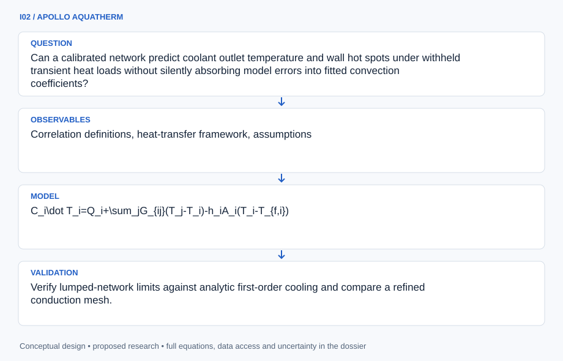

# I02 · APOLLO AQUATHERM

**Original project:** Rocket Development Lab Team: Thermal Management Analysis of Water-Cooled Rocket Engine

**Session I:** Aerospace Technology
**Status:** proposed research dossier; no project experiment or mission qualification has been performed.

Build a thermal-network digital twin that explains how an externally specified heat load moves through a water-cooled wall into coolant. Keep the original water-cooling research objective, but validate the model on an electrically heated, noncombusting flow-loop surrogate. The main advance is a measurable energy and uncertainty budget that distinguishes sensor lag, contact resistance, and flow maldistribution from an apparent heat-transfer improvement.

## Scientific question

Can a calibrated network predict coolant outlet temperature and wall hot spots under withheld transient heat loads without silently absorbing model errors into fitted convection coefficients?

## Testable hypothesis

A network that includes wall capacitance and branch-level flow uncertainty will provide better calibrated transient predictions than a steady single-channel energy balance.

*Conceptual research design; arrows show the analysis dependency, not observed causation.*

## Mathematical model

$$
C_i\dot T_i=Q_i+\sum_jG_{ij}(T_j-T_i)-h_iA_i(T_i-T_{f,i})
$$

$$
\dot m_i c_p(T_{f,i+1}-T_{f,i})=h_iA_i(T_i-T_{f,i})
$$

$$
Q_{\rm in}-\dot m c_p(T_{\rm out}-T_{\rm in})-Q_{\rm loss}=dU/dt
$$

$$
\mathrm{Re}=\rho uD_h/\mu;\quad \mathrm{Nu}=hD_h/k_f
$$

### Variables and units

- T in K; thermal capacitance C in J K^-1; conductance G in W K^-1; heat load Q in W.
- h in W m^-2 K^-1; wetted area A in m^2; coolant mass flow mdot in kg s^-1; cp in J kg^-1 K^-1.
- u in m s^-1; hydraulic diameter Dh in m; dynamic viscosity mu in Pa s; fluid conductivity kf in W m^-1 K^-1.
- Re and Nu are dimensionless; stored energy U in J and heat-loss uncertainty must be retained.

### Assumptions and boundary conditions

- Single-phase liquid and declared correlation-validity ranges are the initial model domain; boiling is outside this surrogate.
- Applied heat is independently measured. Unmodeled enclosure loss cannot be assigned to coolant uptake.

### Inference or simulation method

Represent the wall as a small thermal graph coupled to an advection network. Calibrate loss conductance using heater-off cooling and use separate instrument calibration for inlet/outlet thermometry. Infer contact resistance and convection only after checking parameter identifiability; add distributed wall sensors where competing parameter combinations make different predictions. Propagate property uncertainty and sensor response functions through transient simulations. Use a reduced-order emulator for rapid what-if analysis, with interpolation restricted to the validated dimensionless envelope. Report hot-spot uncertainty rather than only bulk coolant temperature.

### Model limits

A laboratory surrogate tests energy accounting and model structure; it does not reproduce reactive flow, combustion-chamber geometry, or full-scale cooling performance. Correlations lose validity outside their specified flow regime.

## Data and provenance contracts

### NASA cooling technical reference

[Resource or product discovery](https://ntrs.nasa.gov/api/citations/19810012596/downloads/19810012596.pdf)

**Fields:** Correlation definitions, heat-transfer framework, assumptions

**Access:** Public reference; identify the exact applicable regime before using a correlation.

**Role:** Physics comparator and terminology.

### Proposed inert thermal-loop dataset

[Resource or product discovery](https://www.nasa.gov/smallsat-institute/sst-soa/thermal-control/)

**Fields:** Time, applied electrical power, inlet/outlet temperature, wall temperature, mass flow, ambient temperature, calibration covariance

**Access:** No dataset has been collected here. Publish planned schema and instrument certificates with future records.

**Role:** Known-power energy closure and parameter identification.

## Staged execution

1. Create a node map, uncertainty allocation, and sensor-placement study before collecting measurements.
2. Calibrate thermometers together and quantify electrical power uncertainty and parasitic enclosure losses.
3. Collect institutionally supervised noncombusting transients that vary one identifiable heat-transfer factor at a time.
4. Reserve entire heat-waveform families for prediction and release model states with unit-checked metadata.

## Verification and validation

- Verify lumped-network limits against analytic first-order cooling and compare a refined conduction mesh.
- Require energy imbalance to be statistically consistent with the combined measurement and storage-energy uncertainty.
- Evaluate withheld wall hot-spot and outlet-temperature errors separately; report 90% interval coverage and sensitivity to correlation choice.

*Any numerical gate is a proposed requirement unless the dossier explicitly identifies a sourced requirement. Freeze gates before collecting confirmatory data.*

## Resources and deliverables

- Thermal-network code, water-property reference, calibrated flow and temperature measurement, an approved inert heating loop, and thermal laboratory supervision.

- Network model, sensor-selection report, energy-budget dashboard, synthetic demonstration records, and surrogate-validation protocol.

## Risks and interpretation

- Correlated thermometer drift can masquerade as excellent energy closure. An unmeasured flow split can hide a local wall hot spot.

## Figure plan

A heat-flow diagram showing input, coolant uptake, storage, and loss beside held-out measured/predicted temperature traces with uncertainty bands.

## Cited scientific resources

- [NASA cooling technical reference, NTRS 19810012596](https://ntrs.nasa.gov/api/citations/19810012596/downloads/19810012596.pdf) — Heat-transfer analysis context.
- [NASA Small Spacecraft Thermal Control](https://www.nasa.gov/smallsat-institute/sst-soa/thermal-control/) — Thermal modeling, heat-balance and verification context; spacecraft practice is a methodological analogy.

Source discovery reviewed 2026-10-02. A public source pointer does not imply original student-team data access. See [model assurance](../../docs/MODEL_ASSURANCE.md) and [data management](../../docs/DATA_MANAGEMENT.md).
