# I06 · SATURN LOADPATH

**Original project:** Designing and Exploring the Structure of Launch Vehicles to Create Optimal Theoretical and Small-Scale Experimental Models

**Session I:** Aerospace Technology

**Document class:** engineering research design and analysis record · **Revision:** 2 · **Date:** 2026-10-02

**Evidence state:** design basis, mathematical formulation and verification plan documented. Project-specific empirical results remain to be acquired; executable shared model demonstrations have their own recorded checks.

[Engineering document register](../../ENGINEERING_DOCUMENTATION.md) · [Session I handbook](../../documentation/SESSION_I.md) · [Previous: I05](../I/I05.md) · [Next: I07](../I/I07.md)

## Purpose and scientific objective

Develop a structural-modeling workbench that connects a launch-vehicle concept to an explicitly bounded, nonpropulsive subscale experiment. Preserve theoretical design, CAD export, and small-scale verification while placing similitude and uncertainty at the center. The useful result is a reproducible explanation of load paths, mass distribution, stiffness, buckling sensitivity, and modal behavior, not an unsupported assertion that a miniature article proves full-scale flight readiness.

**Question:** Which structural trends survive changes in scale, joint stiffness, imperfection amplitude, and material assumptions, and which require full-scale evidence?

**Testable hypothesis:** Joint compliance and geometric imperfections will explain more disagreement between idealized finite-element predictions and subscale tests than additional nominal mesh detail.

## 1. Design basis and analysis boundary

The structural workbench evaluates an inert launch-vehicle-inspired load-bearing concept through traceable models and subscale tests. Its boundary is supplied load cases, certified/assumed material properties, verified CAD and joints; outputs are compliance, modes, screening stability and similarity limitations. NASA structures context does not establish an integrated launch environment or full-scale readiness.

Begin with analytic beams and frame load paths, advance to shell/joint models and imperfection ensembles, then select an inert article whose achievable similitude groups are explicit. Geometric scaling alone does not preserve mass, gravity, damping or shell imperfections. No propulsion hardware or energetic test is part of the study. Actual scale, materials, fixture and allowable facility loads remain TBD.

## 2. Requirements and verification traceability

These are project design requirements or proposed analysis gates. A numerical target is not a NASA requirement unless its controlling source is explicitly identified. “TBD” identifies evidence required before a decision; it is not permission to assume a value. Verification evidence listed here is planned, unless a linked result explicitly records execution.

| ID | Requirement / gate | Engineering rationale | Verification method | Basis / required evidence |
| --- | --- | --- | --- | --- |
| I06-R1 | Every CAD revision shall link to analysis mesh, mass model, joint state and load/constraint manifest. | Untraceable model/CAD drift invalidates predictions. | Hash/revision and mass/load-path audit. | Proposed configuration contract. |
| I06-R2 | Static beam/modal fixtures shall agree with analytic limits to 1%, a proposed target. | Solver correctness precedes optimization. | Mesh-refined analytic beam tests. | Proposed numerical target. |
| I06-R3 | Joint stiffness and geometric imperfections shall be uncertain inputs rather than perfect defaults. | Connections/imperfections control compliance and stability. | Sensitivity and measured-joint provenance. | Proposed model fidelity. |
| I06-R4 | Subscale reports shall list matched and unmatched similarity groups. | Miniature performance cannot automatically establish full scale. | Dimensional similitude ledger. | Existing scale-transfer caveat. |
| I06-R5 | Buckling values shall state column/shell applicability and nonlinear imperfection assumptions. | Euler columns do not certify shells. | Mode/geometry and imperfection sensitivity audit. | Proposed stability scope. |
| I06-R6 | Measured tests shall be nonpropulsive inert loading/modal characterization within verified fixture limits. | Controlled structural evidence needs actual boundary conditions. | Fixture/load/sensor manifest and independent case holdout. | Proposed experimental gate. |

## 3. Architecture and controlled interfaces

A parameterized CAD/load-path registry emits geometry, material, joints and interface constraints. Mesh generation carries revision hashes and mass/compliance checks. Beam/frame and shell solvers have separate applicability flags. Load cases use externally supplied forces, accelerations or boundary motion rather than invented launch histories.

An uncertainty engine samples joint stiffness, material variation and imperfections. A mass/compliance/modal optimizer retains Pareto candidates and manufacturability constraints. The inert-test adapter records applied load, strain, displacement and acceleration with fixture compliance. A model/test comparator subtracts measured fixture response where justified and reports remaining scale-transfer discrepancies rather than tuning all stiffness terms to one test.

Configuration-linked analysis and measured inert boundaries support only those structural trends whose similarity groups and uncertainty are documented.

[Editable engineering diagram source](../../visuals/projects/I06.mmd)

## 4. Mathematical model and derivation

### Governing equations

$$
\boldsymbol M\ddot{\boldsymbol q}+\boldsymbol C\dot{\boldsymbol q}+\boldsymbol K\boldsymbol q=\boldsymbol f(t)
$$

$$
\det(\boldsymbol K-\omega^2\boldsymbol M)=0
$$

$$
P_{\rm cr}=\pi^2EI/(K_eL)^2
$$

$$
\Pi_{\rm load}=P/(EA);\quad \Pi_{\rm bend}=EI/(EA L^2)
$$

### Variables, units and conventions

- Displacement q in m; mass matrix M in kg; damping C in N s m^-1; stiffness K in N m^-1; applied force f in N.
- Angular natural frequency omega in rad s^-1; E in Pa; section area A in m^2; second moment I in m^4.
- Column length L in m and effective-length factor Ke dimensionless; critical load Pcr is a simple column comparator.
- Pi terms are dimensionless similarity measures; shell buckling is not certified by the Euler-column equation.

### Assumptions and boundary conditions

- Laboratory articles are inert load-bearing structures with defined constraints and joint representations.
- Geometric scale alone does not preserve mass, damping, gravity loading, material microstructure, or shell imperfection effects.

### Derivation step 1

$$
Kq=f,\quad M\ddot q+C\dot q+Kq=f(t)
$$

Static and dynamic models share a coordinate/load convention; matrix dimensions correspond to declared translational/rotational degrees of freedom.

### Derivation step 2

$$
\det(K-\omega^2M)=0
$$

With appropriate boundary constraints, generalized eigenvalues give squared modal angular frequencies. Rigid-body modes must not be mistaken for solver failure.

### Derivation step 3

$$
P_{cr}=\pi^2EI/(K_eL)^2
$$

This Euler-column comparator assumes slender elastic member and defined end conditions; shell stability requires a distinct model.

### Derivation step 4

$$
\Pi_{load}=P/(EA),\quad\Pi_{bend}=I/(AL^2)
$$

Dimensionless load and geometric bending ratios guide similitude. Natural-frequency transfer additionally depends on density/mass distribution and length scale.

### Inference or simulation procedure

Construct a parameterized load-path model and map requirements to force cases, constraints, and allowable deflections. Use beam and shell models only within declared applicability limits. Represent bolted/bonded joints by measured or uncertain stiffness rather than perfect connections. Introduce bounded geometric imperfections and compare linear modes, static compliance, and stability trends. Select a subscale inert test article using dimensionless similitude targets; document which similarity groups cannot be matched. An optimization study trades mass against compliance, uncertainty, and manufacturability, then exports reviewable CAD and an interface definition. Each CAD revision must link to the exact analysis mesh and assumptions.

### Validity domain and fidelity limits

Subscale compression and modal tests do not reproduce integrated launch vibration, aeroelastic loading, propellant motion, thermal conditions, or full-scale shell instability. Predicted buckling must be called a model-dependent screening value.

## 5. Data specifications and provenance

| Field | Type | Unit | Physical / statistical meaning | Quality and missing-data rule |
| --- | --- | --- | --- | --- |
| cad_mesh_revision | struct<string> | 1 | Linked geometry/mesh/solver identity. | Checksums and units mandatory. |
| material_properties | measurement<struct> | Pa, kg m^-3 | E, density, strength/constitutive pedigree. | Assumed versus certified; temperature domain. |
| joint_model | distribution<struct> | N m^-1, N m rad^-1 | Connection stiffness and slip model. | Perfect connection only as explicit comparator. |
| load_constraint | struct | N, N m, m | Supplied force/moment and fixture boundary. | Coordinate/sign and source documented. |
| imperfection_field | distribution<array> | m | Geometric deviations by mode/location. | Amplitude prior and metrology evidence. |
| response | measurement<struct> | m, strain, Hz | Static and modal model/test quantities. | Sensor/fixture covariance and missing channels. |
| similarity_ledger | table | 1 | Matched/unmatched dimensionless groups. | No full-scale conclusion from unmatched groups. |
| pareto_design | table | kg, m N^-1, 1 | Mass/compliance/uncertainty candidates. | Screening buckling status and manufacturability. |

[Machine-readable record schema](../../data/contracts/I06.schema.json) · [Empty acquisition CSV](../../data/contracts/I06.csv) · [Field dictionary CSV](../../data/contracts/I06.dictionary.csv)

The CSV above contains column headers only. Its schema defines future records and does not establish that original-team data or a particular archive product have been acquired. Frame, timing, calibration, covariance, selection and provenance details must accompany populated records.

### NASA structures reference

[Product, archive or reference](https://www.nasa.gov/smallsat-institute/sst-soa/structures-materials-and-mechanisms/)

**Fields:** Materials, mechanisms, structural architecture and verification context

**Access:** Public survey; actual material certificates and joint data need acquisition.

**Role:** Technical context and candidate failure-mode checklist.

### Proposed inert structural test dataset

[Product, archive or reference](https://www.nasa.gov/reference/systems-engineering-handbook/)

**Fields:** CAD revision, specimen material, joint state, applied load, strain, displacement, accelerometer record, boundary-condition metadata

**Access:** No measurements are supplied. Begin with synthetic beams and model-to-model benchmarks.

**Role:** Traceable structural validation and similitude assessment.

## 6. Uncertainty, sensitivity and identifiability

Joint compliance, fixture flexibility and material modulus can fit the same static displacement. Mass distribution and boundary stiffness similarly affect modes. Use multiple load locations and modal shapes, independently measuring fixture and specimen mass. Preserve shared scale/strain calibration covariance rather than treating every sensor point independently.

Buckling is imperfection-sensitive, especially for shells, and linear eigenvalues can overstate actual stability. Sweep measured/justified imperfections and nonlinear constitutive alternatives only within evidence. Compare normalized trends across inert scales, explicitly retaining unmatched gravity, damping and material groups. Optimization ranks model-conditioned candidates; manufacturing and validation uncertainty may erase a nominal mass benefit.

## 7. Engineering trade study

| Alternative | Benefit | Cost / limitation | Decision rule |
| --- | --- | --- | --- |
| Beam/frame model | Fast transparent load paths. | Misses local shell/joint effects. | Use analytic baseline and early trade study. |
| Shell model with uncertain joints | Resolves local modes/stability. | Mesh and imperfection dependence. | Use where geometry and measured joints justify it. |
| Inert subscale article | Checks load paths/modes empirically. | Incomplete similitude and fixture limits. | Use to validate supported trends, not flight qualification. |

## 8. Verification and validation cases

| Case ID | Stimulus / condition | Expected result / criterion | Method | Evidence artifact |
| --- | --- | --- | --- | --- |
| I06-V1 | Cantilever static limit | Tip deflection equals FL cubed/(3EI) for the declared slender uniform beam. | Mesh-refined beam fixture. | Euler-Bernoulli analytic limit. |
| I06-V2 | Mass scaling | Multiplying all masses by factor s divides modal frequencies by sqrt(s) at fixed stiffness. | Generalized eigenvalue fixture. | Modal scaling identity. |
| I06-V3 | Rigid-body freedom | Unconstrained model retains expected zero-frequency rigid modes. | Free/free modal model. | Boundary-condition consistency. |
| I06-V4 | Withheld inert load case | Static/modal response is predicted without re-fitting that fixture/load. | Independent nonpropulsive test case. | Proposed structural validation. |

**Execution status:** these cases are specified, not claimed as executed. Close a case only with the versioned inputs, output, uncertainty, reviewer and pass/fail rationale.

### Additional scientific validation gates

- Report mesh convergence and strain-energy consistency; test free-body reaction balance.
- Compare held-out compliance and first mode frequencies with uncertainty intervals; use mode-shape correlation alongside frequency error.
- Vary boundary stiffness and imperfection amplitude and identify where the structural design ranking reverses.

## 9. Implementation and reproducible work packages

1. Define supplied inert load/constraint and CAD configuration contracts.
2. Implement beam/frame analytic fixtures and mass checks.
3. Generate revision-linked shell meshes and uncertain joints.
4. Run imperfection/material/fixture ensembles and Pareto trades.
5. Select reviewable nonpropulsive subscale similarity targets.
6. Publish load/modal holdouts and unmatched full-scale similarity limits.

### Investigation sequence

1. Define inert article requirements, load paths, and similarity targets; record missing full-scale phenomena.
2. Verify elements and constraints against beam/column references before assembling the CAD-derived model.
3. Measure joint stiffness and run supervised static/modal tests with independent displacement and strain sensing.
4. Freeze a holdout configuration and compare predictions before updating the model.

### Resources and interfaces to expertise

- CAD/finite-element environment, calibrated load/displacement/strain instruments, modal analysis tools, and a supervised structural laboratory.

## 10. Failure modes and interpretation controls

| Failure mode | Effect on result | Detection / evidence | Design response |
| --- | --- | --- | --- |
| Perfect joint assumed | Overstated stiffness/mode frequency. | Mode/load residual localized at connection. | Measured/uncertain joint model. |
| CAD/mesh mismatch | Wrong mass/load path. | Revision/hash audit. | Linked configuration and automatic geometry checks. |
| Subscale success called flight proof | Unsupported readiness claim. | Unmatched similarity/environment ledger. | Report bounded structural trends and remaining evidence. |

- Idealized boundary conditions and undocumented joints can dominate apparent scale effects. Structural failure testing requires an institutionally controlled fixture and exclusion zone.

## 11. Required engineering outputs

- CAD-to-analysis manifest, mass/stiffness trade atlas, inert subscale test specification, similitude ledger, and uncertainty-aware validation report.

### Scientific result figures to produce during execution

A load-path schematic next to finite-element modes and a similarity-group table, with measured and predicted subscale compliance distinctly labeled.

## 12. Cited technical and scientific resources

- [NASA Small Spacecraft Structures, Materials and Mechanisms](https://www.nasa.gov/smallsat-institute/sst-soa/structures-materials-and-mechanisms/) — Structural/material verification context used as a methodological reference.
- [NASA Systems Engineering Handbook](https://www.nasa.gov/reference/systems-engineering-handbook/) — Requirements, interfaces, configuration control, and verification traceability.

Framework and evidence rules: [engineering documentation standard](../../docs/ENGINEERING_STANDARD.md), [model assurance](../../docs/MODEL_ASSURANCE.md), [uncertainty procedure](../../docs/UNCERTAINTY_AND_DECISION_RULES.md), and [data management](../../docs/DATA_MANAGEMENT.md). NASA-inspired names are creative identifiers; requirements and results are not NASA certification.
