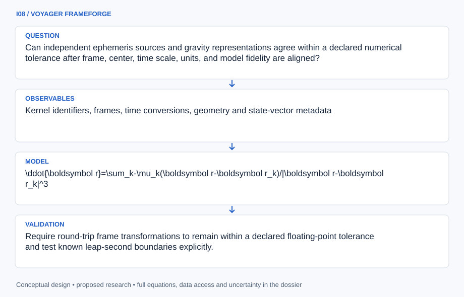

# I08 · VOYAGER FRAMEFORGE

**Original project:** Julia 1.2 Ephemeris and Gravitational Modeling Development

**Session I:** Aerospace Technology
**Status:** proposed research dossier; no project experiment or mission qualification has been performed.

Turn the historical Julia 1.2 ephemeris idea into a reference-quality, unit-aware celestial mechanics library. Preserve Julia 1.2 as an archival compatibility target while choosing a maintained execution environment through a documented support review. The core product is a provenance chain from NASA ephemerides and kernel metadata to state vectors, frame transformations, and gravity calculations, with explicit domain limits for point-mass, spherical-harmonic, and irregular-body models.

## Scientific question

Can independent ephemeris sources and gravity representations agree within a declared numerical tolerance after frame, center, time scale, units, and model fidelity are aligned?

## Testable hypothesis

Most large apparent orbit discrepancies in an initial implementation will arise from conventions and metadata rather than floating-point precision; disciplined frame/time checks will expose them.

*Conceptual research design; arrows show the analysis dependency, not observed causation.*

## Mathematical model

$$
\ddot{\boldsymbol r}=\sum_k-\mu_k(\boldsymbol r-\boldsymbol r_k)/|\boldsymbol r-\boldsymbol r_k|^3
$$

$$
V=\mu/r\{1+\sum_{\ell=2}^{L}(R/r)^\ell\sum_{m=0}^{\ell}\bar P_{\ell m}(\sin\varphi)[\bar C_{\ell m}\cos m\lambda+\bar S_{\ell m}\sin m\lambda]\}
$$

$$
\boldsymbol a=\nabla V;\quad \delta\boldsymbol x=\boldsymbol x_{\rm test}-\boldsymbol x_{\rm reference}
$$

$$
\nabla^2V=0\quad\text{outside the modeled mass}
$$

### Variables and units

- Position r and reference radius R in m; time in s with explicit TDB/UTC/other labels; gravitational parameter muk in m^3 s^-2.
- Potential V in m^2 s^-2 uses the positive mu/r convention; acceleration a in m s^-2 is its gradient.
- phi/varphi and lambda in rad; harmonic coefficients and consistently normalized Legendre functions are dimensionless.
- L is harmonic truncation degree; each state carries center, frame, epoch, units, kernel/source version, and interpolation setting.

### Assumptions and boundary conditions

- A spherical-harmonic expansion is used only outside its convergence boundary; close to an irregular body, use an independently validated closed-shape gravity model.
- Shape, rotation state, density, and gravity coefficients are independent inputs; SPICE geometry alone does not determine a mass distribution.

### Inference or simulation method

Implement a thin Julia interface over documented SPICE/Horizons conventions and maintain a cached, checksum-tagged reference manifest. Create round-trip transformations and compare state vectors only after matching center, reference frame, aberration correction, and epoch. Add point-mass and spherical-harmonic evaluators with unit tests at analytic limits; a later uniform-density polyhedral evaluator must verify closed mesh orientation and mass consistency. Compare acceleration with numerical potential gradients and external-field Laplace residuals. Benchmark runtime only after correctness, separating kernel loading, interpolation, compilation, and repeated evaluation. Archive Julia 1.2 behavior in compatibility notes instead of making it a requirement for all future work.

### Model limits

Independent outputs may share underlying JPL ephemerides, so agreement is an implementation check rather than independent astronomical validation. Harmonic truncation, uncertain small-body density, and shape resolution limit physical accuracy.

## Data and provenance contracts

### NASA/JPL NAIF SPICE tutorials and kernels

[Resource or product discovery](https://naif.jpl.nasa.gov/naif/tutorials.html)

**Fields:** Kernel identifiers, frames, time conversions, geometry and state-vector metadata

**Access:** Public documentation; verify licenses, validity intervals and exact kernel checksums before ingestion.

**Role:** Authoritative convention and transformation reference.

### JPL Horizons reference queries

[Resource or product discovery](https://ssd.jpl.nasa.gov/horizons/manual.html)

**Fields:** State vectors, centers, reference frames, epochs, constants and query metadata

**Access:** Public service; save request/output and retrieval time. Covariance is not assumed to accompany every vector.

**Role:** Independent implementation cross-check with matched conventions.

## Staged execution

1. Freeze the state-object schema, SI boundary rules, kernel manifest, and supported time/frame combinations.
2. Validate vector readers and time conversion before integrating an orbit.
3. Add gravity models in increasing complexity with separate convergence and domain tests.
4. Publish compatibility and runtime benchmarks with the executable environment lockfile.

## Verification and validation

- Require round-trip frame transformations to remain within a declared floating-point tolerance and test known leap-second boundaries explicitly.
- Compare selected Horizons/SPICE epochs and document every mismatch in convention or model source.
- Verify two-body energy/angular-momentum behavior, harmonic degree convergence, and exterior potential-gradient consistency.

*Any numerical gate is a proposed requirement unless the dossier explicitly identifies a sourced requirement. Freeze gates before collecting confirmatory data.*

## Resources and deliverables

- Julia numerical environment, NAIF kernels, saved Horizons outputs, analytic benchmark fixtures, and astrodynamics review.

- Unit-aware state library, kernel/query manifest, analytic gravity fixtures, compatibility report, performance benchmark, and reproducible error atlas.

## Risks and interpretation

- UTC/TDB confusion, kilometers/meters mixing, frame-center mismatch, and harmonics evaluated inside their convergence boundary can overwhelm nominal precision.

## Figure plan

A provenance diagram beside state-residual plots and a radial gravity-model disagreement map, with convergence boundaries and reference conventions labeled.

## Cited scientific resources

- [NASA/JPL NAIF SPICE Tutorials](https://naif.jpl.nasa.gov/naif/tutorials.html) — Frames, kernels, time, and geometric-state conventions.
- [JPL Horizons System Manual](https://ssd.jpl.nasa.gov/horizons/manual.html) — Ephemeris query options, coordinates, times, and limitations.

Source discovery reviewed 2026-10-02. A public source pointer does not imply original student-team data access. See [model assurance](../../docs/MODEL_ASSURANCE.md) and [data management](../../docs/DATA_MANAGEMENT.md).
