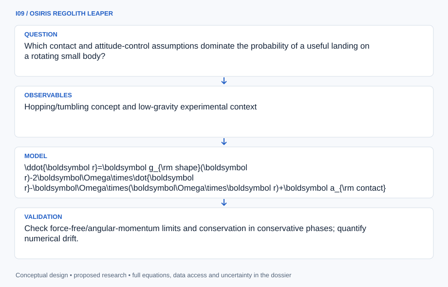

# I09 · OSIRIS REGOLITH LEAPER

**Original project:** Simulation and Evaluation of a Mechanical Hopping Mechanism for Robotic Small Body Surface Exploration

**Session I:** Aerospace Technology

**Document class:** engineering research design and analysis record · **Revision:** 2 · **Date:** 2026-10-02

**Evidence state:** design basis, mathematical formulation and verification plan documented. Project-specific empirical results remain to be acquired; executable shared model demonstrations have their own recorded checks.

[Engineering document register](../../ENGINEERING_DOCUMENTATION.md) · [Session I handbook](../../documentation/SESSION_I.md) · [Previous: I08](../I/I08.md) · [Next: I10](../I/I10.md)

## Purpose and scientific objective

Develop a low-gravity hopping simulator that couples uncertain terrain contact, irregular-body gravity, body rotation, and attitude recovery. Preserve the original SphereX-inspired surface exploration goal and distinguish a mechanical foot concept from JPL Hedgehog-style momentum exchange. The deliverable is a map of locomotion reliability and information gained per hop, with an explicit escape-risk estimate, rather than a single visually convincing trajectory.

**Question:** Which contact and attitude-control assumptions dominate the probability of a useful landing on a rotating small body?

**Testable hypothesis:** A controller selected under uncertain contact impulse and terrain geometry will achieve better landing reliability than one tuned solely for nominal ballistic range.

## 1. Design basis and analysis boundary

The hopper simulator couples shape gravity, body rotation, uncertain contact and robot attitude/momentum. Mechanical-foot and Hedgehog-style momentum-exchange concepts have separate actuation contracts; neither is assumed validated for an asteroid. JPL research context provides a concept comparator, while actual shape, mass, spin and contact properties remain versioned inputs.

Begin with ballistic/contact analytic limits, advance to a rigid-body terrain ensemble, then a calibrated granular/cohesive model only if evidence supports it. Outputs are conditional useful-landing/escape probabilities and science-viewpoint gain, not flight reliability. Earth tests cannot reproduce sustained low gravity, and lunar control results do not automatically transfer to irregular-body dynamics.

## 2. Requirements and verification traceability

These are project design requirements or proposed analysis gates. A numerical target is not a NASA requirement unless its controlling source is explicitly identified. “TBD” identifies evidence required before a decision; it is not permission to assume a value. Verification evidence listed here is planned, unless a linked result explicitly records execution.

| ID | Requirement / gate | Engineering rationale | Verification method | Basis / required evidence |
| --- | --- | --- | --- | --- |
| I09-R1 | Shape gravity, spin frame and robot/contact state shall use consistent units and coordinates. | Coriolis/contact signs change hop outcomes. | Frame and zero-spin fixtures. | Proposed dynamics contract. |
| I09-R2 | Contact shall not create mechanical energy in passive noncohesive fixtures. | Numerical impulses can generate unrealistic escapes. | Restitution/friction energy audit. | Proposed conservative/dissipative contact target. |
| I09-R3 | Ballistic integration shall conserve inertial energy to 0.1% in central-gravity fixtures, a proposed target. | Drift biases bounded/escape classification. | Step refinement and analytic orbit comparator. | Proposed numerical target. |
| I09-R4 | Wheel momentum limits and foot-release assumptions shall be explicit by concept. | Different actuators do not share feasibility. | Separate actuation manifests and saturation replay. | Proposed concept separation. |
| I09-R5 | Useful-hop probabilities shall include sample counts and terrain/contact prior domain. | Simulation fraction is conditional, not certified reliability. | Ensemble/interval and OOD audit. | Proposed uncertainty contract. |
| I09-R6 | Science gain shall require an acceptable landing and valid observation state. | Viewpoint reach alone is not usable science. | Landing/state truth-manifest check. | Proposed mission-utility metric. |

## 3. Architecture and controlled interfaces

A small-body manifest carries closed shape, gravity/density model, constant spin and surface frame. Terrain ensembles define local normals, slopes, obstacles and contact parameters. A robot registry provides mass/inertia and separately typed foot or wheel actuation constraints. The dynamics engine advances translation, attitude and wheel momentum with event-resolved takeoff/landing.

A contact solver applies impulses and optional calibrated cohesion, tracking dissipation. The science evaluator checks landing geometry, stability and observation validity. A risk/utility aggregator records boundedness, momentum exhaustion, landing failure and viewpoint gain. Uncertain gravity/contact draws remain attached to every trace so a visually plausible nominal hop cannot substitute for reliability evidence.

Event-resolved contact and momentum conservation condition science utility; probabilities remain tied to the declared body and terrain prior.

[Editable engineering diagram source](../../visuals/projects/I09.mmd)

## 4. Mathematical model and derivation

### Governing equations

$$
\ddot{\boldsymbol r}=\boldsymbol g_{\rm shape}(\boldsymbol r)-2\boldsymbol\Omega\times\dot{\boldsymbol r}-\boldsymbol\Omega\times(\boldsymbol\Omega\times\boldsymbol r)+\boldsymbol a_{\rm contact}
$$

$$
\boldsymbol I\dot{\boldsymbol\omega}+\boldsymbol\omega\times(\boldsymbol I\boldsymbol\omega+\boldsymbol h_w)=\boldsymbol\tau_{\rm contact}-\dot{\boldsymbol h_w}
$$

$$
\boldsymbol v_n^+=-e\boldsymbol v_n^-;\quad |J_t|\le\mu_fJ_n
$$

$$
p_{\rm useful}=P(\text{bounded trajectory, acceptable landing, usable science})
$$

### Variables, units and conventions

- Body-fixed position r in m and velocity in m s^-1; shape-gravity and contact acceleration in m s^-2.
- Body rotation Omega and robot angular velocity omega in rad s^-1; inertia I in kg m^2; wheel momentum hw in kg m^2 s^-1.
- Contact impulse J in N s; restitution e and friction coefficient muf dimensionless; contact torque in N m.
- Probability p_useful is conditional on the declared terrain/contact prior; it is not a flight reliability certificate.

### Assumptions and boundary conditions

- Constant small-body rotation is the initial model; time-varying rotation and solar/tidal perturbations are added only if their error contribution matters.
- A rigid restitution/friction law is a baseline. Cohesion, granular dissipation and delayed foot release may need a calibrated discrete-element contact model.

### Derivation step 1

$$
\ddot r=g_{shape}-2\Omega\times\dot r-\Omega\times(\Omega\times r)+a_{contact}
$$

Constant-spin body-fixed dynamics include Coriolis and centrifugal terms. An Euler term is needed if spin varies.

### Derivation step 2

$$
v_n^+=-e v_n^-,\quad\Delta E_n=-\tfrac12m(1-e^2)(v_n^-)^2
$$

For passive normal contact with 0<=e<=1 and rigid fixed surface, normal kinetic energy cannot increase.

### Derivation step 3

$$
I\dot\omega+\omega\times(I\omega+h_w)=\tau_{contact}-\dot h_w
$$

Internal wheel torque exchanges angular momentum; external contact changes total robot momentum. Track saturation separately from attitude error.

### Derivation step 4

$$
p_{useful}=N_{bounded,landed,valid}/N,\quad U=E[G_{science}\mathbf1_{useful}]
$$

Counts and utility integrate all success conditions under the declared scenario prior. Statistical intervals must reflect dependent terrain batches where present.

### Inference or simulation procedure

Generate terrain ensembles with uncertain boulder size, slope, local normals, and contact properties. Simulate mechanical-foot and momentum-exchange concepts separately, preserving each actuation assumption. Propagate shape-gravity and contact uncertainty through takeoff, ballistic flight, and landing; track attitudes and available wheel momentum. Choose actions that trade scientific viewpoint gain against predicted landing failure and escape, and flag out-of-distribution terrain. Validate simple ballistic/contact limits before adding a granular model. The 2026 reaction-wheel hopper preprint offers a simulation comparator under lunar gravity, not proof of asteroid performance; reproduce its assumptions separately before transferring a control idea.

### Validity domain and fidelity limits

Earth bench tests cannot directly reproduce sustained asteroid gravity, and lunar simulation results are not automatically valid near an irregular asteroid. Unknown cohesion may dominate contact response.

## 5. Data specifications and provenance

| Field | Type | Unit | Physical / statistical meaning | Quality and missing-data rule |
| --- | --- | --- | --- | --- |
| body_manifest | struct | m, kg, rad s^-1 | Shape/mass/spin and frame. | Independent gravity/density source required. |
| terrain_case | struct | m, radian | Local geometry and seeded obstacles. | Prior/support and OOD flags. |
| robot_state | float64[] | m, m s^-1, radian | Translation and attitude/rate. | Quaternion convention/norm or rotation matrix validity. |
| contact_parameters | distribution<struct> | 1, N or J | Restitution/friction and optional cohesion. | Passive-domain constraints; unsupported parameters marked. |
| actuation_contract | enum+limits | N s, N m s | Foot or momentum-exchange bounds. | No cross-concept default assumptions. |
| wheel_momentum | float64[] | kg m^2 s^-1 | Available/stored wheel state. | Limit and saturation events retained. |
| trajectory_cov | distribution<trace> | mixed state | Gravity/contact/terrain ensemble. | Missing contact events flagged; correlated draws preserved. |
| hop_outcome | struct<bool,float> | 1 | Boundedness, landing validity, science gain. | Definition/version and ensemble count attached. |

[Machine-readable record schema](../../data/contracts/I09.schema.json) · [Empty acquisition CSV](../../data/contracts/I09.csv) · [Field dictionary CSV](../../data/contracts/I09.dictionary.csv)

The CSV above contains column headers only. Its schema defines future records and does not establish that original-team data or a particular archive product have been acquired. Frame, timing, calibration, covariance, selection and provenance details must accompany populated records.

### JPL Hedgehog research overview

[Product, archive or reference](https://www.jpl.nasa.gov/news/hedgehog-robots-hop-tumble-in-microgravity/)

**Fields:** Hopping/tumbling concept and low-gravity experimental context

**Access:** Public research description; obtain detailed data separately before claiming numerical reproduction.

**Role:** Independent locomotion concept comparator.

### Hari et al. (2026) hopper preprint

[Product, archive or reference](https://arxiv.org/abs/2603.10670)

**Fields:** Dynamic assumptions, simulation setup, attitude-control comparisons

**Access:** Open preprint, described as under review; inspect supplied code/data availability.

**Role:** Bounded control-model comparator, not validated flight hardware.

### Proposed small-body scenario manifest

[Product, archive or reference](https://naif.jpl.nasa.gov/naif/tutorials.html)

**Fields:** Shape version, spin frame, mass/density assumption, terrain seed, contact-law parameters, hop-state trace

**Access:** Synthetic scenarios first; actual kernels and shape products require versioned retrieval.

**Role:** Reproducible locomotion uncertainty ensemble.

## 6. Uncertainty, sensitivity and identifiability

Density/shape/spin uncertainty alters near-surface gravity and effective escape behavior. Terrain normals and restitution/friction/cohesion control landing and takeoff; unknown cohesion can dominate. Separate physical prior uncertainty from numerical integration error and sample them jointly where correlated, such as roughness and local normal estimates.

Wheel momentum and contact torque can compensate in attitude response, making a nominal controller appear effective only under favorable terrain. Sweep contact laws and actuator bounds, checking identifiability against independently measured surrogate contacts where applicable. Validate analytic limits before high-fidelity granular models. Probability intervals remain conditional on the tested terrain domain and should include OOD abstention rather than extrapolated success.

## 7. Engineering trade study

| Alternative | Benefit | Cost / limitation | Decision rule |
| --- | --- | --- | --- |
| Rigid impulse contact | Fast energy-auditable baseline. | Weak granular/cohesive realism. | Use analytic and ensemble baseline. |
| Calibrated granular/cohesive contact | Can represent delayed release and dissipation. | Parameter/data demand and computational cost. | Adopt only with independent contact evidence. |
| Utility-aware action selection | Trades viewpoint against risk/momentum. | Prior-sensitive success probabilities. | Use with uncertainty and unsupported-terrain gate. |

## 8. Verification and validation cases

| Case ID | Stimulus / condition | Expected result / criterion | Method | Evidence artifact |
| --- | --- | --- | --- | --- |
| I09-V1 | Zero body spin | Rotating-frame inertial terms vanish. | Omega=0 fixture. | Dynamics limit. |
| I09-V2 | Passive collision limits | e=1 preserves normal kinetic energy and e=0 removes it. | Analytic impulse fixture. | Restitution energy identity. |
| I09-V3 | No external torque | Body-plus-wheel angular momentum is conserved in inertial coordinates. | Internal exchange simulation. | Angular-momentum conservation. |
| I09-V4 | Withheld terrain/contact family | Useful-hop coverage and failure categories are evaluated without retuning actions. | Independent seeded surfaces and contact-law holdout. | Proposed reliability-domain validation. |

**Execution status:** these cases are specified, not claimed as executed. Close a case only with the versioned inputs, output, uncertainty, reviewer and pass/fail rationale.

### Additional scientific validation gates

- Check force-free/angular-momentum limits and conservation in conservative phases; quantify numerical drift.
- Compare contact/landing outcomes across an independent simulator or integrator.
- Report landing success, escape fraction, energy use, wheel saturation, and scientific coverage with ensemble confidence bounds.

## 9. Implementation and reproducible work packages

1. Create independent body/robot/actuation and terrain-prior manifests.
2. Implement frame-consistent translation/attitude and event integration.
3. Build passive-contact and angular-momentum fixtures.
4. Add contact-model fidelity only after calibration/domain review.
5. Run uncertainty ensembles and useful-science outcome ledger.
6. Publish held-out terrain failure maps, momentum limits and OOD actions.

### Investigation sequence

1. Define useful-science and unacceptable-landing criteria before optimizing hop range.
2. Verify rotating-frame dynamics and analytic ballistic limits, then add contact uncertainty.
3. Compare two distinct mechanical concepts under identical environment ensembles.
4. Reserve terrain families and cohesion regimes for validation and document unsupported cases.

### Resources and interfaces to expertise

- Rigid-body simulator, optional discrete-element solver, versioned shape/spin inputs, low-gravity robotics mentor, and controlled inert contact tests.

## 10. Failure modes and interpretation controls

| Failure mode | Effect on result | Detection / evidence | Design response |
| --- | --- | --- | --- |
| Impulse adds energy | Artificial escape or range. | Contact energy ledger. | Event-resolved passive impulse and step refinement. |
| Lunar controller copied as asteroid proof | Unsupported stability claim. | Body/gravity/domain metadata mismatch. | Revalidate small-body dynamics and limits. |
| Momentum exhaustion hidden | Unrecoverable landing attitude. | Wheel-state limit monitor. | Limit-aware action or infeasible outcome. |

- Nominal gravity may be far less influential than contact cohesion. Long airborne intervals amplify state errors, and a model that ignores escape can reward unusable trajectories.

## 11. Required engineering outputs

- Scenario library, coupled dynamics model, landing-risk atlas, concept comparison, uncertainty-aware hop planner specification, and simulation reproduction notes.

### Scientific result figures to produce during execution

Terrain panels showing successful landing density, escape probability, and science viewpoint gain; inset traces show attitude and wheel saturation for representative synthetic hops.

## 12. Cited technical and scientific resources

- [JPL Hedgehog robots hop and tumble in microgravity](https://www.jpl.nasa.gov/news/hedgehog-robots-hop-tumble-in-microgravity/) — Low-gravity hopping/tumbling research precedent.
- [Hari et al. (2026), Dynamic Modeling and Attitude Control of a Reaction-Wheel-Based Low-Gravity Bipedal Hopper](https://arxiv.org/abs/2603.10670) — Under-review lunar simulation comparator; no asteroid validation claim.
- [NASA/JPL NAIF SPICE Tutorials](https://naif.jpl.nasa.gov/naif/tutorials.html) — Body-fixed frames and geometry provenance.

Framework and evidence rules: [engineering documentation standard](../../docs/ENGINEERING_STANDARD.md), [model assurance](../../docs/MODEL_ASSURANCE.md), [uncertainty procedure](../../docs/UNCERTAINTY_AND_DECISION_RULES.md), and [data management](../../docs/DATA_MANAGEMENT.md). NASA-inspired names are creative identifiers; requirements and results are not NASA certification.
