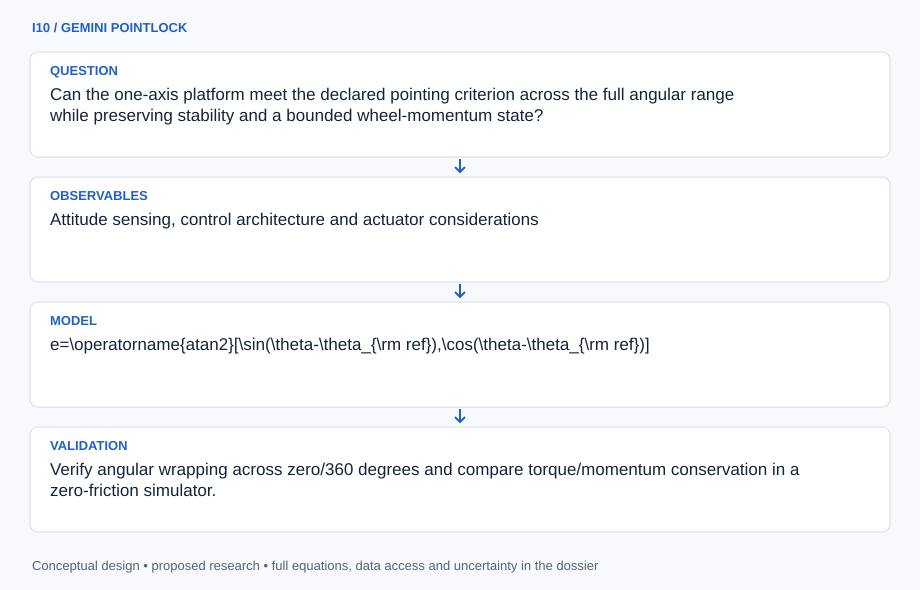

# I10 · GEMINI POINTLOCK

**Original project:** Spacecraft Attitude Control Implementation and Development

**Session I:** Aerospace Technology
**Status:** proposed research dossier; no project experiment or mission qualification has been performed.

Build on the original one-axis reaction-wheel/turntable experiment with an auditable estimation-and-control loop. Retain the symposium pointing target of plus or minus 0.5 degrees as a proposed bench acceptance criterion, then determine whether it survives encoder calibration, friction, disturbances, wheel saturation, and resets. A subsequent three-axis model is a separate extension with independently verified quaternion conventions and momentum-management assumptions.

## Scientific question

Can the one-axis platform meet the declared pointing criterion across the full angular range while preserving stability and a bounded wheel-momentum state?

## Testable hypothesis

A controller that incorporates identified friction, sensor bias, and wheel limits will outperform a nominal proportional-derivative controller during large-angle maneuvers and repeated disturbance recovery.

*Conceptual research design; arrows show the analysis dependency, not observed causation.*

## Mathematical model

$$
e=\operatorname{atan2}[\sin(\theta-\theta_{\rm ref}),\cos(\theta-\theta_{\rm ref})]
$$

$$
I_b\ddot\theta=-u+\tau_d-b\dot\theta;\quad \dot h_w=u
$$

$$
u=\operatorname{sat}(K_pe+K_d\dot\theta)
$$

$$
\dot E_{\rm elec}=P_{\rm elec};\quad |h_w|\le h_{\max}
$$

### Variables and units

- Angle theta and wrapped error e in rad; reported pointing error also in degrees with explicit conversion.
- Body inertia Ib in kg m^2; wheel torque u and external disturbance taud in N m; wheel momentum hw in N m s.
- Viscous friction b in N m s rad^-1; Kp in N m rad^-1 and Kd in N m s rad^-1; saturation is the measured actuator bound.
- E_elec is cumulative electrical energy consumed [J], the integral of measured electrical input power P_elec [W] including losses. It is not stored wheel kinetic energy. Settling time in s and angular rate in rad s^-1.

### Assumptions and boundary conditions

- Wheel torque acts oppositely on the body; signs are verified experimentally and in a known synthetic case.
- A turntable includes friction and external torque. It approximates one axis and does not establish a frictionless or three-axis space environment.

### Inference or simulation method

Identify inertia, friction, encoder bias, and actuator lag using low-energy bench characterization. Fuse gyro and angle measurements with an estimator that propagates bias uncertainty. Compare nominal PD control with a limit-aware controller under identical synthetic and bench maneuvers; include deadband, angular wrap, wheel saturation, and actuator quantization. Specify when momentum exhaustion makes the commanded pointing state infeasible. Run deterministic reset and sensor-dropout replays in the simulator. If extending to three axes, use a unit-norm quaternion state, verify body/inertial convention round trips, and separate wheel momentum management from pointing control. The existing one-axis data cannot substantiate the upgraded model.

### Model limits

A good turntable result does not establish vacuum compatibility, radiation tolerance, on-orbit disturbance rejection, or flight attitude determination. Constant friction approximation may fail around zero rate.

## Data and provenance contracts

### NASA small-spacecraft GNC reference

[Resource or product discovery](https://www.nasa.gov/smallsat-institute/sst-soa/guidance-navigation-and-control/)

**Fields:** Attitude sensing, control architecture and actuator considerations

**Access:** Public survey; exact sensor and wheel specifications require board-level verification.

**Role:** Architecture and failure-mode context.

### Proposed turntable characterization dataset

[Resource or product discovery](https://www.nasa.gov/reference/systems-engineering-handbook/)

**Fields:** Time, reference angle, calibrated angle/rate, wheel speed, current, torque estimate, temperature, state and reset marker

**Access:** No bench observations supplied; release synthetic fixtures first and retain calibration files with later measurements.

**Role:** Plant identification and withheld maneuver evaluation.

## Staged execution

1. Define pointing, settling, momentum, and power acceptance conditions before tuning gains.
2. Calibrate sensor/frame signs and identify plant parameters with independent uncertainty estimates.
3. Tune on a declared subset of angular commands and disturbance cases.
4. Freeze the controller and test unseen angles, reversals, saturation, and reset recovery; keep any three-axis extension separate.

## Verification and validation

- Verify angular wrapping across zero/360 degrees and compare torque/momentum conservation in a zero-friction simulator.
- Assess the proposed plus/minus 0.5-degree criterion using calibrated maximum steady-state error across a declared angular grid, with confidence intervals.
- Report overshoot, settling, RMS jitter, power, saturation duration, and recovery behavior; a single favorable maneuver is insufficient.

*Any numerical gate is a proposed requirement unless the dossier explicitly identifies a sourced requirement. Freeze gates before collecting confirmatory data.*

## Resources and deliverables

- Inert one-axis bench, encoder/gyro calibration, reaction-wheel emulator or supervised mechanism, control simulation, and GNC mentor.

- Plant-identification report, estimator/control code specification, pointing acceptance matrix, saturation/recovery atlas, and staged three-axis extension plan.

## Risks and interpretation

- Encoder misalignment can mimic excellent pointing, and friction can hide unstable free-space behavior. Saturated wheels remove torque authority without a separate momentum-management mechanism.

## Figure plan

Angle command and calibrated response above wheel momentum, torque saturation, and uncertainty; polar error plots cover the full tested one-axis range.

## Cited scientific resources

- [NASA Small Spacecraft Guidance, Navigation and Control](https://www.nasa.gov/smallsat-institute/sst-soa/guidance-navigation-and-control/) — Attitude sensor, actuator, and architecture context.
- [NASA Systems Engineering Handbook](https://www.nasa.gov/reference/systems-engineering-handbook/) — Acceptance criteria and test traceability framework.

Source discovery reviewed 2026-10-02. A public source pointer does not imply original student-team data access. See [model assurance](../../docs/MODEL_ASSURANCE.md) and [data management](../../docs/DATA_MANAGEMENT.md).
