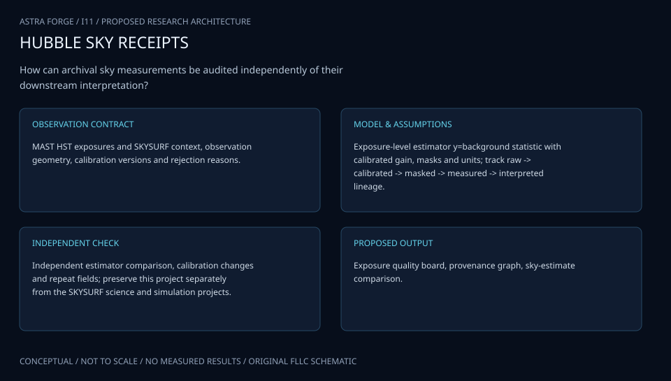

# I11 · HUBBLE SKYVAULT

**Original project:** Measurements of the Sky

**Session I:** Aerospace Technology

**Document class:** engineering research design and analysis record · **Revision:** 2 · **Date:** 2026-10-02

**Evidence state:** design basis, mathematical formulation and verification plan documented. Project-specific empirical results remain to be acquired; executable shared model demonstrations have their own recorded checks.

[Engineering document register](../../ENGINEERING_DOCUMENTATION.md) · [Session I handbook](../../documentation/SESSION_I.md) · [Previous: I10](../I/I10.md) · [Next: I12](../I/I12.md)

## Purpose and scientific objective

Preserve the original Measurements of the Sky project as an archive and calibration audit of Hubble sky foregrounds, consistent with its 2021 abstract. Concentrate on paired reprocessing of identical exposures to determine whether calibration choices alter low-surface-brightness measurements. This work complements the separate SKYSURF simulation and absolute-brightness projects: its central product is exposure-level provenance and systematic-error evidence, not a new unsupported cosmological background measurement.

**Question:** Which detector-calibration and sky-preservation choices shift the estimated foreground brightness, and do those shifts depend on filter, detector position, epoch, or observing geometry?

**Testable hypothesis:** Some apparently astrophysical sky trends will weaken after exposure-paired calibration comparisons and detector/observing-geometry covariates are included.

## 1. Design basis and analysis boundary

The Measurements of the Sky annex is an exposure-paired Hubble calibration audit. It measures how dark, flat, persistence and sky-preservation choices shift the same foreground-sky statistic. SKYSURF definitions/released products establish baseline provenance. Its product is calibration-effect evidence and reproducible paired measurements, not a newly asserted cosmological background detection.

Begin with identical exposures, masks and estimator, then controlled reference-file variants, then a separately labeled mask/foreground sensitivity study. Detector electron-rate surface brightness is converted to physical band intensity only with documented photometric response. Archive selection and failed/inaccessible products remain in the denominator. Repeatability between pipelines does not establish absolute truth.

## 2. Requirements and verification traceability

These are project design requirements or proposed analysis gates. A numerical target is not a NASA requirement unless its controlling source is explicitly identified. “TBD” identifies evidence required before a decision; it is not permission to assume a value. Verification evidence listed here is planned, unless a linked result explicitly records execution.

| ID | Requirement / gate | Engineering rationale | Verification method | Basis / required evidence |
| --- | --- | --- | --- | --- |
| I11-R1 | Primary variant comparisons shall use identical exposure pixels, object masks and sky statistic. | Mask/scene differences confound calibration effects. | Input/mask/estimator hash audit. | Proposed paired-comparison contract. |
| I11-R2 | Every variant shall record dark/flat/persistence/reference versions and removed/restored sky maps. | Absolute sky can be erased silently. | Reference/history manifest and uniform-sky replay. | SKYSURF sky-preservation context. |
| I11-R3 | Paired covariance shall include shared photon, mask and calibration terms. | Reused exposure estimates are not independent. | Identical-variant zero-difference and covariance fixture. | Proposed uncertainty requirement. |
| I11-R4 | Synthetic calibration perturbations shall be recovered within 1% of inserted shift when conditioned, a proposed numerical target. | Audit estimator needs known systematic controls. | Dark/flat perturbation injection and refinement. | Proposed recovery target. |
| I11-R5 | Filter/position/epoch/geometry effects shall be tested on withheld exposure groups. | Within-sample correction can overfit. | Stratified exposure-group holdout. | Proposed systematic-transfer requirement. |
| I11-R6 | Mask changes shall be reported as separate sensitivity rather than folded into the primary calibration difference. | Source wings and calibrations are distinct effects. | Mask-variant lineage audit. | Proposed effect-attribution rule. |

## 3. Architecture and controlled interfaces

The archive manifest links exposure IDs, detector/filter/epoch, viewing geometry and quality. Each calibration branch starts from the same pixel data and records reference operations with a sky-level ledger. A common-mask robust estimator returns detector-rate surface brightness, covariance and usable area. Physical intensity conversion carries filter response and pixel solid angle separately.

A paired-difference engine shares raw-exposure and mask covariance between variants. Mixed-effects analysis associates differences with calibration identity, detector position, epoch and geometry while allowing multiplicative dependence on scene brightness. A separate mask branch explores source-wing sensitivity. Failed reductions retain explicit status so selection does not silently favor well-behaved images.

Identical exposure/mask interfaces isolate calibration changes; shared covariance and distinct masking sensitivity prevent overinterpretation of sky residuals.

[Editable engineering diagram source](../../visuals/projects/I11.mmd)

## 4. Mathematical model and derivation

### Governing equations

$$
\widehat B_{e,k}=(D_e-d_{e,k})/[t_e\,\Omega_e\,f_{e,k}]
$$

$$
\Delta B_{e,k\ell}=\widehat B_{e,k}-\widehat B_{e,\ell}
$$

$$
B_{e,k}=Z_e+A_e+G_e+E_{\rm diffuse}+\beta_k+\gamma_k^T\boldsymbol z_e+\epsilon_{e,k}
$$

$$
\sigma_{\rm total}^2=\sigma_{\rm random}^2+\sigma_{\rm cal}^2+\sigma_{\rm mask}^2+2\sum_{i<j}\mathrm{Cov}_{ij}
$$

### Variables, units and conventions

- Exposure e and calibration variant k are indices; D and subtracted dark/debias term d in electrons for this schematic detector model.
- Exposure t in s, pixel solid angle Omega in sr, flat sensitivity f dimensionless; B is electron-rate surface brightness until filter-specific flux conversion is applied.
- Z, A, G denote zodiacal, other foreground, and Galactic contributions in matching brightness units; Ediffuse is an unconstrained residual comparator.
- z includes detector position, epoch, filter and viewing geometry; beta and gamma encode calibration effects, not established physical components.
- Covariance terms are retained because calibration variants reuse the same exposure and masks.

### Assumptions and boundary conditions

- All variants estimate the same explicitly defined sky statistic and use identical object masks in the primary paired comparison.
- An exposure-level additive decomposition is a diagnostic model; component degeneracy prevents interpreting a residual as a cosmological detection.

### Derivation step 1

$$
\widehat B_{e,k}=(D_e-d_{e,k})/(t_e\Omega_e f_{e,k})
$$

For a schematic electron detector model, B is electron s^-1 sr^-1 until response conversion; f is dimensionless sensitivity and d is an electron-domain correction.

### Derivation step 2

$$
\Delta B_{k\ell}=\frac{D}{t\Omega}(1/f_k-1/f_\ell)-\frac{1}{t\Omega}(d_k/f_k-d_\ell/f_\ell)
$$

A shared exposure eliminates independent scene changes, but a flat difference scales with D; scene brightness can therefore interact with calibration.

### Derivation step 3

$$
\operatorname{Var}(\Delta B)=\operatorname{Var}(B_k)+\operatorname{Var}(B_\ell)-2\operatorname{Cov}(B_k,B_\ell)
$$

Shared photon noise may cancel strongly. Independent-variance addition would overstate or misattribute paired uncertainty.

### Derivation step 4

$$
\Delta B_e=\Delta\beta+\Delta\gamma^Tz_e+\delta g\,B_e+\epsilon_e
$$

The diagnostic model separates additive calibration shifts, context interactions and scene-scaled gain effects; it does not identify physical diffuse components.

### Inference or simulation procedure

Select a stratified archive sample and freeze an exposure manifest with data-quality flags and calibration reference versions. Reprocess each image through approved sky-preserving variants, documenting dark, flat, persistence, scattered-light and masking differences. Estimate the sky with a fixed robust method, then vary masking in a distinct sensitivity analysis. Fit exposure-paired mixed-effects differences so scene brightness cancels while filter and detector interactions remain observable. Compare minimally correlated spatial regions to avoid treating drizzled pixels as independent samples. Use published SKYSURF definitions as the baseline and annotate every departure; report inaccessible products and unsuccessful reprocessing instead of silently dropping them.

### Validity domain and fidelity limits

Repeatability and pipeline agreement do not prove absolute sky accuracy. Foregrounds and undetected source wings are degenerate with diffuse emission, and archive selection may correlate with viewing geometry.

## 5. Data specifications and provenance

| Field | Type | Unit | Physical / statistical meaning | Quality and missing-data rule |
| --- | --- | --- | --- | --- |
| exposure_manifest | struct | 1 | HST exposure/filter/detector/reference identity. | Include inaccessible/failed records and selection status. |
| raw_counts | float64[h,w] | electron | Common detector data for branches. | Quality masks retained; missing pixels absent. |
| variant_reference | struct | 1 | Dark/flat/persistence/pipeline files. | Hash and operation order/sky ledger. |
| common_mask | bool[h,w] | 1 | Primary object/artifact exclusions. | Hash identical across paired branches. |
| sky_statistic | measurement<float64> | electron s^-1 sr^-1 | Declared foreground estimator. | Usable area and pixel-solid-angle convention. |
| paired_covariance | float64[nvariant,nvariant] | brightness^2 | Shared exposure/calibration/mask error. | Preserve cross-variant terms. |
| context | struct | degree, pixel, epoch | Filter, geometry, position and epoch. | Missing context flagged before regression. |
| calibration_difference | measurement<float64> | brightness unit | Paired variant effect. | Physical flux conversion version separate. |

[Machine-readable record schema](../../data/contracts/I11.schema.json) · [Empty acquisition CSV](../../data/contracts/I11.csv) · [Field dictionary CSV](../../data/contracts/I11.dictionary.csv)

The CSV above contains column headers only. Its schema defines future records and does not establish that original-team data or a particular archive product have been acquired. Frame, timing, calibration, covariance, selection and provenance details must accompany populated records.

### MAST SKYSURF high-level science products

[Product, archive or reference](https://archive.stsci.edu/hlsp/skysurf)

**Fields:** Available calibrated products, catalog metadata, filters, exposure identifiers and release version

**Access:** Public product entry point; enumerate exact products and retrieve raw/reference files through archive links as needed.

**Role:** Baseline product comparison and exposure provenance.

### Windhorst et al. (2022) SKYSURF overview

[Product, archive or reference](https://arxiv.org/abs/2205.06214)

**Fields:** Published sky-preservation goals, measurement definitions and systematic context

**Access:** Open paper; numerical replication requires its referenced data and calibration details.

**Role:** Interpretation and reproducibility baseline.

## 6. Uncertainty, sensitivity and identifiability

Dark offsets create additive sky shifts, while flat/gain changes scale with brightness and detector position. Shared raw counts and masks correlate variant estimates; drizzled regions add spatial covariance. Carry full paired covariance and use exposure/visit blocks rather than counting many resampled pixels as independent evidence.

Persistence, scattered light, source wings and viewing geometry can correlate with archive selection or calibration epoch. Keep a fixed primary mask and analyze alternatives separately. Inspect mixed-model context support and held-out exposure groups to distinguish transferable effects from sample-specific correlations. Foreground/decomposition uncertainty prevents a residual from becoming cosmological evidence, even if paired calibration differences are measured precisely.

## 7. Engineering trade study

| Alternative | Benefit | Cost / limitation | Decision rule |
| --- | --- | --- | --- |
| Fixed-mask paired audit | Strong control of scene/mask confounding. | Limited sensitivity to masking choices. | Use primary calibration-effect product. |
| Separate mask-growth study | Measures source-wing dependence. | Cannot be merged blindly with calibration effect. | Use labeled secondary sensitivity. |
| Multifilter/context mixed model | Finds structured systematic shifts. | Sparse overlap and correlated archive selection. | Use only within supported exposure strata. |

## 8. Verification and validation cases

| Case ID | Stimulus / condition | Expected result / criterion | Method | Evidence artifact |
| --- | --- | --- | --- | --- |
| I11-V1 | Identical variants | Paired difference is zero and shared-noise cancellation is represented. | Run identical references/operators twice. | Paired algebra identity. |
| I11-V2 | Known dark shift | Difference follows inserted electron offset divided by exposure/area/flat with sign. | Synthetic dark perturbation. | Detector calibration equation. |
| I11-V3 | Known flat shift | Difference scales with scene counts according to reciprocal flat factors. | Uniform scenes at different sky levels. | Multiplicative calibration relation. |
| I11-V4 | Withheld exposure strata | Context-dependent differences are predicted without retuning masks/references. | Filter/epoch/position group holdout. | Proposed calibration transfer validation. |

**Execution status:** these cases are specified, not claimed as executed. Close a case only with the versioned inputs, output, uncertainty, reviewer and pass/fail rationale.

### Additional scientific validation gates

- Test the pipeline on labeled synthetic constant-sky and gradient scenes before interpreting archive differences.
- Hold out complete detector epochs/filters and report whether calibration effects predict withheld paired differences.
- Use exposure-level or spatially blocked uncertainty estimates; show signed offsets and correlated calibration uncertainty.

## 9. Implementation and reproducible work packages

1. Freeze stratified HST exposure/reference/quality manifest.
2. Implement explicit sky-preservation ledgers for each branch.
3. Apply one versioned common mask/sky estimator.
4. Build paired covariance and known dark/flat fixtures.
5. Fit supported context interactions with grouped holdouts.
6. Publish all reduction statuses, calibration differences and distinct mask/foreground sensitivities.

### Investigation sequence

1. Freeze exposure selection, sky estimand, calibration variants, and filter-specific unit conventions.
2. Build a checksum manifest and produce an audit trail for every processing step.
3. Fit paired calibration differences and separate mask/foreground sensitivities.
4. Release exposure-level failure flags and a reproducible set of representative comparison images.

### Resources and interfaces to expertise

- HST archive access, instrument calibration references, unit-aware image tools, enough storage for frozen products, and a low-surface-brightness astronomy mentor.

## 10. Failure modes and interpretation controls

| Failure mode | Effect on result | Detection / evidence | Design response |
| --- | --- | --- | --- |
| Sky removed without ledger | Invalid foreground level. | Uniform-sky/history check. | Preserve or reconstruct documented removal. |
| Different masks called calibration effect | Confounded shift. | Mask hashes differ. | Fixed-mask primary and separate sensitivity. |
| Shared exposures treated independent | Wrong uncertainty/regression weight. | Covariance and grouping audit. | Paired covariance and visit-block inference. |

- Background subtraction may erase the estimand. Unmasked faint wings, detector artifacts and selection bias can mimic a sky component. No cosmological detection is asserted.

## 11. Required engineering outputs

- Exposure manifest, calibration-difference atlas, paired-reprocessing notebook specification, systematics budget, and sky-preservation recommendations tied to measured evidence.

### Scientific result figures to produce during execution

Identical-exposure thumbnails beside a calibration-difference forest plot by filter/epoch and a foreground-geometry map; all units and selection flags are visible.

## 12. Cited technical and scientific resources

- [MAST SKYSURF High-Level Science Products](https://archive.stsci.edu/hlsp/skysurf) — Released archive products and provenance route.
- [Windhorst et al. (2022), SKYSURF overview](https://arxiv.org/abs/2205.06214) — Sky-preservation and foreground/background measurement context.

Framework and evidence rules: [engineering documentation standard](../../docs/ENGINEERING_STANDARD.md), [model assurance](../../docs/MODEL_ASSURANCE.md), [uncertainty procedure](../../docs/UNCERTAINTY_AND_DECISION_RULES.md), and [data management](../../docs/DATA_MANAGEMENT.md). NASA-inspired names are creative identifiers; requirements and results are not NASA certification.
