# I12 · PIONEER PHOBOS PATHFINDER

**Original project:** Heuristic Optimization Applied to Orbital Transfers Between Low-Planetary Orbits and Distant Retrograde Orbits

**Session I:** Aerospace Technology

**Document class:** engineering research design and analysis record · **Revision:** 2 · **Date:** 2026-10-02

**Evidence state:** design basis, mathematical formulation and verification plan documented. Project-specific empirical results remain to be acquired; executable shared model demonstrations have their own recorded checks.

[Engineering document register](../../ENGINEERING_DOCUMENTATION.md) · [Session I handbook](../../documentation/SESSION_I.md) · [Previous: I11](../I/I11.md) · [Next: I13](../I/I13.md)

## Purpose and scientific objective

Preserve the original low-Mars-orbit to Mars-Phobos distant-retrograde-orbit transfer problem and test whether heuristic search adds value beyond a deterministic baseline. Build a reproducible multiobjective trajectory benchmark, first in a circular restricted three-body model and then in a documented higher-fidelity propagator. Distinguish a numerically feasible synthetic trajectory from an operational mission design and avoid reporting the best stochastic seed as a universal optimum.

**Question:** Does particle-swarm-assisted initialization find lower-cost feasible transfer families more reliably than deterministic multistart optimization under equal evaluation budgets?

**Testable hypothesis:** Heuristic search will improve basin discovery in the simplified model, but some nominally attractive trajectories will fail when Mars oblateness, Phobos irregularity, and ephemeris dynamics are included.

## 1. Design basis and analysis boundary

The transfer benchmark preserves low Mars orbit to a Mars–Phobos distant retrograde orbit. It compares heuristic initialization plus local refinement with deterministic multistart under equal dynamics-evaluation budgets. The primary deliverable is feasible-solution frequency, cost distribution and model-promotion error, not a universal stochastic optimum or operational mission plan.

Begin with a documented CR3BP and actual target periodic-orbit family, then independent feasibility checks, then Mars/Phobos ephemeris forces with Mars J2 and a declared Phobos gravity approximation. Primary separation a and mean motion n set physical velocity a*n; lunar scaling is not substituted. Force-model constants, target family, initial orbit and solver tolerances remain explicit benchmark inputs.

## 2. Requirements and verification traceability

These are project design requirements or proposed analysis gates. A numerical target is not a NASA requirement unless its controlling source is explicitly identified. “TBD” identifies evidence required before a decision; it is not permission to assume a value. Verification evidence listed here is planned, unless a linked result explicitly records execution.

| ID | Requirement / gate | Engineering rationale | Verification method | Basis / required evidence |
| --- | --- | --- | --- | --- |
| I12-R1 | Primary system shall be Mars–Phobos with versioned mass/separation/mean-motion constants. | Wrong system/scaling invalidates cost comparison. | Body/constant manifest and dimensional round trip. | Original context and Horizons reference. |
| I12-R2 | Physical delta-v shall equal nondimensional delta-v times a*n. | a/n has length-time units and is not velocity. | Unit-aware conversion fixture. | Corrected velocity scaling. |
| I12-R3 | Target DRO shall satisfy a defined periodic-family and phase/tolerance contract. | An unspecified distant point is not an orbit target. | Periodic return and target-manifold residual. | Proposed boundary definition. |
| I12-R4 | All optimizers shall share representation, constraints and equal counted propagation budget. | Extra evaluations can manufacture success. | Budget ledger including failures/refinement. | Proposed fair-comparison requirement. |
| I12-R5 | Jacobi drift in unforced CR3BP coasts shall remain below 10^-8 scaled absolute, a proposed numerical target. | Integration drift corrupts feasibility. | Integrator refinement and invariant check. | Proposed numerical target. |
| I12-R6 | Selected trajectories shall be rechecked independently after higher-fidelity promotion. | Simplified feasibility may disappear. | Ephemeris/J2 comparator with arrival and clearance errors. | Proposed promotion requirement. |

## 3. Architecture and controlled interfaces

A constants/source adapter stores Mars/Phobos geometric states, GM values, frame and time metadata. A nondimensionalizer defines a, n, mu and barycentric rotating axes. A DRO-family generator solves periodic return conditions and emits target phase states. The common trajectory representation uses shooting or collocation nodes with explicit coast/impulse interfaces.

Optimizer adapters differ only in initialization/search strategy. A separate checker propagates candidate states and evaluates continuity, departure/arrival and clearance constraints. A promotion adapter converts rotating states to inertial ephemeris coordinates and adds documented forces. The run ledger records every seed, failure and evaluation, allowing distributions rather than best-seed anecdotes to determine comparisons.

Correct Mars–Phobos scaling and a validated target family precede fair optimizer comparisons; independent promotion measures the simplified model's practical limits.

[Editable engineering diagram source](../../visuals/projects/I12.mmd)

## 4. Mathematical model and derivation

### Governing equations

$$
\ddot x-2\dot y=\partial U/\partial x;\quad \ddot y+2\dot x=\partial U/\partial y;\quad \ddot z=\partial U/\partial z
$$

$$
U=(x^2+y^2)/2+(1-\mu)/r_1+\mu/r_2
$$

$$
C_J=2U-(\dot x^2+\dot y^2+\dot z^2)
$$

$$
\min\{\Delta v_{\rm total},T_f,\mathrm{E}[\text{arrival error}]\}\quad\text{subject to dynamics and orbit constraints}
$$

### Variables, units and conventions

- x,y,z and time are nondimensional rotating-frame coordinates scaled by primary separation a in m and inverse mean motion n^-1 in s.
- mu=mass_Phobos/(mass_Mars+mass_Phobos); r1/r2 are dimensionless distances to the primaries.
- Physical velocity scale is a*n in m s^-1; Delta v in m s^-1 after conversion; flight time Tf in s or days with explicit unit labels.
- CJ is the dimensionless Jacobi constant; target DRO is defined by an actual periodic-orbit family and acceptance tolerance.

### Assumptions and boundary conditions

- The circular restricted model omits oblateness, eccentric ephemeris motion, irregular gravity and solar perturbations.
- Low Mars orbit and close Phobos operations may fall outside that simplified model's useful fidelity; the transfer is revalidated rather than assumed scalable.

### Derivation step 1

$$
n=\sqrt{(GM_{Mars}+GM_{Phobos})/a^3},\quad\mu=GM_{Phobos}/(GM_{Mars}+GM_{Phobos})
$$

These define inverse-second mean motion and dimensionless mass ratio under circular separation a.

### Derivation step 2

$$
t^*=nt,\quad r^*=r/a,\quad v^*=v/(an)
$$

Differentiating scaled position by scaled time establishes the physical velocity scale a*n in m s^-1.

### Derivation step 3

$$
U=(x^2+y^2)/2+(1-\mu)/r_1+\mu/r_2
$$

Primaries lie at x=-mu and 1-mu in the declared barycentric rotating frame; gradients enter the existing CR3BP equations.

### Derivation step 4

$$
C_J=2U-|v^*|^2,\quad dC_J/dt^*=0
$$

Dotting coast dynamics with velocity cancels Coriolis work. Impulses change C_J, so invariance tests apply only between modeled impulses.

### Derivation step 5

$$
\Delta v_{total}=an\sum_j\|\Delta v_j^*\|
$$

Compute physical cost from each declared velocity discontinuity. Ephemeris promotion also includes frame-rotation velocity terms, not position rotation alone.

### Inference or simulation procedure

Generate reference DRO families and low-orbit boundary conditions using versioned constants. Define a common multiple-shooting or collocation representation and independent feasibility checker. Compare particle-swarm initialization followed by local refinement, deterministic multistart refinement, and a simple coarse-grid baseline under the same propagation budget. Run independent seeds and report feasible-solution frequency, Pareto coverage, and compute cost. Promote selected trajectories into a Mars-Phobos ephemeris model with Mars J2 and a declared Phobos gravity approximation; quantify how much correction the simplified solution requires. Use GMAT or another independently configured mission-analysis tool as a comparator only where its documented model supports the required bodies and forces.

### Validity domain and fidelity limits

Heuristic methods provide candidate solutions and no global-optimality guarantee. Model promotion can destroy feasibility; unspecified target orbit definitions make cost comparisons meaningless.

## 5. Data specifications and provenance

| Field | Type | Unit | Physical / statistical meaning | Quality and missing-data rule |
| --- | --- | --- | --- | --- |
| system_constants | struct | m, s^-1, m^3 s^-2 | Mars/Phobos a,n,GM,mu. | Source/query and circular approximation. |
| frame_time | struct | TDB s, 1 | Rotating/inertial center/epoch conventions. | Transforms include velocity derivative. |
| departure_orbit | struct | m, m s^-1 | Defined low-Mars boundary and phase. | Collision/atmosphere/clearance assumptions explicit. |
| target_dro | periodic state table | dimensionless | Family, period, phase and acceptance. | Return residual and continuation provenance. |
| candidate_nodes | float64[n,6] | dimensionless state | Common shooting/collocation trajectory. | Continuity/coast/impulse types attached. |
| cost_feasibility | struct | m s^-1, s, m | Delta-v, time and arrival/clearance residuals. | Independent checker; failed candidates retained. |
| optimizer_run | struct | seed, evaluation count | Strategy and complete compute budget. | Local refinement counts included. |
| promotion_error | measurement<struct> | m, m s^-1 | Higher-fidelity arrival/correction discrepancy. | Force model, constants and numerical covariance. |

[Machine-readable record schema](../../data/contracts/I12.schema.json) · [Empty acquisition CSV](../../data/contracts/I12.csv) · [Field dictionary CSV](../../data/contracts/I12.dictionary.csv)

The CSV above contains column headers only. Its schema defines future records and does not establish that original-team data or a particular archive product have been acquired. Frame, timing, calibration, covariance, selection and provenance details must accompany populated records.

### JPL Horizons Mars/Phobos reference states

[Product, archive or reference](https://ssd.jpl.nasa.gov/horizons/manual.html)

**Fields:** Epochs, positions/velocities, center/frame, ephemeris metadata and constants

**Access:** Public query service; freeze complete query/output and match frame/time conventions.

**Role:** Higher-fidelity geometry and model consistency.

### NASA mission-design-tool reference

[Product, archive or reference](https://www.nasa.gov/smallsat-institute/space-mission-design-tools/)

**Fields:** Tool discovery and documented propagation/optimization capabilities

**Access:** Public NASA overview; select a verified supported configuration before claiming a numerical cross-check.

**Role:** Independent mission-analysis route.

### Proposed trajectory benchmark manifest

[Product, archive or reference](https://naif.jpl.nasa.gov/naif/tutorials.html)

**Fields:** Initial/target orbit definitions, constants, force model, solver tolerances, seed, evaluation budget, feasible candidate states

**Access:** Generate explicitly synthetic benchmark cases and release all unsuccessful runs.

**Role:** Fair optimizer comparison and reproducibility.

## 6. Uncertainty, sensitivity and identifiability

Initial phase, target-family phase and transfer duration can create disconnected feasible families. Stochastic seeds affect search success, while solver tolerances and constraint scaling affect apparent feasibility. Repeat independent seeds and deterministic starts under equal counted work, reporting uncertainty in feasible frequency and Pareto coverage.

CR3BP discrepancy includes Mars oblateness, noncircular Phobos ephemerides, irregular local gravity and external perturbations. Low Mars orbit and close Phobos regions may be particularly sensitive. Promote candidates with independently sourced geometry/forces and separate numerical integration error from force-model shift. Large correction requirements invalidate claims of operational feasibility even when the simplified optimizer converged.

## 7. Engineering trade study

| Alternative | Benefit | Cost / limitation | Decision rule |
| --- | --- | --- | --- |
| Coarse deterministic grid | Transparent baseline and coverage. | Expensive in high-dimensional phases. | Use small-domain reference under same budget. |
| Deterministic multistart refinement | Reproducible local solutions. | Initial basin dependence. | Use primary comparator. |
| Particle swarm plus local refinement | Can explore separated basins. | Seed dependence and no global guarantee. | Prefer only if repeated feasible/cost distributions improve at equal work. |

## 8. Verification and validation cases

| Case ID | Stimulus / condition | Expected result / criterion | Method | Evidence artifact |
| --- | --- | --- | --- | --- |
| I12-V1 | Scaling round trip | Dimensional-to-scaled-to-dimensional states/costs reproduce inputs. | Known a,n state fixture. | Nondimensionalization identity. |
| I12-V2 | Coast Jacobi invariant | Unforced integrations meet the proposed drift target. | Refine step/tolerances over representative coasts. | CR3BP conservation. |
| I12-V3 | DRO periodic return | Target state returns to its family boundary within declared acceptance. | Independent integration of target period. | Periodic-orbit contract. |
| I12-V4 | Budget/model holdout | Optimization comparison includes all failures and promotion residuals without selecting only best seeds. | Independent runs/checker and ephemeris promotion. | Proposed fair-validation design. |

**Execution status:** these cases are specified, not claimed as executed. Close a case only with the versioned inputs, output, uncertainty, reviewer and pass/fail rationale.

### Additional scientific validation gates

- Check Jacobi drift in unforced CR3BP arcs, mesh refinement, boundary defects and periodic-orbit closure.
- Use equal-budget comparisons with medians, tails, feasible fractions, and bootstrap uncertainty across seeds.
- Evaluate arrival-state sensitivity under initial-state/constant perturbations and cross-check promoted trajectories with an independent propagator.

## 9. Implementation and reproducible work packages

1. Freeze Mars/Phobos source constants and scaling/frame contracts.
2. Generate validated DRO family and low-orbit boundary cases.
3. Implement common shooting/collocation plus independent checker.
4. Build counted optimizer adapters and complete run ledger.
5. Run repeated equal-budget baseline/heuristic comparisons.
6. Promote selected candidates with documented ephemeris/J2/gravity forces and publish correction/error distributions.

### Investigation sequence

1. Freeze target DRO family, orbit bounds, force model, units, and comparison compute budget.
2. Verify CR3BP dynamics and generate reference periodic orbits before transfer optimization.
3. Run multiple independent heuristic and deterministic campaigns with an independent constraint checker.
4. Repropagate selected candidates at higher fidelity and report model-promotion correction costs.

### Resources and interfaces to expertise

- Astrodynamics solver, uncertainty/optimization tools, versioned SPICE/Horizons inputs, independent propagator, and mission-design mentor.

## 10. Failure modes and interpretation controls

| Failure mode | Effect on result | Detection / evidence | Design response |
| --- | --- | --- | --- |
| Wrong lunar constants or a/n scaling | Invalid physical costs. | System/unit manifest fixture. | Mars–Phobos a*n conversion. |
| Best seed called optimum | Overstated search guarantee. | Complete run distribution missing. | Publish all seeds/budget and uncertainty. |
| Simplified target not feasible after promotion | Unsupported mission claim. | Arrival/clearance residual. | Report model correction or reject candidate. |

- Algorithm luck, inconsistent tolerances, and mixed force models can produce false efficiency claims. Close-Phobos trajectories require irregular-gravity and uncertainty review.

## 11. Required engineering outputs

- Mars-Phobos benchmark, orbit-family atlas, seed-complete optimizer report, model-promotion discrepancy map, and mission-applicability limitations.

### Scientific result figures to produce during execution

Mars-Phobos rotating-frame candidate trajectories next to Delta-v/time Pareto points, seed distributions, and arrival-error shifts after higher-fidelity promotion.

### Included shared numerical starting point

[Executable formulation, parameters, tabular outputs, provenance and verification](../../models/README.md). This shared demonstration has a narrower domain than the project model above. Its own caption and methods identify synthetic parameters or the separately retrieved public catalog; it is not a completed result of the original project.

## 12. Cited technical and scientific resources

- [NASA/JPL NAIF SPICE Tutorials](https://naif.jpl.nasa.gov/naif/tutorials.html) — Reference-frame and ephemeris provenance.
- [JPL Horizons System Manual](https://ssd.jpl.nasa.gov/horizons/manual.html) — Mars/Phobos ephemeris query conventions.
- [NASA Space Mission Design Tools](https://www.nasa.gov/smallsat-institute/space-mission-design-tools/) — Independent mission-design software discovery; capabilities must be checked.

Framework and evidence rules: [engineering documentation standard](../../docs/ENGINEERING_STANDARD.md), [model assurance](../../docs/MODEL_ASSURANCE.md), [uncertainty procedure](../../docs/UNCERTAINTY_AND_DECISION_RULES.md), and [data management](../../docs/DATA_MANAGEMENT.md). NASA-inspired names are creative identifiers; requirements and results are not NASA certification.
