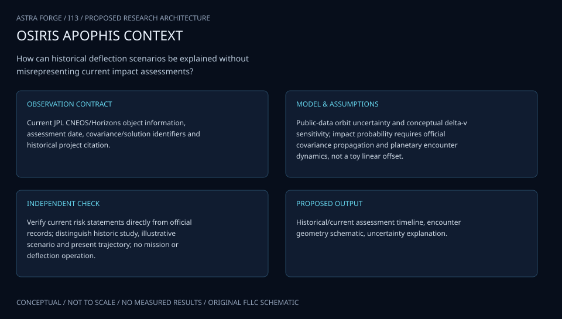

# I13 · OSIRIS APOPHIS HORIZON

**Original project:** A Study of the Deflection of 99942 Apophis from Earth

**Session I:** Aerospace Technology
**Status:** proposed research dossier; no project experiment or mission qualification has been performed.

Retain the Apophis deflection-study title while updating its premise: NASA currently rules out Earth impact by Apophis for at least 100 years, and the April 13, 2029 encounter is an observation opportunity. Study hypothetical small-body perturbations as a classroom planetary-defense and uncertainty-propagation exercise. The baseline is passive observation with no intervention; all altered trajectories are labeled synthetic, and no physical deflection or spacecraft maneuver is recommended.

## Scientific question

How does a close planetary encounter amplify uncertainty in an asteroid state, and which additional observations would most reduce post-encounter prediction uncertainty?

## Testable hypothesis

Better pre/post-encounter state estimation will be more informative for this nonthreatening object than an artificial perturbation study; linear covariance models will fail in some nonlinear encounter scenarios.

*Conceptual research design; arrows show the analysis dependency, not observed causation.*

## Mathematical model

$$
\dot{\boldsymbol x}=\boldsymbol f(\boldsymbol x,t);\quad \dot{\boldsymbol\Phi}=\boldsymbol A\boldsymbol\Phi;\quad \boldsymbol A=\partial\boldsymbol f/\partial\boldsymbol x
$$

$$
\boldsymbol P(t)=\boldsymbol\Phi\boldsymbol P_0\boldsymbol\Phi^T+\boldsymbol Q(t)
$$

$$
\delta\boldsymbol b\approx\boldsymbol H_b\boldsymbol\Phi\delta\boldsymbol x_0
$$

$$
\mathrm{EIG}=\mathrm{E}[\mathrm{KL}(p(\boldsymbol x|y)\parallel p(\boldsymbol x))]
$$

### Variables and units

- State x contains position in m and velocity in m s^-1; time in s with declared TDB/UTC handling.
- Phi is the state transition matrix with block units consistent with the position/velocity state; covariance P has corresponding mixed units.
- Process covariance Q represents explicitly justified unmodeled-force uncertainty, not an arbitrary tuning term.
- b contains encounter-plane coordinates in m; Hb is their Jacobian; EIG is expected information gain in nats.
- Synthetic perturbations are dimensionless offsets scaled by a declared illustrative uncertainty ellipsoid; no impactor or maneuver parameters are specified.

### Assumptions and boundary conditions

- The real-object scenario uses the published nonthreatening status and a passive ephemeris baseline.
- A physically justified covariance is used only when its source is available; Horizons state vectors alone do not establish uncertainty or impact probability.

### Inference or simulation method

Retrieve and freeze a passive reference ephemeris, source metadata, time conventions and force model. Reproduce the unperturbed close-approach geometry before any sensitivity analysis. Propagate synthetic initial-state ensembles through the encounter and compare full nonlinear Monte Carlo distributions with the linear covariance approximation. Compute encounter-plane residuals and show when ellipsoidal uncertainty becomes misleading. In a distinct educational sandbox, apply normalized generic state offsets solely to illustrate sensitivity; do not conflate those cases with current Apophis risk. Compare synthetic optical, radar, and passive spacecraft observation schedules by expected information gain using stated noise models. Present the correct historical-to-current premise prominently in every public visual.

### Model limits

This proposal is not an orbit-determination service, a new hazard assessment, or a physical intervention design. Rare-event probabilities require validated observational covariance and much stronger sampling than a classroom ensemble.

## Data and provenance contracts

### NASA Apophis facts

[Resource or product discovery](https://science.nasa.gov/solar-system/asteroids/apophis-facts/)

**Fields:** Published safe-encounter premise, date, science-observation context

**Access:** Public NASA source checked October 2, 2026; recheck before future hazard statements.

**Role:** Current factual premise and correction of the historical proposal.

### JPL Horizons passive reference ephemeris

[Resource or product discovery](https://ssd.jpl.nasa.gov/horizons/manual.html)

**Fields:** Epoch, state vectors, frame/center and retrieval metadata

**Access:** Public query route. If authoritative covariance is unavailable, label the ensemble illustrative and avoid impact-probability claims.

**Role:** Passive trajectory reference and convention check.

## Staged execution

1. Document the historical premise and the current no-impact-for-at-least-100-years finding in the project introduction.
2. Freeze the passive ephemeris and verify encounter geometry with independently configured propagation.
3. Compare linear and nonlinear uncertainty evolution in explicitly synthetic ensembles.
4. Evaluate information gain from illustrative observation schedules and publish limitations alongside the plots.

## Verification and validation

- Verify state-transition sensitivities against finite differences across multiple step sizes.
- Check passive ephemeris residuals and report force/time/frame discrepancies before interpreting encounter sensitivity.
- Assess Monte Carlo interval coverage in independent synthetic experiments; show covariance failure regimes and avoid unsupported tail probabilities.

*Any numerical gate is a proposed requirement unless the dossier explicitly identifies a sourced requirement. Freeze gates before collecting confirmatory data.*

## Resources and deliverables

- Unit-aware astrodynamics propagator, saved ephemerides, synthetic observation generator, uncertainty sampler, and orbit-determination mentor.

- Updated premise note, passive encounter atlas, linear/nonlinear sensitivity notebook specification, illustrative observation-priority study, and public uncertainty explanation.

## Risks and interpretation

- Outdated danger language can mislead readers. Invented covariance, nonlinear encounter mapping, and inadequate tail sampling can produce false risk precision.

## Figure plan

An unperturbed encounter trajectory with labeled synthetic uncertainty ensembles, linear-versus-nonlinear comparison, and observation information-gain bars; the nonthreatening premise appears on the figure.

## Cited scientific resources

- [NASA Apophis Facts](https://science.nasa.gov/solar-system/asteroids/apophis-facts/) — Safe April 13, 2029 encounter and no Earth-impact risk for at least 100 years.
- [JPL Horizons System Manual](https://ssd.jpl.nasa.gov/horizons/manual.html) — Passive ephemeris query conventions and output limitations.

Source discovery reviewed 2026-10-02. A public source pointer does not imply original student-team data access. See [model assurance](../../docs/MODEL_ASSURANCE.md) and [data management](../../docs/DATA_MANAGEMENT.md).
