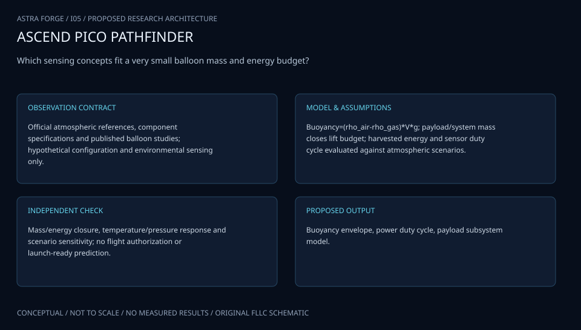
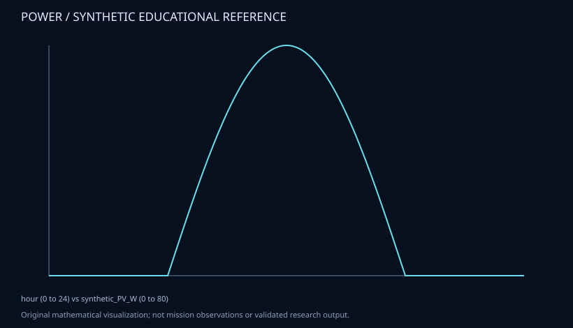

# I05 · ASCEND PICO PATHFINDER

**Original project:** Pico Balloon Platform for Atmospheric Exploration

**Session I:** Aerospace Technology · **Family:** flight

**Historical locator:** [I-5 in the 2021 Arizona NASA Space Grant program](https://spacegrant.arizona.edu/sites/spacegrant.arizona.edu/files/AZSGC%20Symposium%20Booklet%202021_website.pdf#page=25). IDs in this repository follow the user's supplied list, not presentation numbering. The proposed space-inspired name does not rename or appropriate the original authors' research. See the original program for author/mentor credit. This dossier is an original FLLC research extension, not a reproduction of the abstract.

| Evidence layer | State |
|---|---|
| Research architecture | Proposed, formal specification |
| Measurements | None ingested |
| Executable reference | Available; educational only |
| Scientific validation | Pending |
| Deployment / qualification | None |

## Scientific question and value

Which sensing concepts fit a very small balloon mass and energy budget?

The output must let a reviewer inspect the evidence, test a competing explanation and identify the observation that would change the conclusion. A sophisticated visual is useful only when its scale, source and uncertainty are defensible.

## Model and assumptions

Buoyancy=(rho_air-rho_gas)*V*g; payload/system mass closes lift budget; harvested energy and sensor duty cycle evaluated against atmospheric scenarios.

This is the proposed governing formulation. Before research implementation, record the state/input/parameter vectors, units, boundary and initial conditions, observation operator, nuisance terms and parameter identifiability. Select specific primary equation references: archive landing pages below are discovery resources, not proof that this formulation applies. [Shared model and verification standard](../docs/engineering-standard.md).

## Data package and acquisition

Official atmospheric references, component specifications and published balloon studies; hypothetical configuration and environmental sensing only.

Use [the data contract](../docs/data-contract.md). Each input needs a publisher, primary URL, stable identifier, version, observation/retrieval dates, checksum, license/permission, unit dictionary, calibration, missing-value semantics and coverage limits. Never treat absent measurements, detection limits or unsupported source access as zero values. The registry below distinguishes reviewed resources from blocked or reference-only entries.

## Validation and falsification

Mass/energy closure, temperature/pressure response and scenario sensitivity; no flight authorization or launch-ready prediction.

Validation passes only if independent evidence supports the model in its declared domain, uncertainty is reported and simpler baselines are compared fairly. Establish project-specific tolerances from instrument performance or literature before inspecting final results; do not invent universal NASA thresholds. Report failures and negative findings.

## Original visual architecture

Buoyancy envelope, power duty cycle, payload subsystem model.



The shipped diagram is a conceptual specification. The proposed science visualization requires the qualified data above. Raw, calibrated, simulated and inferred states must remain distinguishable, with a visible source/time/uncertainty inspector.

## Executable model state

A narrow **power** reference is runnable; it is not the full research model above.

```bash
python -m models.run --model power --output /tmp/astra-I05.json
```

Synthetic solar profile and clipped ideal storage; not dispatch optimization, measured weather, EPS qualification or electrolysis.



[Synthetic example data](../data/synthetic/power.json) · [Code](../models/reference.py). The full scientific solver and measured-data validation remain pending.

## Ambitious extension and connected work

Link long-duration observation concepts to telemetry coverage and provenance.

Related project dossiers: [E01](E01.md), [E02](E02.md), [E03](E03.md), [E04](E04.md), [E06](E06.md), [E07](E07.md)

Preserve independent scientific questions and original identities. Share schemas/calibration tools only where justified; never share results merely because subjects overlap.

## Concrete delivery sequence

1. Inspect the original source and collect project-specific primary literature; record unresolved interpretation and equation references.
2. Qualify the named observations and metadata; keep raw data immutable and permissions explicit.
3. Implement the stated model with an analytic or published benchmark, error handling and convergence checks.
4. Perform the project-specific validation above with independent holdouts and uncertainty decomposition.
5. Generate the proposed visual and an exportable evidence receipt; retain corrections and rejected inputs.

Completion requires a documented answer, calibrated uncertainty, an independently reproducible run and a reviewer-visible limitation statement. No claimed result currently meets that scientific completion gate.

## References and resource review

- [ASCEND: 2021 Arizona NASA Space Grant Symposium booklet](https://spacegrant.arizona.edu/sites/spacegrant.arizona.edu/files/AZSGC%20Symposium%20Booklet%202021_website.pdf) — Historical project provenance; review status: **inspected**. Student abstracts are not peer-reviewed validation; supplied list remains coverage authority. Original author and mentor attribution is available in the linked program.
- [NOAA: NOAA National Centers for Environmental Information](https://www.ncei.noaa.gov/) — Climate/ocean/atmospheric data discovery; review status: **inspected**. Product-level quality and current service availability require checks before ingestion.
- [NTRS: NASA Technical Reports Server](https://ntrs.nasa.gov/) — Technical literature discovery; review status: **inspected**. Specific reports, equations and benchmark tables still require project-level selection; portal is not proof of any proposed result.
- [ASCEND: 2021 Arizona NASA Space Grant Symposium booklet](https://spacegrant.arizona.edu/sites/spacegrant.arizona.edu/files/AZSGC%20Symposium%20Booklet%202021_website.pdf) — Historical project provenance; review status: **inspected**. Student abstracts are not peer-reviewed validation; supplied list remains coverage authority. Original author and mentor attribution is available in the linked program.

Review date: **2026-10-02**. Portal inspection is not dataset use. Original mission names refer to independent educational inspiration; no NASA endorsement or operational applicability is claimed.
