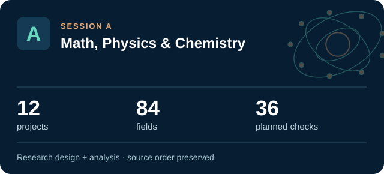
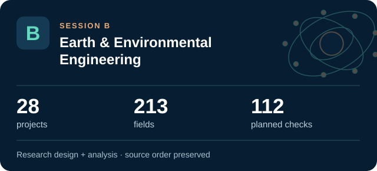
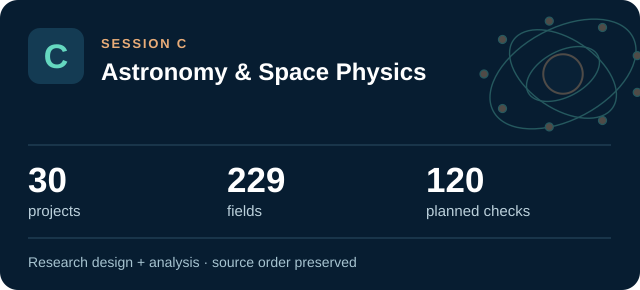
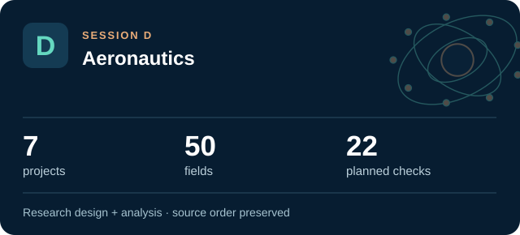
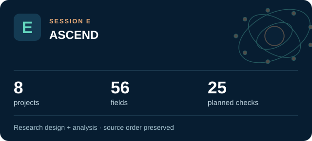
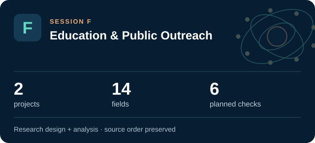
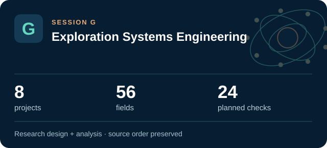
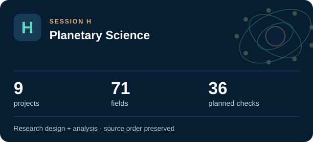
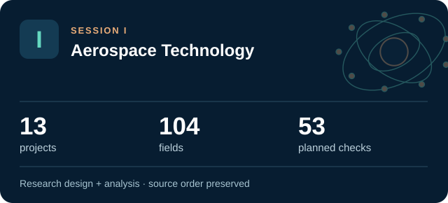

# ATLAS engineering document register

All **117 original projects**, in the supplied **A–I order**. Each entry opens its complete engineering design and analysis record. D03 retains two separate research work packages.

The nine session handbooks combine the same records for continuous reading. The project files provide requirement tables, derivations, data contracts, uncertainty, trades, verification cases, failure analysis, implementation artifacts and cited sources.

## Session A: Math, Physics & Chemistry

[Browse Session A](../research/A/README.md) · [Read the complete engineering handbook](../handbooks/SESSION_A.md)

1. [A01 · ARTEMIS FRACTAL NAVIGATOR](../research/A/A01-artemis-fractal-navigator/README.md) — New Methods for the Iteration and Visualization of Mandelbrot and Julia Sets
2. [A02 · NEW HORIZONS CRYOPHASE](../research/A/A02-new-horizons-cryophase/README.md) — Theory and simulation investigation of eutectic phase behavior on Pluto
3. [A03 · CHANDRA VORTEX CORE](../research/A/A03-chandra-vortex-core/README.md) — Superfluidity of Neutron Star Matter
4. [A04 · APOLLO SWARM SENTINEL](../research/A/A04-apollo-swarm-sentinel/README.md) — Target Detection Using Algorithmic Matter
5. [A05 · VOYAGER CILIA ARRAY](../research/A/A05-voyager-cilia-array/README.md) — Artificial Cilia Creation for Advanced Sensor Devices
6. [A06 · APOLLO PORIN INSIGHT](../research/A/A06-apollo-porin-insight/README.md) — Purification of the P66 Outer Membrane Protein of the Bacterium Borrelia burgdorferi
7. [A07 · ORION CHROMATIN ATLAS](../research/A/A07-orion-chromatin-atlas/README.md) — Properties of Chromatin Extracted by Salt Fractionation from a Cancerous and Non-cancerous Esophageal Cell Line
8. [A08 · HELIOS PULSE FORGE](../research/A/A08-helios-pulse-forge/README.md) — Nonlinear Laser Pulse Compression with a Multipass Cell
9. [A09 · SPITZER RADIO ORIGINS](../research/A/A09-spitzer-radio-origins/README.md) — Majority of the Faint (μJy) Radio Source Population Appears Powered by Star Formation, not AGN
10. [A10 · HUBBLE CARINA CLOCK](../research/A/A10-hubble-carina-clock/README.md) — H-beta Analysis of eta Carinae Radial Velocity during Recent Periastron Passages
11. [A11 · OSIRIS SULFUR ARCHIVE](../research/A/A11-osiris-sulfur-archive/README.md) — Identification of Thiol Function Groups in GRA 95229 and Murchison
12. [A12 · STARDUST ISOTOPE FOUNDRY](../research/A/A12-stardust-isotope-foundry/README.md) — Heterogeneous Supernova Production of Ti and Cr Isotopes

## Session B: Earth & Environmental Engineering

[Browse Session B](../research/B/README.md) · [Read the complete engineering handbook](../handbooks/SESSION_B.md)

1. [B01 · CALDERA SENTINEL — Yellowstone Hydrothermal Observatory](../research/B/B01-caldera-sentinel-yellowstone-hydrothermal-observatory/README.md) — Can Changes in Hot Spring Composition Reflect Decadal-Scale Deformation of the Yellowstone Caldera?
2. [B02 · ARTEMIS LIFE RAFTS — Urban Pollinator Constellation](../research/B/B02-artemis-life-rafts-urban-pollinator-constellation/README.md) — Urban Biodiversity Life Rafts: A Way to Conserve our Pollinators
3. [B03 · ORION CROSSINGS — Gila Monster Road Ecology](../research/B/B03-orion-crossings-gila-monster-road-ecology/README.md) — Potential Road Impacts on Gila Monsters in an Urbanizing Environment
4. [B04 · AURORA VEIL — Ionospheric Absorption Atlas](../research/B/B04-aurora-veil-ionospheric-absorption-atlas/README.md) — Analysis of Space-based Riometer Measurement Data for Characterization of Radio Propagation Disturbance in the Ionosphere
5. [B05 · KEPLER BLOOMCLOCK — Restoration Timing Observatory](../research/B/B05-kepler-bloomclock-restoration-timing-observatory/README.md) — Phenology Data to Aid Pollinator Restoration
6. [B06 · SOLSTICE CHEMISTRY — Tucson Ozone Digital Observatory](../research/B/B06-solstice-chemistry-tucson-ozone-digital-observatory/README.md) — The Contribution of Plants and Pollution to Tucson's Urban Ozone Problem
7. [B07 · REGENESIS CLEANFLOW — Environmental Fate and Remediation Model](../research/B/B07-regenesis-cleanflow-environmental-fate-and-remediation-model/README.md) — Bioremediation of Insensitive Munitions Compounds
8. [B08 · TERRAFORM TERRACES — Dryland Conservation Observatory](../research/B/B08-terraform-terraces-dryland-conservation-observatory/README.md) — The Influence of Conservation Structures on Rangeland Vegetation Patterns
9. [B09 · EUROPA CHEMGRID — Yellowstone Geochemical Atlas](../research/B/B09-europa-chemgrid-yellowstone-geochemical-atlas/README.md) — Mapping Hot Spring Geochemistry in Yellowstone
10. [B10 · LANDSAT EQUITY — Community Canopy Mission](../research/B/B10-landsat-equity-community-canopy-mission/README.md) — Using Remote Sensing to Determine Vegetation Change and Impacts to Communities
11. [B11 · APOLLO LEGACY LEDGER — Environmental Stewardship Knowledge System](../research/B/B11-apollo-legacy-ledger-environmental-stewardship-knowledge-system/README.md) — Nevada Offsite Management
12. [B12 · VULCAN DOMESCAN — O’Leary Emplacement Reconstruction](../research/B/B12-vulcan-domescan-o-leary-emplacement-reconstruction/README.md) — Identifying unique emplacement characteristics of O'Leary Peak: a volcanic dome in the San Francisco Volcanic Field
13. [B13 · GAIA PIXELSCOUT — Ecological Instance Mapping](../research/B/B13-gaia-pixelscout-ecological-instance-mapping/README.md) — Instance Segmentation for Biogeography
14. [B14 · PHOENIX INFILTRATION — Postfire Soil Recovery Observatory](../research/B/B14-phoenix-infiltration-postfire-soil-recovery-observatory/README.md) — Soil hydraulic properties three years after the Frye Fire on Mount Graham, Arizona
15. [B15 · TECTON ORION — Farallon Slab Reconstruction](../research/B/B15-tecton-orion-farallon-slab-reconstruction/README.md) — Numerical simulation of Laramide flat-slab subduction
16. [B16 · ISS BIOGUARD — Retrospective Microgravity Health Evidence](../research/B/B16-iss-bioguard-retrospective-microgravity-health-evidence/README.md) — Multi-drug Resistance of Pseudomonas aeruginosa Under Microgravity Growth Conditions
17. [B17 · AQUARIUS LIFELINE — Inland Fisheries Resilience](../research/B/B17-aquarius-lifeline-inland-fisheries-resilience/README.md) — Off the Hook: Assessing the Vulnerability of Inland Subsistence Fisheries to Climate Change
18. [B18 · POSEIDON WINDCARBON — Southern Ocean Carbon Mission](../research/B/B18-poseidon-windcarbon-southern-ocean-carbon-mission/README.md) — Assessing the Role of the Winds in the Biogeochemical Cycling and Carbon Budget of the Southern Ocean
19. [B19 · PARKER PLASMA WHISPER — Electron Structure Observatory](../research/B/B19-parker-plasma-whisper-electron-structure-observatory/README.md) — Investigation of Electron Parameters and Association with Structures using Quasi-thermal Noise Spectroscopy (QTN)
20. [B20 · LUNAR RECLAIMER — Algal Rare-Earth Recovery](../research/B/B20-lunar-reclaimer-algal-rare-earth-recovery/README.md) — Rare Earth Metal Recovery from Waste Stream Using Algae
21. [B21 · PROTEUS DRIFTSCAPE — Evolutionary Protein Disorder](../research/B/B21-proteus-driftscape-evolutionary-protein-disorder/README.md) — More Effectively Selective Species Have Greater Protein Structural Disorder
22. [B22 · NIF ODYSSEY — Comparative Nitrogen-Fixation Evolution](../research/B/B22-nif-odyssey-comparative-nitrogen-fixation-evolution/README.md) — Developing a model system using Azotobacter vinelandii to investigate the evolution of nitrogen fixation
23. [B23 · HYDRA MISSION CONTROL — Watershed Decisions Under Uncertainty](../research/B/B23-hydra-mission-control-watershed-decisions-under-uncertainty/README.md) — Modeling to Make a Difference: Hydrologic Analysis for Improved Decision Support
24. [B24 · VIPER VOYAGER — Urban Movement and Habitat Connectivity](../research/B/B24-viper-voyager-urban-movement-and-habitat-connectivity/README.md) — Using GIS to Quantify Effects of Land Cover Change on Movement Patterns of Tiger Rattlesnakes in an Urbanizing Environment
25. [B25 · SEEDSTAR GENESIS — Dryland Establishment Forecasting](../research/B/B25-seedstar-genesis-dryland-establishment-forecasting/README.md) — Can We Predict Germination Success in Seed Pellets Using Seed Traits?
26. [B26 · HELIOS POWERLOOP — Solar Electrolysis Dispatch](../research/B/B26-helios-powerloop-solar-electrolysis-dispatch/README.md) — Electrolytic Application of Load-Managing Photovoltaic System
27. [B27 · TRITON WATERWATCH — Autonomous Aquatic Observatory](../research/B/B27-triton-waterwatch-autonomous-aquatic-observatory/README.md) — Aquatic Data Analysis from Deployable, Autonomous Boat
28. [B28 · ASTRA BIOCYCLE — Microalgal Methane and Net Energy](../research/B/B28-astra-biocycle-microalgal-methane-and-net-energy/README.md) — Biogas Production from Microalgae following Freeze-Heat Pretreatment

## Session C: Astronomy & Space Physics

[Browse Session C](../research/C/README.md) · [Read the complete engineering handbook](../handbooks/SESSION_C.md)

1. [C01 · APOLLO WINDWATCH](../research/C/C01-apollo-windwatch/README.md) — The Characterization of EZ CMa
2. [C02 · HUBBLE NIGHTFALL LAB](../research/C/C02-hubble-nightfall-lab/README.md) — Image Simulations for Testing the Fidelity of SKYSURF Background Measurement Algorithms
3. [C03 · TAURUS MOLECULE TRAIL](../research/C/C03-taurus-molecule-trail/README.md) — HCN Mapping of the Taurus Molecular Cloud
4. [C04 · HORIZON TIDAL ECHO](../research/C/C04-horizon-tidal-echo/README.md) — A Deep Look at the Nature of Black Holes: Using Tidal Disruption Events to See the Unseeable
5. [C05 · KEPLER WORLDFORGE](../research/C/C05-kepler-worldforge/README.md) — Exoplanet Classification using Data Mining
6. [C06 · PULSAR GEMINI WATCH](../research/C/C06-pulsar-gemini-watch/README.md) — The First Magnetar in a Binary System?
7. [C07 · ARTEMIS MEMORY BRIDGE](../research/C/C07-artemis-memory-bridge/README.md) — Taperings and Analytic Continuations of Supernova Gravitational Waves with Memory
8. [C08 · MARS NILI SPECTRAL VAULT](../research/C/C08-mars-nili-spectral-vault/README.md) — Laboratory Analysis of olivine-carbonate mixtures as observed on Mars
9. [C09 · EAGLESAT COSMIC PIXEL](../research/C/C09-eaglesat-cosmic-pixel/README.md) — EagleSat Team: Determining Particle Energy Using CMOS Sensors
10. [C10 · VOYAGER LOCAL GROUP HALOS](../research/C/C10-voyager-local-group-halos/README.md) — MW-Andromeda Dark Matter Halo Velocity Dispersion Profiles
11. [C11 · ORION CORE INFERENCE](../research/C/C11-orion-core-inference/README.md) — Evaluation of Supernovae Astrophysical Parameters by Using Machine Learning on Laser Interferometric Data
12. [C12 · HUBBLE COSMIC GLOW](../research/C/C12-hubble-cosmic-glow/README.md) — SKYSURF: Measuring the Brightness of the Sky
13. [C13 · HORIZON RING ATLAS](../research/C/C13-horizon-ring-atlas/README.md) — Characterizing the Images of Black Hole Shadows
14. [C14 · ROMAN DARKHOLE ACADEMY](../research/C/C14-roman-darkhole-academy/README.md) — Controlling the Unseen: GIG Undergraduate Optical Research
15. [C15 · WEBB PHOTON TRUTH](../research/C/C15-webb-photon-truth/README.md) — Assessing the Performance of the JWST/NIRCam Image Simulator PhoSim-NIRCam
16. [C16 · ORION STRAIN METROLOGY](../research/C/C16-orion-strain-metrology/README.md) — Gravitational Wave Calibration Error for Supernovae Core Collapse
17. [C17 · GEMINI DISK SENTINEL](../research/C/C17-gemini-disk-sentinel/README.md) — Investigating the Planet Detection Limit in Debris Disk Images from the Gemini Planet Imager
18. [C18 · REIONIZATION OXYGEN BEACON](../research/C/C18-reionization-oxygen-beacon/README.md) — Characterizing High [OIII]/[OII] and High [OIII] Galaxies to Further LyC Study
19. [C19 · WEBB YOUNG STAR ATMOSPHERES](../research/C/C19-webb-young-star-atmospheres/README.md) — Characterizing the Atmospheres of Low Surface Gravity M-dwarfs
20. [C20 · TRINITY ACCRETION ECHO](../research/C/C20-trinity-accretion-echo/README.md) — Predictions for the Observable Autocorrelations of Accreting Black Holes from the Trinity Theoretical Model
21. [C21 · PARKER MAGNETIC TRAIL](../research/C/C21-parker-magnetic-trail/README.md) — Identification of Switchback Intervals in Parker Space Probe Data
22. [C22 · HUBBLE GALACTIC EXHALE](../research/C/C22-hubble-galactic-exhale/README.md) — Measuring Galactic Wind Frequency and Strength as a Function of Environment
23. [C23 · KEPLER METAL WORLDS](../research/C/C23-kepler-metal-worlds/README.md) — Investigating the Relationship Between Exoplanet Occurrence & Host Star Metallicity
24. [C24 · APOLLO DUST CLOCK](../research/C/C24-apollo-dust-clock/README.md) — The long-period orbit of the dust-producing Wolf-Rayet binary WR 125
25. [C25 · ORION BURST SENTINEL](../research/C/C25-orion-burst-sentinel/README.md) — Improving the Detection of Core-Collapse Supernova Through Experimentation
26. [C26 · LISA PENDULUM PATHFINDER](../research/C/C26-lisa-pendulum-pathfinder/README.md) — Low Frequency Prototype of Laser Interferometer Suspensions for Gravitational Wave Detection
27. [C27 · SPHEREX COSMIC PRISM](../research/C/C27-spherex-cosmic-prism/README.md) — SPHEREx: The Future of Satellite Astronomy
28. [C28 · LOWELL LUNAR LANTERN](../research/C/C28-lowell-lunar-lantern/README.md) — Narrow-band Filter Photometry Calibration for the Lowell 20''
29. [C29 · ACE WIND SHOCK LEDGER](../research/C/C29-ace-wind-shock-ledger/README.md) — Energy Balance at Interplanetary Shocks: In-situ Measurement of the Fraction in Energetic Protons with ACE and Wind
30. [C30 · ARTEMIS FIRST HORIZONS](../research/C/C30-artemis-first-horizons/README.md) — The Origins of Supermassive Black Holes

## Session D: Aeronautics

[Browse Session D](../research/D/README.md) · [Read the complete engineering handbook](../handbooks/SESSION_D.md)

1. [D01 · X-59 VORTEX COMMAND](../research/D/D01-x-59-vortex-command/README.md) — Experimental Investigation of Active Vortex Generators
2. [D02 · LANGLEY STALL MEMORY](../research/D/D02-langley-stall-memory/README.md) — Stall Hysteresis: Why the reattachment angle is less than the separation stall angle
3. [D03 · INGENUITY DESCENT & BUBBLE LAB](../research/D/D03-ingenuity-descent-bubble-lab/README.md) — Optimizing Autorotating Sensor Probe Design for Space Exploration- Low Frequency Unsteadiness in Laminar Separation Bubbles
4. [D04 · GLENN SPHERE STANDARD](../research/D/D04-glenn-sphere-standard/README.md) — Validating a New CFD Algorithm by Finding the Drag Coefficient of a Sphere
5. [D05 · APOLLO CYBER FLIGHT DECK](../research/D/D05-apollo-cyber-flight-deck/README.md) — CIS Aviation-ISAC
6. [D06 · LANGLEY MACH ATLAS](../research/D/D06-langley-mach-atlas/README.md) — Characterization of a Hypersonic Wind Tunnel Nozzle
7. [D07 · ARES DUAL-WORLD SCOUT](../research/D/D07-ares-dual-world-scout/README.md) — Suborbital Uncrewed Aerial Vehicles for Earth Surveillance and Mars Exploration

## Session E: ASCEND

[Browse Session E](../research/E/README.md) · [Read the complete engineering handbook](../handbooks/SESSION_E.md)

1. [E01 · APOLLO HELIOSCOPE](../research/E/E01-apollo-helioscope/README.md) — Phoenix College: Video Streaming and DNA Studies
2. [E02 · GEMINI HELIX](../research/E/E02-gemini-helix/README.md) — Project Helix
3. [E03 · ARTEMIS STRATODOSE](../research/E/E03-artemis-stratodose/README.md) — UArizona ASCEND: Profiling High-Altitude Radiation with a General Data Logger
4. [E04 · AURA VERTICAL](../research/E/E04-aura-vertical/README.md) — A Measurement of the Concentration of Greenhouse Gases as Altitude Increases
5. [E05 · ORION TRUSS](../research/E/E05-orion-truss/README.md) — EagleSat Team: Design and Refinement of 3U CubeSat Structure
6. [E06 · APOLLO THERMALIS](../research/E/E06-apollo-thermalis/README.md) — Study of Thermal Heat Transfer Within a High-Altitude Balloon Payload
7. [E07 · DISCOVERY TRIDENT](../research/E/E07-discovery-trident/README.md) — Glendale Community College (GCC) ASCEND Team
8. [E08 · GATEWAY POWERBENCH](../research/E/E08-gateway-powerbench/README.md) — EagleSat Team: Development and Implementation of a Self-Contained Harness for In-House Integration, Verification, and Testing of CubeSat Electric Power Systems

## Session F: Education & Public Outreach

[Browse Session F](../research/F/README.md) · [Read the complete engineering handbook](../handbooks/SESSION_F.md)

1. [F01 · APOLLO VOICELINK](../research/F/F01-apollo-voicelink/README.md) — Communication and Exploration
2. [F02 · DISCOVERY QUILL](../research/F/F02-discovery-quill/README.md) — The Impact and Importance of Science Writing

## Session G: Exploration Systems Engineering

[Browse Session G](../research/G/README.md) · [Read the complete engineering handbook](../handbooks/SESSION_G.md)

1. [G01 · ARTEMIS BONE WATCH](../research/G/G01-artemis-bone-watch/README.md) — Ex Vivo Analysis of Multi-Sensory Device for Bone Strain Monitoring
2. [G02 · DEEP SPACE QUIETLINE](../research/G/G02-deep-space-quietline/README.md) — Minimizing Local Electromagnetic Interference Using Adaptive Filters
3. [G03 · DEEP SPACE BEAM CARTOGRAPHER](../research/G/G03-deep-space-beam-cartographer/README.md) — Measuring Antenna Patterns for Ground Station
4. [G04 · ARTEMIS CARTILAGE MATRIX](../research/G/G04-artemis-cartilage-matrix/README.md) — Photocurable nanocomposites for customizable cartilage replacements
5. [G05 · ARES CREW RESOURCE VAULT](../research/G/G05-ares-crew-resource-vault/README.md) — Mars In-Situ Resource Utilization for Health Applications
6. [G06 · TERRA HUMIDITY HARVEST](../research/G/G06-terra-humidity-harvest/README.md) — Direct Air Capture Using Moisture Swing Chemistry
7. [G07 · HUBBLE SPECTRAL ANCHOR](../research/G/G07-hubble-spectral-anchor/README.md) — An Introduction to Systems Engineering: Building a Monochromator Mount
8. [G08 · ORION HEPATIC RECOVERY](../research/G/G08-orion-hepatic-recovery/README.md) — Mediated Liver Regeneration

## Session H: Planetary Science

[Browse Session H](../research/H/README.md) · [Read the complete engineering handbook](../handbooks/SESSION_H.md)

1. [H01 · VOYAGER STORYWALK](../research/H/H01-voyager-storywalk/README.md) — USGS Science Center: Solar System Exhibit Captions
2. [H02 · OSIRIS PHOTONFORGE](../research/H/H02-osiris-photonforge/README.md) — Calibration of Images from the OSIRIS-REx Camera Suite
3. [H03 · ARTEMIS POLAR COMPASS](../research/H/H03-artemis-polar-compass/README.md) — Magnetic Anomalies in the South Polar Region of the Moon
4. [H04 · STARDUST CARBON ATLAS](../research/H/H04-stardust-carbon-atlas/README.md) — Exploring Carbon-bearing Matter in an Antarctic Micrometeorite
5. [H05 · TERRA SEVEN GENERATIONS](../research/H/H05-terra-seven-generations/README.md) — Supporting the Climate Change Department
6. [H06 · MARS ODYSSEY RIDGEWORK](../research/H/H06-mars-odyssey-ridgework/README.md) — Variability of Martian Wrinkle Ridges
7. [H07 · KEPLER CO ECHO](../research/H/H07-kepler-co-echo/README.md) — Increasing CO Gas Detections in Protoplanetary Disks
8. [H08 · GENESIS RIM CHRONICLE](../research/H/H08-genesis-rim-chronicle/README.md) — Investigating the Origin of Fine-Grained Rims in Mighei-like Carbonaceous Chondrites
9. [H09 · PERSEVERANCE LAKE ARCHIVE](../research/H/H09-perseverance-lake-archive/README.md) — Trends in Mineralogy and Grain Size Distribution Across Paleolake Basins on Mars

## Session I: Aerospace Technology

[Browse Session I](../research/I/README.md) · [Read the complete engineering handbook](../handbooks/SESSION_I.md)

1. [I01 · SATURN TRANSIENT SHIELD](../research/I/I01-saturn-transient-shield/README.md) — Rocket Development Lab Team: The Effects of Equivalence Ratio during shutdown of a rocket engine on hardware longevity
2. [I02 · APOLLO AQUATHERM](../research/I/I02-apollo-aquatherm/README.md) — Rocket Development Lab Team: Thermal Management Analysis of Water-Cooled Rocket Engine
3. [I03 · SATURN CHANNEL ATLAS](../research/I/I03-saturn-channel-atlas/README.md) — Rocket Development Lab Team: Cooling Channel Geometry Analysis for a Regeneratively Cooled Rocket Engine
4. [I04 · ORION SENTINEL CORE](../research/I/I04-orion-sentinel-core/README.md) — EagleSat Team: On-board Computer Subsystem
5. [I05 · PIONEER AERODRIFT](../research/I/I05-pioneer-aerodrift/README.md) — Pico Balloon Platform for Atmospheric Exploration
6. [I06 · SATURN LOADPATH](../research/I/I06-saturn-loadpath/README.md) — Designing and Exploring the Structure of Launch Vehicles to Create Optimal Theoretical and Small-Scale Experimental Models
7. [I07 · GATEWAY CATSAT CONSOLE](../research/I/I07-gateway-catsat-console/README.md) — CatSat Groundstation Command and Control
8. [I08 · VOYAGER FRAMEFORGE](../research/I/I08-voyager-frameforge/README.md) — Julia 1.2 Ephemeris and Gravitational Modeling Development
9. [I09 · OSIRIS REGOLITH LEAPER](../research/I/I09-osiris-regolith-leaper/README.md) — Simulation and Evaluation of a Mechanical Hopping Mechanism for Robotic Small Body Surface Exploration
10. [I10 · GEMINI POINTLOCK](../research/I/I10-gemini-pointlock/README.md) — Spacecraft Attitude Control Implementation and Development
11. [I11 · HUBBLE SKYVAULT](../research/I/I11-hubble-skyvault/README.md) — Measurements of the Sky
12. [I12 · PIONEER PHOBOS PATHFINDER](../research/I/I12-pioneer-phobos-pathfinder/README.md) — Heuristic Optimization Applied to Orbital Transfers Between Low-Planetary Orbits and Distant Retrograde Orbits
13. [I13 · OSIRIS APOPHIS HORIZON](../research/I/I13-osiris-apophis-horizon/README.md) — A Study of the Deflection of 99942 Apophis from Earth
