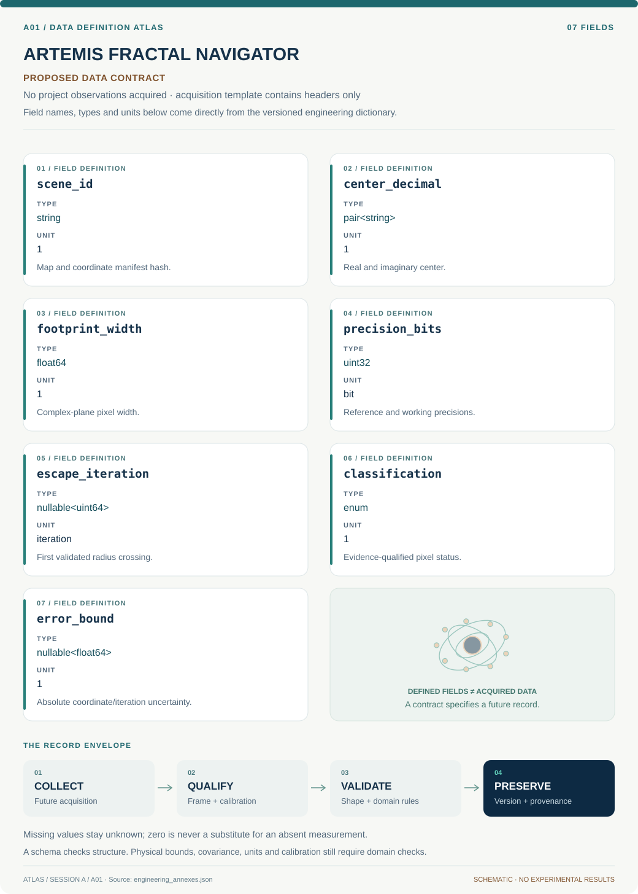
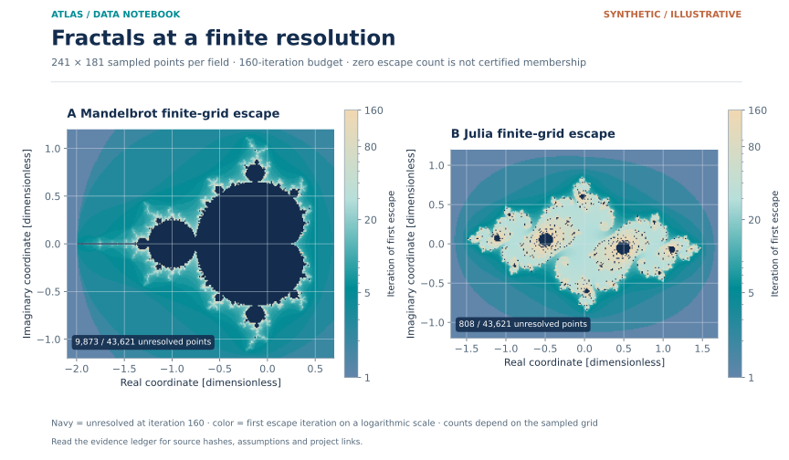
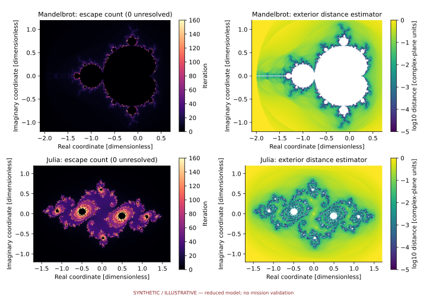

# A01 · Figure gallery

[ARTEMIS FRACTAL NAVIGATOR](../README.md) · [Data blueprint](../data/README.md) · [Data diagnostic gallery](../../../../data/figures/README.md)

## Engineering architecture

Certification, rebasing and independent fallback precede publication. The diagram preserves unresolved finite-cap points and distinguishes point escape from footprint membership.

[SVG](architecture.svg) · [Editable Mermaid source](architecture.mmd)

## Data blueprint

**Proposed contract · observations pending.** Every field, type, unit and meaning comes from the controlled dictionary. [Open SVG](data-map.svg) · [Download dictionary](../data/dictionary.csv)

## Mission profile

The scientific question, hypothesis, model boundary and document metadata are drawn from controlled sources. Proposed work remains distinguished from acquired evidence. [Open SVG](mission-profile.svg)

## Data diagnostic

Finite-grid escape iteration maps from immutable Mandelbrot and Julia outputs. Logarithmic color records the first iteration whose modulus exceeds two. Navy regions identify points that did not escape within 160 iterations; these points are unresolved by this computation and are not certified members. The Julia parameter is c = −0.75 + 0.11i.

[SVG](../../../../data/figures/17_fractal_resolution_and_escape.svg) · [PNG](../../../../data/figures/17_fractal_resolution_and_escape.png) · [Figure provenance](../../../../data/figures/17_fractal_resolution_and_escape.provenance.json)

## Original numerical view

[Model formulation, data, assumptions and executed numerical checks](../../../../models/README.md)

## Planned scientific result

Four synchronized panes: Mandelbrot parameter map, Julia map, complex orbit trace, and pixel-confidence/timing heatmap; captions distinguish certified, escaped, and unresolved pixels.

This final scientific result remains an execution deliverable; the design diagrams do not establish an empirical finding.
