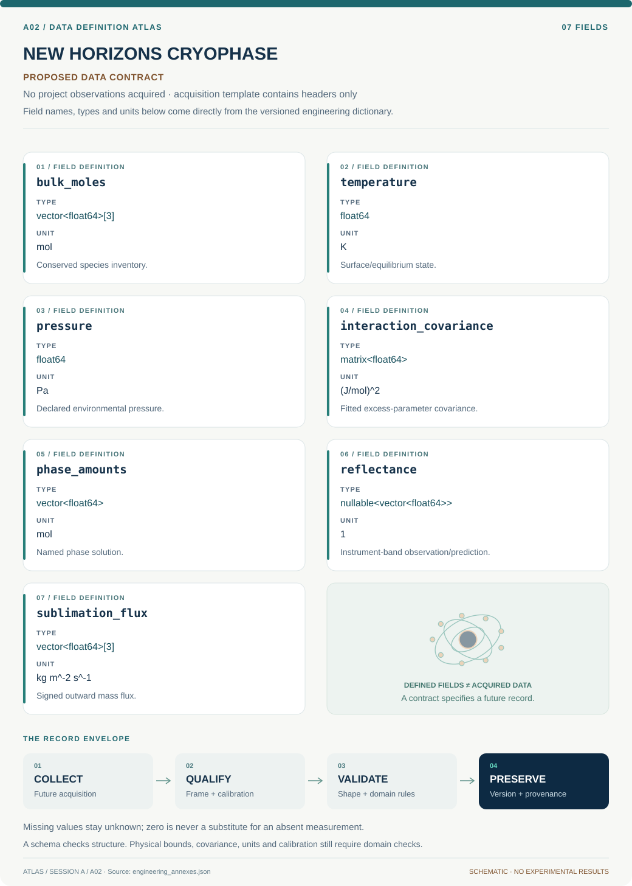
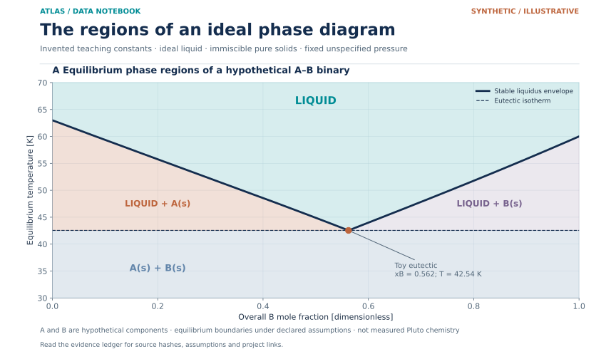

# A02 · Figure gallery

[NEW HORIZONS CRYOPHASE](../README.md) · [Data blueprint](../data/README.md) · [Data diagnostic gallery](../../../../data/figures/README.md)

## Engineering architecture

Phase selection couples to signed energy exchange, while spectra enter through a separate optical/instrument branch. Equilibrium and unique bulk composition are not inferred merely from band appearance.

[SVG](architecture.svg) · [Editable Mermaid source](architecture.mmd)

## Data blueprint

**Proposed contract · observations pending.** Every field, type, unit and meaning comes from the controlled dictionary. [Open SVG](data-map.svg) · [Download dictionary](../data/dictionary.csv)

## Data diagnostic

Equilibrium phase regions inferred from the existing ideal-binary liquidus model with invented melting temperatures and fusion enthalpies. Above the liquidus the material is liquid; between the liquidus and eutectic temperature it is liquid plus the indicated pure solid; below the eutectic it is A and B solids. The region labels follow the model assumptions and are not predictions for Pluto's real volatile mixtures.

[SVG](../../../../data/figures/16_ideal_binary_phase_regions.svg) · [PNG](../../../../data/figures/16_ideal_binary_phase_regions.png) · [Figure provenance](../../../../data/figures/16_ideal_binary_phase_regions.provenance.json)

## Original numerical view

[Model formulation, data, assumptions and executed numerical checks](../../../../models/README.md)

## Planned scientific result

Ternary composition triangle with phase domains, selected temperature sections, and observed-versus-synthetic spectra; extrapolation is hatched and uncertainty is shaded.

This final scientific result remains an execution deliverable; the design diagrams do not establish an empirical finding.
