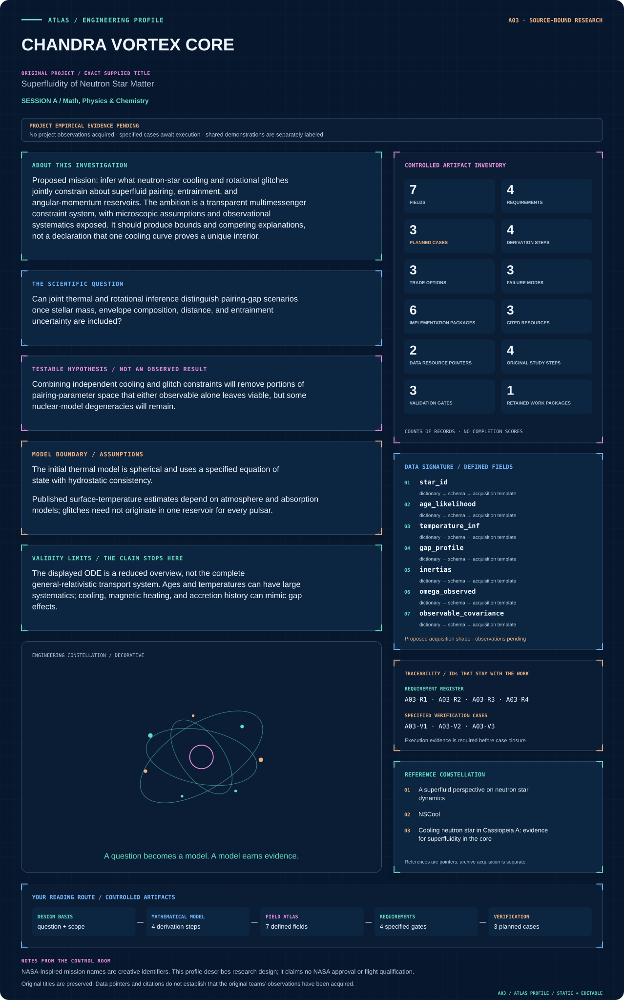
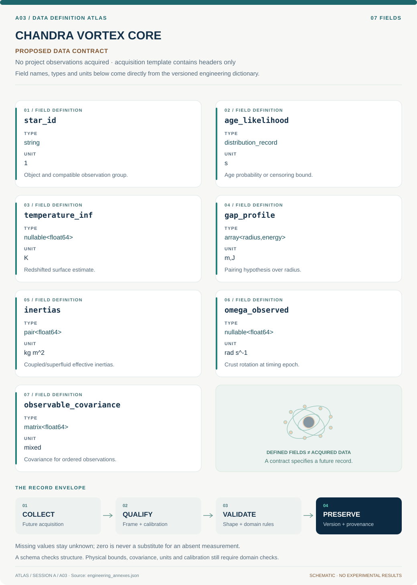

# A03 · CHANDRA VORTEX CORE

**Original project:** Superfluidity of Neutron Star Matter

**Session A:** Math, Physics & Chemistry

**Document class:** engineering research design and analysis record · **Revision:** 4 · **Date:** 2026-10-02

**Evidence state:** design basis, mathematical formulation and verification plan documented. Project-specific empirical results remain to be acquired; executable shared model demonstrations have their own recorded checks.

[Session A](../README.md) · [All projects](../../../ENGINEERING_DOCUMENTATION.md) · [Session handbook](../../../handbooks/SESSION_A.md) · [← A02](../A02-new-horizons-cryophase/README.md) · [A04 →](../A04-apollo-swarm-sentinel/README.md)

| Proposed requirements | Specified verification cases | Defined data fields | Cited resources |
| ---: | ---: | ---: | ---: |
| 4 | 3 | 7 | 3 |

[Explore the data blueprint](data/README.md) · [Open the figure gallery](figures/README.md) · [Download acquisition template](data/acquisition.csv) · [Browse the data atlas](../../../data/README.md)

---

## Mission profile



| Profile panel | Engineering signal | Open the evidence |
| --- | --- | --- |
| Mission identity | Superfluidity of Neutron Star Matter | [Scientific objective](#purpose-and-scientific-objective) |
| Model cockpit | 4 governing expressions; 4 derivation steps; declared assumptions and validity envelope | [Mathematical formulation](#4-mathematical-model-and-derivation) |
| Data blueprint | 7 proposed fields with types, units and quality rules | [Field map & downloads](data/README.md) |
| Verification queue | 4 proposed requirements; 3 specified cases; project execution evidence pending | [Case definitions](#8-verification-and-validation-cases) |
| Figure wall | Architecture, field map, planned result description | [Open full gallery](figures/README.md) |
| Resource library | 3 cited primary resources with support statements | [Cited resources](#12-cited-technical-and-scientific-resources) |

### Model cockpit

**Analysis method:** Use a documented stellar cooling solver and a two-component rotational emulator with explicitly parameterized gap profiles. Construct separate likelihoods for thermal spectra and glitch timing, then combine only after checking independence and selection. Generate posterior predictive cooling tracks and glitch-relaxation distributions. Compare no-pairing, crust-pairing, and crust-plus-core alternatives while varying equations of state and envelopes.

**Operating envelope:** The displayed ODE is a reduced overview, not the complete general-relativistic transport system. Ages and temperatures can have large systematics; cooling, magnetic heating, and accretion history can mimic gap effects.

**Variables and conventions**

- Pairing gap Delta and critical temperature T_c; effective temperature and age; neutron-star mass and radius.
- I_s/I_total, lag Omega_s-Omega_c, mutual-friction coupling time, entrainment parameters, envelope composition, and distance.

### Artifact wall



Cooling and rotational branches meet through controlled shared nuisance variables. Reduced torque conservation is distinguished from stellar transport; either observable can remain nonidentifying.

**Scientific result to produce:** Cooling curves with observational confidence regions, rotational reservoir diagrams, and overlapping allowed pairing-gap bands; alternative interior models remain distinguishable by color.

### Investigation feed · planned work

The feed records proposed work packages. A row becomes executed evidence only with versioned inputs, outputs and a reviewed result.

| Sequence | Evidence state | Engineering work package |
| --- | --- | --- |
| 01 | Planned | Create stellar_config.yaml with EOS hashes and pairing/redshift metadata. |
| 02 | Planned | Build nscool_adapter.py and reproduce one documented configuration. |
| 03 | Planned | Implement rotation_emulator.py with exact torque fixtures. |
| 04 | Planned | Create thermal/timing likelihood modules and shared_nuisance.json. |
| 05 | Planned | Produce sensitivity_profiles.ipynb and alternate-model recovery cases. |
| 06 | Planned | Emit predictions.parquet and inference_manifest.json with selection and unresolved degeneracies. |

### Mission connections

Connections are reading routes based on actual shared resources, supplied sessions or included illustrations. They do not establish physical dependencies, team collaborations or validated results.

| Connected mission | Original investigation | Recorded connection basis |
| --- | --- | --- |
| [A02 · NEW HORIZONS CRYOPHASE](../A02-new-horizons-cryophase/README.md) | Theory and simulation investigation of eutectic phase behavior on Pluto | Session A |
| [A04 · APOLLO SWARM SENTINEL](../A04-apollo-swarm-sentinel/README.md) | Target Detection Using Algorithmic Matter | Session A |
| [A01 · ARTEMIS FRACTAL NAVIGATOR](../A01-artemis-fractal-navigator/README.md) | New Methods for the Iteration and Visualization of Mandelbrot and Julia Sets | Session A |
| [A05 · VOYAGER CILIA ARRAY](../A05-voyager-cilia-array/README.md) | Artificial Cilia Creation for Advanced Sensor Devices | Session A |
| [A06 · APOLLO PORIN INSIGHT](../A06-apollo-porin-insight/README.md) | Purification of the P66 Outer Membrane Protein of the Bacterium Borrelia burgdorferi | Session A |
| [A07 · ORION CHROMATIN ATLAS](../A07-orion-chromatin-atlas/README.md) | Properties of Chromatin Extracted by Salt Fractionation from a Cancerous and Non-cancerous Esophageal Cell Line | Session A |

[Machine-readable connection register and ranking rule](../../../registry/mission_connections.json)

### Reading playlist

| Route | Start here | Continue to |
| --- | --- | --- |
| Understand the idea | [Scientific objective](#purpose-and-scientific-objective) | [Design boundary](#1-design-basis-and-analysis-boundary) → [Mathematics](#4-mathematical-model-and-derivation) |
| Inspect the data | [Visual blueprint](data/README.md) | [Provenance](#5-data-specifications-and-provenance) → [Uncertainty](#6-uncertainty-sensitivity-and-identifiability) |
| Make a design decision | [Trade study](#7-engineering-trade-study) | [Failure modes](#10-failure-modes-and-interpretation-controls) → [Required outputs](#11-required-engineering-outputs) |
| Prepare execution | [Requirements](#2-requirements-and-verification-traceability) | [Verification](#8-verification-and-validation-cases) → [Implementation](#9-implementation-and-reproducible-work-packages) |

## Complete engineering dossier

The profile above is a browsing layer. The full design basis, equations, derivations, data contract, uncertainty, trades and controlled case definitions follow.

## Purpose and scientific objective

Proposed mission: infer what neutron-star cooling and rotational glitches jointly constrain about superfluid pairing, entrainment, and angular-momentum reservoirs. The ambition is a transparent multimessenger constraint system, with microscopic assumptions and observational systematics exposed. It should produce bounds and competing explanations, not a declaration that one cooling curve proves a unique interior.

**Question:** Can joint thermal and rotational inference distinguish pairing-gap scenarios once stellar mass, envelope composition, distance, and entrainment uncertainty are included?

**Testable hypothesis:** Combining independent cooling and glitch constraints will remove portions of pairing-parameter space that either observable alone leaves viable, but some nuclear-model degeneracies will remain.

## 1. Design basis and analysis boundary

The inference boundary includes a spherical star with declared equation of state, mass, envelope and pairing profile, plus a reduced two-reservoir rotational model. Cooling and timing are separate observables with separate measurement physics. A surface-temperature slope or one glitch does not independently identify a unique superfluid gap.

Begin with analytic reduced ODE limits, reproduce a documented NSCool configuration, then add hierarchical nuisance inference. Pairing channel, density dependence and entrainment are explicit model choices. Thermal and glitch likelihoods combine only for compatible observations, with shared distances, ages and selection handled once.

## 2. Requirements and verification traceability

These are project design requirements or proposed analysis gates. A numerical target is not a NASA requirement unless its controlling source is explicitly identified. “TBD” identifies evidence required before a decision; it is not permission to assume a value. Verification evidence listed here is planned, unless a linked result explicitly records execution.

| ID | Requirement / gate | Engineering rationale | Verification method | Basis / required evidence |
| --- | --- | --- | --- | --- |
| A03-R1 | Every run shall identify EOS, mass, envelope, gap channel and redshift convention. | Structural choices can mimic pairing. | Reject incomplete manifests and reproduce a baseline. | NSCool configuration contract. |
| A03-R2 | Isolated rotation shall conserve total angular momentum; proposed relative drift target is 10^-8. | Internal friction transfers angular momentum. | Zero-torque integration and analytic comparison. | Derived conservation; proposed tolerance. |
| A03-R3 | Likelihoods shall preserve temperature/age and timing covariance and censoring. | Derived temperature is atmosphere dependent. | Audit correlated synthetic recovery and age bounds. | Observation-model requirement. |
| A03-R4 | Gap conclusions shall include at least two declared envelope/EOS alternatives. | Fixed nuisance assumptions overstate identification. | Compare posterior/profile shifts and predictive residuals. | Proposed inference gate; no new constraint claimed. |

## 3. Architecture and controlled interfaces

A stellar adapter maps radius to density, redshift and local heat-capacity/emissivity tables. Pairing modules return channel-labeled gap energies and suppression factors. Cooling outputs use redshifted surface temperature and a documented time convention; atmosphere likelihoods remain separate from the interior solver.

The torque emulator receives inertias and external torque and returns crust frequency and superfluid lag in rad/s. Timing epochs use a declared barycentric scale. A shared nuisance registry prevents prior duplication when separate likelihoods enter the sampler. Exported predictions carry model identities and observable covariance rather than unlabeled cooling curves.


Cooling and rotational branches meet through controlled shared nuisance variables. Reduced torque conservation is distinguished from stellar transport; either observable can remain nonidentifying.

[Editable engineering diagram source](figures/architecture.mmd)

## 4. Mathematical model and derivation

### Governing equations

```text
T_c(r) approximately 0.57 Delta_0(r)/k_B for weak-coupling isotropic BCS pairing; anisotropic channels need channel-specific relations.
```

```text
C_V(T) dT/dt=-L_nu(T)-L_gamma(T)+H(T), with redshift-aware stellar structure in the production model.
```

```text
I_c dot(Omega_c)=N_ext+N_mf; I_s dot(Omega_s)=-N_mf.
```

```text
n_v=2 Omega_s/kappa; kappa=h/(2m_n), the vortex circulation quantum.
```

### Variables, units and conventions

- Pairing gap Delta and critical temperature T_c; effective temperature and age; neutron-star mass and radius.
- I_s/I_total, lag Omega_s-Omega_c, mutual-friction coupling time, entrainment parameters, envelope composition, and distance.

### Assumptions and boundary conditions

- The initial thermal model is spherical and uses a specified equation of state with hydrostatic consistency.
- Published surface-temperature estimates depend on atmosphere and absorption models; glitches need not originate in one reservoir for every pulsar.

### Derivation step 1

$$
T_c\simeq0.57\Delta_0/k_B
$$

Energy divided by Boltzmann's constant is K. The factor is for weak-coupling isotropic BCS pairing; anisotropic channels require their own relationship.

### Derivation step 2

$$
C\dot T=-L_\nu-L_\gamma+H
$$

C in J/K and luminosities in W give a reduced heat ledger. Production local/redshifted variables require consistent conversion before comparing integrated loss and stored heat.

### Derivation step 3

$$
N_{mf}=I_s\ell/\tau;\quad\dot\ell=-(1+I_s/I_c)\ell/\tau
$$

Define ell=Omega_s-Omega_c, positive torque on the crust, and zero external torque. Subtracting the two equations gives decaying rather than growing lag.

### Derivation step 4

$$
I_c\dot\Omega_c+I_s\dot\Omega_s=N_{ext};\quad n_v=2\Omega_s/\kappa
$$

Summation cancels internal torque. With kappa=h/(2m_n) in m^2/s, vortex density is m^-2; this constraint does not resolve pinning or entrainment microphysics.

### Inference or simulation procedure

Use a documented stellar cooling solver and a two-component rotational emulator with explicitly parameterized gap profiles. Construct separate likelihoods for thermal spectra and glitch timing, then combine only after checking independence and selection. Generate posterior predictive cooling tracks and glitch-relaxation distributions. Compare no-pairing, crust-pairing, and crust-plus-core alternatives while varying equations of state and envelopes.

### Validity domain and fidelity limits

The displayed ODE is a reduced overview, not the complete general-relativistic transport system. Ages and temperatures can have large systematics; cooling, magnetic heating, and accretion history can mimic gap effects.

## 5. Data specifications and provenance



**Proposed data contract · observations pending.** This visual inventory shows the record fields to acquire or derive. It contains no project measurements. [Open the data blueprint and downloads](data/README.md).

| Field | Type | Unit | Physical / statistical meaning | Quality and missing-data rule |
| --- | --- | --- | --- | --- |
| star_id | string | 1 | Object and compatible observation group. | Never merge unrelated cooling/timing stars. |
| age_likelihood | distribution_record | s | Age probability or censoring bound. | Missing null; preserve upper/lower limits. |
| temperature_inf | nullable<float64> | K | Redshifted surface estimate. | Atmosphere version and covariance required. |
| gap_profile | array<radius,energy> | m,J | Pairing hypothesis over radius. | Channel and EOS mapping required. |
| inertias | pair<float64> | kg m^2 | Coupled/superfluid effective inertias. | Positive; entrainment convention documented. |
| omega_observed | nullable<float64> | rad s^-1 | Crust rotation at timing epoch. | Epoch scale and error required. |
| observable_covariance | matrix<float64> | mixed | Covariance for ordered observations. | Units per row; positive semidefinite. |

[Machine-readable record schema](data/schema.json) · [Empty acquisition CSV](data/acquisition.csv) · [Field dictionary CSV](data/dictionary.csv)

The CSV above contains column headers only. Its schema defines future records and does not establish that original-team data or a particular archive product have been acquired. Frame, timing, calibration, covariance, selection and provenance details must accompany populated records.

### NSCool author's code resource

[Product, archive or reference](https://www.astroscu.unam.mx/neutrones/NSCool/)

**Fields:** Cooling routines, physical inputs, example structures, and documentation.

**Access:** Public research code resource; inspect license, dependencies, and input provenance before redistribution.

**Role:** Physics implementation baseline, not observational truth.

### Published cooling and dynamics constraints

[Product, archive or reference](https://arxiv.org/abs/2103.10218)

**Fields:** Gap scenarios, entrainment discussion, cooling/glitch observables and referenced datasets.

**Access:** Public manuscript; retrieve individual observational tables from their originating papers or archives.

**Role:** Constraint design and model limitations.

## 6. Uncertainty, sensitivity and identifiability

Mass, envelope composition, atmosphere, absorption, distance and age correlate with gap effects. Timing relaxation adds reservoir geometry, entrainment and torque variation. Shared spectral calibration or distance cannot be counted as independent information in multiple likelihoods. Magnetic heating, accretion and spatial transport create structural discrepancy.

Compute sensitivities of cooling and lag to gap amplitude/location and nuisance parameters. Collinear sensitivity columns indicate parameter combinations the data cannot resolve. Profile likelihoods and alternate-solver synthetic recovery test whether quoted intervals survive model discrepancy. Restrict conclusions to the density and temperature domains actually sampled.

## 7. Engineering trade study

| Alternative | Benefit | Cost / limitation | Decision rule |
| --- | --- | --- | --- |
| No-pairing baseline | Tests non-superfluid explanations. | Omits suppression/pair emission. | Retain as falsification reference. |
| Parameterized crust/core gaps | Efficient and interpretable. | Flexible profiles can absorb other physics. | Select only if predictions improve under nuisance alternatives. |
| Microscopic gap tables | Physical channel structure. | Interaction/EOS uncertainty limits transfer. | Use documented tables as a model ensemble. |

## 8. Verification and validation cases

| Case ID | Stimulus / condition | Expected result / criterion | Method | Evidence artifact |
| --- | --- | --- | --- | --- |
| A03-V1 | Zero-torque rotation | Total angular momentum stays constant and lag decays exponentially. | Compare unequal-inertia integration to derived solution. | Conservation and sign checks. |
| A03-V2 | Power-off thermal limit | With all heating/luminosity terms zero, T stays constant. | Check reduced solver and production adapter with refined steps. | Energy conservation. |
| A03-V3 | Withheld observable | Unsupported gap information widens intervals or produces explicit predictive failure. | Withhold cooling epoch or timing stream and examine predictions. | Proposed identifiability test; result pending. |

**Execution status:** these cases are specified, not claimed as executed. Close a case only with the versioned inputs, output, uncertainty, reviewer and pass/fail rationale.

### Additional scientific validation gates

- Recover normal-fluid and decoupled-rotor limits; verify angular-momentum conservation when external torque is zero.
- Check energy closure and convergence of cooling tracks against tighter radial/time resolution.
- Require held-out objects and posterior predictive coverage; report prior sensitivity, Bayes-factor instability, and nonidentifiability.

## 9. Implementation and reproducible work packages

1. Create stellar_config.yaml with EOS hashes and pairing/redshift metadata.
2. Build nscool_adapter.py and reproduce one documented configuration.
3. Implement rotation_emulator.py with exact torque fixtures.
4. Create thermal/timing likelihood modules and shared_nuisance.json.
5. Produce sensitivity_profiles.ipynb and alternate-model recovery cases.
6. Emit predictions.parquet and inference_manifest.json with selection and unresolved degeneracies.

### Investigation sequence

1. Compile a versioned observational table with object identifiers, atmosphere assumptions, confidence intervals, and exclusions.
2. Reproduce a published baseline cooling scenario; build interpolation surrogates only after numerical validation.
3. Perform hierarchical inference across several stars and pulsars without assuming identical masses or heating histories.
4. Conduct prospective analysis: quantify which new temperature epoch or timing precision would best distinguish surviving scenarios.

### Resources and interfaces to expertise

- Nuclear theory and relativistic stellar-structure expertise; cooling solver; Bayesian sampler; observational X-ray/timing collaboration.

## 10. Failure modes and interpretation controls

| Failure mode | Effect on result | Detection / evidence | Design response |
| --- | --- | --- | --- |
| Mixed redshift conventions | False temperature/luminosity history. | Round-trip conversion discrepancy. | Central conversion module. |
| Friction sign error | Lag grows unphysically. | Analytic decay regression. | Torque direction specified at interface. |
| Fixed envelope confounder | Overconfident pairing interpretation. | Posterior shifts under envelope changes. | Publish nuisance alternatives. |

- Model-dependent inferences can appear more definitive than the data support.
- Joint inference is invalid if catalog selections or shared systematic errors are ignored.

## 11. Required engineering outputs

- Pairing-gap constraint atlas, reproducible thermal/rotational likelihoods, posterior ensembles, and an observing-priority report.

### Scientific result figures to produce during execution

Cooling curves with observational confidence regions, rotational reservoir diagrams, and overlapping allowed pairing-gap bands; alternative interior models remain distinguishable by color.

## 12. Cited technical and scientific resources

- [A superfluid perspective on neutron star dynamics](https://arxiv.org/abs/2103.10218) — Research treatment of superfluid degrees of freedom, quantized vortices, mutual friction, and entrainment.
- [NSCool](https://www.astroscu.unam.mx/neutrones/NSCool/) — Author-maintained neutron-star cooling implementation and documentation.
- [Cooling neutron star in Cassiopeia A: evidence for superfluidity in the core](https://onlinelibrary.wiley.com/doi/10.1111/j.1745-3933.2011.01015.x) — Original observational/modeling hypothesis motivating, but not uniquely resolving, cooling-based pairing constraints.

Framework and evidence rules: [engineering documentation standard](../../../engineering/ENGINEERING_STANDARD.md), [model assurance](../../../engineering/MODEL_ASSURANCE.md), [uncertainty procedure](../../../engineering/UNCERTAINTY_AND_DECISION_RULES.md), [data management](../../../engineering/DATA_MANAGEMENT.md). NASA-inspired names are creative identifiers; requirements and results are not NASA certification.
