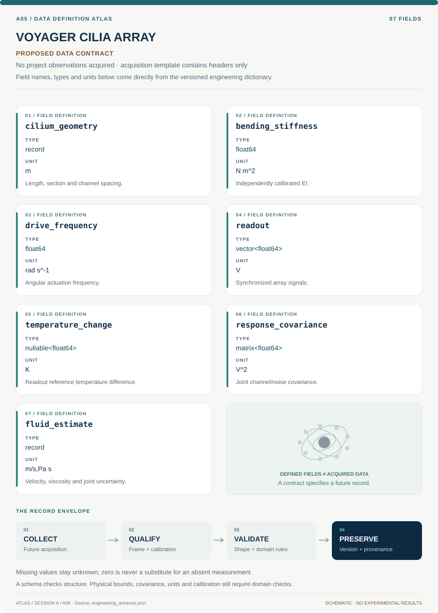

# A05 · Data blueprint

[VOYAGER CILIA ARRAY](../README.md) · [Figure gallery](../figures/README.md) · [Data atlas](../../../../data/README.md)

**PROPOSED CONTRACT · 7 fields · no project observations acquired.** The acquisition CSV contains column headers only. The diagram is a visual record specification, not measured data.

| Download | What it contains |
| --- | --- |
| [Acquisition CSV](acquisition.csv) | Empty columns ready for controlled acquisition |
| [Field dictionary](dictionary.csv) | Names, source types, units, meanings and quality rules |
| [JSON Schema](schema.json) | Nullable record structure with unit and quality metadata |

## Field reference

| Field | Type | Unit | Meaning | Quality / missingness |
| --- | --- | --- | --- | --- |
| cilium_geometry | record | m | Length, section and channel spacing. | Positive dimensions; manufacturing uncertainty retained. |
| bending_stiffness | float64 | N m^2 | Independently calibrated EI. | Covariance with geometry recorded. |
| drive_frequency | float64 | rad s^-1 | Angular actuation frequency. | Hz conversion explicit; zero permitted. |
| readout | vector<float64> | V | Synchronized array signals. | Missing channels null with mask. |
| temperature_change | nullable<float64> | K | Readout reference temperature difference. | Reference and sensor error required. |
| response_covariance | matrix<float64> | V^2 | Joint channel/noise covariance. | Positive semidefinite; cross-cilia terms retained. |
| fluid_estimate | record | m/s,Pa s | Velocity, viscosity and joint uncertainty. | Unidentifiable parameter null plus flag. |

## Acquisition and provenance

Null means missing or unknown; record its cause. Preserve product identifier, retrieval timestamp, source hash, calibration, coordinate and time frame, covariance basis, selection rules and every transformation. JSON Schema checks structure; physical bounds and the quality rules above require domain validation.

- [Published sensor-integrated cilia research](https://pmc.ncbi.nlm.nih.gov/articles/PMC10589697/) — archive or acquisition resource; inclusion here does not assert that its data have been retrieved.
- [Published artificial-cilia flow measurements](https://pmc.ncbi.nlm.nih.gov/articles/PMC3364822/) — archive or acquisition resource; inclusion here does not assert that its data have been retrieved.

[Controlled data-management procedure](../../../../engineering/DATA_MANAGEMENT.md)
