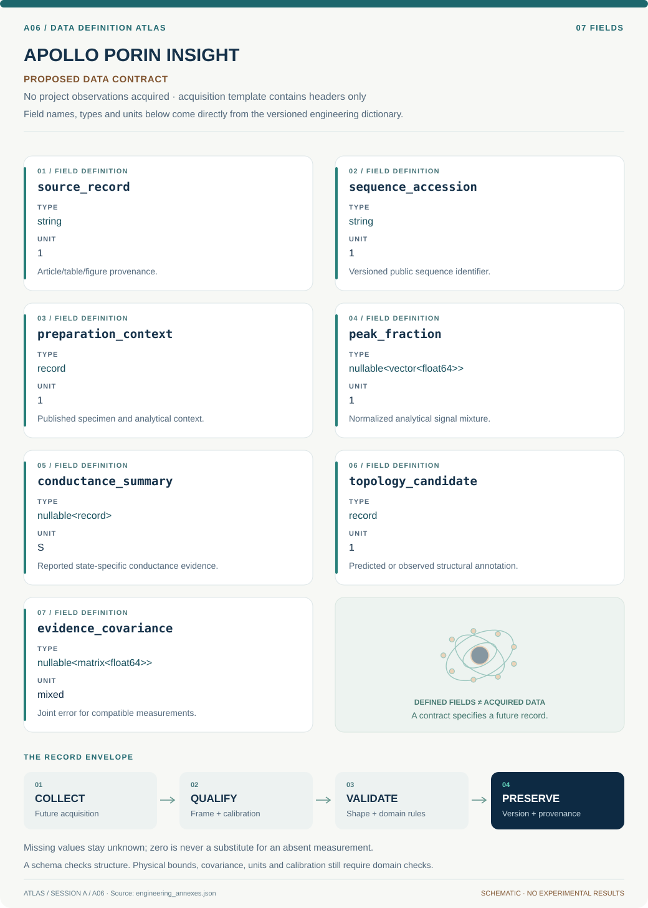

# A06 · Data blueprint

[APOLLO PORIN INSIGHT](../README.md) · [Figure gallery](../figures/README.md) · [Data atlas](../../../../data/README.md)

**PROPOSED CONTRACT · 7 fields · no project observations acquired.** The acquisition CSV contains column headers only. The diagram is a visual record specification, not measured data.

| Download | What it contains |
| --- | --- |
| [Acquisition CSV](acquisition.csv) | Empty columns ready for controlled acquisition |
| [Field dictionary](dictionary.csv) | Names, source types, units, meanings and quality rules |
| [JSON Schema](schema.json) | Nullable record structure with unit and quality metadata |

## Field reference

| Field | Type | Unit | Meaning | Quality / missingness |
| --- | --- | --- | --- | --- |
| source_record | string | 1 | Article/table/figure provenance. | Stable URL plus figure region required. |
| sequence_accession | string | 1 | Versioned public sequence identifier. | Residue numbering and sequence hash stored. |
| preparation_context | record | 1 | Published specimen and analytical context. | Unknown entries null; no inferred procedure. |
| peak_fraction | nullable<vector<float64>> | 1 | Normalized analytical signal mixture. | Sum check; response basis declared. |
| conductance_summary | nullable<record> | S | Reported state-specific conductance evidence. | Native units and published uncertainty retained. |
| topology_candidate | record | 1 | Predicted or observed structural annotation. | Evidence class and confidence distinguished. |
| evidence_covariance | nullable<matrix<float64>> | mixed | Joint error for compatible measurements. | Unknown dependence flagged; null not zero. |

## Acquisition and provenance

Null means missing or unknown; record its cause. Preserve product identifier, retrieval timestamp, source hash, calibration, coordinate and time frame, covariance basis, selection rules and every transformation. JSON Schema checks structure; physical bounds and the quality rules above require domain validation.

- [Original P66/Oms66 porin study](https://pmc.ncbi.nlm.nih.gov/articles/PMC175520/) — archive or acquisition resource; inclusion here does not assert that its data have been retrieved.
- [Structural and physicochemical P66 study](https://pmc.ncbi.nlm.nih.gov/articles/PMC3911182/) — archive or acquisition resource; inclusion here does not assert that its data have been retrieved.

[Controlled data-management procedure](../../../../engineering/DATA_MANAGEMENT.md)
