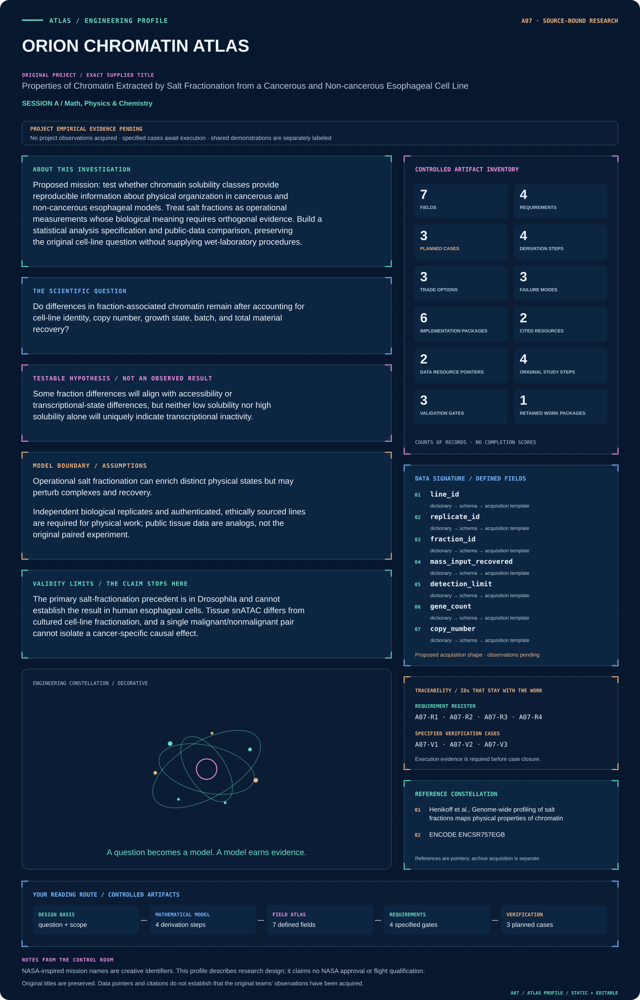

# A07 · ORION CHROMATIN ATLAS

**Original project:** Properties of Chromatin Extracted by Salt Fractionation from a Cancerous and Non-cancerous Esophageal Cell Line

**Session A:** Math, Physics & Chemistry

**Document class:** engineering research design and analysis record · **Revision:** 4 · **Date:** 2026-10-02

**Evidence state:** design basis, mathematical formulation and verification plan documented. Project-specific empirical results remain to be acquired; executable shared model demonstrations have their own recorded checks.

[Session A](../README.md) · [All projects](../../../ENGINEERING_DOCUMENTATION.md) · [Session handbook](../../../handbooks/SESSION_A.md) · [← A06](../A06-apollo-porin-insight/README.md) · [A08 →](../A08-helios-pulse-forge/README.md)

| Proposed requirements | Specified verification cases | Defined data fields | Cited resources |
| ---: | ---: | ---: | ---: |
| 4 | 3 | 7 | 2 |

[Explore the data blueprint](data/README.md) · [Open the figure gallery](figures/README.md) · [Download acquisition template](data/acquisition.csv) · [Browse the data atlas](../../../data/README.md)

---

## Mission profile



| Profile panel | Engineering signal | Open the evidence |
| --- | --- | --- |
| Mission identity | Properties of Chromatin Extracted by Salt Fractionation from a Cancerous and Non-cancerous Esophageal Cell Line | [Scientific objective](#purpose-and-scientific-objective) |
| Model cockpit | 4 governing expressions; 4 derivation steps; declared assumptions and validity envelope | [Mathematical formulation](#4-mathematical-model-and-derivation) |
| Data blueprint | 7 proposed fields with types, units and quality rules | [Field map & downloads](data/README.md) |
| Verification queue | 4 proposed requirements; 3 specified cases; project execution evidence pending | [Case definitions](#8-verification-and-validation-cases) |
| Figure wall | Architecture, field map, planned result description | [Open full gallery](figures/README.md) |
| Resource library | 2 cited primary resources with support statements | [Cited resources](#12-cited-technical-and-scientific-resources) |

### Model cockpit

**Analysis method:** Define the planned comparison as a factorial analysis of status and fraction, with mass balance and compositional statistics. Public accessibility data provide contextual genomic annotations. Associate fraction changes with accessibility and expression only after testing technical recovery and copy-number confounding. Use effect sizes and corrected uncertainty intervals, and evaluate whether an independent cell-line pair reproduces directions rather than treating one pair as representative of all esophageal cancer.

**Operating envelope:** The primary salt-fractionation precedent is in Drosophila and cannot establish the result in human esophageal cells. Tissue snATAC differs from cultured cell-line fractionation, and a single malignant/nonmalignant pair cannot isolate a cancer-specific causal effect.

**Variables and conventions**

- Fraction mass M, DNA/protein/histone-associated signals, gene-level counts, cell-line identifier, replicate, and batch.
- Recovery fraction, ploidy/copy number, accessibility, transcription, and detection limits; tumor status is not automatically the only causal difference.

### Artifact wall



The diagram preserves total recovery separately from composition and checks confounding before interpreting status interactions. Public annotations can inform context but cannot create missing line-pair replication.

**Scientific result to produce:** Fraction-mass Sankey plot, cancer-by-fraction interaction effects, and genomic annotation tracks; tissue analogs and proposed paired-cell data are labeled separately.

### Investigation feed · planned work

The feed records proposed work packages. A row becomes executed evidence only with versioned inputs, outputs and a reviewed result.

| Sequence | Evidence state | Engineering work package |
| --- | --- | --- |
| 01 | Planned | Create sample_registry.csv and genome_build_manifest.json. |
| 02 | Planned | Implement mass_recovery.py with remainder and assay-basis ledgers. |
| 03 | Planned | Build zero_censoring.py and logratio_transform.py using K-1 coordinates. |
| 04 | Planned | Create design_rank_report.py and NB_fraction_model.py. |
| 05 | Planned | Produce fraction_effects.parquet with intervals and declared test families. |
| 06 | Planned | Publish line_pair_holdout.ipynb and a tissue-context annotation report. |

### Mission connections

Connections are reading routes based on actual shared resources, supplied sessions or included illustrations. They do not establish physical dependencies, team collaborations or validated results.

| Connected mission | Original investigation | Recorded connection basis |
| --- | --- | --- |
| [A06 · APOLLO PORIN INSIGHT](../A06-apollo-porin-insight/README.md) | Purification of the P66 Outer Membrane Protein of the Bacterium Borrelia burgdorferi | Session A |
| [A08 · HELIOS PULSE FORGE](../A08-helios-pulse-forge/README.md) | Nonlinear Laser Pulse Compression with a Multipass Cell | Session A |
| [A05 · VOYAGER CILIA ARRAY](../A05-voyager-cilia-array/README.md) | Artificial Cilia Creation for Advanced Sensor Devices | Session A |
| [A09 · SPITZER RADIO ORIGINS](../A09-spitzer-radio-origins/README.md) | Majority of the Faint (μJy) Radio Source Population Appears Powered by Star Formation, not AGN | Session A |
| [A04 · APOLLO SWARM SENTINEL](../A04-apollo-swarm-sentinel/README.md) | Target Detection Using Algorithmic Matter | Session A |
| [A10 · HUBBLE CARINA CLOCK](../A10-hubble-carina-clock/README.md) | H-beta Analysis of eta Carinae Radial Velocity during Recent Periastron Passages | Session A |

[Machine-readable connection register and ranking rule](../../../registry/mission_connections.json)

### Reading playlist

| Route | Start here | Continue to |
| --- | --- | --- |
| Understand the idea | [Scientific objective](#purpose-and-scientific-objective) | [Design boundary](#1-design-basis-and-analysis-boundary) → [Mathematics](#4-mathematical-model-and-derivation) |
| Inspect the data | [Visual blueprint](data/README.md) | [Provenance](#5-data-specifications-and-provenance) → [Uncertainty](#6-uncertainty-sensitivity-and-identifiability) |
| Make a design decision | [Trade study](#7-engineering-trade-study) | [Failure modes](#10-failure-modes-and-interpretation-controls) → [Required outputs](#11-required-engineering-outputs) |
| Prepare execution | [Requirements](#2-requirements-and-verification-traceability) | [Verification](#8-verification-and-validation-cases) → [Implementation](#9-implementation-and-reproducible-work-packages) |

## Complete engineering dossier

The profile above is a browsing layer. The full design basis, equations, derivations, data contract, uncertainty, trades and controlled case definitions follow.

## Purpose and scientific objective

Proposed mission: test whether chromatin solubility classes provide reproducible information about physical organization in cancerous and non-cancerous esophageal models. Treat salt fractions as operational measurements whose biological meaning requires orthogonal evidence. Build a statistical analysis specification and public-data comparison, preserving the original cell-line question without supplying wet-laboratory procedures.

**Question:** Do differences in fraction-associated chromatin remain after accounting for cell-line identity, copy number, growth state, batch, and total material recovery?

**Testable hypothesis:** Some fraction differences will align with accessibility or transcriptional-state differences, but neither low solubility nor high solubility alone will uniquely indicate transcriptional inactivity.

## 1. Design basis and analysis boundary

The analysis boundary is a comparison of operational chromatin fractions from authenticated line contexts, with mass recovery and genomic annotation represented explicitly. The annex specifies a computational design and reporting contract, not salt-fractionation procedures. Cancer status is entangled with line identity in a single pair and cannot be treated as a causal intervention.

Begin with recovered-mass accounting and compositional contrasts, then fit fraction-by-status interactions with batch and copy-number covariates. Public tissue accessibility data are contextual annotation only; the ENCODE unreplicated tissue experiment is not a replicate of the proposed cultured-line comparison. Independent line-pair evaluation is required before broader biological interpretation.

## 2. Requirements and verification traceability

These are project design requirements or proposed analysis gates. A numerical target is not a NASA requirement unless its controlling source is explicitly identified. “TBD” identifies evidence required before a decision; it is not permission to assume a value. Verification evidence listed here is planned, unless a linked result explicitly records execution.

| ID | Requirement / gate | Engineering rationale | Verification method | Basis / required evidence |
| --- | --- | --- | --- | --- |
| A07-R1 | Every fraction record shall retain input mass, recovered mass and detection limits. | Compositional shifts can arise from unequal recovery. | Check total recovery and species-specific ledgers. | Operational fractionation measurement contract. |
| A07-R2 | Zeros shall be classified as below detection, structural zero or missing before log-ratio analysis. | A common pseudocount changes biological conclusions. | Audit zero policy and repeat sensitivity alternatives. | Compositional-analysis requirement. |
| A07-R3 | Cell-line identity, batch and copy-number provenance shall accompany all status contrasts. | A single line pair does not isolate cancer. | Inspect design matrix rank and confounding report. | Causal limitation established in dossier. |
| A07-R4 | Proposed statistical gate: report effect intervals and false-discovery control at q=0.05 for genomic families. | Multiple genomic tests otherwise inflate positives. | Recompute correction with declared family and independent holdout. | Proposed reporting threshold; no new discovery. |

## 3. Architecture and controlled interfaces

A metadata registry links line, replicate, fraction, batch and measurement platform. A mass-balance module normalizes recovered fractions while separately retaining total recovery. A detection-limit adapter produces censored or missing values rather than inventing small positive masses.

The compositional module outputs log-ratio coordinates and their covariance; genomic count models use library offsets and compatible copy-number annotations. A design-matrix checker detects aliasing between status and line identity. Public accessibility/expression annotations join by genome build and coordinates, and outputs preserve their different specimen context.


The diagram preserves total recovery separately from composition and checks confounding before interpreting status interactions. Public annotations can inform context but cannot create missing line-pair replication.

[Editable engineering diagram source](figures/architecture.mmd)

## 4. Mathematical model and derivation

### Governing equations

```text
f_k=M_k/sum_j M_j; sum_k f_k=1 for recovered mass across operational fractions.
```

```text
clr(f_k)=log[f_k/g(f)], where g(f) is the geometric mean; zero values require a declared detection-limit model.
```

$$
Y=\beta_0+\beta_c c+\boldsymbol\beta_f^T\mathbf z_k+c\boldsymbol\beta_{cf}^T\mathbf z_k+u_{batch}+\epsilon;\quad\mathbf z_k\text{ encodes categorical fraction contrasts.}
$$

```text
Count_g~NegativeBinomial(mu_g,phi_g); log(mu_g)=offset_library+design_g.
```

### Variables, units and conventions

- Fraction mass M, DNA/protein/histone-associated signals, gene-level counts, cell-line identifier, replicate, and batch.
- Recovery fraction, ploidy/copy number, accessibility, transcription, and detection limits; tumor status is not automatically the only causal difference.

### Assumptions and boundary conditions

- Operational salt fractionation can enrich distinct physical states but may perturb complexes and recovery.
- Independent biological replicates and authenticated, ethically sourced lines are required for physical work; public tissue data are analogs, not the original paired experiment.

### Derivation step 1

$$
r=\sum_kM_k/M_{in};\quad f_k=M_k/\sum_jM_j
$$

Recovery r measures total captured material; composition f measures allocation among recovered fractions. Their sum-to-one property does not establish complete recovery.

### Derivation step 2

$$
clr_k=\ln f_k-\frac1K\sum_j\ln f_j
$$

Centered log ratios sum to zero, giving a rank K-1 covariance. Use an orthonormal log-ratio basis or constrained fitting rather than invert singular CLR covariance.

### Derivation step 3

$$
Y=\beta_0+\beta_c c+\boldsymbol\beta_f^T\mathbf z_k+c\boldsymbol\beta_{cf}^T\mathbf z_k+u_b+\epsilon
$$

Here c is the declared status indicator and z_k is a contrast-coded categorical vector for operational salt fraction k. The interaction estimates differential fraction association without imposing a numeric or linear salt-fraction trend. Record the reference category or sum-to-zero contrast matrix. If cancer status is unique to one line, line and status effects are aliased and require an explicit restricted interpretation.

### Derivation step 4

$$
\log\mu_g=\log L+X\beta_g;\quad C_g\sim NB(\mu_g,\phi_g)
$$

Library size L is an exposure offset, not an arbitrary covariate. Overdispersion and copy-number effects are checked before linking counts to physical fraction mass.

### Inference or simulation procedure

Define the planned comparison as a factorial analysis of status and fraction, with mass balance and compositional statistics. Public accessibility data provide contextual genomic annotations. Associate fraction changes with accessibility and expression only after testing technical recovery and copy-number confounding. Use effect sizes and corrected uncertainty intervals, and evaluate whether an independent cell-line pair reproduces directions rather than treating one pair as representative of all esophageal cancer.

### Validity domain and fidelity limits

The primary salt-fractionation precedent is in Drosophila and cannot establish the result in human esophageal cells. Tissue snATAC differs from cultured cell-line fractionation, and a single malignant/nonmalignant pair cannot isolate a cancer-specific causal effect.

## 5. Data specifications and provenance


**Proposed data contract · observations pending.** This visual inventory shows the record fields to acquire or derive. It contains no project measurements. [Open the data blueprint and downloads](data/README.md).

| Field | Type | Unit | Physical / statistical meaning | Quality and missing-data rule |
| --- | --- | --- | --- | --- |
| line_id | string | 1 | Authenticated line identity/context. | Status and provenance required. |
| replicate_id | string | 1 | Independent biological/analytical replicate. | Replicate type explicit; technical repeats not independent. |
| fraction_id | enum | 1 | Operational fraction label. | Definition version fixed; no procedure inferred. |
| mass_input_recovered | record | ng | Input and fraction material masses. | Assay basis and uncertainty required. |
| detection_limit | nullable<float64> | ng | Platform lower quantification bound. | Null means unknown; zero policy mandatory. |
| gene_count | nullable<uint64> | count | Fraction-associated genomic count. | Genome build/library ID retained. |
| copy_number | nullable<float64> | copies | Compatible locus-level adjustment. | Unknown not assigned diploid automatically. |

[Machine-readable record schema](data/schema.json) · [Empty acquisition CSV](data/acquisition.csv) · [Field dictionary CSV](data/dictionary.csv)

The CSV above contains column headers only. Its schema defines future records and does not establish that original-team data or a particular archive product have been acquired. Frame, timing, calibration, covariance, selection and provenance details must accompany populated records.

### Genome-wide salt-fraction chromatin study

[Product, archive or reference](https://pubmed.ncbi.nlm.nih.gov/19088306/)

**Fields:** Operational fraction interpretation, genomic profiles, recovery and regulatory-element associations.

**Access:** Public article and associated records; inspect supplements/sequence-accession availability.

**Role:** Methodological precedent.

### ENCODE ENCSR757EGB human esophageal squamous epithelium

[Product, archive or reference](https://www.encodeproject.org/experiments/ENCSR757EGB/)

**Fields:** snATAC assay metadata, tissue identity, available processed/raw-file metadata.

**Access:** Released experiment record; browser page showed no files in its displayed file list, so confirm downloadable files through portal/API before planning analysis.

**Role:** Public tissue context; explicitly unpaired and not a cancer-control fractionation dataset.

## 6. Uncertainty, sensitivity and identifiability

Mass assays, extraction recovery and library normalization induce correlated fraction uncertainty. Below-detection components strongly influence log ratios. Batch, growth state and copy number can produce status-like effects, while physical fractionation itself may perturb complexes; the statistical model cannot erase these provenance limitations.

Propagate mass covariance through log-ratio coordinates, then repeat with alternative censoring models. Block resampling by biological replicate and line pair rather than by gene. Test whether interaction directions survive copy-number adjustment and a withheld line context. Tissue annotation agreement is supportive context, never a substitute for replication of the physical comparison.

## 7. Engineering trade study

| Alternative | Benefit | Cost / limitation | Decision rule |
| --- | --- | --- | --- |
| Recovered fraction percentages | Easy mass interpretation. | Closure creates spurious correlations. | Use for descriptive ledger only. |
| Log-ratio contrasts | Respects compositional geometry. | Requires explicit zero handling. | Primary fraction comparison with censoring sensitivity. |
| Negative-binomial genomic model | Handles counts and dispersion. | Library/CNV confounding remains. | Use for genomic association after metadata and recovery gates. |

## 8. Verification and validation cases

| Case ID | Stimulus / condition | Expected result / criterion | Method | Evidence artifact |
| --- | --- | --- | --- | --- |
| A07-V1 | Mass ledger | Input equals recovered plus explicitly unmeasured/lost remainder. | Check synthetic complete and incomplete recovery records. | Conservation bookkeeping; unknown loss retained. |
| A07-V2 | Closure invariance | Multiplying every recovered mass by the same positive factor leaves log ratios unchanged. | Analytic and numeric fixture across K fractions. | Definition of f and CLR. |
| A07-V3 | Confounded pair | Design checker reports aliased line/status effects for a single fixed pair. | Generate known-rank matrices and withhold a line pair. | Linear-model rank; no causal cancer estimate claimed. |

**Execution status:** these cases are specified, not claimed as executed. Close a case only with the versioned inputs, output, uncertainty, reviewer and pass/fail rationale.

### Additional scientific validation gates

- Check mass conservation, library depth, replicate consistency, copy-number effects, and sample identity.
- Report effect sizes with false-discovery control; sensitivity analyses cover zero handling, normalization, and high-variance features.
- Proposed gate: primary associations reproduce direction and calibrated uncertainty in a held-out dataset; biological interpretations retain alternatives.

## 9. Implementation and reproducible work packages

1. Create sample_registry.csv and genome_build_manifest.json.
2. Implement mass_recovery.py with remainder and assay-basis ledgers.
3. Build zero_censoring.py and logratio_transform.py using K-1 coordinates.
4. Create design_rank_report.py and NB_fraction_model.py.
5. Produce fraction_effects.parquet with intervals and declared test families.
6. Publish line_pair_holdout.ipynb and a tissue-context annotation report.

### Investigation sequence

1. Create an analysis-ready metadata schema and preregister primary contrasts, exclusion criteria, and recovery thresholds.
2. Separate total mass changes from redistribution among fractions using recovery-aware compositional analysis.
3. Use public chromatin annotations to formulate hypotheses, with any future institutional experiment designed by qualified investigators.
4. Validate candidate differences in independent lines or orthogonal assays only after adequate replication and batch balancing.

### Resources and interfaces to expertise

- Chromatin and biostatistics expertise, reproducible count-analysis software, public annotation resources, and institutional oversight for future cell work.

## 10. Failure modes and interpretation controls

| Failure mode | Effect on result | Detection / evidence | Design response |
| --- | --- | --- | --- |
| Missing coded as zero | False solubility differences. | Detection/missing audit. | Censored-data contract. |
| Technical repeats treated biological | Narrow intervals. | Replicate provenance checker. | Block by biological unit. |
| Genome builds mixed | Incorrect annotation/CNV joins. | Coordinate/version mismatch. | Versioned liftover or reject join. |

- Operational fractions can be mistaken for discrete chromatin states.
- Cancer-specific claims may reflect lineage or copy-number differences; preserve uncertainty and avoid diagnostic claims.

## 11. Required engineering outputs

- Preregistered analysis plan, fraction-recovery dashboard, annotated differential-state atlas, and a public-data provenance report.

### Scientific result figures to produce during execution

Fraction-mass Sankey plot, cancer-by-fraction interaction effects, and genomic annotation tracks; tissue analogs and proposed paired-cell data are labeled separately.

## 12. Cited technical and scientific resources

- [Henikoff et al., Genome-wide profiling of salt fractions maps physical properties of chromatin](https://pubmed.ncbi.nlm.nih.gov/19088306/) — Original study showing active regulatory regions can appear at both solubility extremes.
- [ENCODE ENCSR757EGB](https://www.encodeproject.org/experiments/ENCSR757EGB/) — Official human esophageal snATAC metadata and explicit unreplicated tissue context.

Framework and evidence rules: [engineering documentation standard](../../../engineering/ENGINEERING_STANDARD.md), [model assurance](../../../engineering/MODEL_ASSURANCE.md), [uncertainty procedure](../../../engineering/UNCERTAINTY_AND_DECISION_RULES.md), [data management](../../../engineering/DATA_MANAGEMENT.md). NASA-inspired names are creative identifiers; requirements and results are not NASA certification.
