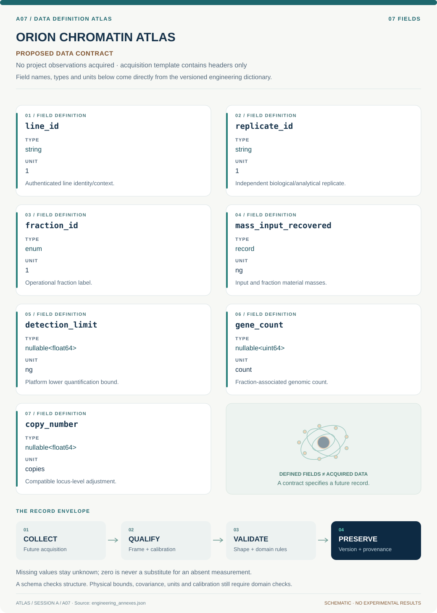

# A07 · Data blueprint

[ORION CHROMATIN ATLAS](../README.md) · [Figure gallery](../figures/README.md) · [Data atlas](../../../../data/README.md)

**PROPOSED CONTRACT · 7 fields · no project observations acquired.** The acquisition CSV contains column headers only. The diagram is a visual record specification, not measured data.

| Download | What it contains |
| --- | --- |
| [Acquisition CSV](acquisition.csv) | Empty columns ready for controlled acquisition |
| [Field dictionary](dictionary.csv) | Names, source types, units, meanings and quality rules |
| [JSON Schema](schema.json) | Nullable record structure with unit and quality metadata |

## Field reference

| Field | Type | Unit | Meaning | Quality / missingness |
| --- | --- | --- | --- | --- |
| line_id | string | 1 | Authenticated line identity/context. | Status and provenance required. |
| replicate_id | string | 1 | Independent biological/analytical replicate. | Replicate type explicit; technical repeats not independent. |
| fraction_id | enum | 1 | Operational fraction label. | Definition version fixed; no procedure inferred. |
| mass_input_recovered | record | ng | Input and fraction material masses. | Assay basis and uncertainty required. |
| detection_limit | nullable<float64> | ng | Platform lower quantification bound. | Null means unknown; zero policy mandatory. |
| gene_count | nullable<uint64> | count | Fraction-associated genomic count. | Genome build/library ID retained. |
| copy_number | nullable<float64> | copies | Compatible locus-level adjustment. | Unknown not assigned diploid automatically. |

## Acquisition and provenance

Null means missing or unknown; record its cause. Preserve product identifier, retrieval timestamp, source hash, calibration, coordinate and time frame, covariance basis, selection rules and every transformation. JSON Schema checks structure; physical bounds and the quality rules above require domain validation.

- [Genome-wide salt-fraction chromatin study](https://pubmed.ncbi.nlm.nih.gov/19088306/) — archive or acquisition resource; inclusion here does not assert that its data have been retrieved.
- [ENCODE ENCSR757EGB human esophageal squamous epithelium](https://www.encodeproject.org/experiments/ENCSR757EGB/) — archive or acquisition resource; inclusion here does not assert that its data have been retrieved.

[Controlled data-management procedure](../../../../engineering/DATA_MANAGEMENT.md)
