# A08 · HELIOS PULSE FORGE

**Original project:** Nonlinear Laser Pulse Compression with a Multipass Cell

**Session A:** Math, Physics & Chemistry

**Document class:** engineering research design and analysis record · **Revision:** 4 · **Date:** 2026-10-02

**Evidence state:** design basis, mathematical formulation and verification plan documented. Project-specific empirical results remain to be acquired; executable shared model demonstrations have their own recorded checks.

[Session A](../README.md) · [All projects](../../../ENGINEERING_DOCUMENTATION.md) · [Session handbook](../../../handbooks/SESSION_A.md) · [← A07](../A07-orion-chromatin-atlas/README.md) · [A09 →](../A09-spitzer-radio-origins/README.md)

| Proposed requirements | Specified verification cases | Defined data fields | Cited resources |
| ---: | ---: | ---: | ---: |
| 4 | 3 | 7 | 2 |

[Explore the data blueprint](data/README.md) · [Open the figure gallery](figures/README.md) · [Download acquisition template](data/acquisition.csv) · [Browse the data atlas](../../../data/README.md)

---

## Mission profile


| Profile panel | Engineering signal | Open the evidence |
| --- | --- | --- |
| Mission identity | Nonlinear Laser Pulse Compression with a Multipass Cell | [Scientific objective](#purpose-and-scientific-objective) |
| Model cockpit | 4 governing expressions; 4 derivation steps; declared assumptions and validity envelope | [Mathematical formulation](#4-mathematical-model-and-derivation) |
| Data blueprint | 7 proposed fields with types, units and quality rules | [Field map & downloads](data/README.md) |
| Verification queue | 4 proposed requirements; 3 specified cases; project execution evidence pending | [Case definitions](#8-verification-and-validation-cases) |
| Figure wall | Architecture, field map, planned result description | [Open full gallery](figures/README.md) |
| Resource library | 2 cited primary resources with support statements | [Cited resources](#12-cited-technical-and-scientific-resources) |

### Model cockpit

**Analysis method:** Reconstruct the input pulse from appropriate phase-sensitive metrology supplied by an authorized laser laboratory. Use split-step propagation with pass-specific focusing and dispersion, then add a transverse model when self-focusing or spatial spectral variation matters. Optimize a multiobjective score using main-pulse energy, throughput, beam quality, and sensitivity to input fluctuations. Compare model predictions to published and independently measured output spectra and retrieved temporal profiles.

**Operating envelope:** Autocorrelation alone cannot uniquely reconstruct a pulse. Material nonlinearities and mirror phase errors can dominate, and favorable simulations do not establish safe operating fluences or high-power qualification.

**Variables and conventions**

- Pulse envelope A, duration, energy, repetition rate, spectrum, chirp, nonlinear index n_2, dispersion beta_2.
- Pass count, beam radius, mirror dispersion, spot fluence, thermal load, M-squared, and temporal main-feature integration window.

### Artifact wall



Per-pass dispersion and Kerr phase feed a separately defined compressor and energy metric. The diagram requires field retrieval and supplied hardware limits; it does not establish operating safety or full transverse validity.

**Scientific result to produce:** Input/output spectra and phase-retrieved temporal intensity accompany a main-pulse-fraction versus throughput Pareto map; model and laboratory results use different line styles.

### Investigation feed · planned work

The feed records proposed work packages. A row becomes executed evidence only with versioned inputs, outputs and a reviewed result.

| Sequence | Evidence state | Engineering work package |
| --- | --- | --- |
| 01 | Planned | Create field_manifest.json with retrieval, units and Fourier conventions. |
| 02 | Planned | Implement split_step.py and analytic linear/Kerr fixtures. |
| 03 | Planned | Build pass_geometry.yaml and phase_library.parquet with supplied constraint fields. |
| 04 | Planned | Create compressor.py and immutable main_window.py. |
| 05 | Planned | Produce convergence.ipynb and transverse-validity comparison. |
| 06 | Planned | Publish robust_trade.parquet and run hashes; reserve laboratory performance claims for actual data. |

### Mission connections

Connections are reading routes based on actual shared resources, supplied sessions or included illustrations. They do not establish physical dependencies, team collaborations or validated results.

| Connected mission | Original investigation | Recorded connection basis |
| --- | --- | --- |
| [A07 · ORION CHROMATIN ATLAS](../A07-orion-chromatin-atlas/README.md) | Properties of Chromatin Extracted by Salt Fractionation from a Cancerous and Non-cancerous Esophageal Cell Line | Session A |
| [A09 · SPITZER RADIO ORIGINS](../A09-spitzer-radio-origins/README.md) | Majority of the Faint (μJy) Radio Source Population Appears Powered by Star Formation, not AGN | Session A |
| [A06 · APOLLO PORIN INSIGHT](../A06-apollo-porin-insight/README.md) | Purification of the P66 Outer Membrane Protein of the Bacterium Borrelia burgdorferi | Session A |
| [A10 · HUBBLE CARINA CLOCK](../A10-hubble-carina-clock/README.md) | H-beta Analysis of eta Carinae Radial Velocity during Recent Periastron Passages | Session A |
| [A05 · VOYAGER CILIA ARRAY](../A05-voyager-cilia-array/README.md) | Artificial Cilia Creation for Advanced Sensor Devices | Session A |
| [A11 · OSIRIS SULFUR ARCHIVE](../A11-osiris-sulfur-archive/README.md) | Identification of Thiol Function Groups in GRA 95229 and Murchison | Session A |

[Machine-readable connection register and ranking rule](../../../registry/mission_connections.json)

### Reading playlist

| Route | Start here | Continue to |
| --- | --- | --- |
| Understand the idea | [Scientific objective](#purpose-and-scientific-objective) | [Design boundary](#1-design-basis-and-analysis-boundary) → [Mathematics](#4-mathematical-model-and-derivation) |
| Inspect the data | [Visual blueprint](data/README.md) | [Provenance](#5-data-specifications-and-provenance) → [Uncertainty](#6-uncertainty-sensitivity-and-identifiability) |
| Make a design decision | [Trade study](#7-engineering-trade-study) | [Failure modes](#10-failure-modes-and-interpretation-controls) → [Required outputs](#11-required-engineering-outputs) |
| Prepare execution | [Requirements](#2-requirements-and-verification-traceability) | [Verification](#8-verification-and-validation-cases) → [Implementation](#9-implementation-and-reproducible-work-packages) |

## Complete engineering dossier

The profile above is a browsing layer. The full design basis, equations, derivations, data contract, uncertainty, trades and controlled case definitions follow.

## Purpose and scientific objective

Proposed mission: optimize pulse compression as a coupled temporal, spatial, thermal, and efficiency problem. Build a propagation model that predicts broadened spectra and recoverable pulse energy, then evaluate dispersion-managed multipass designs under measured input variability. A short full-width-at-half-maximum is insufficient if energy is spread into temporal pedestals or the beam loses quality.

**Question:** Can dispersion management improve usable main-pulse energy and robustness more effectively than simply increasing nonlinear phase accumulation?

**Testable hypothesis:** A proposed dispersion-engineered operating region will offer superior main-pulse fraction at a comparable compression ratio, throughput, and spatial quality; the location depends on measured input chirp and medium parameters.

## 1. Design basis and analysis boundary

The compression analysis begins at a measured input electric-field envelope and ends at a phase-reconstructed output pulse. It includes per-pass nonlinear propagation, dispersion, losses and the downstream compressor; laboratory operating limits remain supplied constraints, not values inferred from favorable simulations. Autocorrelation alone cannot define the starting or ending field uniquely.

Use a temporal split-step model with prescribed beam radius as the first tier, then add transverse propagation when self-focusing or spatially varying spectra invalidate it. Optimize usable main-pulse energy and robustness rather than only bandwidth. Mirror phase and input retrieval errors enter the design trade because they can dominate nominal nonlinear-phase gains.

## 2. Requirements and verification traceability

These are project design requirements or proposed analysis gates. A numerical target is not a NASA requirement unless its controlling source is explicitly identified. “TBD” identifies evidence required before a decision; it is not permission to assume a value. Verification evidence listed here is planned, unless a linked result explicitly records execution.

| ID | Requirement / gate | Engineering rationale | Verification method | Basis / required evidence |
| --- | --- | --- | --- | --- |
| A08-R1 | Each run shall specify envelope/Fourier convention, input phase retrieval and energy normalization. | Sign or normalization errors can produce fictitious compression. | Round-trip transforms and energy checks. | Envelope model contract. |
| A08-R2 | Proposed numerical gate: lossless propagation energy drift below 10^-6. | Splitting and window errors must be controlled. | Refine time window, grid and step independently. | Proposed solver target. |
| A08-R3 | Main-pulse energy shall use a fixed preregistered time window or reproducible pulse-selection rule. | Changing windows can inflate compression quality. | Apply one rule to all candidate and baseline outputs. | Metric-definition requirement. |
| A08-R4 | Report phase/amplitude sensitivity and supplied fluence constraints for every selected design. | Optimum performance may be fragile or outside authorized limits. | Perturb input and mirror phase; reject unspecified constraint status. | Proposed design gate; no hardware qualification. |

## 3. Architecture and controlled interfaces

The input-field adapter stores complex A(t) with |A|^2 in W and a sampled retarded-time axis. Each pass combines linear spectral propagation, nonlinear time-domain phase and measured attenuation. A beam-radius map converts power to intensity under an explicitly declared transverse shape, while a spatial extension can replace that assumption.

A compressor applies a versioned spectral-phase function. Retrieval comparison preserves wavelength-to-frequency Jacobians, temporal reference and covariance. Energy integration, central-pulse selection and beam-quality outputs feed the optimizer as separate objectives. Supplied material/optic limits travel through a feasibility gate rather than being guessed.


Per-pass dispersion and Kerr phase feed a separately defined compressor and energy metric. The diagram requires field retrieval and supplied hardware limits; it does not establish operating safety or full transverse validity.

[Editable engineering diagram source](figures/architecture.mmd)

## 4. Mathematical model and derivation

### Governing equations

```text
partial A/partial z=-(alpha/2)A-i(beta_2/2)partial^2 A/partial t^2+i gamma|A|^2 A, a reduced envelope model.
```

```text
B=k_0 integral n_2 I(z) dz; k_0=2pi/lambda.
```

```text
phi_out(omega)=phi_input+phi_nonlinear+phi_medium+phi_mirrors+phi_compressor.
```

```text
eta_main=integral_main |A(t)|^2dt/integral_all |A(t)|^2dt; eta_total=E_out/E_in.
```

### Variables, units and conventions

- Pulse envelope A, duration, energy, repetition rate, spectrum, chirp, nonlinear index n_2, dispersion beta_2.
- Pass count, beam radius, mirror dispersion, spot fluence, thermal load, M-squared, and temporal main-feature integration window.

### Assumptions and boundary conditions

- The first envelope model neglects ionization, self-steepening, and full transverse dynamics; validity is tested before optimization.
- Measured input spectra and phase are required; an assumed Gaussian transform-limited pulse is only a synthetic baseline.

### Derivation step 1

$$
E=\int|A(t)|^2dt;\quad I_{axis}=2P/(\pi w^2)
$$

With a Gaussian transverse intensity and 1/e^2 radius w, integrate over area to obtain the axial intensity. Other beam profiles require another conversion.

### Derivation step 2

$$
B=k_0\int n_2I\,dz;\quad \gamma=k_0n_2/A_{eff}
$$

B is dimensionless and gamma has W^-1 m^-1. Relate accumulated Kerr phase to the power envelope using the same effective-area convention. For this axial temporal approximation define A_eff=pi w^2/2, matching the preceding peak-intensity relation; a mode-averaged transverse model needs its independently derived effective area.

### Derivation step 3

$$
\partial_z\widetilde A=i\beta_2\Omega^2\widetilde A/2-\alpha\widetilde A/2
$$

For the declared transform where time differentiation gives -Omega^2, the dossier's -i beta2 A_tt/2 yields this linear propagator. Phase signs must match compressor conventions.

### Derivation step 4

$$
\eta_{main}=\frac{\int_W|A|^2dt}{\int|A|^2dt};\quad E_{usable}=E_{in}\eta_{total}\eta_{main}
$$

Throughput and temporal concentration multiply to useful energy. Spectral broadening alone leaves this quantity unconstrained when satellites or losses increase.

### Inference or simulation procedure

Reconstruct the input pulse from appropriate phase-sensitive metrology supplied by an authorized laser laboratory. Use split-step propagation with pass-specific focusing and dispersion, then add a transverse model when self-focusing or spatial spectral variation matters. Optimize a multiobjective score using main-pulse energy, throughput, beam quality, and sensitivity to input fluctuations. Compare model predictions to published and independently measured output spectra and retrieved temporal profiles.

### Validity domain and fidelity limits

Autocorrelation alone cannot uniquely reconstruct a pulse. Material nonlinearities and mirror phase errors can dominate, and favorable simulations do not establish safe operating fluences or high-power qualification.

## 5. Data specifications and provenance


**Proposed data contract · observations pending.** This visual inventory shows the record fields to acquire or derive. It contains no project measurements. [Open the data blueprint and downloads](data/README.md).

| Field | Type | Unit | Physical / statistical meaning | Quality and missing-data rule |
| --- | --- | --- | --- | --- |
| time_grid | vector<float64> | s | Retarded time samples. | Uniform spacing, window and origin recorded. |
| input_field | vector<complex128> | sqrt(W) | Retrieved complex envelope. | Phase reference, covariance and retrieval method required. |
| pass_geometry | array<record> | m | Path lengths and beam radii. | No missing radius silently replaced. |
| nonlinear_index | float64 | m^2/W | Material n2 at declared conditions. | Source and uncertainty required. |
| dispersion | array<float64> | s^2/m | Per-medium beta2. | Higher-order terms separately labeled. |
| optic_phase | nullable<vector<float64>> | rad | Mirror/compressor spectral phase. | Unknown null; interpolation domain checked. |
| energy_metrics | record | J,1 | Output, main-window energy and throughput. | Window rule immutable across comparisons. |

[Machine-readable record schema](data/schema.json) · [Empty acquisition CSV](data/acquisition.csv) · [Field dictionary CSV](data/dictionary.csv)

The CSV above contains column headers only. Its schema defines future records and does not establish that original-team data or a particular archive product have been acquired. Frame, timing, calibration, covariance, selection and provenance details must accompany populated records.

### Gas-filled multipass compression study

[Product, archive or reference](https://opg.optica.org/ol/abstract.cfm?uri=ol-43-9-2070)

**Fields:** Reported input/output pulse durations, energy, average power, beam quality, throughput, and spectral broadening.

**Access:** Public abstract; full article may require institutional access. Raw traces are not assumed open.

**Role:** Published operating-point benchmark.

### Dispersion-engineered high-quality compression study

[Product, archive or reference](https://pubmed.ncbi.nlm.nih.gov/37966747/)

**Fields:** Reported compression ratio and temporal main-feature energy fraction.

**Access:** Public abstract; obtain full data from article supplements/authors as needed.

**Role:** Independent dispersion-design comparison.

## 6. Uncertainty, sensitivity and identifiability

Input phase retrieval, pulse energy, radius, nonlinear index and mirror dispersion are correlated. Since intensity scales inversely with radius squared, small geometry uncertainty can shift B appreciably. Ionization, self-steepening and transverse instabilities are structural discrepancy outside the reduced model, not extra fit parameters to conceal failure.

Propagate measured field ensembles and realistic correlated mirror-phase perturbations. Compare designs on worst-supported and central envelopes rather than only a nominal pulse. Grid and propagation-step uncertainty are assessed separately from physical input uncertainty. If transverse model residuals exceed the temporal uncertainty envelope, downgrade the temporal-only optimum.

## 7. Engineering trade study

| Alternative | Benefit | Cost / limitation | Decision rule |
| --- | --- | --- | --- |
| More nonlinear passes | Greater nominal bandwidth. | Higher loss and accumulated phase sensitivity. | Choose only if usable energy improves within supplied constraints. |
| Dispersion-engineered cell | Can concentrate compressed pulse energy. | Needs accurate optic phase. | Prefer if robust main-window gain survives phase uncertainty. |
| Full transverse model | Captures spatial spectral variation. | Higher cost and more parameters. | Use when beam-radius approximation fails held-out profiles. |

## 8. Verification and validation cases

| Case ID | Stimulus / condition | Expected result / criterion | Method | Evidence artifact |
| --- | --- | --- | --- | --- |
| A08-V1 | Zero nonlinearity/loss | Linear spectral phase preserves energy and bandwidth magnitude. | Set n2=alpha=0 and compare analytic dispersion. | Fourier unitary propagation. |
| A08-V2 | Pure Kerr step | Temporal intensity unchanged; phase increment equals gamma P dz. | Compare one-step analytic solution. | Local nonlinear ODE. |
| A08-V3 | Compression reversal | Known quadratic chirp removed by equal/opposite phase returns synthetic transform-limited pulse. | Round-trip retrieval and compressor pipeline. | Analytic synthetic fixture; real results pending. |

**Execution status:** these cases are specified, not claimed as executed. Close a case only with the versioned inputs, output, uncertainty, reviewer and pass/fail rationale.

### Additional scientific validation gates

- Check energy conservation when alpha is zero, Fourier-transform consistency, temporal-window convergence, and spatial-grid convergence.
- Compare predicted and measured spectrum plus phase-sensitive pulse retrieval; report retrieval residual and ambiguity.
- Proposed acceptance: improvements in main-pulse fraction persist under input variations and do not sacrifice measured throughput or beam quality beyond declared requirements.

## 9. Implementation and reproducible work packages

1. Create field_manifest.json with retrieval, units and Fourier conventions.
2. Implement split_step.py and analytic linear/Kerr fixtures.
3. Build pass_geometry.yaml and phase_library.parquet with supplied constraint fields.
4. Create compressor.py and immutable main_window.py.
5. Produce convergence.ipynb and transverse-validity comparison.
6. Publish robust_trade.parquet and run hashes; reserve laboratory performance claims for actual data.

### Investigation sequence

1. Freeze a proposed operating envelope with qualified laser specialists and record measurement/calibration uncertainties.
2. Validate reduced propagation against low-nonlinearity cases and published benchmarks; extend physics only when residuals demand it.
3. Sweep dispersion, pass count, medium properties, and input phase with uncertainty ensembles rather than a single optimum.
4. Produce a robust design region and a metrology specification; laboratory work proceeds only within an established laser facility's procedures.

### Resources and interfaces to expertise

- Ultrafast optics laboratory, pulse-retrieval metrology, dispersion data, propagation software, and optical/thermal engineering review.

## 10. Failure modes and interpretation controls

| Failure mode | Effect on result | Detection / evidence | Design response |
| --- | --- | --- | --- |
| Aliased time window | False short pulse or lost satellites. | Window-edge energy and refinement. | Expand window and sampling. |
| Dispersion sign mismatch | Pulse broadens while optimizer reports improvement. | Known-chirp reversal test. | One Fourier convention registry. |
| Autocorrelation treated as field | Unsupported pulse reconstruction. | Missing phase provenance. | Require phase-sensitive input or label synthetic. |

- Laser damage and exposure hazards require authorized facility controls.
- Peak power claims are unreliable without phase retrieval and consistent main-feature energy accounting.

## 11. Required engineering outputs

- Validated propagation notebook, uncertainty-aware Pareto map, input/output pulse archive, and dispersion-budget specification.

### Scientific result figures to produce during execution

Input/output spectra and phase-retrieved temporal intensity accompany a main-pulse-fraction versus throughput Pareto map; model and laboratory results use different line styles.

## 12. Cited technical and scientific resources

- [Ueffing et al., Nonlinear pulse compression in a gas-filled multipass cell](https://opg.optica.org/ol/abstract.cfm?uri=ol-43-9-2070) — Original gas-cell compression demonstration and measured output characteristics.
- [Karst et al., Dispersion engineering in nonlinear multipass cells for high-quality pulse compression](https://pubmed.ncbi.nlm.nih.gov/37966747/) — Original evidence that dispersion design can improve compressed temporal energy concentration.

Framework and evidence rules: [engineering documentation standard](../../../engineering/ENGINEERING_STANDARD.md), [model assurance](../../../engineering/MODEL_ASSURANCE.md), [uncertainty procedure](../../../engineering/UNCERTAINTY_AND_DECISION_RULES.md), [data management](../../../engineering/DATA_MANAGEMENT.md). NASA-inspired names are creative identifiers; requirements and results are not NASA certification.
