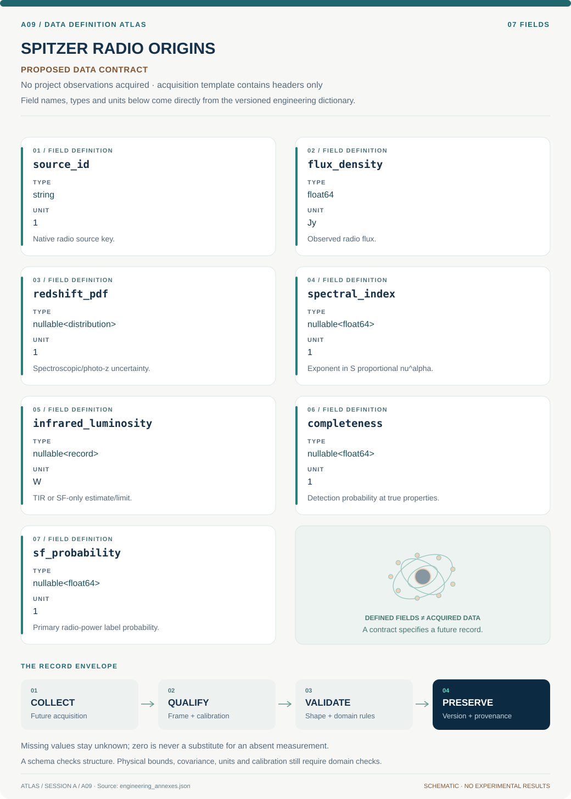

# A09 · SPITZER RADIO ORIGINS

**Original project:** Majority of the Faint (μJy) Radio Source Population Appears Powered by Star Formation, not AGN

**Session A:** Math, Physics & Chemistry

**Document class:** engineering research design and analysis record · **Revision:** 3 · **Date:** 2026-10-02

**Evidence state:** design basis, mathematical formulation and verification plan documented. Project-specific empirical results remain to be acquired; executable shared model demonstrations have their own recorded checks.

[Session A](../README.md) · [All projects](../../../ENGINEERING_DOCUMENTATION.md) · [Session handbook](../../../handbooks/SESSION_A.md) · [← A08](../A08-helios-pulse-forge/README.md) · [A10 →](../A10-hubble-carina-clock/README.md)

| Proposed requirements | Specified verification cases | Defined data fields | Cited resources |
| ---: | ---: | ---: | ---: |
| 4 | 3 | 7 | 2 |

[Explore the data blueprint](data/README.md) · [Open the figure gallery](figures/README.md) · [Download acquisition template](data/acquisition.csv) · [Browse the data atlas](../../../data/README.md)

---

## Purpose and scientific objective

Proposed mission: turn the supplied population claim into a reproducible, selection-aware test of what powers faint radio emission. Distinguish the existence of an active galactic nucleus from whether it dominates a galaxy's radio output. Estimate star-formation-powered fractions as functions of flux, redshift, and angular resolution, with counterpart incompleteness and cosmic variance included.

**Question:** Does the inferred majority remain after radio selection, multiwavelength nondetections, classification uncertainty, and field-to-field variance are modeled?

**Testable hypothesis:** Star-formation-powered systems will dominate portions of the faint flux range in well-characterized deep fields; the fraction will vary with frequency, flux threshold, redshift, and the radio-power definition.

## 1. Design basis and analysis boundary

The population analysis boundary starts with a flux-selected radio catalog and compatible multiwavelength counterparts, then models completeness, measurement scatter and uncertain radio-power classes. The original title remains a hypothesis to reproduce under its source definitions, not a universal statement about every microjansky survey.

First replicate the documented VLA-COSMOS classification columns, then forward-model selection and infer probabilistic star-formation fractions. Infrared/X-ray nondetections remain censored observations. Distinguish an AGN host from radio emission dominated by AGN, because those labels answer different physical questions. Do not extrapolate below validated completeness without marking predictions.

## 2. Requirements and verification traceability

These are project design requirements or proposed analysis gates. A numerical target is not a NASA requirement unless its controlling source is explicitly identified. “TBD” identifies evidence required before a decision; it is not permission to assume a value. Verification evidence listed here is planned, unless a linked result explicitly records execution.

| ID | Requirement / gate | Engineering rationale | Verification method | Basis / required evidence |
| --- | --- | --- | --- | --- |
| A09-R1 | Flux, spectral-index sign and rest-frequency conventions shall be explicit. | K-corrections change with sign convention. | Recompute luminosities from catalog metadata and synthetic limits. | Existing catalog/source definitions. |
| A09-R2 | Each weighted fraction shall retain completeness uncertainty and effective sample size. | Large inverse weights can dominate the majority claim. | Inspect weight distribution and selection-model sensitivity. | Population-estimator requirement. |
| A09-R3 | Nondetections shall enter as limits rather than disappear from the sample. | Discarding faint counterparts biases classes. | Compare sample ledger before and after likelihood assembly. | Censored-data requirement. |
| A09-R4 | Proposed majority criterion: interval lower bound above 0.5 under the primary label and stated flux range. | A point estimate alone is weak evidence. | Bootstrap by sky region and vary predefined class alternatives. | Proposed inferential criterion; no new fraction claimed. |

## 3. Architecture and controlled interfaces

Catalog ingestion preserves original source IDs, fluxes, sizes, flags and angular positions. A counterpart adapter records reliability and redshift likelihood, not just one selected match. The luminosity module uses a declared cosmology and Jy-to-SI conversion; infrared quantities distinguish total IR from star-formation-only luminosity.

A class likelihood combines radio excess and ancillary indicators without forcing overlapping labels into exclusive physical truth. A detection model predicts inclusion versus flux/size/position and couples to flux-error convolution. Regional hierarchical effects capture field variance. Outputs include flux-bin fractions, covariance and definition-specific label probabilities.



Flux selection and uncertain radio-power classification enter the population model separately. The resulting majority criterion applies only to declared labels, flux ranges and survey context.

[Editable engineering diagram source](figures/architecture.mmd)

## 4. Mathematical model and derivation

### Governing equations

```text
L_nu,rest=4pi D_L^2 S_nu,obs (1+z)^(-(1+alpha)) for same numerical rest/observed frequency and S_nu proportional nu^alpha.
```

```text
q_TIR=log10[(L_TIR/(3.75e12 Hz))/L_1.4GHz], with both luminosity terms in compatible SI units.
```

```text
f_SF(bin)=sum_i w_i P_i(SF-powered)/sum_i w_i; w_i=1/C_i for calibrated completeness C_i.
```

```text
N_obs(S)=integral P(S_obs|S_true)C(S_true)N_true(S_true)dS_true.
```

### Variables, units and conventions

- Flux density S in Jy, redshift z, luminosity distance D_L, spectral index alpha, infrared luminosity, and radio excess.
- Counterpart reliability, completeness, source size, class probability, flux-bin covariance, and survey area.

### Assumptions and boundary conditions

- Spectral-index conventions are explicit; a fixed alpha is a sensitivity scenario rather than a universal fact.
- Multiwavelength AGN indicators and radio excess diagnose overlapping phenomena and cannot be collapsed into a single error-free label.

### Derivation step 1

$$
L_{\nu}=4\pi D_L^2S_{\nu}(1+z)^{-(1+\alpha)}
$$

For S proportional to nu^alpha and equal numerical rest/observed frequency, derive the K-correction from redshifted spectral flux. Convert Jy to W m^-2 Hz^-1 before forming W/Hz.

### Derivation step 2

$$
q_{TIR}=\log_{10}\left[(L_{TIR}/3.75\times10^{12}\,Hz)/L_{1.4}\right]
$$

The numerator and denominator both have W/Hz. Total-IR and SF-only definitions are not interchangeable, particularly for AGN-containing objects.

### Derivation step 3

$$
\widehat f=\sum_iw_ip_i/\sum_iw_i;\quad n_{eff}=(\sum_iw_i)^2/\sum_iw_i^2
$$

Weighted class probabilities estimate the fraction only under calibrated selection weights. Effective sample size diagnoses concentration but does not replace completeness covariance.

### Derivation step 4

$$
N_{obs}(S_o)=\int P(S_o\mid S)C(S,\theta)N_{true}(S)dS
$$

Flux scatter and source-size/position selection jointly shape observed counts. Forward convolution prevents using noisy observed flux as an error-free weighting variable.

### Inference or simulation procedure

Reproduce a documented VLA-COSMOS baseline with its native definitions, then fit probabilistic radio-power labels using infrared-radio relations and ancillary information. Model upper limits rather than discard undetected infrared or X-ray sources. Forward-model flux scatter and resolution losses through the selection function. Use stratified bootstrap or hierarchical field effects and test alternative AGN definitions without changing the primary definition after seeing results.

### Validity domain and fidelity limits

IR-radio evolution and dust modeling affect classification. An observed majority in one survey does not prove all microjansky surveys are star-formation dominated, and extrapolation beyond the measured completeness limit is a model prediction.

## 5. Data specifications and provenance



**Proposed data contract · observations pending.** This visual inventory shows the record fields to acquire or derive. It contains no project measurements. [Open the data blueprint and downloads](data/README.md).

| Field | Type | Unit | Physical / statistical meaning | Quality and missing-data rule |
| --- | --- | --- | --- | --- |
| source_id | string | 1 | Native radio source key. | Stable catalog version and deblend flags. |
| flux_density | float64 | Jy | Observed radio flux. | Frequency, integrated/peak basis and error required. |
| redshift_pdf | nullable<distribution> | 1 | Spectroscopic/photo-z uncertainty. | No-redshift sources retained as missing likelihood. |
| spectral_index | nullable<float64> | 1 | Exponent in S proportional nu^alpha. | Convention required; assumed values flagged. |
| infrared_luminosity | nullable<record> | W | TIR or SF-only estimate/limit. | Definition and upper-limit flag required. |
| completeness | nullable<float64> | 1 | Detection probability at true properties. | Between zero and one; covariance/version retained. |
| sf_probability | nullable<float64> | 1 | Primary radio-power label probability. | Definition fixed; unclassified is null, not zero. |

[Machine-readable record schema](data/schema.json) · [Empty acquisition CSV](data/acquisition.csv) · [Field dictionary CSV](data/dictionary.csv)

The CSV above contains column headers only. Its schema defines future records and does not establish that original-team data or a particular archive product have been acquired. Frame, timing, calibration, covariance, selection and provenance details must accompany populated records.

### IRSA COSMOS 3 GHz AGN catalog definitions

[Product, archive or reference](https://irsa.ipac.caltech.edu/data/COSMOS/gator_docs/cosmos_3ghzagn_colDescriptions.html)

**Fields:** ID_VLA3, sky coordinates, Z_BEST/Z_TYPE, FLUX_INT_3GHz, Lradio, L_TIR_SF, and classification fields.

**Access:** Public column documentation; query the corresponding catalog through IRSA and retain release/version.

**Role:** Analysis schema and multiwavelength attributes.

### VLA-COSMOS radio project

[Product, archive or reference](https://cosmos.astro.caltech.edu/page/radio)

**Fields:** Radio imaging context, frequency, depth, survey area, and data links.

**Access:** Public project resource; individual FITS/catalog downloads and masks require product-level checks.

**Role:** Survey selection context.

## 6. Uncertainty, sensitivity and identifiability

Radio flux errors correlate with deblending and angular size; redshift and spectral-index uncertainties propagate jointly into luminosity. IR decomposition and evolving IR–radio relations change class probability. Cosmic variance is a regional systematic and cannot be reduced by resampling individual sources as independent draws.

Use sky-region bootstrap or field random effects, propagate class and completeness ensembles, and profile redshift/IR-relation alternatives. Fit a withheld region and flux bin without redefining the label after inspecting results. Report bins whose weight concentration or missing counterparts prevent a robust majority assessment.

## 7. Engineering trade study

| Alternative | Benefit | Cost / limitation | Decision rule |
| --- | --- | --- | --- |
| Hard radio-excess labels | Reproduces a published baseline. | Threshold and limits discard uncertainty. | Use only for source-definition reproduction. |
| Probabilistic labels | Propagates ambiguous indicators. | Depends on relation and priors. | Primary inference if calibrated on held-out objects. |
| Full count/selection hierarchy | Handles scatter and nondetection. | More complex and less identifiable. | Use where completeness/size data support it. |

## 8. Verification and validation cases

| Case ID | Stimulus / condition | Expected result / criterion | Method | Evidence artifact |
| --- | --- | --- | --- | --- |
| A09-V1 | Low-redshift limit | At z=0, luminosity reduces to 4 pi D_L^2 S. | Unit and sign fixture with fixed nonzero test distance. | K-correction identity. |
| A09-V2 | Complete equal-probability sample | If C=1 and all p=p0, fraction equals p0. | Analytic synthetic catalog. | Weighted-estimator algebra. |
| A09-V3 | Injection/holdout selection | Recovered synthetic population lies within declared uncertainty; held-out regional residuals expose mismatch. | Generate known counts through size/flux selection and refit. | Proposed coverage check; no survey outcome invented. |

**Execution status:** these cases are specified, not claimed as executed. Close a case only with the versioned inputs, output, uncertainty, reviewer and pass/fail rationale.

### Additional scientific validation gates

- Recover baseline population trends within compatible definitions and quantify discrepancies.
- Inject synthetic catalog populations to test fraction recovery, Eddington bias correction, and confidence-interval coverage.
- Report alternative spectral-index, counterpart, and AGN-threshold analyses; a majority claim requires the uncertainty interval to support it.

## 9. Implementation and reproducible work packages

1. Create catalog_manifest.json preserving native columns and cosmology.
2. Implement counterpart_likelihood.py and censored_ir.py.
3. Build luminosity_kcorrect.py with unit/sign fixtures.
4. Implement selection_forward.py using injection-completeness metadata.
5. Create population_hierarchy.py and regional holdout notebooks.
6. Emit fractions.parquet with covariance, label definitions and unassessable bins.

### Investigation sequence

1. Freeze flux bins, scientific power-source definition, and completeness threshold.
2. Cross-match catalogs with positional uncertainties and audit blended/multi-component cases.
3. Estimate weighted probabilistic fractions with upper-limit treatment and selection forward modeling.
4. Repeat on an independently selected field when available and report extrapolated fractions separately.

### Resources and interfaces to expertise

- Radio-astronomy expertise, catalog cross-matching tools, SED/upper-limit statistics, and access to IRSA data products.

## 10. Failure modes and interpretation controls

| Failure mode | Effect on result | Detection / evidence | Design response |
| --- | --- | --- | --- |
| Alpha sign flipped | Biased luminosities and radio excess. | Known-spectrum K-correction fixture. | Declared exponent convention. |
| AGN host equated radio AGN | Wrong physical fraction. | Label-definition audit. | Separate host and power labels. |
| Extreme weights hidden | Unstable majority claim. | Effective-size and weight concentration. | Restrict validated range or widen interval. |

- A host AGN can exist while star formation supplies most radio emission.
- Field variance, surface-brightness losses, and inconsistent frequency conversion can create misleading aggregate fractions.

## 11. Required engineering outputs

- Versioned source table, power-source probability catalog, corrected population-fraction plots, and a reproducibility notebook.

### Scientific result figures to produce during execution

Flux-versus-star-formation-powered fraction with credible bands, redshift strata, and a classification flow diagram; observed bins and extrapolations are clearly separated.

## 12. Cited technical and scientific resources

- [Smolcic et al., VLA-COSMOS 3 GHz: composition of the faint radio population](https://arxiv.org/abs/1703.09719) — Original multiwavelength classification and flux-dependent population fractions.
- [IRSA COSMOS 3 GHz AGN catalog definitions](https://irsa.ipac.caltech.edu/data/COSMOS/gator_docs/cosmos_3ghzagn_colDescriptions.html) — Official column names, units, and distinctions in infrared/star-formation luminosity.

Framework and evidence rules: [engineering documentation standard](../../../engineering/ENGINEERING_STANDARD.md), [model assurance](../../../engineering/MODEL_ASSURANCE.md), [uncertainty procedure](../../../engineering/UNCERTAINTY_AND_DECISION_RULES.md), [data management](../../../engineering/DATA_MANAGEMENT.md). NASA-inspired names are creative identifiers; requirements and results are not NASA certification.
