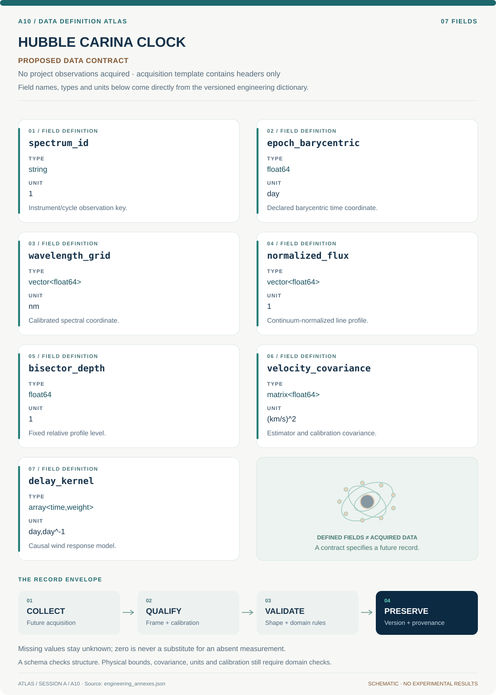

# A10 · Figure gallery

[HUBBLE CARINA CLOCK](../README.md) · [Data blueprint](../data/README.md) · [Data diagnostic gallery](../../../../data/figures/README.md)

## Engineering architecture

Separate profile estimators compare to an orbit filtered through a causal wind model. Time conventions and nuisance offsets are explicit; line-only fits do not establish inclination or stellar masses.

[SVG](architecture.svg) · [Editable Mermaid source](architecture.mmd)

## Data blueprint

**Proposed contract · observations pending.** Every field, type, unit and meaning comes from the controlled dictionary. [Open SVG](data-map.svg) · [Download dictionary](../data/dictionary.csv)

## Planned scientific result

Phase-folded H-beta trailed spectra, velocity estimators with uncertainty, instantaneous and wind-delayed orbital curves, and residuals by periastron cycle.

This final scientific result remains an execution deliverable; the design diagrams do not establish an empirical finding.
