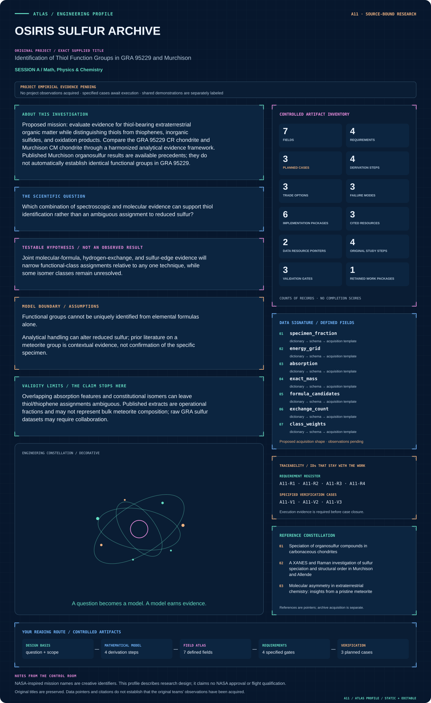

# A11 · OSIRIS SULFUR ARCHIVE

**Original project:** Identification of Thiol Function Groups in GRA 95229 and Murchison

**Session A:** Math, Physics & Chemistry

**Document class:** engineering research design and analysis record · **Revision:** 4 · **Date:** 2026-10-02

**Evidence state:** design basis, mathematical formulation and verification plan documented. Project-specific empirical results remain to be acquired; executable shared model demonstrations have their own recorded checks.

[Session A](../README.md) · [All projects](../../../ENGINEERING_DOCUMENTATION.md) · [Session handbook](../../../handbooks/SESSION_A.md) · [← A10](../A10-hubble-carina-clock/README.md) · [A12 →](../A12-stardust-isotope-foundry/README.md)

| Proposed requirements | Specified verification cases | Defined data fields | Cited resources |
| ---: | ---: | ---: | ---: |
| 4 | 3 | 7 | 3 |

[Explore the data blueprint](data/README.md) · [Open the figure gallery](figures/README.md) · [Download acquisition template](data/acquisition.csv) · [Browse the data atlas](../../../data/README.md)

---

## Mission profile



| Profile panel | Engineering signal | Open the evidence |
| --- | --- | --- |
| Mission identity | Identification of Thiol Function Groups in GRA 95229 and Murchison | [Scientific objective](#purpose-and-scientific-objective) |
| Model cockpit | 4 governing expressions; 4 derivation steps; declared assumptions and validity envelope | [Mathematical formulation](#4-mathematical-model-and-derivation) |
| Data blueprint | 7 proposed fields with types, units and quality rules | [Field map & downloads](data/README.md) |
| Verification queue | 4 proposed requirements; 3 specified cases; project execution evidence pending | [Case definitions](#8-verification-and-validation-cases) |
| Figure wall | Architecture, field map, planned result description | [Open full gallery](figures/README.md) |
| Resource library | 3 cited primary resources with support statements | [Cited resources](#12-cited-technical-and-scientific-resources) |

### Model cockpit

**Analysis method:** Compile spectra, formula tables, and isotopic/provenance evidence where available. Fit standard-constrained sulfur-edge mixtures and cross-check candidate molecular classes against exchange behavior and mass accuracy. Compare Murchison and GRA 95229 only after harmonizing analytical fractions and measurement techniques. Plan future expert spectroscopy around unresolved class distinctions, emphasizing minimal material consumption and independent reference standards.

**Operating envelope:** Overlapping absorption features and constitutional isomers can leave thiol/thiophene assignments ambiguous. Published extracts are operational fractions and may not represent bulk meteorite composition; raw GRA sulfur datasets may require collaboration.

**Variables and conventions**

- Accurate mass, molecular formula, exchangeable hydrogen count, sulfur oxidation-state indicators, spectral calibration, and standard-mixture coefficients.
- Sample provenance, terrestrial exposure, mineral/organic sulfur partition, grain heterogeneity, instrumental detection limits, and assignment confidence.

### Artifact wall


Spectral and molecular branches combine only through matched specimen context. The output retains nonunique sulfur classes; formulas and isotope context are not treated as direct thiol identification.

**Scientific result to produce:** Sulfur-edge spectra, molecular-class network, and a matrix of meteorite-by-technique evidence; missing GRA observations are explicit gaps rather than inferred detections.

### Investigation feed · planned work

The feed records proposed work packages. A row becomes executed evidence only with versioned inputs, outputs and a reviewed result.

| Sequence | Evidence state | Engineering work package |
| --- | --- | --- |
| 01 | Planned | Create specimen_evidence_registry.csv with fraction/method source locations. |
| 02 | Planned | Implement sulfur_spectrum_adapter.py retaining calibration and covariance. |
| 03 | Planned | Build formula_adduct_checks.py and exchange_evidence.json. |
| 04 | Planned | Implement constrained_xanes.py with degenerate-standard fixtures. |
| 05 | Planned | Create joint_assignment.py with provenance/dependency gates. |
| 06 | Planned | Publish assignment_uncertainty.ipynb and a class_evidence_table.parquet containing tentative/unavailable states. |

### Mission connections

Connections are reading routes based on actual shared resources, supplied sessions or included illustrations. They do not establish physical dependencies, team collaborations or validated results.

| Connected mission | Original investigation | Recorded connection basis |
| --- | --- | --- |
| [A10 · HUBBLE CARINA CLOCK](../A10-hubble-carina-clock/README.md) | H-beta Analysis of eta Carinae Radial Velocity during Recent Periastron Passages | Session A |
| [A12 · STARDUST ISOTOPE FOUNDRY](../A12-stardust-isotope-foundry/README.md) | Heterogeneous Supernova Production of Ti and Cr Isotopes | Session A |
| [A09 · SPITZER RADIO ORIGINS](../A09-spitzer-radio-origins/README.md) | Majority of the Faint (μJy) Radio Source Population Appears Powered by Star Formation, not AGN | Session A |
| [A08 · HELIOS PULSE FORGE](../A08-helios-pulse-forge/README.md) | Nonlinear Laser Pulse Compression with a Multipass Cell | Session A |
| [A07 · ORION CHROMATIN ATLAS](../A07-orion-chromatin-atlas/README.md) | Properties of Chromatin Extracted by Salt Fractionation from a Cancerous and Non-cancerous Esophageal Cell Line | Session A |
| [A06 · APOLLO PORIN INSIGHT](../A06-apollo-porin-insight/README.md) | Purification of the P66 Outer Membrane Protein of the Bacterium Borrelia burgdorferi | Session A |

[Machine-readable connection register and ranking rule](../../../registry/mission_connections.json)

### Reading playlist

| Route | Start here | Continue to |
| --- | --- | --- |
| Understand the idea | [Scientific objective](#purpose-and-scientific-objective) | [Design boundary](#1-design-basis-and-analysis-boundary) → [Mathematics](#4-mathematical-model-and-derivation) |
| Inspect the data | [Visual blueprint](data/README.md) | [Provenance](#5-data-specifications-and-provenance) → [Uncertainty](#6-uncertainty-sensitivity-and-identifiability) |
| Make a design decision | [Trade study](#7-engineering-trade-study) | [Failure modes](#10-failure-modes-and-interpretation-controls) → [Required outputs](#11-required-engineering-outputs) |
| Prepare execution | [Requirements](#2-requirements-and-verification-traceability) | [Verification](#8-verification-and-validation-cases) → [Implementation](#9-implementation-and-reproducible-work-packages) |

## Complete engineering dossier

The profile above is a browsing layer. The full design basis, equations, derivations, data contract, uncertainty, trades and controlled case definitions follow.

## Purpose and scientific objective

Proposed mission: evaluate evidence for thiol-bearing extraterrestrial organic matter while distinguishing thiols from thiophenes, inorganic sulfides, and oxidation products. Compare the GRA 95229 CR chondrite and Murchison CM chondrite through a harmonized analytical evidence framework. Published Murchison organosulfur results are available precedents; they do not automatically establish identical functional groups in GRA 95229.

**Question:** Which combination of spectroscopic and molecular evidence can support thiol identification rather than an ambiguous assignment to reduced sulfur?

**Testable hypothesis:** Joint molecular-formula, hydrogen-exchange, and sulfur-edge evidence will narrow functional-class assignments relative to any one technique, while some isomer classes remain unresolved.

## 1. Design basis and analysis boundary

The analysis joins public meteorite spectra, molecular formulas and exchange/isotope evidence to assess whether thiol assignments are distinguishable from other reduced sulfur classes. The boundary includes specimen/fraction provenance, energy/mass calibration and reference-standard compatibility. It does not treat an elemental formula as a unique functional-group identification or imply that available Murchison data establish the same result in GRA 95229.

Begin with source/figure accounting and calibrated standard-mixture fits. Add molecular/exchange likelihoods only for compatible analytical fractions; isotope evidence addresses origin/context rather than directly proving a thiol bond. Any new expert spectroscopy is specified as required reporting outputs, without a material-processing recipe.

## 2. Requirements and verification traceability

These are project design requirements or proposed analysis gates. A numerical target is not a NASA requirement unless its controlling source is explicitly identified. “TBD” identifies evidence required before a decision; it is not permission to assume a value. Verification evidence listed here is planned, unless a linked result explicitly records execution.

| ID | Requirement / gate | Engineering rationale | Verification method | Basis / required evidence |
| --- | --- | --- | --- | --- |
| A11-R1 | Each functional-group assignment shall cite at least two distinguishable evidence classes or remain tentative. | Mass formula alone admits constitutional isomers. | Audit assignment-to-spectrum/exchange links. | Existing organosulfur primary studies. |
| A11-R2 | Every GRA/Murchison comparison shall preserve specimen, fraction and method provenance. | Operational extracts need not represent bulk composition. | Reject unmatched quantitative comparisons. | Specimen-context requirement. |
| A11-R3 | XANES mixture coefficients shall be nonnegative and normalized, with residuals retained. | An unconstrained fit can create nonphysical components. | Constrained fitting and independent reconstruction. | Spectral-mixture contract. |
| A11-R4 | Proposed assignment gate: confidence classification remains stable under calibration uncertainty and alternate plausible standards. | Closely overlapping sulfur features can be indistinguishable. | Sensitivity ensemble and leave-standard-out fitting. | Proposed robustness criterion; no new thiol identification. |

## 3. Architecture and controlled interfaces

A source registry indexes specimen IDs, exposure history and analytical fraction. Spectral ingestion returns energy in eV, normalized absorption and covariance; a standard-library adapter carries matched calibration and resolution. Molecular ingestion preserves exact mass, ion/adduct convention and formula alternatives.

A constrained spectral fit returns class weights and covariance, while formula/exchange logic checks allowable hydrogen and sulfur interpretations. A dependency-aware evidence combiner retains ambiguous isomers and incompatible contexts. The output is an assignment table with supported, tentative or unavailable status and a transparent list of observations that would separate alternatives.


Spectral and molecular branches combine only through matched specimen context. The output retains nonunique sulfur classes; formulas and isotope context are not treated as direct thiol identification.

[Editable engineering diagram source](figures/architecture.mmd)

## 4. Mathematical model and derivation

### Governing equations

```text
X(E)=sum_j a_j X_j(E)+epsilon(E); a_j>=0 and sum_j a_j=1 for candidate sulfur-standard spectral components.
```

```text
DBE=1+C-H/2+N/2 for applicable closed-shell CHNOS formula classes; oxygen and divalent sulfur do not directly enter this simple count.
```

```text
P(class|mass,exchange,XANES) proportional likelihood*prior, with dependencies among measurements explicitly modeled.
```

```text
delta D=1000[(D/H)_sample/(D/H)_standard-1], when isotope evidence is available.
```

### Variables, units and conventions

- Accurate mass, molecular formula, exchangeable hydrogen count, sulfur oxidation-state indicators, spectral calibration, and standard-mixture coefficients.
- Sample provenance, terrestrial exposure, mineral/organic sulfur partition, grain heterogeneity, instrumental detection limits, and assignment confidence.

### Assumptions and boundary conditions

- Functional groups cannot be uniquely identified from elemental formulas alone.
- Analytical handling can alter reduced sulfur; prior literature on a meteorite group is contextual evidence, not confirmation of the specific specimen.

### Derivation step 1

$$
X(E)=\sum_ja_jX_j(E)+\epsilon;\ a_j\ge0,\ \sum_ja_j=1
$$

Normalized linear combinations approximate compatible standard spectra. Coefficients are response-weighted spectral contributions, not automatically bulk sulfur molar fractions.

### Derivation step 2

```text
DBE=1+C-H/2+N/2
```

For the stated closed-shell CHNOS class, count hydrogen deficiency relative to a saturated acyclic formula. Adduct correction and charge conventions precede calculation; oxygen/divalent sulfur do not enter directly.

### Derivation step 3

$$
\Delta m_{ppm}=10^6(m_{obs}-m_{calc})/m_{calc}
$$

Mass residual is dimensionless ppm. Multiple formulas within instrument uncertainty remain candidates; a small residual alone does not assign connectivity.

### Derivation step 4

$$
\delta D=1000[(D/H)_{sample}/(D/H)_{standard}-1]
$$

The isotope ratio is dimensionless and reported per mil. Exchangeable hydrogen and terrestrial alteration can confound provenance, so isotope evidence is a contextual likelihood, not a direct sulfur bond identifier.

### Inference or simulation procedure

Compile spectra, formula tables, and isotopic/provenance evidence where available. Fit standard-constrained sulfur-edge mixtures and cross-check candidate molecular classes against exchange behavior and mass accuracy. Compare Murchison and GRA 95229 only after harmonizing analytical fractions and measurement techniques. Plan future expert spectroscopy around unresolved class distinctions, emphasizing minimal material consumption and independent reference standards.

### Validity domain and fidelity limits

Overlapping absorption features and constitutional isomers can leave thiol/thiophene assignments ambiguous. Published extracts are operational fractions and may not represent bulk meteorite composition; raw GRA sulfur datasets may require collaboration.

## 5. Data specifications and provenance


**Proposed data contract · observations pending.** This visual inventory shows the record fields to acquire or derive. It contains no project measurements. [Open the data blueprint and downloads](data/README.md).

| Field | Type | Unit | Physical / statistical meaning | Quality and missing-data rule |
| --- | --- | --- | --- | --- |
| specimen_fraction | record | 1 | Meteorite ID and analytical fraction. | Unknown provenance fields null. |
| energy_grid | vector<float64> | eV | Sulfur-edge spectral coordinate. | Calibration reference/version required. |
| absorption | vector<float64> | 1 | Normalized spectral signal. | Normalization region and covariance retained. |
| exact_mass | nullable<float64> | Da | Observed ion mass. | Adduct, charge and error required. |
| formula_candidates | array<string> | 1 | Compatible elemental formulas. | Retain alternatives; no forced unique winner. |
| exchange_count | nullable<float64> | H count | Reported exchange behavior. | Method/context error included; missing null. |
| class_weights | nullable<vector<float64>> | 1 | Constrained sulfur-class spectral contribution. | Sum check; basis and ambiguity flags required. |

[Machine-readable record schema](data/schema.json) · [Empty acquisition CSV](data/acquisition.csv) · [Field dictionary CSV](data/dictionary.csv)

The CSV above contains column headers only. Its schema defines future records and does not establish that original-team data or a particular archive product have been acquired. Frame, timing, calibration, covariance, selection and provenance details must accompany populated records.

### Murchison/Allende organosulfur speciation study

[Product, archive or reference](https://pmc.ncbi.nlm.nih.gov/articles/PMC8016918/)

**Fields:** Assigned molecular formulas, exchange behavior, sulfur functional classes, and complementary characterization.

**Access:** Public article/supplements; verify availability of machine-readable formula lists.

**Role:** Functional-assignment precedent for Murchison, not direct GRA data.

### GRA 95229 organic-composition study

[Product, archive or reference](https://pmc.ncbi.nlm.nih.gov/articles/PMC2268819/)

**Fields:** Organic compound distributions, meteorite comparison, isotope/provenance discussion.

**Access:** Public article; it does not itself establish the requested GRA thiol result.

**Role:** Specimen context and limits of transferable evidence.

## 6. Uncertainty, sensitivity and identifiability

Energy alignment, normalization and standard overlap generate correlated spectral errors. Mass calibration and exchange interpretation may share preparation uncertainty. Terrestrial exposure and analytical alteration can shift reduced sulfur classes; differences between grains or fractions are physical variability, not instrumental noise to average away.

Perturb calibration shifts and standard shapes jointly, then compare thiol versus thiophene/sulfide alternatives. Use profile likelihood or convex feasible sets when coefficients are nonunique. Report what discrimination remains after leave-one-evidence-type-out analysis, and explicitly separate absence of evidence from a detection-limit-based upper bound.

## 7. Engineering trade study

| Alternative | Benefit | Cost / limitation | Decision rule |
| --- | --- | --- | --- |
| Formula/exchange screening | Uses accessible molecular tables. | Isomers and exchange ambiguity. | Generate hypotheses, never final bond assignments alone. |
| Standard-constrained XANES | Direct sulfur-environment sensitivity. | Overlapping standards and alteration. | Use with calibrated uncertainty and residual audit. |
| Joint evidence model | Tests complementary observations. | Dependencies/provenance may prevent joining. | Adopt only for matched analytical contexts. |

## 8. Verification and validation cases

| Case ID | Stimulus / condition | Expected result / criterion | Method | Evidence artifact |
| --- | --- | --- | --- | --- |
| A11-V1 | Single-standard endpoint | Weight one reconstructs the exact standard; other weights zero. | Synthetic constrained-fit fixture. | Mixture definition. |
| A11-V2 | DBE/adduct sanity | Known neutral formulas give expected DBE; impossible negative values flag convention errors. | Use documented formula examples after ion correction. | Hydrogen-deficiency algebra. |
| A11-V3 | Indistinguishable standards | Identical standards yield nonunique weights and an ambiguity flag. | Duplicate one basis spectrum and profile fits. | Identifiability check; no invented specimen result. |

**Execution status:** these cases are specified, not claimed as executed. Close a case only with the versioned inputs, output, uncertainty, reviewer and pass/fail rationale.

### Additional scientific validation gates

- Use blinded standard mixtures to assess confusion among thiols, thiophenes, sulfides, and oxidized sulfur.
- Report false-assignment rates, spectral residuals, mass errors, and sensitivity to reference-library choice.
- A proposed thiol claim requires at least two compatible independent evidence types; otherwise report a reduced-sulfur candidate class.

## 9. Implementation and reproducible work packages

1. Create specimen_evidence_registry.csv with fraction/method source locations.
2. Implement sulfur_spectrum_adapter.py retaining calibration and covariance.
3. Build formula_adduct_checks.py and exchange_evidence.json.
4. Implement constrained_xanes.py with degenerate-standard fixtures.
5. Create joint_assignment.py with provenance/dependency gates.
6. Publish assignment_uncertainty.ipynb and a class_evidence_table.parquet containing tentative/unavailable states.

### Investigation sequence

1. Create a specimen-and-fraction provenance table before combining analytical claims.
2. Establish reference-library coverage for organic and inorganic sulfur states; test identifiability on synthetic mixtures.
3. Reanalyze available Murchison evidence and explicitly inventory absent GRA observations.
4. Design a collaboration proposal for orthogonal GRA characterization, with uncertainty, contamination controls, and material conservation defined at a non-procedural level.

### Resources and interfaces to expertise

- Meteorite curator partnership, sulfur spectroscopy expertise, high-resolution mass-spectrometry analysis skills, and a versioned molecular-assignment database.

## 10. Failure modes and interpretation controls

| Failure mode | Effect on result | Detection / evidence | Design response |
| --- | --- | --- | --- |
| Formula equated to thiol | False bond assignment. | Evidence-class audit. | Require orthogonal evidence or tentative label. |
| Calibration shift interpreted chemistry | False oxidation-state difference. | Common-energy-offset sensitivity. | Matched standards and correlated calibration model. |
| GRA context borrowed from Murchison | Unsupported specimen conclusion. | Provenance join checker. | Separate tables and explicit missing evidence. |

- Terrestrial contamination and analytical oxidation may imitate or obscure native chemistry.
- Distinct meteorites and analytical fractions cannot be treated as replicate samples.

## 11. Required engineering outputs

- Evidence-ranked sulfur inventory, cross-meteorite comparison, reproducible spectral fitting, and an unresolved-measurement priority list.

### Scientific result figures to produce during execution

Sulfur-edge spectra, molecular-class network, and a matrix of meteorite-by-technique evidence; missing GRA observations are explicit gaps rather than inferred detections.

## 12. Cited technical and scientific resources

- [Speciation of organosulfur compounds in carbonaceous chondrites](https://pmc.ncbi.nlm.nih.gov/articles/PMC8016918/) — Original molecular/exchange evidence for sulfur classes in Murchison and Allende.
- [A XANES and Raman investigation of sulfur speciation and structural order in Murchison and Allende](https://onlinelibrary.wiley.com/doi/full/10.1111/maps.12811) — Original complementary sulfur-edge spectroscopy and evidence of analytical/alteration effects.
- [Molecular asymmetry in extraterrestrial chemistry: insights from a pristine meteorite](https://pmc.ncbi.nlm.nih.gov/articles/PMC2268819/) — Original GRA 95229 comparison and specimen-organic context.

Framework and evidence rules: [engineering documentation standard](../../../engineering/ENGINEERING_STANDARD.md), [model assurance](../../../engineering/MODEL_ASSURANCE.md), [uncertainty procedure](../../../engineering/UNCERTAINTY_AND_DECISION_RULES.md), [data management](../../../engineering/DATA_MANAGEMENT.md). NASA-inspired names are creative identifiers; requirements and results are not NASA certification.
