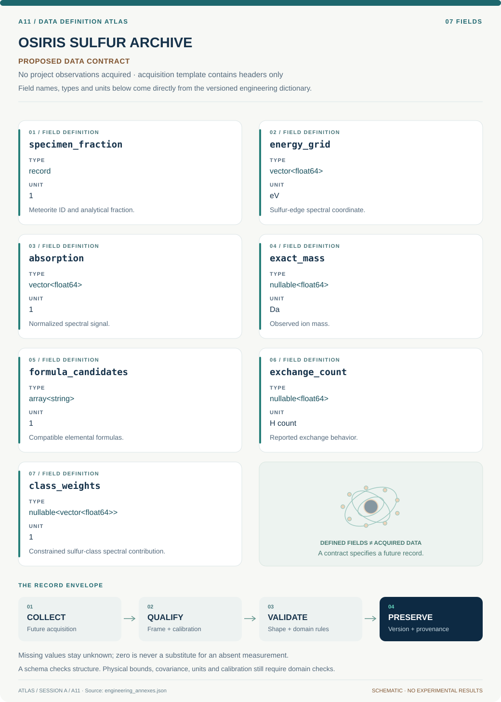

# A11 · Data blueprint

[OSIRIS SULFUR ARCHIVE](../README.md) · [Figure gallery](../figures/README.md) · [Data atlas](../../../../data/README.md)

**PROPOSED CONTRACT · 7 fields · no project observations acquired.** The acquisition CSV contains column headers only. The diagram is a visual record specification, not measured data.

| Download | What it contains |
| --- | --- |
| [Acquisition CSV](acquisition.csv) | Empty columns ready for controlled acquisition |
| [Field dictionary](dictionary.csv) | Names, source types, units, meanings and quality rules |
| [JSON Schema](schema.json) | Nullable record structure with unit and quality metadata |

## Field reference

| Field | Type | Unit | Meaning | Quality / missingness |
| --- | --- | --- | --- | --- |
| specimen_fraction | record | 1 | Meteorite ID and analytical fraction. | Unknown provenance fields null. |
| energy_grid | vector<float64> | eV | Sulfur-edge spectral coordinate. | Calibration reference/version required. |
| absorption | vector<float64> | 1 | Normalized spectral signal. | Normalization region and covariance retained. |
| exact_mass | nullable<float64> | Da | Observed ion mass. | Adduct, charge and error required. |
| formula_candidates | array<string> | 1 | Compatible elemental formulas. | Retain alternatives; no forced unique winner. |
| exchange_count | nullable<float64> | H count | Reported exchange behavior. | Method/context error included; missing null. |
| class_weights | nullable<vector<float64>> | 1 | Constrained sulfur-class spectral contribution. | Sum check; basis and ambiguity flags required. |

## Acquisition and provenance

Null means missing or unknown; record its cause. Preserve product identifier, retrieval timestamp, source hash, calibration, coordinate and time frame, covariance basis, selection rules and every transformation. JSON Schema checks structure; physical bounds and the quality rules above require domain validation.

- [Murchison/Allende organosulfur speciation study](https://pmc.ncbi.nlm.nih.gov/articles/PMC8016918/) — archive or acquisition resource; inclusion here does not assert that its data have been retrieved.
- [GRA 95229 organic-composition study](https://pmc.ncbi.nlm.nih.gov/articles/PMC2268819/) — archive or acquisition resource; inclusion here does not assert that its data have been retrieved.

[Controlled data-management procedure](../../../../engineering/DATA_MANAGEMENT.md)
