# A11 · Figure gallery

[OSIRIS SULFUR ARCHIVE](../README.md) · [Data blueprint](../data/README.md) · [Data diagnostic gallery](../../../../data/figures/README.md)

## Engineering architecture

Spectral and molecular branches combine only through matched specimen context. The output retains nonunique sulfur classes; formulas and isotope context are not treated as direct thiol identification.

[SVG](architecture.svg) · [Editable Mermaid source](architecture.mmd)

## Data blueprint

**Proposed contract · observations pending.** Every field, type, unit and meaning comes from the controlled dictionary. [Open SVG](data-map.svg) · [Download dictionary](../data/dictionary.csv)

## Planned scientific result

Sulfur-edge spectra, molecular-class network, and a matrix of meteorite-by-technique evidence; missing GRA observations are explicit gaps rather than inferred detections.

This final scientific result remains an execution deliverable; the design diagrams do not establish an empirical finding.
