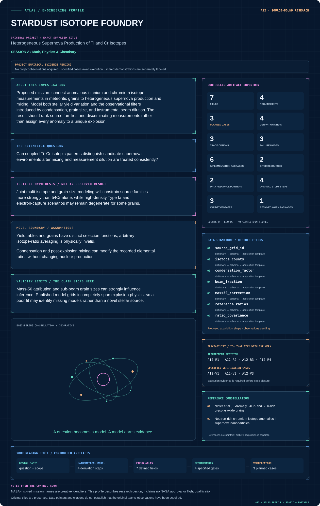

# A12 · STARDUST ISOTOPE FOUNDRY

**Original project:** Heterogeneous Supernova Production of Ti and Cr Isotopes

**Session A:** Math, Physics & Chemistry

**Document class:** engineering research design and analysis record · **Revision:** 4 · **Date:** 2026-10-02

**Evidence state:** design basis, mathematical formulation and verification plan documented. Project-specific empirical results remain to be acquired; executable shared model demonstrations have their own recorded checks.

[Session A](../README.md) · [All projects](../../../ENGINEERING_DOCUMENTATION.md) · [Session handbook](../../../handbooks/SESSION_A.md) · [← A11](../A11-osiris-sulfur-archive/README.md) · [B01 →](../../B/B01-caldera-sentinel-yellowstone-hydrothermal-observatory/README.md)

| Proposed requirements | Specified verification cases | Defined data fields | Cited resources |
| ---: | ---: | ---: | ---: |
| 4 | 3 | 7 | 2 |

[Explore the data blueprint](data/README.md) · [Open the figure gallery](figures/README.md) · [Download acquisition template](data/acquisition.csv) · [Browse the data atlas](../../../data/README.md)

---

## Mission profile



| Profile panel | Engineering signal | Open the evidence |
| --- | --- | --- |
| Mission identity | Heterogeneous Supernova Production of Ti and Cr Isotopes | [Scientific objective](#purpose-and-scientific-objective) |
| Model cockpit | 4 governing expressions; 4 derivation steps; declared assumptions and validity envelope | [Mathematical formulation](#4-mathematical-model-and-derivation) |
| Data blueprint | 7 proposed fields with types, units and quality rules | [Field map & downloads](data/README.md) |
| Verification queue | 4 proposed requirements; 3 specified cases; project execution evidence pending | [Case definitions](#8-verification-and-validation-cases) |
| Figure wall | Architecture, field map, planned result description | [Open full gallery](figures/README.md) |
| Resource library | 2 cited primary resources with support statements | [Cited resources](#12-cited-technical-and-scientific-resources) |

### Model cockpit

**Analysis method:** Ingest published grain isotope tables with errors and source-family yield grids where accessible. Compute isotope-number mixtures and simulate measurement beam dilution. Use hierarchical inference to separate source variation, mixing, and grain-size effects. Compare Type Ia, electron-capture, and core-collapse candidates; report posterior predictive isotope patterns and identify measurements that best break degeneracies. Any new reaction-network calculation requires verified nuclear-rate libraries and conservation tests.

**Operating envelope:** Mass-50 attribution and sub-beam grain sizes can strongly influence inference. Published model grids incompletely span explosion physics, so a poor fit may identify missing models rather than a novel stellar source.

**Variables and conventions**

- Isotope yields, electron fraction Y_e, temperature/density history, mixing fractions, grain size, beam overlap a, and background composition.
- Mass-50 contributions from Ti and Cr, measurement covariance, elemental condensation efficiencies, and normalization conventions.

### Artifact wall


Counts are mixed before ratios and before inference. Beam/background response and mass-fractionation covariance remain visible, preventing ratio averaging or nominal dilution from masquerading as source evidence.

**Scientific result to produce:** Ti–Cr anomaly diagrams with source-yield families, count-space mixing curves, beam-dilution arrows, and grain-size-coded observations; ambiguous mass-50 contributions receive separate symbols.

### Investigation feed · planned work

The feed records proposed work packages. A row becomes executed evidence only with versioned inputs, outputs and a reviewed result.

| Sequence | Evidence state | Engineering work package |
| --- | --- | --- |
| 01 | Planned | Create yield_manifest.json with family, isotope inventory and normalization. |
| 02 | Planned | Build yield_to_counts.py and element_condensation.py. |
| 03 | Planned | Implement beam_count_mixture.py with endpoint/denominator fixtures. |
| 04 | Planned | Create isotope_measurement_adapter.py preserving correction covariance. |
| 05 | Planned | Build source_hierarchy.py and synthetic coverage notebooks. |
| 06 | Planned | Publish predictive_patterns.parquet and an identifiability report distinguishing grid gaps from evidence against models. |

### Mission connections

Connections are reading routes based on actual shared resources, supplied sessions or included illustrations. They do not establish physical dependencies, team collaborations or validated results.

| Connected mission | Original investigation | Recorded connection basis |
| --- | --- | --- |
| [A11 · OSIRIS SULFUR ARCHIVE](../A11-osiris-sulfur-archive/README.md) | Identification of Thiol Function Groups in GRA 95229 and Murchison | Session A |
| [A10 · HUBBLE CARINA CLOCK](../A10-hubble-carina-clock/README.md) | H-beta Analysis of eta Carinae Radial Velocity during Recent Periastron Passages | Session A |
| [A09 · SPITZER RADIO ORIGINS](../A09-spitzer-radio-origins/README.md) | Majority of the Faint (μJy) Radio Source Population Appears Powered by Star Formation, not AGN | Session A |
| [A08 · HELIOS PULSE FORGE](../A08-helios-pulse-forge/README.md) | Nonlinear Laser Pulse Compression with a Multipass Cell | Session A |
| [A07 · ORION CHROMATIN ATLAS](../A07-orion-chromatin-atlas/README.md) | Properties of Chromatin Extracted by Salt Fractionation from a Cancerous and Non-cancerous Esophageal Cell Line | Session A |
| [A06 · APOLLO PORIN INSIGHT](../A06-apollo-porin-insight/README.md) | Purification of the P66 Outer Membrane Protein of the Bacterium Borrelia burgdorferi | Session A |

[Machine-readable connection register and ranking rule](../../../registry/mission_connections.json)

### Reading playlist

| Route | Start here | Continue to |
| --- | --- | --- |
| Understand the idea | [Scientific objective](#purpose-and-scientific-objective) | [Design boundary](#1-design-basis-and-analysis-boundary) → [Mathematics](#4-mathematical-model-and-derivation) |
| Inspect the data | [Visual blueprint](data/README.md) | [Provenance](#5-data-specifications-and-provenance) → [Uncertainty](#6-uncertainty-sensitivity-and-identifiability) |
| Make a design decision | [Trade study](#7-engineering-trade-study) | [Failure modes](#10-failure-modes-and-interpretation-controls) → [Required outputs](#11-required-engineering-outputs) |
| Prepare execution | [Requirements](#2-requirements-and-verification-traceability) | [Verification](#8-verification-and-validation-cases) → [Implementation](#9-implementation-and-reproducible-work-packages) |

## Complete engineering dossier

The profile above is a browsing layer. The full design basis, equations, derivations, data contract, uncertainty, trades and controlled case definitions follow.

## Purpose and scientific objective

Proposed mission: connect anomalous titanium and chromium isotope measurements in meteoritic grains to heterogeneous supernova production and mixing. Model both stellar yield variation and the observational filters introduced by condensation, grain size, and instrumental beam dilution. The result should rank source families and discriminating measurements rather than assign every anomaly to a unique explosion.

**Question:** Can coupled Ti–Cr isotopic patterns distinguish candidate supernova environments after mixing and measurement dilution are treated consistently?

**Testable hypothesis:** Joint multi-isotope and grain-size modeling will constrain source families more strongly than 54Cr alone, while high-density Type Ia and electron-capture scenarios may remain degenerate for some grains.

## 1. Design basis and analysis boundary

The engineering product is a count-consistent isotope-mixture forward model connecting supernova yield grids to grain measurements. The boundary includes explosion-family provenance, elemental condensation selection, denominator-isotope weighting and beam dilution. Model families remain alternatives; a poor fit does not by itself imply a new source.

Begin with published isotope tables and explicitly normalized yield vectors. Mix isotope numbers before forming ratios, then simulate spatial measurement contamination. A reaction network is optional higher fidelity and requires a verified rate library plus baryon/charge bookkeeping. The immediate design decision is which isotope measurements can separate source mixture from dilution and mass-50 interference.

## 2. Requirements and verification traceability

These are project design requirements or proposed analysis gates. A numerical target is not a NASA requirement unless its controlling source is explicitly identified. “TBD” identifies evidence required before a decision; it is not permission to assume a value. Verification evidence listed here is planned, unless a linked result explicitly records execution.

| ID | Requirement / gate | Engineering rationale | Verification method | Basis / required evidence |
| --- | --- | --- | --- | --- |
| A12-R1 | Mixtures shall be formed in isotope-number space, with yield normalization and condensation assumptions documented. | Averaging ratios generally violates physical weighting. | Reconstruct ratios from mixed counts and check endmembers. | Corrected isotope-model contract. |
| A12-R2 | Every mass-50 observation shall retain Ti/Cr attribution and interference uncertainty. | Unresolved contributions can change source interpretation. | Audit correction and alternate interference scenarios. | Existing coupled isotope study. |
| A12-R3 | Beam dilution shall use isotope/element-specific response or state a justified common factor. | Elemental concentrations alter denominator weighting. | Compare full count mixing with ratio approximation. | Measurement-model requirement. |
| A12-R4 | Proposed acceptance: synthetic known-source intervals cover truth at nominal 95% frequency within sampling uncertainty. | Mixture inference should not appear precise under nonidentifiability. | Repeat simulated recovery over source/dilution ensembles. | Proposed calibration target; no measured source result. |

## 3. Architecture and controlled interfaces

A yield adapter converts source-grid outputs to an isotope-number basis per declared ejecta mass. A condensation module scales elemental incorporation separately. A grain/background response model integrates beam overlap and instrumental sensitivity before ratio construction.

The measurement adapter preserves reference ratios, mass-fractionation correction and cross-isotope covariance. A hierarchy fits source-family weights, grain-specific dilution and shared nuisance parameters. Posterior predictive tables return raw counts where available and corrected ratios with the same normalization as observations; unsupported yield-grid regions are marked missing-model domains.


Counts are mixed before ratios and before inference. Beam/background response and mass-fractionation covariance remain visible, preventing ratio averaging or nominal dilution from masquerading as source evidence.

[Editable engineering diagram source](figures/architecture.mmd)

## 4. Mathematical model and derivation

### Governing equations

```text
Y_i^mix=sum_s f_s Y_i,s; f_s>=0 and sum_s f_s=1, for isotope-number yields before forming ratios.
```

```text
R_i/j=Y_i^mix/Y_j^mix; epsilon_i=1e4[(R_i/j)_sample/(R_i/j)_reference-1] after a declared mass-fractionation correction.
```

```text
R_obs approximately a R_grain+(1-a)R_background only when denominator-isotope weighting is appropriate; otherwise mix isotope counts explicitly.
```

```text
dY_i/dt=sum_r nu_i,r lambda_r(T,rho,Y_e) product_k Y_k^(a_k,r), a reaction-network schematic.
```

### Variables, units and conventions

- Isotope yields, electron fraction Y_e, temperature/density history, mixing fractions, grain size, beam overlap a, and background composition.
- Mass-50 contributions from Ti and Cr, measurement covariance, elemental condensation efficiencies, and normalization conventions.

### Assumptions and boundary conditions

- Yield tables and grains have distinct selection functions; arbitrary isotope-ratio averaging is physically invalid.
- Condensation and post-explosion mixing can modify the recorded elemental ratios without changing nuclear production.

### Derivation step 1

$$
N_i^{mix}=\sum_sf_sN_{i,s};\quad f_s\ge0,\ \sum_sf_s=1
$$

Source fractions apply only after endmembers share a stated ejecta-mass basis. Condensation factors may modify elemental counts before mixing with measured background.

### Derivation step 2

$$
R_{i/j}=\frac{\sum_sf_sN_{i,s}}{\sum_sf_sN_{j,s}}
$$

The ratio is nonlinear in source fraction. Ratio averaging is valid only with denominator-isotope weights w_s proportional to f_s N_(j,s), not arbitrary mass weights.

### Derivation step 3

$$
R_{obs}=\frac{aN_{i,g}+(1-a)N_{i,b}}{aN_{j,g}+(1-a)N_{j,b}}
$$

Beam fraction a gives a direct geometric approximation only when response conventions match. Equal denominator counts reduce this to the familiar linear ratio expression.

### Derivation step 4

$$
\epsilon_i=10^4(R_i/R_{ref,i}-1);\quad\Sigma_\epsilon=J\Sigma_NJ^T
$$

Convert corrected ratios to dimensionless epsilon units. The Jacobian carries shared denominators/interference covariance; normalization correction must match the published isotope system.

### Inference or simulation procedure

Ingest published grain isotope tables with errors and source-family yield grids where accessible. Compute isotope-number mixtures and simulate measurement beam dilution. Use hierarchical inference to separate source variation, mixing, and grain-size effects. Compare Type Ia, electron-capture, and core-collapse candidates; report posterior predictive isotope patterns and identify measurements that best break degeneracies. Any new reaction-network calculation requires verified nuclear-rate libraries and conservation tests.

### Validity domain and fidelity limits

Mass-50 attribution and sub-beam grain sizes can strongly influence inference. Published model grids incompletely span explosion physics, so a poor fit may identify missing models rather than a novel stellar source.

## 5. Data specifications and provenance


**Proposed data contract · observations pending.** This visual inventory shows the record fields to acquire or derive. It contains no project measurements. [Open the data blueprint and downloads](data/README.md).

| Field | Type | Unit | Physical / statistical meaning | Quality and missing-data rule |
| --- | --- | --- | --- | --- |
| source_grid_id | string | 1 | Explosion family and yield version. | Mass basis and absent isotopes explicit. |
| isotope_counts | vector<float64> | number per kg ejecta | Endmember yield basis. | Nonnegative; no missing isotope replaced zero. |
| condensation_factor | nullable<vector<float64>> | 1 | Element-specific incorporation hypothesis. | Bounds/provenance required; unknown TBD. |
| beam_fraction | nullable<float64> | 1 | Grain contribution in response model. | Between zero and one; definition recorded. |
| mass50_correction | record | count | Ti/Cr interference attribution. | Joint error retained. |
| reference_ratios | vector<float64> | 1 | Declared isotope standards. | Normalization/fractionation convention required. |
| ratio_covariance | matrix<float64> | 1 | Joint observed ratio uncertainty. | Symmetric positive semidefinite; denominator correlations retained. |

[Machine-readable record schema](data/schema.json) · [Empty acquisition CSV](data/acquisition.csv) · [Field dictionary CSV](data/dictionary.csv)

The CSV above contains column headers only. Its schema defines future records and does not establish that original-team data or a particular archive product have been acquired. Frame, timing, calibration, covariance, selection and provenance details must accompany populated records.

### Presolar oxide Ti/Cr grain study

[Product, archive or reference](https://pmc.ncbi.nlm.nih.gov/articles/PMC6491047/)

**Fields:** Cr isotopic enrichments, mass-50 interpretation, grain sizes, and candidate supernova comparisons.

**Access:** Public manuscript; inspect tables/supplements for numerical values and covariance availability.

**Role:** Primary grain constraint.

### Supernova nanoparticle isotope study

[Product, archive or reference](https://arxiv.org/abs/1007.4016)

**Fields:** Chromium anomalies, grain-host interpretation, and nucleosynthesis comparisons.

**Access:** Public manuscript; raw ion-count images and machine-readable yield grids may need author access.

**Role:** Independent observational/modeling comparison.

## 6. Uncertainty, sensitivity and identifiability

Yield physics, source mixing and condensation efficiency can produce similar patterns. Sub-beam grains and background composition strongly influence anomaly dilution. Reference ratios and mass-fractionation corrections introduce shared systematic covariance, while published source grids incompletely sample explosion conditions.

Profile source fractions jointly with dilution and condensation rather than fixing them at nominal values. Sensitivity singular values identify isotope combinations that actually break degeneracy. Test synthetic grains generated outside the fitted grid family and report model-mismatch flags; an apparently tight posterior inside an inadequate grid is not reliable source identification.

## 7. Engineering trade study

| Alternative | Benefit | Cost / limitation | Decision rule |
| --- | --- | --- | --- |
| Ratio-pattern screening | Fast exploratory comparison. | Incorrect if physical weights ignored. | Use only after count-consistent prediction. |
| Hierarchical mixture/dilution inference | Separates shared source and grain effects. | Degenerate without multiple isotope systems. | Primary approach when covariance and counts support it. |
| New reaction-network calculations | Explores missing source physics. | Rate/library and trajectory uncertainty. | Add only with conserved network fixtures and verified provenance. |

## 8. Verification and validation cases

| Case ID | Stimulus / condition | Expected result / criterion | Method | Evidence artifact |
| --- | --- | --- | --- | --- |
| A12-V1 | Pure source/endmember | f_s=1 reproduces that source's corrected ratios. | Count-space endpoint fixture. | Mixture algebra. |
| A12-V2 | Zero grain contribution | a=0 reproduces background; a=1 reproduces grain. | Beam-model synthetic extremes. | Count mixing identity. |
| A12-V3 | Equal denominator approximation | Linear ratio interpolation agrees only when denominator counts match. | Compare equal and unequal denominator fixtures. | Derived condition; known-source coverage check pending. |

**Execution status:** these cases are specified, not claimed as executed. Close a case only with the versioned inputs, output, uncertainty, reviewer and pass/fail rationale.

### Additional scientific validation gates

- Verify isotope and mass conservation, pure-source limits, and consistency between count-space and ratio-space predictions.
- Inject synthetic grain populations to evaluate source-family recovery and dilution bias.
- Require posterior predictive checks across all available isotopes; disclose when model ranking is driven mainly by priors or unavailable covariance.

## 9. Implementation and reproducible work packages

1. Create yield_manifest.json with family, isotope inventory and normalization.
2. Build yield_to_counts.py and element_condensation.py.
3. Implement beam_count_mixture.py with endpoint/denominator fixtures.
4. Create isotope_measurement_adapter.py preserving correction covariance.
5. Build source_hierarchy.py and synthetic coverage notebooks.
6. Publish predictive_patterns.parquet and an identifiability report distinguishing grid gaps from evidence against models.

### Investigation sequence

1. Define a consistent isotope reference and mass-fractionation convention; retain raw ratios when possible.
2. Compile provenance and covariance for every grain and yield grid; model censored or ambiguous mass-50 measurements.
3. Fit source/mixing/dilution alternatives with positive isotope abundances and physically valid mixture fractions.
4. Produce a prospective NanoSIMS or complementary isotope measurement-priority analysis with qualified collaborators.

### Resources and interfaces to expertise

- Nucleosynthesis specialist, cosmochemistry collaborator, isotope-analysis expertise, Bayesian mixture solver, and curated stellar yield/rate references.

## 10. Failure modes and interpretation controls

| Failure mode | Effect on result | Detection / evidence | Design response |
| --- | --- | --- | --- |
| Ratios averaged directly | Biased source fraction. | Count-space comparison failure. | Mix isotope numbers first. |
| Missing yield treated zero | False isotopic signature. | Yield completeness audit. | Explicit unavailable-model mask. |
| Dilution fixed arbitrarily | Overconfident source assignment. | Source–dilution profile ridge. | Joint fit and additional isotope constraints. |

- Beam dilution can suppress true anomalies; reported ratios may be lower-bound-like measurements.
- Rare-source claims are sensitive to incompletely sampled stellar model families and grain condensation assumptions.

## 11. Required engineering outputs

- Versioned isotope/yield catalog, mixture-and-dilution model, source-family comparison atlas, and prioritized discriminating observations.

### Scientific result figures to produce during execution

Ti–Cr anomaly diagrams with source-yield families, count-space mixing curves, beam-dilution arrows, and grain-size-coded observations; ambiguous mass-50 contributions receive separate symbols.

## 12. Cited technical and scientific resources

- [Nittler et al., Extremely 54Cr- and 50Ti-rich presolar oxide grains](https://pmc.ncbi.nlm.nih.gov/articles/PMC6491047/) — Original coupled isotope observations and rare-supernova interpretation.
- [Neutron-rich chromium isotope anomalies in supernova nanoparticles](https://arxiv.org/abs/1007.4016) — Original measurements connecting anomalous Cr carriers to supernova nucleosynthesis.

Framework and evidence rules: [engineering documentation standard](../../../engineering/ENGINEERING_STANDARD.md), [model assurance](../../../engineering/MODEL_ASSURANCE.md), [uncertainty procedure](../../../engineering/UNCERTAINTY_AND_DECISION_RULES.md), [data management](../../../engineering/DATA_MANAGEMENT.md). NASA-inspired names are creative identifiers; requirements and results are not NASA certification.
