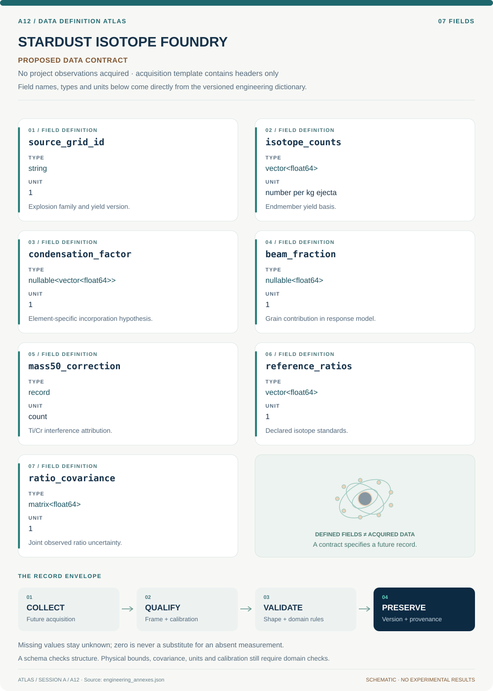

# A12 · Figure gallery

[STARDUST ISOTOPE FOUNDRY](../README.md) · [Data blueprint](../data/README.md) · [Data diagnostic gallery](../../../../data/figures/README.md)

## Engineering architecture

Counts are mixed before ratios and before inference. Beam/background response and mass-fractionation covariance remain visible, preventing ratio averaging or nominal dilution from masquerading as source evidence.

[SVG](architecture.svg) · [Editable Mermaid source](architecture.mmd)

## Data blueprint

**Proposed contract · observations pending.** Every field, type, unit and meaning comes from the controlled dictionary. [Open SVG](data-map.svg) · [Download dictionary](../data/dictionary.csv)

## Planned scientific result

Ti–Cr anomaly diagrams with source-yield families, count-space mixing curves, beam-dilution arrows, and grain-size-coded observations; ambiguous mass-50 contributions receive separate symbols.

This final scientific result remains an execution deliverable; the design diagrams do not establish an empirical finding.
