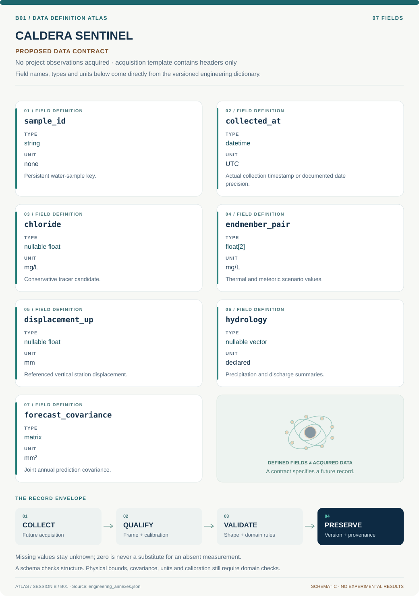

# B01 · Figure gallery

[CALDERA SENTINEL — Yellowstone Hydrothermal Observatory](../README.md) · [Data blueprint](../data/README.md) · [Data diagnostic gallery](../../../../data/figures/README.md)

## Engineering architecture

The diagram identifies separate chemical, geodetic and hydrologic interfaces and the chronological inference boundary. It establishes forecast provenance, while leaving deformation mechanism and volcanic interpretation unresolved.

[SVG](architecture.svg) · [Editable Mermaid source](architecture.mmd)

## Data blueprint

**Proposed contract · observations pending.** Every field, type, unit and meaning comes from the controlled dictionary. [Open SVG](data-map.svg) · [Download dictionary](../data/dictionary.csv)

## Planned scientific result

Linked spring map, chemistry and displacement histories with the held-out period shaded; overlay forecast intervals and hydrology-only residuals.

This final scientific result remains an execution deliverable; the design diagrams do not establish an empirical finding.
