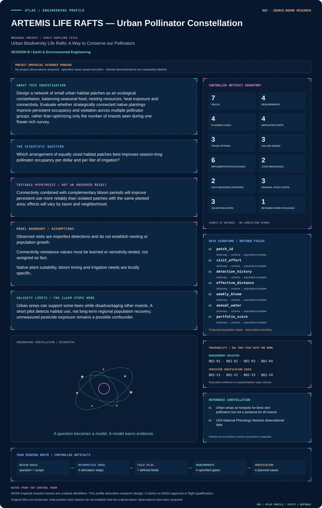
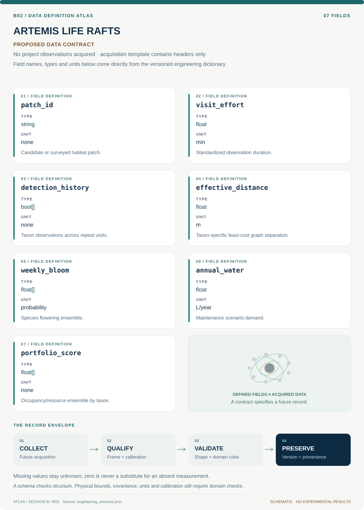

# B02 · ARTEMIS LIFE RAFTS — Urban Pollinator Constellation

**Original project:** Urban Biodiversity Life Rafts: A Way to Conserve our Pollinators

**Session B:** Earth & Environmental Engineering

**Document class:** engineering research design and analysis record · **Revision:** 4 · **Date:** 2026-10-02

**Evidence state:** design basis, mathematical formulation and verification plan documented. Project-specific empirical results remain to be acquired; executable shared model demonstrations have their own recorded checks.

[Session B](../README.md) · [All projects](../../../ENGINEERING_DOCUMENTATION.md) · [Session handbook](../../../handbooks/SESSION_B.md) · [← B01](../B01-caldera-sentinel-yellowstone-hydrothermal-observatory/README.md) · [B03 →](../B03-orion-crossings-gila-monster-road-ecology/README.md)

| Proposed requirements | Specified verification cases | Defined data fields | Cited resources |
| ---: | ---: | ---: | ---: |
| 4 | 4 | 7 | 2 |

[Explore the data blueprint](data/README.md) · [Open the figure gallery](figures/README.md) · [Download acquisition template](data/acquisition.csv) · [Browse the data atlas](../../../data/README.md)

---

## Mission profile



| Profile panel | Engineering signal | Open the evidence |
| --- | --- | --- |
| Mission identity | Urban Biodiversity Life Rafts: A Way to Conserve our Pollinators | [Scientific objective](#purpose-and-scientific-objective) |
| Model cockpit | 3 governing expressions; 4 derivation steps; declared assumptions and validity envelope | [Mathematical formulation](#4-mathematical-model-and-derivation) |
| Data blueprint | 7 proposed fields with types, units and quality rules | [Field map & downloads](data/README.md) |
| Verification queue | 4 proposed requirements; 4 specified cases; project execution evidence pending | [Case definitions](#8-verification-and-validation-cases) |
| Figure wall | Architecture, field map, planned result description | [Open full gallery](figures/README.md) |
| Resource library | 2 cited primary resources with support statements | [Cited resources](#12-cited-technical-and-scientific-resources) |

### Model cockpit

**Analysis method:** Begin with paired existing sites and repeat standardized, nonlethal observations. Stratify by neighborhood heat, imperviousness and surrounding vegetation. Fit detection-corrected occupancy and visitation models, construct taxon-specific connectivity graphs, then compare candidate planting portfolios through robust multiobjective optimization. Use before/after control-impact evaluation for any future installation and include neighborhood access and maintenance feasibility as explicit constraints.

**Operating envelope:** Urban areas can support some bees while disadvantaging other insects. A short pilot detects habitat use, not long-term regional population recovery; unmeasured pesticide exposure remains a possible confounder.

**Variables and conventions**

- d: effective movement distance, m; λ: uncertain dispersal scale, m.
- h_j: calibrated habitat suitability in [0,1], dimensionless; psi: occupancy probability. With lambda>0 and d>=0, p_ij remains in [0,1].
- c: lifecycle cost, USD; q: irrigation demand, L/year.
- B and Q: community-agreed budget and water constraints.

### Artifact wall



The system joins detection-aware habitat use, seasonal resources and taxon-specific connectivity with maintenance constraints. Its portfolio scores describe proposed habitat performance and cannot establish regional population recovery.

**Scientific result to produce:** Show candidate life rafts as nodes sized by resources, connecting uncertain movement pathways; accompany with weekly bloom coverage and costs.

### Investigation feed · planned work

The feed records proposed work packages. A row becomes executed evidence only with versioned inputs, outputs and a reviewed result.

| Sequence | Evidence state | Engineering work package |
| --- | --- | --- |
| 01 | Planned | Define taxon groups, patch boundaries and a community-approved objective/constraint register. |
| 02 | Planned | Create repeat-survey and phenology schemas with explicit effort and missing visits. |
| 03 | Planned | Implement occupancy fitting and posterior checks before constructing connectivity graphs. |
| 04 | Planned | Build resistance ensembles and weekly resource matrices with shared weather scenarios. |
| 05 | Planned | Compare equal-budget baselines and independently verify every optimized portfolio. |
| 06 | Planned | Publish taxon-specific tradeoffs, maintenance inventories and restricted-data export rules. |

### Mission connections

Connections are reading routes based on actual shared resources, supplied sessions or included illustrations. They do not establish physical dependencies, team collaborations or validated results.

| Connected mission | Original investigation | Recorded connection basis |
| --- | --- | --- |
| [B05 · KEPLER BLOOMCLOCK — Restoration Timing Observatory](../B05-kepler-bloomclock-restoration-timing-observatory/README.md) | Phenology Data to Aid Pollinator Restoration | Session B; [USA National Phenology Network observational data](https://nn.usanpn.org/data/observational) |
| [B01 · CALDERA SENTINEL — Yellowstone Hydrothermal Observatory](../B01-caldera-sentinel-yellowstone-hydrothermal-observatory/README.md) | Can Changes in Hot Spring Composition Reflect Decadal-Scale Deformation of the Yellowstone Caldera? | Session B |
| [B03 · ORION CROSSINGS — Gila Monster Road Ecology](../B03-orion-crossings-gila-monster-road-ecology/README.md) | Potential Road Impacts on Gila Monsters in an Urbanizing Environment | Session B |
| [B04 · AURORA VEIL — Ionospheric Absorption Atlas](../B04-aurora-veil-ionospheric-absorption-atlas/README.md) | Analysis of Space-based Riometer Measurement Data for Characterization of Radio Propagation Disturbance in the Ionosphere | Session B |
| [B06 · SOLSTICE CHEMISTRY — Tucson Ozone Digital Observatory](../B06-solstice-chemistry-tucson-ozone-digital-observatory/README.md) | The Contribution of Plants and Pollution to Tucson's Urban Ozone Problem | Session B |
| [B07 · REGENESIS CLEANFLOW — Environmental Fate and Remediation Model](../B07-regenesis-cleanflow-environmental-fate-and-remediation-model/README.md) | Bioremediation of Insensitive Munitions Compounds | Session B |

[Machine-readable connection register and ranking rule](../../../registry/mission_connections.json)

### Reading playlist

| Route | Start here | Continue to |
| --- | --- | --- |
| Understand the idea | [Scientific objective](#purpose-and-scientific-objective) | [Design boundary](#1-design-basis-and-analysis-boundary) → [Mathematics](#4-mathematical-model-and-derivation) |
| Inspect the data | [Visual blueprint](data/README.md) | [Provenance](#5-data-specifications-and-provenance) → [Uncertainty](#6-uncertainty-sensitivity-and-identifiability) |
| Make a design decision | [Trade study](#7-engineering-trade-study) | [Failure modes](#10-failure-modes-and-interpretation-controls) → [Required outputs](#11-required-engineering-outputs) |
| Prepare execution | [Requirements](#2-requirements-and-verification-traceability) | [Verification](#8-verification-and-validation-cases) → [Implementation](#9-implementation-and-reproducible-work-packages) |

## Complete engineering dossier

The profile above is a browsing layer. The full design basis, equations, derivations, data contract, uncertainty, trades and controlled case definitions follow.

## Purpose and scientific objective

Design a network of small urban habitat patches as an ecological constellation, balancing seasonal food, nesting resources, heat exposure and connectivity. Evaluate whether strategically connected native plantings improve persistent occupancy and visitation across multiple pollinator groups, rather than optimizing only the number of insects seen during one flower-rich survey.

**Question:** Which arrangement of equally sized habitat patches best improves season-long pollinator occupancy per dollar and per liter of irrigation?

**Testable hypothesis:** Connectivity combined with complementary bloom periods will improve persistent use more reliably than isolated patches with the same planted area; effects will vary by taxon and neighborhood.

## 1. Design basis and analysis boundary

The design system is a graph of candidate urban habitat patches connected to repeated, nonlethal pollinator observations and local flowering records. Each patch has area, maintenance cost, irrigation demand, heat exposure and nesting-resource descriptors. The decision is which feasible patch portfolio provides persistent resource coverage and connectivity for explicitly named taxa, subject to community-agreed budget and water constraints.

Use detection-corrected occupancy before attributing conservation benefit to raw visit counts. Published urban ecology motivates group-specific responses; proposed dispersal lengths and resistance surfaces remain uncertain hypotheses. The fidelity ladder advances from an unconnected planting baseline to taxon-specific graphs and then robust portfolio optimization. Field installation and long-term population recovery are outside the present computational deliverable.

## 2. Requirements and verification traceability

These are project design requirements or proposed analysis gates. A numerical target is not a NASA requirement unless its controlling source is explicitly identified. “TBD” identifies evidence required before a decision; it is not permission to assume a value. Verification evidence listed here is planned, unless a linked result explicitly records execution.

| ID | Requirement / gate | Engineering rationale | Verification method | Basis / required evidence |
| --- | --- | --- | --- | --- |
| B02-R1 | Each occupancy site-season shall contain repeat-visit histories with effort and weather; proposed minimum is three visits when feasible. | Single observations cannot separate absence and nondetection. | Audit history completeness and sensitivity to fewer visits. | Proposed sampling target. |
| B02-R2 | Candidate portfolios shall satisfy declared lifecycle budget B and annual water cap Q in every accepted scenario. | Plans must be maintainable. | Independent cost/water ledger calculation. | Community constraints TBD. |
| B02-R3 | Bloom-resource coverage shall be resolved by week and by pollinator group. | Seasonal gaps are hidden in annual totals. | Recompute species-week matrix. | Proposed temporal resolution. |
| B02-R4 | Publish raw encounter locations only under site-owner and community permissions; aggregated outputs must pass access review. | Private gardens and vulnerable taxa require governed release. | Inspect export policy and sample maps. | Study governance requirement. |

## 3. Architecture and controlled interfaces

A survey-history table has patch, taxon, visit, duration and binary detection fields; floral counts and observer identities remain separate covariates. Patch geometry uses a locally suitable projected CRS in metres. The graph builder consumes dated imperviousness and vegetation resistance layers and emits nonnegative least-cost distances with taxon-specific uncertainty.

The phenology adapter outputs a species-week resource matrix, with abundance units distinguished from nectar or pollen measurements. Occupancy and detection submodels share survey metadata but have separate parameter sets. The optimizer receives probability ensembles, cost USD and water L/year; a feasibility checker recalculates totals independently. Low-effort or novel habitats propagate abstention flags to portfolio rankings rather than being silently assigned zero habitat value.


The system joins detection-aware habitat use, seasonal resources and taxon-specific connectivity with maintenance constraints. Its portfolio scores describe proposed habitat performance and cannot establish regional population recovery.

[Editable engineering diagram source](figures/architecture.mmd)

## 4. Mathematical model and derivation

### Governing equations

```text
p_ij=exp(−d_ij/λ_s) h_j; d_ij is least-cost distance for taxon s.
```

```text
y_ist∼Bernoulli(ψ_ist p_detect,ist), with separate occupancy and detection models.
```

```text
max_x Σ_s,t W_s ψ_s,t(x) subject to Σ_j c_j x_j≤B and Σ_j q_j x_j≤Q.
```

### Variables, units and conventions

- d: effective movement distance, m; λ: uncertain dispersal scale, m.
- h_j: calibrated habitat suitability in [0,1], dimensionless; psi: occupancy probability. With lambda>0 and d>=0, p_ij remains in [0,1].
- c: lifecycle cost, USD; q: irrigation demand, L/year.
- B and Q: community-agreed budget and water constraints.

### Assumptions and boundary conditions

- Observed visits are imperfect detections and do not establish nesting or population growth.
- Connectivity resistance values must be learned or sensitivity-tested, not assigned as fact.
- Native plant suitability, bloom timing and irrigation needs are locally specific.

### Derivation step 1

```text
y_kt~Bernoulli(z_k p_kt); z_k~Bernoulli(psi_k).
```

Repeated visits reveal detection probability p separately from latent occupancy psi, under the declared within-season closure approximation.

### Derivation step 2

```text
w_ij,s=exp(-d_ij,s/lambda_s) h_j.
```

d and lambda both use metres, and 0<=h<=1 gives bounded edge weights. Resistance scale changes are indistinguishable from lambda unless anchored by movement evidence.

### Derivation step 3

```text
R_s,w(x)=sum_j x_j a_j sum_k n_jk b_kw r_ks.
```

x selects patches, a is area, n is planting density, b is bloom probability and r is taxon-specific resource per plant; their units yield resources/week.

### Derivation step 4

```text
max_x min_theta sum_s,w W_s psi_sw(x,theta), subject to c^T x<=B; q^T x<=Q.
```

The robust objective evaluates uncertain graph and flowering parameters. Taxon weights are declared values, not estimated biological constants.

### Inference or simulation procedure

Begin with paired existing sites and repeat standardized, nonlethal observations. Stratify by neighborhood heat, imperviousness and surrounding vegetation. Fit detection-corrected occupancy and visitation models, construct taxon-specific connectivity graphs, then compare candidate planting portfolios through robust multiobjective optimization. Use before/after control-impact evaluation for any future installation and include neighborhood access and maintenance feasibility as explicit constraints.

### Validity domain and fidelity limits

Urban areas can support some bees while disadvantaging other insects. A short pilot detects habitat use, not long-term regional population recovery; unmeasured pesticide exposure remains a possible confounder.

## 5. Data specifications and provenance



**Proposed data contract · observations pending.** This visual inventory shows the record fields to acquire or derive. It contains no project measurements. [Open the data blueprint and downloads](data/README.md).

| Field | Type | Unit | Physical / statistical meaning | Quality and missing-data rule |
| --- | --- | --- | --- | --- |
| patch_id | string | none | Candidate or surveyed habitat patch. | Persistent boundary version required. |
| visit_effort | float | min | Standardized observation duration. | Zero effort invalid for absence inference. |
| detection_history | bool[] | none | Taxon observations across repeat visits. | Missing visits stored as null. |
| effective_distance | float | m | Taxon-specific least-cost graph separation. | Nonnegative; resistance version required. |
| weekly_bloom | float[] | probability | Species flowering ensemble. | Preserve species/site covariance. |
| annual_water | float | L/year | Maintenance scenario demand. | Identify measured versus assumed demand. |
| portfolio_score | float[] | none | Occupancy/resource ensemble by taxon. | Publish distribution with constraint failures. |

[Machine-readable record schema](data/schema.json) · [Empty acquisition CSV](data/acquisition.csv) · [Field dictionary CSV](data/dictionary.csv)

The CSV above contains column headers only. Its schema defines future records and does not establish that original-team data or a particular archive product have been acquired. Frame, timing, calibration, covariance, selection and provenance details must accompany populated records.

### Urban areas as hotspots for bees and pollination but not a panacea for all insects

[Product, archive or reference](https://www.nature.com/articles/s41467-020-14496-6)

**Fields:** Urbanization gradients, pollinator taxa and primary study methods.

**Access:** Open research paper; original observations depend on its data statement.

**Role:** Prior design and taxon-specific hypotheses.

### USA National Phenology Network observational data

[Product, archive or reference](https://nn.usanpn.org/data/observational)

**Fields:** Flowering phenophases and dated observations for candidate plants.

**Access:** Public observational downloads; species/site coverage is uneven.

**Role:** Seasonal resource coverage; supplement with local plant surveys.

## 6. Uncertainty, sensitivity and identifiability

Detection changes with wind, heat, observer skill and floral density, while occupancy may violate closure through transient visitors. Refit with effort/weather covariates, compare occupancy to visitation endpoints and investigate poorly identified detection probabilities. A patch with abundant flowers may improve observation probability without improving nesting persistence.

Dispersal length, resistance contrast and habitat suitability can compensate for each other in the graph. Sweep plausible scales, inspect rank reversals and evaluate held-out neighborhoods. Correlated drought affects multiple species and irrigation demand simultaneously, so portfolio simulations retain shared weather draws. Report stable selections and alternatives that change under community weight choices.

## 7. Engineering trade study

| Alternative | Benefit | Cost / limitation | Decision rule |
| --- | --- | --- | --- |
| Largest individual patches | Straightforward maintenance and area accounting. | May leave geographic and seasonal gaps. | Use as an equal-budget baseline. |
| Taxon-specific stepping stones | Targets connectivity and complementary blooms. | Sensitive to uncertain dispersal resistance. | Choose when rankings survive scale sweeps. |
| Uniform neighborhood allocation | Improves equitable access and spread. | May reduce predicted ecological score. | Use when agreed distribution constraints require it. |

## 8. Verification and validation cases

| Case ID | Stimulus / condition | Expected result / criterion | Method | Evidence artifact |
| --- | --- | --- | --- | --- |
| B02-V1 | Graph limits | Recover both limits with no negative edges. | Condition/fixture: As d=0, w=h; as d tends to infinity, w tends to zero. Verification procedure: Analytic distance sweep.. | Analytic distance sweep. |
| B02-V2 | Known nondetection | All-zero history probability equals 0.125. | Condition/fixture: Synthetic psi=1 and p=0.5 over three visits. Verification procedure: Exact likelihood comparison.. | Exact likelihood comparison. |
| B02-V3 | Budget boundary | Only portfolios with summed cost at most 100 are feasible. | Condition/fixture: Synthetic costs 40,60,80 USD with B=100. Verification procedure: Exhaustive small-graph enumeration.. | Exhaustive small-graph enumeration. |
| B02-V4 | Neighborhood holdout | Report calibration and rank stability separately by taxon. | Condition/fixture: Reserve complete neighborhoods and survey seasons. Verification procedure: Spatial-temporal holdout evaluation.. | Spatial-temporal holdout evaluation. |

**Execution status:** these cases are specified, not claimed as executed. Close a case only with the versioned inputs, output, uncertainty, reviewer and pass/fail rationale.

### Additional scientific validation gates

- Hold out entire neighborhoods and years; keep repeat visits from a site within the same split.
- Estimate observer agreement, detection probability and identification uncertainty.
- Report occupancy, bloom-gap days, water use and maintenance cost with bootstrap intervals and a no-intervention comparator.

## 9. Implementation and reproducible work packages

1. Define taxon groups, patch boundaries and a community-approved objective/constraint register.
2. Create repeat-survey and phenology schemas with explicit effort and missing visits.
3. Implement occupancy fitting and posterior checks before constructing connectivity graphs.
4. Build resistance ensembles and weekly resource matrices with shared weather scenarios.
5. Compare equal-budget baselines and independently verify every optimized portfolio.
6. Publish taxon-specific tradeoffs, maintenance inventories and restricted-data export rules.

### Investigation sequence

1. Stage 1: map existing patches, recruit stewards, define taxa and survey effort, and preregister occupancy and resource-continuity endpoints.
2. Stage 2: fit baseline ecological networks and produce equal-area, equal-budget planting alternatives with drought sensitivity.
3. Stage 3: evaluate phased installations against matched controls across at least two flowering seasons; update the portfolio using observed maintenance costs.

### Resources and interfaces to expertise

- Local restoration botanist, entomologist and community stewards.
- QGIS, network optimization and accessible observation forms; photographs for identification review.

## 10. Failure modes and interpretation controls

| Failure mode | Effect on result | Detection / evidence | Design response |
| --- | --- | --- | --- |
| Visit counts treated as abundance | False recovery claim. | Mismatch between encounter and demographic endpoints. | Label endpoints and fit detection. |
| Water estimates omit establishment | Infeasible planting portfolio. | Audit first-year versus mature demand. | Include lifecycle scenarios. |
| Resistance map dominates outcome | Arbitrary corridor recommendations. | Large ranking changes across scales. | Publish robust alternatives and data priorities. |

- Unreliable maintenance or irrigation during extreme heat.
- Taxonomic misidentification and volunteer sampling imbalance.
- Unequal neighborhood access and displacement of existing habitat.

## 11. Required engineering outputs

- Habitat-network map and seasonal flowering calendar.
- Budget/water Pareto frontier and implementation shortlist.
- Detection-corrected monitoring dataset and public stewardship guide.

### Scientific result figures to produce during execution

Show candidate life rafts as nodes sized by resources, connecting uncertain movement pathways; accompany with weekly bloom coverage and costs.

## 12. Cited technical and scientific resources

- [Urban areas as hotspots for bees and pollination but not a panacea for all insects](https://www.nature.com/articles/s41467-020-14496-6) — Primary urban ecology study motivates taxon-specific assessment of urban habitat value.
- [USA National Phenology Network observational data](https://nn.usanpn.org/data/observational) — Observed plant and animal phenophases and observation documentation; provides timing records, not automatic pollinator abundance estimates.

Framework and evidence rules: [engineering documentation standard](../../../engineering/ENGINEERING_STANDARD.md), [model assurance](../../../engineering/MODEL_ASSURANCE.md), [uncertainty procedure](../../../engineering/UNCERTAINTY_AND_DECISION_RULES.md), [data management](../../../engineering/DATA_MANAGEMENT.md). NASA-inspired names are creative identifiers; requirements and results are not NASA certification.
