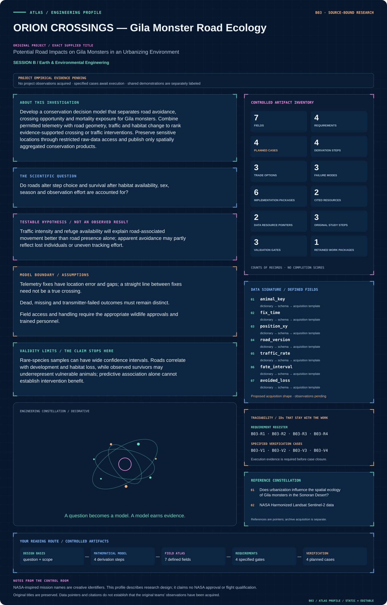

# B03 · ORION CROSSINGS — Gila Monster Road Ecology

**Original project:** Potential Road Impacts on Gila Monsters in an Urbanizing Environment

**Session B:** Earth & Environmental Engineering

**Document class:** engineering research design and analysis record · **Revision:** 4 · **Date:** 2026-10-02

**Evidence state:** design basis, mathematical formulation and verification plan documented. Project-specific empirical results remain to be acquired; executable shared model demonstrations have their own recorded checks.

[Session B](../README.md) · [All projects](../../../ENGINEERING_DOCUMENTATION.md) · [Session handbook](../../../handbooks/SESSION_B.md) · [← B02](../B02-artemis-life-rafts-urban-pollinator-constellation/README.md) · [B04 →](../B04-aurora-veil-ionospheric-absorption-atlas/README.md)

| Proposed requirements | Specified verification cases | Defined data fields | Cited resources |
| ---: | ---: | ---: | ---: |
| 4 | 4 | 7 | 2 |

[Explore the data blueprint](data/README.md) · [Open the figure gallery](figures/README.md) · [Download acquisition template](data/acquisition.csv) · [Browse the data atlas](../../../data/README.md)

---

## Mission profile



| Profile panel | Engineering signal | Open the evidence |
| --- | --- | --- |
| Mission identity | Potential Road Impacts on Gila Monsters in an Urbanizing Environment | [Scientific objective](#purpose-and-scientific-objective) |
| Model cockpit | 3 governing expressions; 4 derivation steps; declared assumptions and validity envelope | [Mathematical formulation](#4-mathematical-model-and-derivation) |
| Data blueprint | 7 proposed fields with types, units and quality rules | [Field map & downloads](data/README.md) |
| Verification queue | 4 proposed requirements; 4 specified cases; project execution evidence pending | [Case definitions](#8-verification-and-validation-cases) |
| Figure wall | Architecture, field map, planned result description | [Open full gallery](figures/README.md) |
| Resource library | 2 cited primary resources with support statements | [Cited resources](#12-cited-technical-and-scientific-resources) |

### Model cockpit

**Analysis method:** Map changes in road network and vegetation, then use integrated step-selection models with matched available steps generated from each animal’s movement distribution. Jointly model detection and censoring where possible; use proximity to roads, traffic seasonality and refuge cover rather than a single urban/rural label. Rank mitigation alternatives through scenario analysis and explicitly display when the available data cannot distinguish attraction, avoidance or increased mortality.

**Operating envelope:** Rare-species samples can have wide confidence intervals. Roads correlate with development and habitat loss, while observed survivors may underrepresent vulnerable animals; predictive association alone cannot establish intervention benefit.

**Variables and conventions**

- X: distance to roads/refuges, m, and traffic covariates, vehicles/day.
- Z: individual traits, weather and recent crossing exposure.
- H: mortality hazard, day⁻¹; crossing probabilities are dimensionless.
- Benefit: expected avoided losses over a stated time horizon.

### Artifact wall


The diagram preserves movement, exposure and survival as separate evidence paths and shows where restricted tracks enter the analysis. It does not turn uncertain telemetry intersections into confirmed road crossings.

**Scientific result to produce:** Publish generalized habitat corridors and risk intervals; keep individual paths and refuge coordinates in access-controlled layers.

### Investigation feed · planned work

The feed records proposed work packages. A row becomes executed evidence only with versioned inputs, outputs and a reviewed result.

| Sequence | Evidence state | Engineering work package |
| --- | --- | --- |
| 01 | Planned | Create a restricted-data manifest and approved public aggregation specification. |
| 02 | Planned | Implement temporal GIS joins, coordinate checks and location-error propagation. |
| 03 | Planned | Produce encounter probability layers with observed/plausible/unresolved evidence classes. |
| 04 | Planned | Build matched-step datasets and individual-level validation splits. |
| 05 | Planned | Fit survival only after fate and event-count adequacy review. |
| 06 | Planned | Release scenario benefit distributions, limitations and an independently checked mitigation ledger. |

### Mission connections

Connections are reading routes based on actual shared resources, supplied sessions or included illustrations. They do not establish physical dependencies, team collaborations or validated results.

| Connected mission | Original investigation | Recorded connection basis |
| --- | --- | --- |
| [B08 · TERRAFORM TERRACES — Dryland Conservation Observatory](../B08-terraform-terraces-dryland-conservation-observatory/README.md) | The Influence of Conservation Structures on Rangeland Vegetation Patterns | Session B; [NASA Harmonized Landsat Sentinel-2 data](https://hls.gsfc.nasa.gov/hls-data/) |
| [B10 · LANDSAT EQUITY — Community Canopy Mission](../B10-landsat-equity-community-canopy-mission/README.md) | Using Remote Sensing to Determine Vegetation Change and Impacts to Communities | Session B; [NASA Harmonized Landsat Sentinel-2 data](https://hls.gsfc.nasa.gov/hls-data/) |
| [B24 · VIPER VOYAGER — Urban Movement and Habitat Connectivity](../B24-viper-voyager-urban-movement-and-habitat-connectivity/README.md) | Using GIS to Quantify Effects of Land Cover Change on Movement Patterns of Tiger Rattlesnakes in an Urbanizing Environment | Session B; [NASA Harmonized Landsat Sentinel-2 data](https://hls.gsfc.nasa.gov/hls-data/) |
| [B02 · ARTEMIS LIFE RAFTS — Urban Pollinator Constellation](../B02-artemis-life-rafts-urban-pollinator-constellation/README.md) | Urban Biodiversity Life Rafts: A Way to Conserve our Pollinators | Session B |
| [B04 · AURORA VEIL — Ionospheric Absorption Atlas](../B04-aurora-veil-ionospheric-absorption-atlas/README.md) | Analysis of Space-based Riometer Measurement Data for Characterization of Radio Propagation Disturbance in the Ionosphere | Session B |
| [B01 · CALDERA SENTINEL — Yellowstone Hydrothermal Observatory](../B01-caldera-sentinel-yellowstone-hydrothermal-observatory/README.md) | Can Changes in Hot Spring Composition Reflect Decadal-Scale Deformation of the Yellowstone Caldera? | Session B |

[Machine-readable connection register and ranking rule](../../../registry/mission_connections.json)

### Reading playlist

| Route | Start here | Continue to |
| --- | --- | --- |
| Understand the idea | [Scientific objective](#purpose-and-scientific-objective) | [Design boundary](#1-design-basis-and-analysis-boundary) → [Mathematics](#4-mathematical-model-and-derivation) |
| Inspect the data | [Visual blueprint](data/README.md) | [Provenance](#5-data-specifications-and-provenance) → [Uncertainty](#6-uncertainty-sensitivity-and-identifiability) |
| Make a design decision | [Trade study](#7-engineering-trade-study) | [Failure modes](#10-failure-modes-and-interpretation-controls) → [Required outputs](#11-required-engineering-outputs) |
| Prepare execution | [Requirements](#2-requirements-and-verification-traceability) | [Verification](#8-verification-and-validation-cases) → [Implementation](#9-implementation-and-reproducible-work-packages) |

## Complete engineering dossier

The profile above is a browsing layer. The full design basis, equations, derivations, data contract, uncertainty, trades and controlled case definitions follow.

## Purpose and scientific objective

Develop a conservation decision model that separates road avoidance, crossing opportunity and mortality exposure for Gila monsters. Combine permitted telemetry with road geometry, traffic and habitat change to rank evidence-supported crossing or traffic interventions. Preserve sensitive locations through restricted raw-data access and publish only spatially aggregated conservation products.

**Question:** Do roads alter step choice and survival after habitat availability, sex, season and observation effort are accounted for?

**Testable hypothesis:** Traffic intensity and refuge availability will explain road-associated movement better than road presence alone; apparent avoidance may partly reflect lost individuals or uneven tracking effort.

## 1. Design basis and analysis boundary

The conservation model consumes authorized Gila monster telemetry, individual fate records, dated road geometry, traffic and habitat covariates. It separates three questions: whether an animal approaches a road, whether a crossing is plausible at the available fix cadence, and whether road exposure predicts mortality. Intervention rankings remain conditional estimates, because a track from a surviving individual is not a randomized road-mitigation experiment.

Start with location-error-aware road encounters and descriptive movement summaries. Promote to integrated step selection and interval-censored survival only when sample size and fate resolution permit. Literature supplies the Sonoran Desert study context; traffic-reduction and crossing scenarios are proposed decisions with uncertain benefit. Precise refuges and tracks remain restricted, while public outputs use approved aggregation.

## 2. Requirements and verification traceability

These are project design requirements or proposed analysis gates. A numerical target is not a NASA requirement unless its controlling source is explicitly identified. “TBD” identifies evidence required before a decision; it is not permission to assume a value. Verification evidence listed here is planned, unless a linked result explicitly records execution.

| ID | Requirement / gate | Engineering rationale | Verification method | Basis / required evidence |
| --- | --- | --- | --- | --- |
| B03-R1 | Every fix shall retain timestamp, coordinate reference, location uncertainty and transmitter status. | Straight lines between uncertain fixes can invent crossings. | Check metadata and reconstruct uncertainty buffers. | Authorized telemetry contract. |
| B03-R2 | Classify crossing evidence as observed, plausible or unresolved; no unresolved interval shall count as a confirmed crossing. | Avoid false precision from sparse cadence. | Review trajectory-road intersections across error draws. | Proposed evidence classes. |
| B03-R3 | Movement validation shall hold out complete individuals; mortality evaluation shall preserve interval censoring. | Repeated fixes are not independent animals. | Audit split and likelihood construction. | Proposed inference protocol. |
| B03-R4 | Exported maps shall omit precise refuges and individual identifiers and obey investigator-approved spatial suppression. | Protect vulnerable wildlife and private sites. | Inspect generated release layers. | Access agreement required. |

## 3. Architecture and controlled interfaces

The telemetry adapter produces individual-keyed positions in projected metres and times in UTC, with 2x2 horizontal covariance. Road segments carry installation dates, width and traffic units vehicles/day. A temporal join prevents modern roads from being assigned to older animal movements. Fate records distinguish confirmed death, last detection, lost transmitter and study end.

The encounter module generates location and path ensembles before labeling road proximity. Matched available steps come from an individual's movement distribution and form conditional choice strata; survival consumes exposure aggregated over documented intervals. The scenario engine modifies traffic or crossing opportunity without changing the underlying landscape arbitrarily. Missing transmitters propagate censoring rather than mortality, and the release layer applies governed spatial aggregation.


The diagram preserves movement, exposure and survival as separate evidence paths and shows where restricted tracks enter the analysis. It does not turn uncertain telemetry intersections into confirmed road crossings.

[Editable engineering diagram source](figures/architecture.mmd)

## 4. Mathematical model and derivation

### Governing equations

```text
P(step k chosen)=exp(βᵀ X_k)/Σ_j exp(βᵀ X_j).
```

```text
H_i(t)=H_0(t) exp(γᵀ Z_i(t)), with time-varying exposure and interval-censored survival.
```

```text
Expected benefit_j=Σ_i P(encounter_ij) ΔP(survival_ij)−uncertainty penalty_j.
```

### Variables, units and conventions

- X: distance to roads/refuges, m, and traffic covariates, vehicles/day.
- Z: individual traits, weather and recent crossing exposure.
- H: mortality hazard, day⁻¹; crossing probabilities are dimensionless.
- Benefit: expected avoided losses over a stated time horizon.

### Assumptions and boundary conditions

- Telemetry fixes have location error and gaps; a straight line between fixes need not be a true crossing.
- Dead, missing and transmitter-failed outcomes must remain distinct.
- Field access and handling require the appropriate wildlife approvals and trained personnel.

### Derivation step 1

```text
L_k=norm(s_(k+1)-s_k); theta_k=angle(v_(k-1),v_k).
```

Length uses metres and turning angle radians. Their availability distributions must account for cadence and uncertainty before sampling alternative steps.

### Derivation step 2

```text
P(k chosen)=exp(beta^T X_k)/sum_j exp(beta^T X_j).
```

Matched steps within one stratum share a starting fix; road distance scaling fixes coefficient units and prevents comparison of unmatched movements.

### Derivation step 3

```text
S(t)=exp(-integral_0^t h_0(u)exp(gamma^T Z(u))du).
```

Hazard has day^-1 units; an interval-censored death contributes S(t_left)-S(t_right), while transmitter failure contributes a distinct censoring process.

### Derivation step 4

```text
B_j=sum_i P(encounter_ij)[S_i,j(T)-S_i,base(T)].
```

Benefit is expected avoided losses over horizon T. It is a scenario contrast with propagated exposure and hazard uncertainty, not a measured mitigation effect.

### Inference or simulation procedure

Map changes in road network and vegetation, then use integrated step-selection models with matched available steps generated from each animal’s movement distribution. Jointly model detection and censoring where possible; use proximity to roads, traffic seasonality and refuge cover rather than a single urban/rural label. Rank mitigation alternatives through scenario analysis and explicitly display when the available data cannot distinguish attraction, avoidance or increased mortality.

### Validity domain and fidelity limits

Rare-species samples can have wide confidence intervals. Roads correlate with development and habitat loss, while observed survivors may underrepresent vulnerable animals; predictive association alone cannot establish intervention benefit.

## 5. Data specifications and provenance


**Proposed data contract · observations pending.** This visual inventory shows the record fields to acquire or derive. It contains no project measurements. [Open the data blueprint and downloads](data/README.md).

| Field | Type | Unit | Physical / statistical meaning | Quality and missing-data rule |
| --- | --- | --- | --- | --- |
| animal_key | restricted string | none | Pseudonymous individual identity. | Never exported with precise tracks. |
| fix_time | datetime | UTC | Observation timestamp. | Sorted; cadence gaps explicit. |
| position_xy | float[2] | m | Projected telemetry coordinate. | CRS and covariance required. |
| road_version | string | none | Geometry and effective-date key. | No future road assigned. |
| traffic_rate | nullable float | vehicles/day | Observed or scenario traffic. | Separate measurements from assumptions. |
| fate_interval | nullable datetime[2] | UTC | Bounds of confirmed event or censoring. | Death and transmitter loss distinct. |
| avoided_loss | float[] | animals | Intervention benefit ensemble. | Include zero/negative outcomes and horizon. |

[Machine-readable record schema](data/schema.json) · [Empty acquisition CSV](data/acquisition.csv) · [Field dictionary CSV](data/dictionary.csv)

The CSV above contains column headers only. Its schema defines future records and does not establish that original-team data or a particular archive product have been acquired. Frame, timing, calibration, covariance, selection and provenance details must accompany populated records.

### Does urbanization influence the spatial ecology of Gila monsters in the Sonoran Desert?

[Product, archive or reference](https://pubs.usgs.gov/publication/70032684)

**Fields:** Primary study movement/home-range metrics and urban context.

**Access:** USGS publication record; raw telemetry is not guaranteed public.

**Role:** Literature benchmark and study-design assumptions.

### NASA Harmonized Landsat Sentinel-2 data

[Product, archive or reference](https://hls.gsfc.nasa.gov/hls-data/)

**Fields:** Surface reflectance, quality flags and vegetation history.

**Access:** Public NASA data; Earthdata access may be required.

**Role:** Habitat-change covariates, supplemented by local road/traffic records.

## 6. Uncertainty, sensitivity and identifiability

Location error, long intervals and unknown tortuous paths make crossing counts uncertain. Resample positions from their documented covariance and compare interpolation assumptions; reject inferred routes that depend entirely on one arbitrary path. Traffic and development are correlated, so road coefficients cannot automatically be interpreted as causal mortality effects.

Road avoidance, low encounter frequency and selective disappearance can produce similar observed tracks. Profile road-distance and traffic effects, use animal-level bootstrap intervals and evaluate sensitivity to informative censoring. If deaths are too rare, retain descriptive exposure and a wide scenario benefit range rather than fit an unstable survival model. Conservation priorities should expose this limitation.

## 7. Engineering trade study

| Alternative | Benefit | Cost / limitation | Decision rule |
| --- | --- | --- | --- |
| Encounter-only mapping | Works with sparse movement and no death records. | Cannot estimate mortality benefit. | Use when fate evidence is inadequate. |
| Joint step and survival models | Connects behavior with exposure and outcomes. | Rare events and censoring weaken identification. | Adopt when independent fate data support it. |
| Traffic/crossing scenario screening | Compares practical mitigations. | Effectiveness inputs may be literature assumptions. | Rank only outcomes stable across effectiveness ranges. |

## 8. Verification and validation cases

| Case ID | Stimulus / condition | Expected result / criterion | Method | Evidence artifact |
| --- | --- | --- | --- | --- |
| B03-V1 | Symmetric choices | Each probability is 0.5. | Condition/fixture: Two available steps have equal covariates. Verification procedure: Exact conditional-likelihood check.. | Exact conditional-likelihood check. |
| B03-V2 | Zero hazard | S(T)=1 and no modeled road-attributable loss. | Condition/fixture: Set h_0=0 for a synthetic individual. Verification procedure: Analytic survival fixture.. | Analytic survival fixture. |
| B03-V3 | Uncertain road intersection | Output plausible/unresolved probability; never a guaranteed crossing. | Condition/fixture: Two fixes straddle a road with broad covariance. Verification procedure: Monte Carlo path integration.. | Monte Carlo path integration. |
| B03-V4 | Animal holdout | Report step calibration and fate predictions without shared-individual leakage. | Condition/fixture: Reserve all fixes from selected individuals. Verification procedure: Blocked evaluation.. | Blocked evaluation. |

**Execution status:** these cases are specified, not claimed as executed. Close a case only with the versioned inputs, output, uncertainty, reviewer and pass/fail rationale.

### Additional scientific validation gates

- Hold out animals and geographic areas; do not split neighboring fixes randomly.
- Validate inferred crossings against sufficiently resolved fixes or independently permitted field observations.
- Use simulations to measure bias from missing fixes and transmitter failure; report confidence intervals and failed identification cases.

## 9. Implementation and reproducible work packages

1. Create a restricted-data manifest and approved public aggregation specification.
2. Implement temporal GIS joins, coordinate checks and location-error propagation.
3. Produce encounter probability layers with observed/plausible/unresolved evidence classes.
4. Build matched-step datasets and individual-level validation splits.
5. Fit survival only after fate and event-count adequacy review.
6. Release scenario benefit distributions, limitations and an independently checked mitigation ledger.

### Investigation sequence

1. Stage 1: secure authorized telemetry access, inventory road/traffic histories, and assess whether the number of independently observed animals supports the intended effect size.
2. Stage 2: fit movement and survival models with explicit location and censoring uncertainty; compare simple road-presence and traffic-aware hypotheses.
3. Stage 3: produce confidential mitigation scenarios and test prospective before/after crossing observations at selected locations.

### Resources and interfaces to expertise

- Wildlife biologist, GIS analyst and transportation partner.
- Restricted telemetry repository; movement-model software and local traffic counts.

## 10. Failure modes and interpretation controls

| Failure mode | Effect on result | Detection / evidence | Design response |
| --- | --- | --- | --- |
| Lost transmitter coded dead | Inflated road hazard. | Compare fate evidence with field notes. | Use separate censoring status. |
| Modern roads joined retrospectively | False development exposure. | Check road effective dates. | Versioned temporal GIS joins. |
| Sensitive map release | Wildlife disturbance risk. | Export audit against restricted fields. | Aggregate and suppress locations. |

- Protected-species disturbance or exposure of precise refuge locations.
- Small sample size and unrecorded road mortality.
- Mitigation effects inferred outside the observed traffic range.

## 11. Required engineering outputs

- Road-risk and refuge-connectivity models.
- Aggregated mitigation priority map with uncertainty.
- Data-governance plan and monitoring design.

### Scientific result figures to produce during execution

Publish generalized habitat corridors and risk intervals; keep individual paths and refuge coordinates in access-controlled layers.

## 12. Cited technical and scientific resources

- [Does urbanization influence the spatial ecology of Gila monsters in the Sonoran Desert?](https://pubs.usgs.gov/publication/70032684) — Primary telemetry study supports movement and urbanization questions without proving a universal road mortality effect.
- [NASA Harmonized Landsat Sentinel-2 data](https://hls.gsfc.nasa.gov/hls-data/) — Surface reflectance and quality layers support reproducible landscape and vegetation monitoring.

Framework and evidence rules: [engineering documentation standard](../../../engineering/ENGINEERING_STANDARD.md), [model assurance](../../../engineering/MODEL_ASSURANCE.md), [uncertainty procedure](../../../engineering/UNCERTAINTY_AND_DECISION_RULES.md), [data management](../../../engineering/DATA_MANAGEMENT.md). NASA-inspired names are creative identifiers; requirements and results are not NASA certification.
