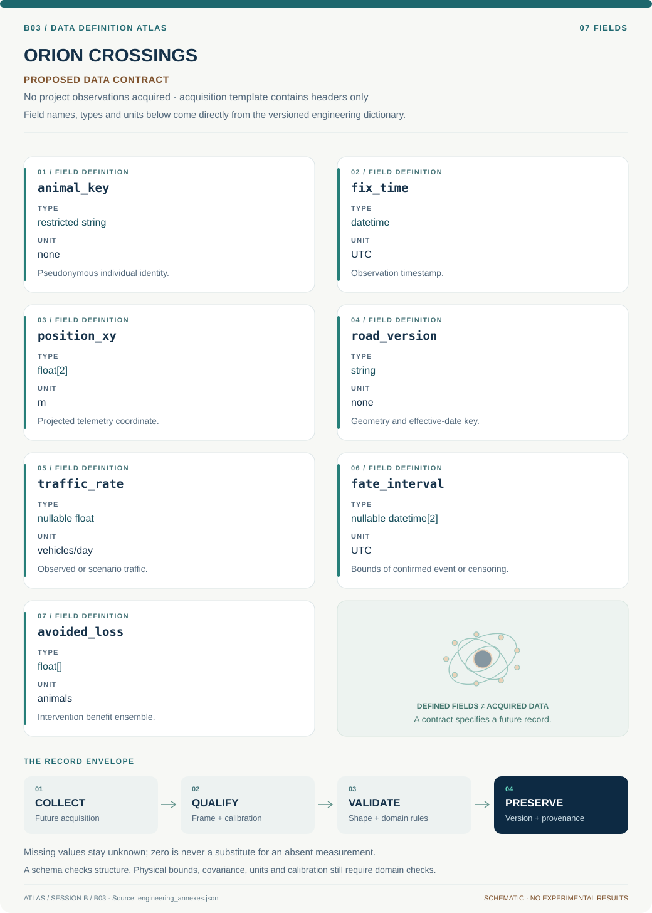

# B03 · Figure gallery

[ORION CROSSINGS — Gila Monster Road Ecology](../README.md) · [Data blueprint](../data/README.md) · [Data diagnostic gallery](../../../../data/figures/README.md)

## Engineering architecture

The diagram preserves movement, exposure and survival as separate evidence paths and shows where restricted tracks enter the analysis. It does not turn uncertain telemetry intersections into confirmed road crossings.

[SVG](architecture.svg) · [Editable Mermaid source](architecture.mmd)

## Data blueprint

**Proposed contract · observations pending.** Every field, type, unit and meaning comes from the controlled dictionary. [Open SVG](data-map.svg) · [Download dictionary](../data/dictionary.csv)

## Planned scientific result

Publish generalized habitat corridors and risk intervals; keep individual paths and refuge coordinates in access-controlled layers.

This final scientific result remains an execution deliverable; the design diagrams do not establish an empirical finding.
