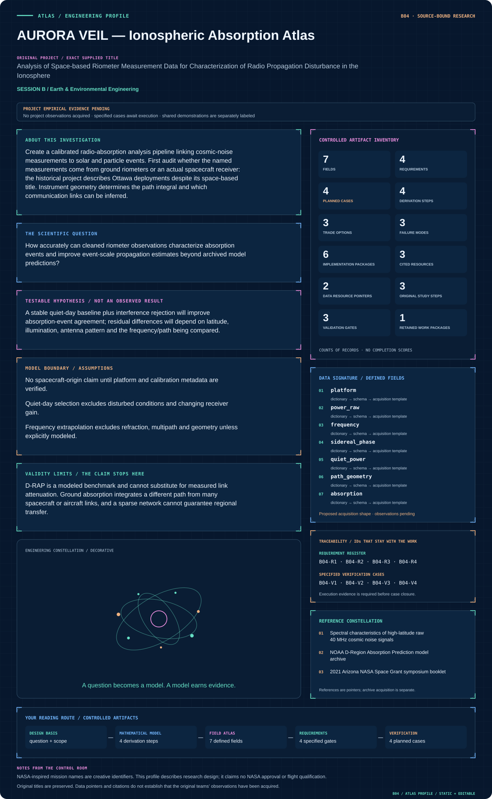

# B04 · AURORA VEIL — Ionospheric Absorption Atlas

**Original project:** Analysis of Space-based Riometer Measurement Data for Characterization of Radio Propagation Disturbance in the Ionosphere

**Session B:** Earth & Environmental Engineering

**Document class:** engineering research design and analysis record · **Revision:** 4 · **Date:** 2026-10-02

**Evidence state:** design basis, mathematical formulation and verification plan documented. Project-specific empirical results remain to be acquired; executable shared model demonstrations have their own recorded checks.

[Session B](../README.md) · [All projects](../../../ENGINEERING_DOCUMENTATION.md) · [Session handbook](../../../handbooks/SESSION_B.md) · [← B03](../B03-orion-crossings-gila-monster-road-ecology/README.md) · [B05 →](../B05-kepler-bloomclock-restoration-timing-observatory/README.md)

| Proposed requirements | Specified verification cases | Defined data fields | Cited resources |
| ---: | ---: | ---: | ---: |
| 4 | 4 | 7 | 3 |

[Explore the data blueprint](data/README.md) · [Open the figure gallery](figures/README.md) · [Download acquisition template](data/acquisition.csv) · [Browse the data atlas](../../../data/README.md)

---

## Mission profile



| Profile panel | Engineering signal | Open the evidence |
| --- | --- | --- |
| Mission identity | Analysis of Space-based Riometer Measurement Data for Characterization of Radio Propagation Disturbance in the Ionosphere | [Scientific objective](#purpose-and-scientific-objective) |
| Model cockpit | 3 governing expressions; 4 derivation steps; declared assumptions and validity envelope | [Mathematical formulation](#4-mathematical-model-and-derivation) |
| Data blueprint | 7 proposed fields with types, units and quality rules | [Field map & downloads](data/README.md) |
| Verification queue | 4 proposed requirements; 4 specified cases; project execution evidence pending | [Case definitions](#8-verification-and-validation-cases) |
| Figure wall | Architecture, field map, planned result description | [Open full gallery](figures/README.md) |
| Resource library | 3 cited primary resources with support statements | [Cited resources](#12-cited-technical-and-scientific-resources) |

### Model cockpit

**Analysis method:** Reconstruct receiver gain history and sidereal baselines using clean intervals; flag narrowband interference and saturation before calculating absorption. Align events with NOAA solar/particle records, then compare observed event peaks, durations and timing with D-RAP. Fit a constrained event model and evaluate latitude/daylight interactions. Forward-model antenna and ray-path weighting for any spacecraft case rather than copying ground-riometer assumptions.

**Operating envelope:** D-RAP is a modeled benchmark and cannot substitute for measured link attenuation. Ground absorption integrates a different path from many spacecraft or aircraft links, and a sparse network cannot guarantee regional transfer.

**Variables and conventions**

- P: calibrated receiver power, W or consistent relative units.
- n_e: electron density, m⁻³; ν_en: collision frequency, s⁻¹.
- f: frequency, Hz; s: propagation-path length, m.
- A: absorption, dB; quiet-day baseline is sidereal-time dependent.

### Artifact wall


The architecture makes instrument power, platform geometry and modeled event comparisons explicit. The spacecraft branch is conditional on verified metadata, and no ground measurement is automatically interpreted as spacecraft-link attenuation.

**Scientific result to produce:** Display raw/clean receiver power, quiet-day baseline, absorption and D-RAP event comparisons; annotate instrument location and path geometry.

### Investigation feed · planned work

The feed records proposed work packages. A row becomes executed evidence only with versioned inputs, outputs and a reviewed result.

| Sequence | Evidence state | Engineering work package |
| --- | --- | --- |
| 01 | Planned | Create a platform/frequency/antenna/gain inventory with unresolved metadata entries. |
| 02 | Planned | Implement UTC-to-sidereal conversion and receiver calibration checks. |
| 03 | Planned | Construct clean-day ensembles and save baseline covariance artifacts. |
| 04 | Planned | Compute flagged power-ratio absorption before joining event comparators. |
| 05 | Planned | Implement conditional path/frequency sensitivity notebooks with explicit validity masks. |
| 06 | Planned | Publish instrument-level events and a geometry-limited interpretation report. |

### Mission connections

Connections are reading routes based on actual shared resources, supplied sessions or included illustrations. They do not establish physical dependencies, team collaborations or validated results.

| Connected mission | Original investigation | Recorded connection basis |
| --- | --- | --- |
| [B14 · PHOENIX INFILTRATION — Postfire Soil Recovery Observatory](../B14-phoenix-infiltration-postfire-soil-recovery-observatory/README.md) | Soil hydraulic properties three years after the Frye Fire on Mount Graham, Arizona | Session B; [2021 Arizona NASA Space Grant symposium booklet](https://spacegrant.arizona.edu/sites/spacegrant.arizona.edu/files/AZSGC%20Symposium%20Booklet%202021_website.pdf) |
| [B03 · ORION CROSSINGS — Gila Monster Road Ecology](../B03-orion-crossings-gila-monster-road-ecology/README.md) | Potential Road Impacts on Gila Monsters in an Urbanizing Environment | Session B |
| [B05 · KEPLER BLOOMCLOCK — Restoration Timing Observatory](../B05-kepler-bloomclock-restoration-timing-observatory/README.md) | Phenology Data to Aid Pollinator Restoration | Session B |
| [B02 · ARTEMIS LIFE RAFTS — Urban Pollinator Constellation](../B02-artemis-life-rafts-urban-pollinator-constellation/README.md) | Urban Biodiversity Life Rafts: A Way to Conserve our Pollinators | Session B |
| [B06 · SOLSTICE CHEMISTRY — Tucson Ozone Digital Observatory](../B06-solstice-chemistry-tucson-ozone-digital-observatory/README.md) | The Contribution of Plants and Pollution to Tucson's Urban Ozone Problem | Session B |
| [B01 · CALDERA SENTINEL — Yellowstone Hydrothermal Observatory](../B01-caldera-sentinel-yellowstone-hydrothermal-observatory/README.md) | Can Changes in Hot Spring Composition Reflect Decadal-Scale Deformation of the Yellowstone Caldera? | Session B |

[Machine-readable connection register and ranking rule](../../../registry/mission_connections.json)

### Reading playlist

| Route | Start here | Continue to |
| --- | --- | --- |
| Understand the idea | [Scientific objective](#purpose-and-scientific-objective) | [Design boundary](#1-design-basis-and-analysis-boundary) → [Mathematics](#4-mathematical-model-and-derivation) |
| Inspect the data | [Visual blueprint](data/README.md) | [Provenance](#5-data-specifications-and-provenance) → [Uncertainty](#6-uncertainty-sensitivity-and-identifiability) |
| Make a design decision | [Trade study](#7-engineering-trade-study) | [Failure modes](#10-failure-modes-and-interpretation-controls) → [Required outputs](#11-required-engineering-outputs) |
| Prepare execution | [Requirements](#2-requirements-and-verification-traceability) | [Verification](#8-verification-and-validation-cases) → [Implementation](#9-implementation-and-reproducible-work-packages) |

## Complete engineering dossier

The profile above is a browsing layer. The full design basis, equations, derivations, data contract, uncertainty, trades and controlled case definitions follow.

## Purpose and scientific objective

Create a calibrated radio-absorption analysis pipeline linking cosmic-noise measurements to solar and particle events. First audit whether the named measurements come from ground riometers or an actual spacecraft receiver: the historical project describes Ottawa deployments despite its space-based title. Instrument geometry determines the path integral and which communication links can be inferred.

**Question:** How accurately can cleaned riometer observations characterize absorption events and improve event-scale propagation estimates beyond archived model predictions?

**Testable hypothesis:** A stable quiet-day baseline plus interference rejection will improve absorption-event agreement; residual differences will depend on latitude, illumination, antenna pattern and the frequency/path being compared.

## 1. Design basis and analysis boundary

The instrument audit is the first engineering gate. Despite the original space-based title, the historical project context identifies Ottawa ground deployments; a spacecraft receiver is a separate conditional case requiring its own antenna, orbit and calibration metadata. The baseline system therefore estimates cosmic-noise absorption along verified ground-riometer viewing paths and compares event timing with NOAA model products.

Begin with receiver-power and sidereal quiet-day reconstruction, then interference-resistant event estimates, and only then geometry-aware propagation comparisons. The source paper documents ground riometry and baseline limitations; proposed link-frequency extrapolation is restricted to a declared collision-frequency regime. D-RAP remains a modeled comparator. Neither a ground path integral nor a modeled map demonstrates attenuation on a particular spacecraft communication link.

## 2. Requirements and verification traceability

These are project design requirements or proposed analysis gates. A numerical target is not a NASA requirement unless its controlling source is explicitly identified. “TBD” identifies evidence required before a decision; it is not permission to assume a value. Verification evidence listed here is planned, unless a linked result explicitly records execution.

| ID | Requirement / gate | Engineering rationale | Verification method | Basis / required evidence |
| --- | --- | --- | --- | --- |
| B04-R1 | Every series shall have verified platform, receiver frequency, antenna footprint, gain history and clock convention before absorption is published. | Geometry determines the observable. | Metadata gate with unresolved-platform state. | Instrument provenance requirement. |
| B04-R2 | Quiet-day power shall be positive and sidereal-time indexed; disturbed intervals and gain transitions shall be excluded by a recorded rule. | A calendar-time average biases cosmic-noise baseline. | Inspect baseline residuals by sidereal phase. | Riometer processing source. |
| B04-R3 | Absorption output shall preserve RFI, saturation and baseline uncertainty flags at original cadence. | Power contamination otherwise becomes physical absorption. | Synthetic interference and clipping tests. | Proposed quality contract. |
| B04-R4 | Any link attenuation extrapolation shall state path, frequency ratio and validity domain and remain separate from measured absorption. | f^-2 scaling is conditional. | Review model assumptions and compare regime limits. | Existing collisional model. |

## 3. Architecture and controlled interfaces

A receiver adapter preserves raw relative power or watts, frequency Hz, UTC time and gain calibration version. A geometry record defines ground antenna azimuth/elevation weighting; an actual spacecraft branch additionally requires ephemeris, attitude and antenna pattern. The clock adapter computes sidereal phase for the verified site, with solar-day meteorological covariates retained separately.

The baseline estimator emits quiet-day power and covariance; the absorption engine emits dB plus masking reasons. An event matcher aligns independent solar/particle records and D-RAP predictions without treating them as observations. A path integrator accepts electron-density and collision-rate profiles only with stated provenance. Missing geometry stops communication-link inference while leaving qualified instrument-level absorption usable.


The architecture makes instrument power, platform geometry and modeled event comparisons explicit. The spacecraft branch is conditional on verified metadata, and no ground measurement is automatically interpreted as spacecraft-link attenuation.

[Editable engineering diagram source](figures/architecture.mmd)

## 4. Mathematical model and derivation

### Governing equations

```text
A(f,t)=10 log10[P_quiet(f,t)/P_observed(f,t)], in dB.
```

```text
α(f,s)∝n_e(s) ν_en(s)/[ν_en(s)²+(2πf)²]; A∝∫path α ds.
```

```text
A_link=A_ref(f_ref/f_link)² is only a first approximation in the appropriate high-frequency collision regime.
```

### Variables, units and conventions

- P: calibrated receiver power, W or consistent relative units.
- n_e: electron density, m⁻³; ν_en: collision frequency, s⁻¹.
- f: frequency, Hz; s: propagation-path length, m.
- A: absorption, dB; quiet-day baseline is sidereal-time dependent.

### Assumptions and boundary conditions

- No spacecraft-origin claim until platform and calibration metadata are verified.
- Quiet-day selection excludes disturbed conditions and changing receiver gain.
- Frequency extrapolation excludes refraction, multipath and geometry unless explicitly modeled.

### Derivation step 1

```text
P_obs=P_quiet exp(-tau); A=10 log10(P_quiet/P_obs)=10 tau/ln(10).
```

tau is dimensionless power optical depth; this convention avoids mixing field-amplitude attenuation with power attenuation.

### Derivation step 2

```text
sigma_A^2=(10/ln(10))^2[var(P_q)/P_q^2+var(P_o)/P_o^2-2cov(P_q,P_o)/(P_q P_o)].
```

Shared receiver gain can cancel in ratios only when its covariance and temporal stability are justified.

### Derivation step 3

```text
alpha=C n_e nu/[nu^2+(2pi f)^2]; tau=integral alpha ds.
```

C contains the specified plasma constants and power-attenuation convention. alpha has m^-1 units, and the viewing path must match the platform.

### Derivation step 4

```text
A_link/A_ref approximately (f_ref/f_link)^2.
```

This follows when 2pi f is much larger than collision frequency and path weighting is unchanged; refraction and different link paths invalidate direct transfer.

### Inference or simulation procedure

Reconstruct receiver gain history and sidereal baselines using clean intervals; flag narrowband interference and saturation before calculating absorption. Align events with NOAA solar/particle records, then compare observed event peaks, durations and timing with D-RAP. Fit a constrained event model and evaluate latitude/daylight interactions. Forward-model antenna and ray-path weighting for any spacecraft case rather than copying ground-riometer assumptions.

### Validity domain and fidelity limits

D-RAP is a modeled benchmark and cannot substitute for measured link attenuation. Ground absorption integrates a different path from many spacecraft or aircraft links, and a sparse network cannot guarantee regional transfer.

## 5. Data specifications and provenance


**Proposed data contract · observations pending.** This visual inventory shows the record fields to acquire or derive. It contains no project measurements. [Open the data blueprint and downloads](data/README.md).

| Field | Type | Unit | Physical / statistical meaning | Quality and missing-data rule |
| --- | --- | --- | --- | --- |
| platform | enum | none | ground, spacecraft or unresolved. | No spacecraft claim from title. |
| power_raw | nullable float | W or relative | Measured receiver power. | Positive; retain saturation/RFI flags. |
| frequency | float | Hz | Verified receiver channel. | Positive; bandwidth recorded. |
| sidereal_phase | float | rad | Site-relative cosmic-noise phase. | Derived from site and UTC convention. |
| quiet_power | float | same as power | Estimated undisturbed baseline. | Covariance and excluded days retained. |
| path_geometry | structured record | m rad | Antenna/ray weighting definition. | Null blocks link inference. |
| absorption | nullable float | dB | Power-ratio absorption estimate. | Carry baseline covariance and quality mask. |

[Machine-readable record schema](data/schema.json) · [Empty acquisition CSV](data/acquisition.csv) · [Field dictionary CSV](data/dictionary.csv)

The CSV above contains column headers only. Its schema defines future records and does not establish that original-team data or a particular archive product have been acquired. Frame, timing, calibration, covariance, selection and provenance details must accompany populated records.

### Spectral characteristics of high-latitude raw 40 MHz cosmic noise signals

[Product, archive or reference](https://npg.copernicus.org/articles/23/215/2016/npg-23-215-2016.html)

**Fields:** Cosmic-noise time series, baseline methods and interference examples.

**Access:** Open primary paper; raw signals require its repository/data statement.

**Role:** Measurement processing benchmark.

### NOAA D-Region Absorption Prediction model archive

[Product, archive or reference](https://www.ncei.noaa.gov/products/space-weather/ionospheric-program/d-region-absorption-prediction)

**Fields:** Time-stamped global absorption predictions and archive metadata.

**Access:** Public NOAA archive; check file coverage and model-version changes.

**Role:** Event comparator; add independent riometer records if accessible.

## 6. Uncertainty, sensitivity and identifiability

Quiet-day selection, receiver drift and interference dominate some events; their errors are temporally correlated. Fit alternate clean-day windows, compare sidereal residuals and retain an event-level baseline covariance. Negative absorption is a diagnostic outcome, not automatically clipped, because excess sky noise or baseline error may explain it.

An integrated measurement generally cannot identify a unique electron-density profile. Density and collision-frequency perturbations can compensate, and antenna averaging mixes rays. Examine profile ensembles and sensitivity kernels rather than report a recovered altitude profile without independent constraints. Spacecraft and ground configurations must have separate forward models; agreement with D-RAP only supports comparator consistency.

## 7. Engineering trade study

| Alternative | Benefit | Cost / limitation | Decision rule |
| --- | --- | --- | --- |
| Empirical quiet-day ratio | Directly connected to instrument power. | Sensitive to gain and clean-day selection. | Default for verified ground data. |
| Collisional path model | Explains frequency and altitude weighting. | Needs density/collision profiles and geometry. | Use for conditional sensitivity analysis. |
| D-RAP event comparison | Provides broad event context. | Prediction is not independent attenuation truth. | Use for timing/regime comparison only. |

## 8. Verification and validation cases

| Case ID | Stimulus / condition | Expected result / criterion | Method | Evidence artifact |
| --- | --- | --- | --- | --- |
| B04-V1 | No attenuation | A=0 dB. | Condition/fixture: P_obs=P_quiet with common units. Verification procedure: Exact ratio fixture.. | Exact ratio fixture. |
| B04-V2 | Known power ratio | A=10 dB; 100 gives 20 dB. | Condition/fixture: P_quiet/P_obs=10. Verification procedure: Analytic conversion check.. | Analytic conversion check. |
| B04-V3 | High-frequency limit | Modeled absorption approaches one quarter. | Condition/fixture: Double f with identical path and nu much smaller than 2pi f. Verification procedure: Dimensionless regime sweep.. | Dimensionless regime sweep. |
| B04-V4 | Missing spacecraft metadata | Spacecraft/link product is blocked, ground product remains labeled ground. | Condition/fixture: Input lacks orbit or antenna weighting. Verification procedure: Integration gate test.. | Integration gate test. |

**Execution status:** these cases are specified, not claimed as executed. Close a case only with the versioned inputs, output, uncertainty, reviewer and pass/fail rationale.

### Additional scientific validation gates

- Hold out complete events and quiet-day seasons; quantify false alarms as well as event recall.
- Inject simulated gain drift and interference into clean signals and measure recovery bias.
- Compare timing, peak dB and event-integrated absorption with uncertainty propagated from baseline choice.

## 9. Implementation and reproducible work packages

1. Create a platform/frequency/antenna/gain inventory with unresolved metadata entries.
2. Implement UTC-to-sidereal conversion and receiver calibration checks.
3. Construct clean-day ensembles and save baseline covariance artifacts.
4. Compute flagged power-ratio absorption before joining event comparators.
5. Implement conditional path/frequency sensitivity notebooks with explicit validity masks.
6. Publish instrument-level events and a geometry-limited interpretation report.

### Investigation sequence

1. Stage 1: verify platform, antenna, frequency, calibration and time standard; publish a metadata decision tree resolving the historical geometry ambiguity.
2. Stage 2: implement quality-controlled sidereal baselines, event extraction and physically bounded frequency/path extrapolation.
3. Stage 3: score withheld solar events and deployment sites; publish a propagation atlas with an explicit applicability envelope.

### Resources and interfaces to expertise

- Space-weather scientist, radio engineer and receiver calibration records.
- Spectral analysis tools and UTC/sidereal time conversion; independent link logs where available.

## 10. Failure modes and interpretation controls

| Failure mode | Effect on result | Detection / evidence | Design response |
| --- | --- | --- | --- |
| Solar-time baseline | Spurious repeating absorption. | Residual drift across sidereal phases. | Use sidereal baseline adapter. |
| RFI treated as absorption | Biased event magnitude. | Spectral/temporal outlier flags. | Mask and preserve contaminated records. |
| Ground geometry relabeled space | Unsupported communication claims. | Platform audit failure. | Separate model branches and halt extrapolation. |

- Mislabeling ground observations as spacecraft measurements.
- Radio interference masquerading as absorption.
- Unsupported transfer from one frequency or latitude to another.

## 11. Required engineering outputs

- Instrument provenance report and reusable cleaning pipeline.
- Absorption-event catalog and model-comparison notebook.
- Communication-relevance atlas with path limitations.

### Scientific result figures to produce during execution

Display raw/clean receiver power, quiet-day baseline, absorption and D-RAP event comparisons; annotate instrument location and path geometry.

## 12. Cited technical and scientific resources

- [Spectral characteristics of high-latitude raw 40 MHz cosmic noise signals](https://npg.copernicus.org/articles/23/215/2016/npg-23-215-2016.html) — Primary analysis establishes quiet-day baseline, interference and signal-processing considerations for riometry.
- [NOAA D-Region Absorption Prediction model archive](https://www.ncei.noaa.gov/products/space-weather/ionospheric-program/d-region-absorption-prediction) — Archived model predictions provide a comparator for radio absorption; predictions are not independent absorption observations.
- [2021 Arizona NASA Space Grant symposium booklet](https://spacegrant.arizona.edu/sites/spacegrant.arizona.edu/files/AZSGC%20Symposium%20Booklet%202021_website.pdf) — Original-title provenance only; historical abstracts are not new measurements or evidence of project completion.

Framework and evidence rules: [engineering documentation standard](../../../engineering/ENGINEERING_STANDARD.md), [model assurance](../../../engineering/MODEL_ASSURANCE.md), [uncertainty procedure](../../../engineering/UNCERTAINTY_AND_DECISION_RULES.md), [data management](../../../engineering/DATA_MANAGEMENT.md). NASA-inspired names are creative identifiers; requirements and results are not NASA certification.
