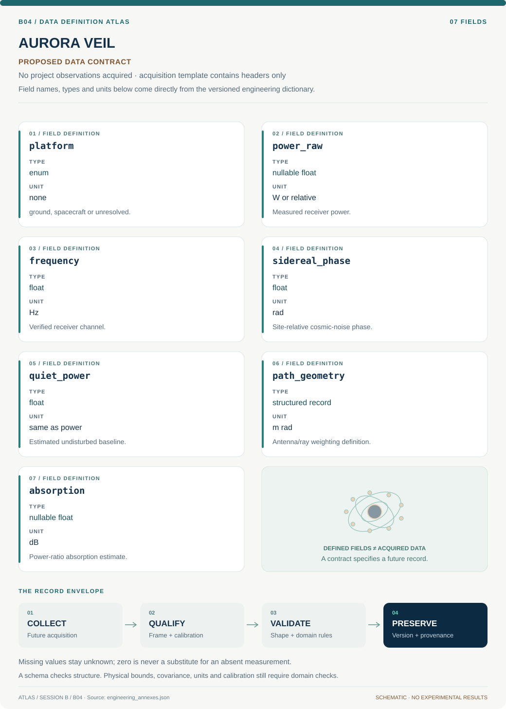

# B04 · Figure gallery

[AURORA VEIL — Ionospheric Absorption Atlas](../README.md) · [Data blueprint](../data/README.md) · [Data diagnostic gallery](../../../../data/figures/README.md)

## Engineering architecture

The architecture makes instrument power, platform geometry and modeled event comparisons explicit. The spacecraft branch is conditional on verified metadata, and no ground measurement is automatically interpreted as spacecraft-link attenuation.

[SVG](architecture.svg) · [Editable Mermaid source](architecture.mmd)

## Data blueprint

**Proposed contract · observations pending.** Every field, type, unit and meaning comes from the controlled dictionary. [Open SVG](data-map.svg) · [Download dictionary](../data/dictionary.csv)

## Planned scientific result

Display raw/clean receiver power, quiet-day baseline, absorption and D-RAP event comparisons; annotate instrument location and path geometry.

This final scientific result remains an execution deliverable; the design diagrams do not establish an empirical finding.
