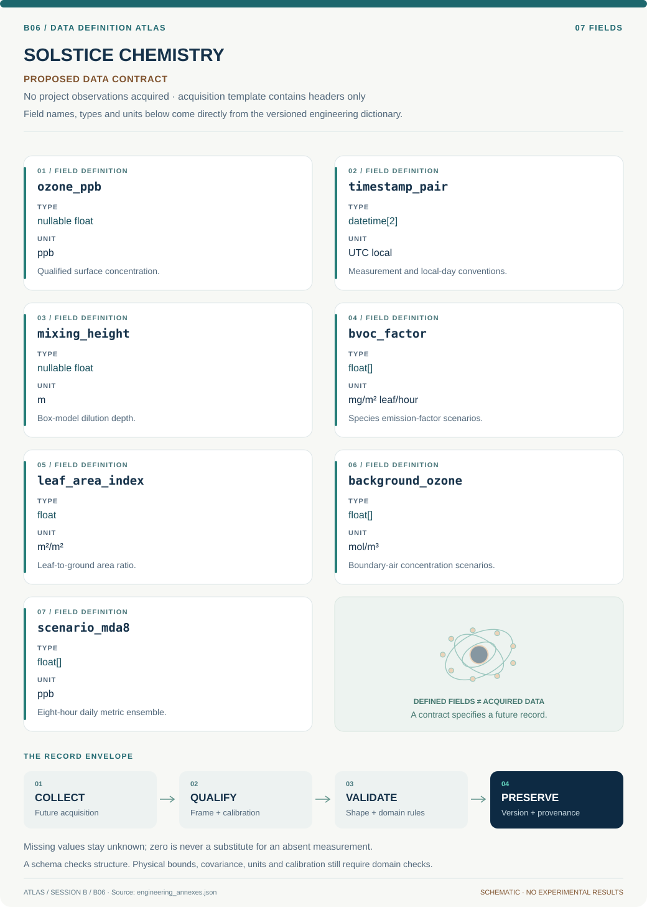

# B06 · Data blueprint

[SOLSTICE CHEMISTRY — Tucson Ozone Digital Observatory](../README.md) · [Figure gallery](../figures/README.md) · [Data atlas](../../../../data/README.md)

**PROPOSED CONTRACT · 7 fields · no project observations acquired.** The acquisition CSV contains column headers only. The diagram is a visual record specification, not measured data.

| Download | What it contains |
| --- | --- |
| [Acquisition CSV](acquisition.csv) | Empty columns ready for controlled acquisition |
| [Field dictionary](dictionary.csv) | Names, source types, units, meanings and quality rules |
| [JSON Schema](schema.json) | Nullable record structure with unit and quality metadata |

## Field reference

| Field | Type | Unit | Meaning | Quality / missingness |
| --- | --- | --- | --- | --- |
| ozone_ppb | nullable float | ppb | Qualified surface concentration. | Duration, method and flags retained. |
| timestamp_pair | datetime[2] | UTC local | Measurement and local-day conventions. | DST/site timezone explicit. |
| mixing_height | nullable float | m | Box-model dilution depth. | Positive; source support flagged. |
| bvoc_factor | float[] | mg/m² leaf/hour | Species emission-factor scenarios. | No NDVI substitution; covariance retained. |
| leaf_area_index | float | m²/m² | Leaf-to-ground area ratio. | Sensor/date provenance required. |
| background_ozone | float[] | mol/m³ | Boundary-air concentration scenarios. | Distinct from local monitor truth. |
| scenario_mda8 | float[] | ppb | Eight-hour daily metric ensemble. | Report completeness and model discrepancy. |

## Acquisition and provenance

Null means missing or unknown; record its cause. Preserve product identifier, retrieval timestamp, source hash, calibration, coordinate and time frame, covariance basis, selection rules and every transformation. JSON Schema checks structure; physical bounds and the quality rules above require domain validation.

- [EPA AQS Data API documentation](https://aqs.epa.gov/aqsweb/documents/ramltohtml.html) — archive or acquisition resource; inclusion here does not assert that its data have been retrieved.
- [A long-term (2001–2022) examination of surface ozone concentrations in Tucson, Arizona](https://pubs.rsc.org/en/content/articlehtml/2025/ea/d5ea00072f) — archive or acquisition resource; inclusion here does not assert that its data have been retrieved.

[Controlled data-management procedure](../../../../engineering/DATA_MANAGEMENT.md)
