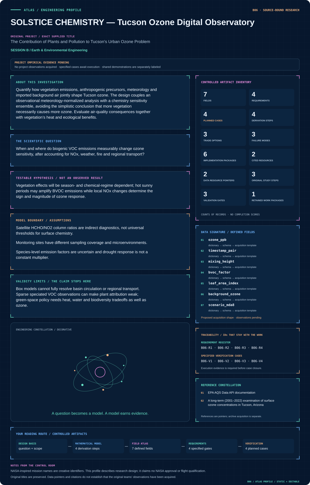

# B06 · Figure gallery

[SOLSTICE CHEMISTRY — Tucson Ozone Digital Observatory](../README.md) · [Data blueprint](../data/README.md) · [Data diagnostic gallery](../../../../data/figures/README.md)

## Engineering architecture

The architecture distinguishes observed ozone normalization from conditional chemistry scenarios and shows transport as an explicit interface. It supports bounded source sensitivities without equating vegetation correlations with causal ozone production.

[SVG](architecture.svg) · [Editable Mermaid source](architecture.mmd)

## Data blueprint

**Proposed contract · observations pending.** Every field, type, unit and meaning comes from the controlled dictionary. [Open SVG](data-map.svg) · [Download dictionary](../data/dictionary.csv)

## Mission profile

The scientific question, hypothesis, model boundary and document metadata are drawn from controlled sources. Proposed work remains distinguished from acquired evidence. [Open SVG](mission-profile.svg)

## Planned scientific result

Plot ozone response surfaces for NOx and BVOC changes by season, alongside measured monitor histories and intervention uncertainty.

This final scientific result remains an execution deliverable; the design diagrams do not establish an empirical finding.
