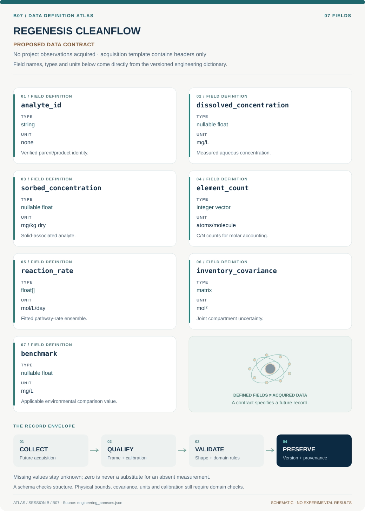

# B07 · REGENESIS CLEANFLOW — Environmental Fate and Remediation Model

**Original project:** Bioremediation of Insensitive Munitions Compounds

**Session B:** Earth & Environmental Engineering

**Document class:** engineering research design and analysis record · **Revision:** 3 · **Date:** 2026-10-02

**Evidence state:** design basis, mathematical formulation and verification plan documented. Project-specific empirical results remain to be acquired; executable shared model demonstrations have their own recorded checks.

[Session B](../README.md) · [All projects](../../../ENGINEERING_DOCUMENTATION.md) · [Session handbook](../../../handbooks/SESSION_B.md) · [← B06](../B06-solstice-chemistry-tucson-ozone-digital-observatory/README.md) · [B08 →](../B08-terraform-terraces-dryland-conservation-observatory/README.md)

| Proposed requirements | Specified verification cases | Defined data fields | Cited resources |
| ---: | ---: | ---: | ---: |
| 4 | 4 | 7 | 2 |

[Explore the data blueprint](data/README.md) · [Open the figure gallery](figures/README.md) · [Download acquisition template](data/acquisition.csv) · [Browse the data atlas](../../../data/README.md)

---

## Purpose and scientific objective

Build an environmental remediation assessment for existing contaminated-water and soil records, centered on parent compounds, transformation products and mineralization evidence. The project evaluates cleanup effectiveness and residual toxicity from published or authorized analytical data. It excludes energetic-material synthesis, formulation and operational handling instructions.

**Question:** Which documented remediation pathways most reliably reduce total contaminant burden and toxicity rather than merely removing a monitored parent compound?

**Testable hypothesis:** A model that tracks transformation products, sorption and redox history will predict residual exposure better than apparent first-order parent disappearance alone.

## 1. Design basis and analysis boundary

The remediation assessment is a retrospective environmental fate model built from authorized analytical concentration-time and matrix records. Its boundary includes dissolved, sorbed, gas and biomass inventories only when independently measured or explicitly unknown. Parent-compound disappearance is an observation; product formation, mineralization and residual environmental hazard are separate estimands.

Start with a compartment molar balance and censored likelihood, then add transport or competing biological/abiotic pathways only where their controls are documented. Existing remediation research motivates the reaction-network approach. The deliverable specifies analytical endpoints and model artifacts, without synthesis, formulation or operational energetic-material handling instructions. Missing transformation products prevent a complete-cleanup claim even if the parent is below a reporting limit.

## 2. Requirements and verification traceability

These are project design requirements or proposed analysis gates. A numerical target is not a NASA requirement unless its controlling source is explicitly identified. “TBD” identifies evidence required before a decision; it is not permission to assume a value. Verification evidence listed here is planned, unless a linked result explicitly records execution.

| ID | Requirement / gate | Engineering rationale | Verification method | Basis / required evidence |
| --- | --- | --- | --- | --- |
| B07-R1 | Track parent and identified products on an element-specific molar basis with molecular identity and analytical recovery. | Total analyte mass changes across transformations. | Audit stoichiometry and mg-to-g conversions. | Existing carbon-accounting model. |
| B07-R2 | Every nondetection shall retain its reporting limit and method; missing benchmarks shall remain unresolved. | Zero substitution understates concentration and hazard. | Censored-likelihood and benchmark-null tests. | Proposed analytical contract. |
| B07-R3 | Distinguish dissolved loss, sorption, identified transformation and verified mineralization in all outputs. | Parent removal alone is ambiguous. | Review endpoint lineage and measured pools. | Primary remediation evidence. |
| B07-R4 | Rate transfer shall remain within published matrix/redox support or be tagged extrapolated. | Controlled studies may not represent field transport. | Compare scenario metadata to source envelope. | Proposed applicability gate. |

## 3. Architecture and controlled interfaces

An analyte dictionary stores formula, molar mass g/mol, element counts and assay method. Observation tables preserve concentration mg/L, sorbed mass mg/kg dry solids, water volume L, soil mass kg and censoring. The compartment adapter converts these to mol of analyte and mol of carbon or nitrogen atoms with uncertainty.

The network builder checks signed stoichiometric coefficients against elemental conservation before parameter fitting. A censored observation layer separates analytical recovery and reaction state; abiotic controls use independent source records. Transport is added through pore-water velocity and dispersion only if geometry is known. A hazard screen links available environmental benchmarks but propagates unknown-product and missing-benchmark flags to the final report.



The diagram establishes molar, element-specific accounting and separates analytical loss, transformation and transport. Its hazard ledger carries unmeasured-product uncertainty, so parent disappearance cannot become a claim of complete remediation.

[Editable engineering diagram source](figures/architecture.mmd)

## 4. Mathematical model and derivation

### Governing equations

```text
dc_i/dt = D_i*laplacian(c_i) - v·grad(c_i) + sum_r(nu_ir*r_r(c)) - k_loss,i*c_i; use a stoichiometrically balanced reaction network on a molar basis.
```

```text
n_C,recovered = sum_i N_C,i * [(C_i*V + S_i*m_soil)/MW_i] + n_C,gas + n_C,biomass; closure_C = n_C,recovered/n_C,initial, after converting all analyte masses to grams.
```

```text
Risk_index=sum_i C_i/C_benchmark,i, only where defensible environmental benchmarks exist; additivity is a screened assumption, not a proven mixture-toxicity model.
```

### Variables, units and conventions

- C_i: measured dissolved mass concentration mg/L; S_i: sorbed mass mg/kg; c_i: molar dissolved concentration mol/L after mass-unit conversion.
- MW_i: molar mass g/mol; N_C,i: carbon atoms per molecule; nu_ir: dimensionless signed molar stoichiometric coefficient; r_r: reaction rate mol/(L day).
- D_i: dispersion m^2/day; v: pore-water velocity m/day; k_loss,i: independently characterized loss day^-1.
- V: water volume L; m_soil: dry soil mass kg; n_C: mol of carbon atoms. Convert mg to g before division by MW; inventory gas, biomass and unmeasured pools separately.

### Assumptions and boundary conditions

- Disappearance may reflect sorption, dilution or incomplete analytical coverage.
- Published rate constants transfer only within documented matrix and environmental ranges.
- Missing toxicity benchmarks are retained as unresolved uncertainty, never treated as zero risk.
- Total recovered analyte mass is not conserved across different molecular transformation products. Element-specific molar accounting and pool completeness are required before interpreting closure or mineralization.
- Total recovered analyte mass is not conserved across different molecular transformation products. Element-specific molar accounting and pool completeness are required before interpreting closure or mineralization.

### Derivation step 1

```text
n_i=(C_i V+S_i m_soil)*10^-3/MW_i.
```

C in mg/L and S in mg/kg produce mg; 10^-3 converts to g before division by molar mass. Dissolved and sorbed inventories must not double count extracted pools.

### Derivation step 2

```text
dn/dt=V N r(n/V)+q_in c_in-q_out c_out.
```

N is the stoichiometric matrix, rates are mol/L/day, and all terms are mol/day. Nonreactive transport changes inventory independently of transformation.

### Derivation step 3

```text
n_C=sum_i a_C,i n_i+n_C,gas+n_C,biomass; closure=n_C/n_C,initial.
```

Carbon atom counts are dimensionless. Unmeasured carbon pools make closure incomplete, and organic background requires source-specific correction.

### Derivation step 4

```text
P(C<L|theta)=F_C(L|theta); HI=sum_i C_i/B_i.
```

Censored likelihood uses reporting limit L. The hazard index is dimensionless only for compatible benchmarks and is an additive screening assumption.

### Inference or simulation procedure

Extract concentration-time records, reporting limits, redox and matrix descriptors from primary remediation studies. Fit coupled stoichiometric parent/product molar-balance models with censored observations, compare biological and abiotic interpretations, and propagate kinetic/transport uncertainty into retrospective exposure estimates. Use literature-based scenario analysis for authorized remediation planning. Require independent product identification and carbon/nitrogen accounting before describing mineralization; do not infer complete cleanup from parent removal.

### Validity domain and fidelity limits

Sparse product coverage and inconsistent extraction recoveries may prevent mass closure. Published controlled-system results may not transfer to heterogeneous field sites, and mixture toxicity can violate additive risk assumptions.

## 5. Data specifications and provenance



**Proposed data contract · observations pending.** This visual inventory shows the record fields to acquire or derive. It contains no project measurements. [Open the data blueprint and downloads](data/README.md).

| Field | Type | Unit | Physical / statistical meaning | Quality and missing-data rule |
| --- | --- | --- | --- | --- |
| analyte_id | string | none | Verified parent/product identity. | Formula and assay identity required. |
| dissolved_concentration | nullable float | mg/L | Measured aqueous concentration. | Limit, recovery and qualifier retained. |
| sorbed_concentration | nullable float | mg/kg dry | Solid-associated analyte. | Extraction basis and dry mass required. |
| element_count | integer vector | atoms/molecule | C/N counts for molar accounting. | Check formula consistency. |
| reaction_rate | float[] | mol/L/day | Fitted pathway-rate ensemble. | Source matrix/redox domain recorded. |
| inventory_covariance | matrix | mol² | Joint compartment uncertainty. | Include shared recovery/background bias. |
| benchmark | nullable float | mg/L | Applicable environmental comparison value. | Null remains unresolved, never zero risk. |

[Machine-readable record schema](data/schema.json) · [Empty acquisition CSV](data/acquisition.csv) · [Field dictionary CSV](data/dictionary.csv)

The CSV above contains column headers only. Its schema defines future records and does not establish that original-team data or a particular archive product have been acquired. Frame, timing, calibration, covariance, selection and provenance details must accompany populated records.

### Combined biological and abiotic reactions with iron and Fe(III)-reducing microorganisms for remediation

[Product, archive or reference](https://pubs.rsc.org/en/content/articlehtml/2015/ew/c4ew00062e)

**Fields:** Parent/product concentrations, matrix descriptions, abiotic comparisons and reported uncertainty.

**Access:** Open primary article; source data availability must be checked.

**Role:** Retrospective pathway fitting and controls.

### SERDP insensitive munitions environmental health, fate and transport resources

[Product, archive or reference](https://serdp-estcp.mil/resources/details/67fdfd78-7528-443c-a3f9-d7f109407801)

**Fields:** Government environmental-fate research and associated technical reports.

**Access:** Public SERDP resources; some underlying datasets need investigator requests.

**Role:** Environmental endpoint selection and evidence gaps.

## 6. Uncertainty, sensitivity and identifiability

Extraction recovery, analytical censoring and unmeasured products are distinct from kinetic uncertainty. A common recovery bias correlates concentrations across times; background carbon and gas losses can dominate closure. Propagate each pool's covariance and present measured-pool closure alongside an unresolved-pool interval instead of forcing recovery to exactly one.

Sorption, dilution and transformation can produce similar parent curves. Compare a nonreactive-loss baseline, balanced product network and supported transport alternative. Use profile likelihoods and withheld time points to determine which rates are estimable. If products are unobserved, report an identifiable aggregate disappearance rate and explicitly decline unique pathway attribution or mineralization inference.

## 7. Engineering trade study

| Alternative | Benefit | Cost / limitation | Decision rule |
| --- | --- | --- | --- |
| Parent-only decay | Simple screening of observed disappearance. | Cannot distinguish cleanup from redistribution. | Use as a descriptive baseline only. |
| Balanced parent-product compartments | Connects disappearance with measured products. | Unmeasured pools weaken closure. | Preferred when analytical coverage exists. |
| Reactive transport extension | Represents heterogeneous field movement. | Needs hydraulic geometry and parameters. | Adopt only with independently supported transport. |

## 8. Verification and validation cases

| Case ID | Stimulus / condition | Expected result / criterion | Method | Evidence artifact |
| --- | --- | --- | --- | --- |
| B07-V1 | Closed conservative network | Total tracked element inventory remains constant. | Condition/fixture: Synthetic reaction has elemental balance a^T N=0 and no transport. Verification procedure: Integrator conservation check.. | Integrator conservation check. |
| B07-V2 | Pure sorption | Parent total and carbon inventory stay unchanged. | Condition/fixture: Move one mol from water to solids without reaction. Verification procedure: Compartment-transfer fixture.. | Compartment-transfer fixture. |
| B07-V3 | Censored measurement | Likelihood integrates below L and does not use C=0. | Condition/fixture: Observed record states C<L. Verification procedure: Compare exact CDF fixture.. | Compare exact CDF fixture. |
| B07-V4 | Incomplete product coverage | Output flags incomplete closure and avoids mineralization claim. | Condition/fixture: Remove a known synthetic product channel from observations. Verification procedure: Integration evidence gate.. | Integration evidence gate. |

**Execution status:** these cases are specified, not claimed as executed. Close a case only with the versioned inputs, output, uncertainty, reviewer and pass/fail rationale.

### Additional scientific validation gates

- Hold out whole studies/matrices; repeated samples from one system are not independent external validation.
- Audit carbon-atom molar closure, gas/CO2/biomass pools and measured product accumulation; label unresolved pools. Recovered analyte mg alone cannot establish mineralization.
- Report concentration error, censored-likelihood fit and uncertainty coverage; require toxicity evidence before claiming detoxification.

## 9. Implementation and reproducible work packages

1. Create analyte/formula, assay and matrix schemas with reporting-limit fields.
2. Extract published concentration-time records with digitization and recovery uncertainty.
3. Implement balanced molar compartment networks and censored observation likelihoods.
4. Compare abiotic/nonreactive alternatives before fitting complex pathways.
5. Generate inventory closure, rate identifiability and held-out prediction artifacts.
6. Release environmental fate and residual-hazard reports with unresolved product coverage.

### Investigation sequence

1. Stage 1: build a provenance-preserving literature data table and analytical-coverage map; separate observation from inferred transformation.
2. Stage 2: fit competing transport/reaction models and quantify parameter identifiability, reporting-limit effects and mass-balance uncertainty.
3. Stage 3: validate on an independent study or authorized site dataset and deliver a cleanup-evidence framework with explicit unresolved products.

### Resources and interfaces to expertise

- Environmental analytical chemist, remediation specialist and site data custodian.
- Censored-data statistics, reaction/transport solver and published method quality records.

## 10. Failure modes and interpretation controls

| Failure mode | Effect on result | Detection / evidence | Design response |
| --- | --- | --- | --- |
| Mass closure on mg totals | False conservation across different molecules. | Compare molecular masses and element inventory. | Use molar elemental ledger. |
| Parent loss called mineralization | Unsupported cleanup claim. | Check gas/product evidence links. | Require independent pool identification. |
| Missing benchmark treated safe | Understated residual hazard. | Audit null benchmark propagation. | Report unresolved toxicity. |

- Unmeasured persistent or toxic transformation products.
- Rate transfer across soils or redox environments.
- False cleanup confidence from inadequate analytical recovery.

## 11. Required engineering outputs

- Environmental fate database and reaction-network model.
- Residual-exposure scenarios and analytical-gap map.
- Decision report distinguishing removal, transformation, mineralization and detoxification.

### Scientific result figures to produce during execution

Show monitored parent-to-product pathways with uncertainty bands and separate dissolved, sorbed, unresolved and verified mineralized fractions.

## 12. Cited technical and scientific resources

- [Combined biological and abiotic reactions with iron and Fe(III)-reducing microorganisms for remediation](https://pubs.rsc.org/en/content/articlehtml/2015/ew/c4ew00062e) — Primary remediation study supports modeling multiple transformation pathways and abiotic controls.
- [SERDP insensitive munitions environmental health, fate and transport resources](https://serdp-estcp.mil/resources/details/67fdfd78-7528-443c-a3f9-d7f109407801) — Government research context for environmental transformation and uncertainty in insensitive munitions compounds.

Framework and evidence rules: [engineering documentation standard](../../../engineering/ENGINEERING_STANDARD.md), [model assurance](../../../engineering/MODEL_ASSURANCE.md), [uncertainty procedure](../../../engineering/UNCERTAINTY_AND_DECISION_RULES.md), [data management](../../../engineering/DATA_MANAGEMENT.md). NASA-inspired names are creative identifiers; requirements and results are not NASA certification.
