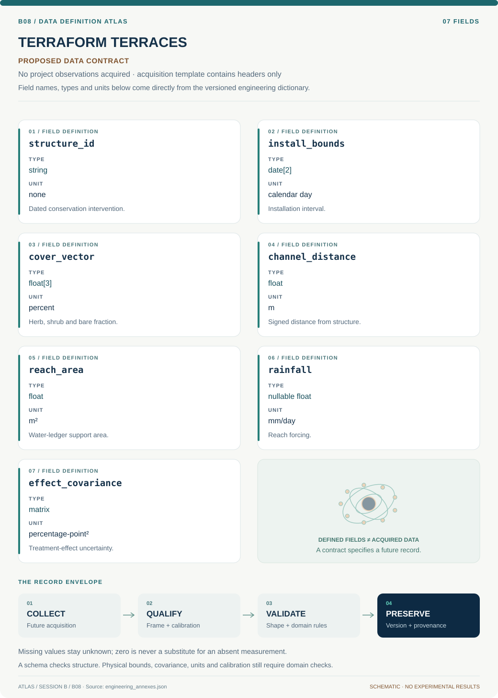

# B08 · TERRAFORM TERRACES — Dryland Conservation Observatory

**Original project:** The Influence of Conservation Structures on Rangeland Vegetation Patterns

**Session B:** Earth & Environmental Engineering

**Document class:** engineering research design and analysis record · **Revision:** 3 · **Date:** 2026-10-02

**Evidence state:** design basis, mathematical formulation and verification plan documented. Project-specific empirical results remain to be acquired; executable shared model demonstrations have their own recorded checks.

[Session B](../README.md) · [All projects](../../../ENGINEERING_DOCUMENTATION.md) · [Session handbook](../../../handbooks/SESSION_B.md) · [← B07](../B07-regenesis-cleanflow-environmental-fate-and-remediation-model/README.md) · [B09 →](../B09-europa-chemgrid-yellowstone-geochemical-atlas/README.md)

| Proposed requirements | Specified verification cases | Defined data fields | Cited resources |
| ---: | ---: | ---: | ---: |
| 4 | 4 | 7 | 3 |

[Explore the data blueprint](data/README.md) · [Open the figure gallery](figures/README.md) · [Download acquisition template](data/acquisition.csv) · [Browse the data atlas](../../../data/README.md)

---

## Purpose and scientific objective

Evaluate rock detention and related conservation structures as interventions in water redistribution, sediment retention and vegetation. Combine field measurements with satellite histories through a before/after control-impact design. Quantify cover changes alongside upstream/downstream redistribution and maintenance; a greener image alone cannot establish ecosystem improvement.

**Question:** How far upstream and downstream do structures alter vegetation functional groups, after rainfall and initial site selection are considered?

**Testable hypothesis:** Structures may increase herbaceous cover near retained water and sediment; responses of shrubs, diversity, soil fertility and downstream habitat require separate tests.

## 1. Design basis and analysis boundary

The engineering analysis evaluates rock detention and related conservation structures as dated hydrologic interventions within specific channel reaches. It joins structure condition, installation timing, vegetation fractions, rainfall and upstream/downstream geometry. The target is incremental herbaceous, shrub and bare-cover change relative to defensible controls, supported by water redistribution evidence.

Start with mapped structure and control inventories plus pretreatment trend checks. Promote to distance-dependent event studies and water-balance scenarios where observations support them. The primary semiarid studies justify vegetation/hydrology endpoints, not universal soil-fertility or biodiversity improvements. Small structures and their influence zones may be below imagery resolution, so field observations and satellite support must remain separately labeled.

## 2. Requirements and verification traceability

These are project design requirements or proposed analysis gates. A numerical target is not a NASA requirement unless its controlling source is explicitly identified. “TBD” identifies evidence required before a decision; it is not permission to assume a value. Verification evidence listed here is planned, unless a linked result explicitly records execution.

| ID | Requirement / gate | Engineering rationale | Verification method | Basis / required evidence |
| --- | --- | --- | --- | --- |
| B08-R1 | Each treated reach shall retain installation-date uncertainty, structure condition, contributing area and matched-control rationale. | Placement and maintenance confound treatment effects. | Audit reach register and date ranges. | Primary field design context. |
| B08-R2 | Cover fractions shall use consistent functional-group definitions and sum to 100% within stated classification error. | NDVI is not herb/shrub composition. | Compare field and imagery compositional ledger. | Proposed endpoint contract. |
| B08-R3 | Estimate pretreatment trend differences and publish failures before interpreting a treatment coefficient. | Nonrandom placement violates causal assumptions. | Event-study pretrend review. | Proposed comparison design. |
| B08-R4 | Water accounting shall include upstream inflow and downstream outflow; any downstream deficit is a reported tradeoff. | Local retention can redistribute water. | Independent catchment balance calculation. | Existing hydrologic model. |

## 3. Architecture and controlled interfaces

A reach registry represents structures as surveyed points/lines with condition and installation bounds. Vegetation observations are georeferenced transects or image-derived functional fractions with sampling support polygons. Dated reflectance scenes preserve cloud masks and acquisition season; the spatial adapter uses projected channel distance with positive downstream sign.

Matched-control and event-study modules consume rainfall and catchment characteristics as confounders. A water ledger converts volumes m³ to equivalent depth using an explicitly declared reach area. Distance kernels are compared with flexible reach effects so an assumed exponential footprint cannot manufacture an influence length. Control spillover, pixel mixing and failed structures propagate exclusion/sensitivity states, rather than being erased from the evaluation.


The architecture links vegetation effects to dated interventions and comparable reaches, with a separate water ledger. It exposes pixel support, maintenance and downstream redistribution limits rather than equating greenness with ecosystem improvement.

[Editable engineering diagram source](figures/architecture.mmd)

## 4. Mathematical model and derivation

### Governing equations

```text
Y_it=α_i+δ_t+β(Treated_i×Post_t)+γᵀ weather_it+ε_it.
```

```text
dS/dt=P+Q_in−ET−Q_out−deep_percolation, after area conversion.
```

```text
Effect(d)=β_0 exp(−|d|/ℓ)+β_down I(d>0), compared with flexible alternatives.
```

### Variables, units and conventions

- Y: herb/shrub/bare cover, percent; β: percentage-point change.
- S: stored water, mm; fluxes: mm/day.
- d: signed channel distance, m; ℓ: influence length, m.
- Structure condition, slope, contributing area and rainfall are covariates.

### Assumptions and boundary conditions

- Nonrandom placement requires matched controls and pretreatment trend tests.
- Cover fractions share field/image definitions and sum consistently.
- Water retained locally can change downstream availability.

### Derivation step 1

```text
beta_BACI=(Y_T,post-Y_T,pre)-(Y_C,post-Y_C,pre).
```

Y is cover percent, so beta is percentage points. The difference removes shared temporal changes only under defensible control comparability.

### Derivation step 2

```text
dS/dt=P+Q_in/A-ET-Q_out/A-D.
```

S is water-depth storage; volumetric flows divided by area produce m/time and are converted consistently to mm/day.

### Derivation step 3

```text
E(d)=beta_0 exp(-abs(d)/ell)+beta_down I(d>0).
```

Distance and influence length use metres. The asymmetric term allows upstream retention and downstream response to differ.

### Derivation step 4

```text
Var(beta)=c^T Sigma_Y c; c=(1,-1,-1,1).
```

Repeated reaches and weather create correlated errors. Catchment/block resampling replaces an independence assumption across nearby pixels.

### Inference or simulation procedure

Construct dated structure inventories and matched untreated channel segments. Map functional-group cover from field transects and remote sensing; fit spatial event-study models with rainfall interactions and distance effects. Test parallel pretreatment trends and sensitivity to catchment mismatches. Use water balances to evaluate mechanisms, and report incremental changes relative to controls. Propagate imagery, installation-date and spatial-correlation uncertainty through block bootstrapping.

### Validity domain and fidelity limits

Small structures can fall below pixel size. Nearby controls may experience spillovers; observed cover changes cannot directly establish species-diversity or soil-fertility improvement.

## 5. Data specifications and provenance



**Proposed data contract · observations pending.** This visual inventory shows the record fields to acquire or derive. It contains no project measurements. [Open the data blueprint and downloads](data/README.md).

| Field | Type | Unit | Physical / statistical meaning | Quality and missing-data rule |
| --- | --- | --- | --- | --- |
| structure_id | string | none | Dated conservation intervention. | Condition and maintenance history required. |
| install_bounds | date[2] | calendar day | Installation interval. | Uncertain dates propagate to event bins. |
| cover_vector | float[3] | percent | Herb, shrub and bare fraction. | Sum and classification covariance checked. |
| channel_distance | float | m | Signed distance from structure. | Positive downstream; CRS recorded. |
| reach_area | float | m² | Water-ledger support area. | Positive and fixed per comparison. |
| rainfall | nullable float | mm/day | Reach forcing. | Coverage and gauge uncertainty retained. |
| effect_covariance | matrix | percentage-point² | Treatment-effect uncertainty. | Spatial and temporal covariance included. |

[Machine-readable record schema](data/schema.json) · [Empty acquisition CSV](data/acquisition.csv) · [Field dictionary CSV](data/dictionary.csv)

The CSV above contains column headers only. Its schema defines future records and does not establish that original-team data or a particular archive product have been acquired. Frame, timing, calibration, covariance, selection and provenance details must accompany populated records.

### USDA ARS research on porous rock check dams

[Product, archive or reference](https://www.ars.usda.gov/research/publications/publication/?seqNo115=363913)

**Fields:** Field structure geometry, catchment setting and methods.

**Access:** Public USDA primary record; raw transects may require investigator access.

**Role:** Mechanism and sampling design.

### Dryland rock detention structures increase herbaceous vegetation cover and stabilize shrub cover over 10 years

[Product, archive or reference](https://pubmed.ncbi.nlm.nih.gov/38280600/)

**Fields:** Long-duration functional-group cover observations.

**Access:** Primary paper indexed at PubMed; check publisher data statement.

**Role:** External endpoint comparison.

### NASA Harmonized Landsat Sentinel-2 data

[Product, archive or reference](https://hls.gsfc.nasa.gov/hls-data/)

**Fields:** Reflectance dates and quality flags.

**Access:** Public NASA imagery; record Earthdata requirements/version.

**Role:** Regional context and matching.

## 6. Uncertainty, sensitivity and identifiability

Nonrandom structure placement and incomplete installation dates are major identification risks. Fit event-time models under plausible dates, match controls on slope and contributing area, and examine pretreatment trends. A control affected by the same detention structure violates isolation; vary buffer distances and report spillover sensitivity.

Cover classification errors are compositional and correlated across groups, while repeated rainfall shocks affect multiple reaches. Preserve their covariance in block bootstraps. Influence length may trade off with kernel amplitude when few transects exist, so profile ell and compare flexible distance bins. Water retention is a proposed mechanism unless inlet/outlet or storage evidence supports the balance.

## 7. Engineering trade study

| Alternative | Benefit | Cost / limitation | Decision rule |
| --- | --- | --- | --- |
| Matched BACI reach analysis | Transparent incremental cover estimate. | Requires valid controls and preperiods. | Preferred initial treatment comparison. |
| Spatial event-study kernel | Estimates timing and influence footprint. | Installation error and spillover complicate fit. | Use with sufficient dated transects. |
| Rainfall-runoff mechanism model | Tests redistribution beyond greenness. | Hydraulic observations may be sparse. | Adopt when balance terms are independently constrained. |

## 8. Verification and validation cases

| Case ID | Stimulus / condition | Expected result / criterion | Method | Evidence artifact |
| --- | --- | --- | --- | --- |
| B08-V1 | Identical trends | BACI effect equals zero. | Condition/fixture: Synthetic treated/control cover changes are both +5 points. Verification procedure: Exact difference calculation.. | Exact difference calculation. |
| B08-V2 | Known intervention contrast | Estimated contrast is +8 percentage points. | Condition/fixture: Treated change +12 points, control +4 points. Verification procedure: Unit-aware fixture.. | Unit-aware fixture. |
| B08-V3 | Closed water ledger | Storage change is +5 mm/day. | Condition/fixture: P=10, ET=2, outflow=3, other terms zero mm/day. Verification procedure: Independent balance arithmetic.. | Independent balance arithmetic. |
| B08-V4 | Control spillover holdout | Report effect movement and prediction calibration. | Condition/fixture: Exclude nearby controls and reserve catchments. Verification procedure: Spatial blocked sensitivity.. | Spatial blocked sensitivity. |

**Execution status:** these cases are specified, not claimed as executed. Close a case only with the versioned inputs, output, uncertainty, reviewer and pass/fail rationale.

### Additional scientific validation gates

- Hold out catchments and years; report spatial-block confidence intervals.
- Use placebo dates and pretreatment trend checks to expose selection bias.
- Validate cover against independent field plots and inspect shadows/channel mixing; compare effects with no-treatment trajectories.

## 9. Implementation and reproducible work packages

1. Publish reach, structure-condition and installation-date inventories with source lineage.
2. Define consistent functional-cover labels and field/image support areas.
3. Create matched controls and pretrend diagnostics before fitting treatment effects.
4. Implement event-time and distance alternatives with catchment-block covariance.
5. Build inlet/storage/outlet water scenarios and explicit downstream tradeoff artifacts.
6. Release cover-effect maps with resolution limits, spillover analyses and maintenance states.

### Investigation sequence

1. Stage 1: inventory installations/condition, match controls and compare image resolution with footprints; define water/vegetation endpoints.
2. Stage 2: fit rainfall-adjusted spatial effects and water redistribution ensembles; quantify influence distance and uncertainty.
3. Stage 3: validate independent catchments and deliver maintenance/placement recommendations including downstream consequences.

### Resources and interfaces to expertise

- Rangeland ecologist, hydrologist and land-manager partner.
- GIS structure surveys, precipitation histories, fractional-cover tools and versioned data manifest.

## 10. Failure modes and interpretation controls

| Failure mode | Effect on result | Detection / evidence | Design response |
| --- | --- | --- | --- |
| Cloud/season confounding | Apparent treatment greening. | Compare image dates and valid-pixel support. | Season-matched cloud-screened composites. |
| Failed structures pooled active | Diluted or misleading intervention effect. | Condition-history review. | Separate maintenance states. |
| Downstream impact omitted | Incomplete ecosystem assessment. | Water-ledger imbalance. | Report redistributed flow and uncertainty. |

- Treatment selection and spillovers.
- Rainfall variation dominating short records.
- Downstream erosion or water-access tradeoffs.

## 11. Required engineering outputs

- Structure-impact geodatabase and matched-control audit.
- Distance-response and water-balance notebooks.
- Condition/maintenance priorities with uncertainty.

### Scientific result figures to produce during execution

Map structures, controls and cover-change intervals; display upstream/downstream effects with rainfall-adjusted uncertainty bands.

## 12. Cited technical and scientific resources

- [USDA ARS research on porous rock check dams](https://www.ars.usda.gov/research/publications/publication/?seqNo115=363913) — Primary semiarid field research motivates spatially explicit vegetation and hydrology assessment.
- [Dryland rock detention structures increase herbaceous vegetation cover and stabilize shrub cover over 10 years](https://pubmed.ncbi.nlm.nih.gov/38280600/) — Primary long-duration field evidence supports vegetation endpoints and cautions against inferring soil-fertility changes from cover alone.
- [NASA Harmonized Landsat Sentinel-2 data](https://hls.gsfc.nasa.gov/hls-data/) — Surface reflectance and quality layers support reproducible landscape and vegetation monitoring.

Framework and evidence rules: [engineering documentation standard](../../../engineering/ENGINEERING_STANDARD.md), [model assurance](../../../engineering/MODEL_ASSURANCE.md), [uncertainty procedure](../../../engineering/UNCERTAINTY_AND_DECISION_RULES.md), [data management](../../../engineering/DATA_MANAGEMENT.md). NASA-inspired names are creative identifiers; requirements and results are not NASA certification.
