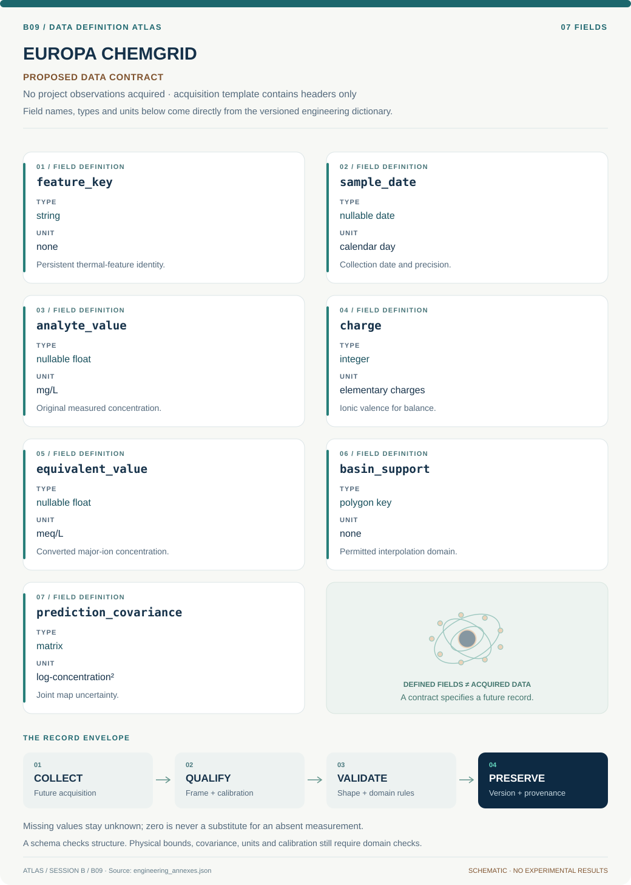

# B09 · Figure gallery

[EUROPA CHEMGRID — Yellowstone Geochemical Atlas](../README.md) · [Data blueprint](../data/README.md) · [Data diagnostic gallery](../../../../data/figures/README.md)

## Engineering architecture

The diagram defines a versioned sample-to-map lineage and basin/time support boundary. Measured concentration, inferred facies and optional equilibrium interpretation remain separate products with explicit sparse-data limits.

[SVG](architecture.svg) · [Editable Mermaid source](architecture.mmd)

## Data blueprint

**Proposed contract · observations pending.** Every field, type, unit and meaning comes from the controlled dictionary. [Open SVG](data-map.svg) · [Download dictionary](../data/dictionary.csv)

## Planned scientific result

Basin map with measured points, assay/date filters, facies probabilities and an explicit unsupported-prediction mask.

This final scientific result remains an execution deliverable; the design diagrams do not establish an empirical finding.
