# B10 · LANDSAT EQUITY — Community Canopy Mission

**Original project:** Using Remote Sensing to Determine Vegetation Change and Impacts to Communities

**Session B:** Earth & Environmental Engineering

**Document class:** engineering research design and analysis record · **Revision:** 3 · **Date:** 2026-10-02

**Evidence state:** design basis, mathematical formulation and verification plan documented. Project-specific empirical results remain to be acquired; executable shared model demonstrations have their own recorded checks.

[Session B](../README.md) · [All projects](../../../ENGINEERING_DOCUMENTATION.md) · [Session handbook](../../../handbooks/SESSION_B.md) · [← B09](../B09-europa-chemgrid-yellowstone-geochemical-atlas/README.md) · [B11 →](../B11-apollo-legacy-ledger-environmental-stewardship-knowledge-system/README.md)

| Proposed requirements | Specified verification cases | Defined data fields | Cited resources |
| ---: | ---: | ---: | ---: |
| 4 | 4 | 7 | 3 |

[Explore the data blueprint](data/README.md) · [Open the figure gallery](figures/README.md) · [Download acquisition template](data/acquisition.csv) · [Browse the data atlas](../../../data/README.md)

---

## Purpose and scientific objective

Connect persistent vegetation change to community thermal exposure and green-space access through consistent satellite histories. Define impacts first as measured environmental exposure and access; health or displacement effects require additional evidence. Show neighborhood distributions and uncertainty so citywide averages do not hide places losing canopy or receiving little restoration benefit.

**Question:** Which neighborhoods lose persistent vegetation, and how does loss coincide with thermal exposure after climate and land-use differences are considered?

**Testable hypothesis:** Canopy loss may increase local thermal exposure unequally; irrigation, housing changes and redevelopment can confound vegetation–temperature relationships.

## 1. Design basis and analysis boundary

The community canopy analysis joins consistently processed satellite vegetation and thermal histories with approved neighborhood population and access data. Its boundary is environmental exposure and green-space accessibility; a surface-temperature map is not an individual heat dose or a clinical health outcome. The decision is where sustained vegetation loss and access inequity warrant locally reviewed restoration scenarios.

Start with seasonal reflectance composites and persistent change detection, then add canopy validation, surface-temperature panels and population weighting. Air-temperature inference requires independent calibration. NASA imagery provides observation support, while neighborhood definitions, disclosure rules and restoration weights are jointly reviewed design choices. Community and Indigenous data authority governs linkage and publication, especially when small-area demographics can identify vulnerable households.

## 2. Requirements and verification traceability

These are project design requirements or proposed analysis gates. A numerical target is not a NASA requirement unless its controlling source is explicitly identified. “TBD” identifies evidence required before a decision; it is not permission to assume a value. Verification evidence listed here is planned, unless a linked result explicitly records execution.

| ID | Requirement / gate | Engineering rationale | Verification method | Basis / required evidence |
| --- | --- | --- | --- | --- |
| B10-R1 | Reflectance comparisons shall use documented sensor harmonization, cloud masks and matched seasonal windows. | Sensor/season changes resemble vegetation loss. | Scene-manifest and composite audit. | HLS product documentation. |
| B10-R2 | Separate tree canopy, general greenness, surface temperature and air-temperature estimates in every output. | NDVI and thermal imagery have different meanings. | Inspect field names, labels and validation routes. | Existing measurement distinctions. |
| B10-R3 | Population-weighted exposure shall use contemporaneous population surfaces and retain boundary-version sensitivity. | Changing neighborhoods bias trends. | Recalculate on stable and historical boundaries. | Proposed demographic contract. |
| B10-R4 | Publish only community-approved aggregation and uncertainty; precise household or culturally sensitive locations remain governed. | Data linkage can exceed consent. | Release-policy audit against data authority register. | Local governance requirement. |

## 3. Architecture and controlled interfaces

The imagery adapter emits dated surface reflectance with valid-pixel masks and projected support. A canopy classifier uses independently reviewed labels and produces calibrated cover fractions. Thermal products carry acquisition time, retrieval quality and physical K units, while air-temperature transects enter a separate calibration table.

A temporal panel aligns pixel histories on stable support and then aggregates using population weights with uncertainty. An access engine computes travel-network distance to usable green space, rather than nearest-pixel greenness. Scenario outputs combine canopy establishment, water and maintenance with exposure changes. Cloud gaps, mixed street-tree pixels and demographic uncertainty propagate to neighborhood intervals and suppressed rankings.



The diagram distinguishes canopy, surface heat, air-temperature calibration and usable access before neighborhood aggregation. The release boundary preserves community authority and prevents environmental exposure estimates from becoming unsupported health claims.

[Editable engineering diagram source](figures/architecture.mmd)

## 4. Mathematical model and derivation

### Governing equations

```text
NDVI=(ρ_NIR−ρ_red)/(ρ_NIR+ρ_red), using valid surface reflectance.
```

```text
T_it=α_i+δ_t+β canopy_it+γᵀ climate_it+ε_it.
```

```text
Exposure_g=Σ_p population_gp temperature_anomaly_p/Σ_p population_gp.
```

### Variables, units and conventions

- ρ: unitless reflectance; canopy: validated percent cover.
- T: surface-temperature anomaly, K; air temperature needs separate calibration.
- g: neighborhood; p: spatial cell.
- Exposure: ecological aggregate, not an individual heat dose.

### Assumptions and boundary conditions

- NDVI mixes trees, grass and seasonal weeds.
- Surface temperature differs from air temperature and physiological heat stress.
- Population estimates and neighborhood boundaries change through time.

### Derivation step 1

```text
NDVI=(rho_NIR-rho_red)/(rho_NIR+rho_red).
```

Reflectances are dimensionless; zero/invalid denominators and cloud-contaminated pixels are masked. Greenness is not automatically tree cover.

### Derivation step 2

```text
Delta T_it=alpha_i+delta_t+beta C_it+gamma^T W_it+epsilon_it.
```

C is canopy fraction or percent with explicit scaling, so beta has K/fraction or K/percentage-point units. Fixed effects do not remove all redevelopment confounding.

### Derivation step 3

```text
E_g=sum_p N_gp Delta T_p/sum_p N_gp.
```

Population N is persons; exposure E is K and is an ecological aggregate. Empty-population neighborhoods yield null rather than division by zero.

### Derivation step 4

```text
Var(E_g) approximately J Sigma_(N,T) J^T.
```

The covariance includes population/temperature uncertainty and spatially correlated retrieval errors; independent-pixel assumptions understate intervals.

### Inference or simulation procedure

Build cloud- and season-controlled reflectance composites, persistent vegetation/canopy trends and change points. Combine documented thermal imagery with air-temperature transects and socioeconomic records on consistent spatial units. Compare matched redevelopment/control areas or panel models with pretrend checks. Weight outputs by exposure and green-space access; evaluate restoration scenarios with water demand, establishment survival and maintenance. Propagate classification and demographic uncertainty rather than ranking neighborhoods by unqualified point estimates.

### Validity domain and fidelity limits

Mixed pixels can miss street trees. Associations do not establish causal health effects; unobserved irrigation and neighborhood change can bias estimates.

## 5. Data specifications and provenance


**Proposed data contract · observations pending.** This visual inventory shows the record fields to acquire or derive. It contains no project measurements. [Open the data blueprint and downloads](data/README.md).

| Field | Type | Unit | Physical / statistical meaning | Quality and missing-data rule |
| --- | --- | --- | --- | --- |
| scene_id | string | none | Exact harmonized reflectance product. | Version/checksum and masks required. |
| canopy_fraction | nullable float | 0–1 | Validated tree-cover estimate. | Class calibration and covariance retained. |
| surface_temperature | nullable float | K | Satellite skin-temperature retrieval. | Acquisition time/quality required. |
| air_temperature | nullable float | °C | Independent in situ measurement. | Never substituted from thermal pixels. |
| population_weight | float[] | persons | Contemporaneous cell population. | Boundary year and uncertainty saved. |
| green_access_distance | nullable float | m | Network distance to usable green space. | Access restrictions and routes documented. |
| exposure_covariance | matrix | K² | Joint neighborhood exposure uncertainty. | Include spatial and demographic terms. |

[Machine-readable record schema](data/schema.json) · [Empty acquisition CSV](data/acquisition.csv) · [Field dictionary CSV](data/dictionary.csv)

The CSV above contains column headers only. Its schema defines future records and does not establish that original-team data or a particular archive product have been acquired. Frame, timing, calibration, covariance, selection and provenance details must accompany populated records.

### NASA Harmonized Landsat Sentinel-2 data

[Product, archive or reference](https://hls.gsfc.nasa.gov/hls-data/)

**Fields:** Reflectance, observation dates and cloud/shadow quality.

**Access:** Public NASA imagery; version/Earthdata requirements recorded.

**Role:** Vegetation histories.

### NASA Landsat: urban heat and social vulnerability

[Product, archive or reference](https://science.nasa.gov/missions/landsat/how-urban-heat-affects-the-socially-vulnerable-in-sun-belt-cities/)

**Fields:** NASA vegetation/temperature/vulnerability integration example.

**Access:** Public account; acquire local thermal and demographic data separately.

**Role:** Exposure framing, without transferring city-specific effect sizes.

## 6. Uncertainty, sensitivity and identifiability

Mixed pixels, seasonal weeds and irrigation changes can mimic canopy gain or loss. Validate classifications on withheld neighborhoods and years, carry confusion uncertainty into cover, and compare multiple seasonal windows. Thermal overpass sampling can miss nocturnal heat and air temperature; any conversion requires independent transects and a stated applicability range.

Population weights and neighborhood boundaries change, and redevelopment may affect vegetation, exposure and residents together. Analyze stable-support panels, profile boundary choices and distinguish environmental change from population redistribution. Use spatial blocks for covariance. Avoid precise neighborhood rankings when intervals overlap; community priorities and access barriers are values/evidence inputs, not inferred from satellite radiance.

## 7. Engineering trade study

| Alternative | Benefit | Cost / limitation | Decision rule |
| --- | --- | --- | --- |
| Seasonal NDVI trend | Broad reproducible vegetation history. | Cannot identify trees or direct heat dose. | Use as screening and change baseline. |
| Validated canopy/thermal panel | Closer to shade and surface exposure. | Needs labels and retrieval uncertainty. | Prefer where independent validation exists. |
| Community access and air-temperature survey | Measures usable access and human-scale conditions. | Limited spatial/temporal coverage. | Use to calibrate and contextualize imagery. |

## 8. Verification and validation cases

| Case ID | Stimulus / condition | Expected result / criterion | Method | Evidence artifact |
| --- | --- | --- | --- | --- |
| B10-V1 | NDVI limits | NDVI=0 and 1 respectively. | Condition/fixture: Equal positive red/NIR reflectance; red=0 with positive NIR. Verification procedure: Exact ratio checks.. | Exact ratio checks. |
| B10-V2 | Uniform thermal field | Every valid weighted neighborhood exposure equals 3 K. | Condition/fixture: Every populated pixel has anomaly 3 K. Verification procedure: Aggregation unit test.. | Aggregation unit test. |
| B10-V3 | No population support | Output null with unsupported-population flag. | Condition/fixture: Neighborhood denominator is zero. Verification procedure: Integration boundary fixture.. | Integration boundary fixture. |
| B10-V4 | Neighborhood/year holdout | Report canopy calibration and thermal residuals separately. | Condition/fixture: Reserve complete areas and acquisition years. Verification procedure: Spatial-temporal evaluation.. | Spatial-temporal evaluation. |

**Execution status:** these cases are specified, not claimed as executed. Close a case only with the versioned inputs, output, uncertainty, reviewer and pass/fail rationale.

### Additional scientific validation gates

- Hold out neighborhoods/seasons and validate canopy against independently reviewed plots.
- Test surface-to-air-temperature translation against local sensors before labeling human exposure.
- Repeat estimates across boundaries, cloud filters and seasonal windows; report distributional intervals and missing-data effects.

## 9. Implementation and reproducible work packages

1. Create a community-reviewed estimand, data-authority and public-release register.
2. Freeze imagery, population and boundary versions with scene-quality manifests.
3. Implement seasonal composites and canopy validation with spatial/year folds.
4. Build separate thermal retrieval and air-temperature calibration artifacts.
5. Calculate population exposure and network access with full covariance sensitivity.
6. Release reviewable restoration scenarios with water/maintenance and overlapping-rank uncertainty.

### Investigation sequence

1. Stage 1: select a community-defined boundary/time span, inventory images and demographic sources, and document ethical aggregation rules.
2. Stage 2: map validated change and unequal exposure; compare greenness with canopy-specific models and temporal baselines.
3. Stage 3: validate sensors/withheld neighborhoods and deliver restoration benefit, water and cost scenarios.

### Resources and interfaces to expertise

- Remote-sensing analyst, urban ecologist and community planning partner.
- Harmonized/thermal imagery, GIS and privacy-preserving demographic tables.

## 10. Failure modes and interpretation controls

| Failure mode | Effect on result | Detection / evidence | Design response |
| --- | --- | --- | --- |
| Surface heat called health effect | Unsupported impact claim. | Endpoint and citation review. | Retain environmental estimands. |
| Cloud gap filled as loss | False canopy-change hotspot. | Valid-pixel support diagnostics. | Missingness-aware composites. |
| Sensitive small-area linkage | Privacy/data-authority breach. | Export audit and aggregation checks. | Community-approved suppression. |

- Ecological fallacy and unsupported health causality.
- Unequal monitoring quality.
- Restoration increasing water burdens or displacement pressures.

## 11. Required engineering outputs

- Vegetation-change and exposure atlas.
- Impact evidence tiers and uncertainty ledger.
- Restoration scenarios with water/maintenance requirements.

### Scientific result figures to produce during execution

Pair canopy-change maps with measured thermal anomalies, population-weighted exposure and uncertain restoration benefits/water demand.

## 12. Cited technical and scientific resources

- [NASA Harmonized Landsat Sentinel-2 data](https://hls.gsfc.nasa.gov/hls-data/) — Surface reflectance and quality layers support reproducible landscape and vegetation monitoring.
- [NASA Landsat: urban heat and social vulnerability](https://science.nasa.gov/missions/landsat/how-urban-heat-affects-the-socially-vulnerable-in-sun-belt-cities/) — NASA account of integrating remotely sensed vegetation and temperature with socioeconomic data; association alone is not a causal health result.
- [Global Indigenous Data Alliance, CARE Principles for Indigenous Data Governance](https://www.gida-global.org/careprinciples) — Primary governance framework supporting collective benefit, authority to control, responsibility and ethics; local community standards and permissions govern actual linkage and release.

Framework and evidence rules: [engineering documentation standard](../../../engineering/ENGINEERING_STANDARD.md), [model assurance](../../../engineering/MODEL_ASSURANCE.md), [uncertainty procedure](../../../engineering/UNCERTAINTY_AND_DECISION_RULES.md), [data management](../../../engineering/DATA_MANAGEMENT.md). NASA-inspired names are creative identifiers; requirements and results are not NASA certification.
